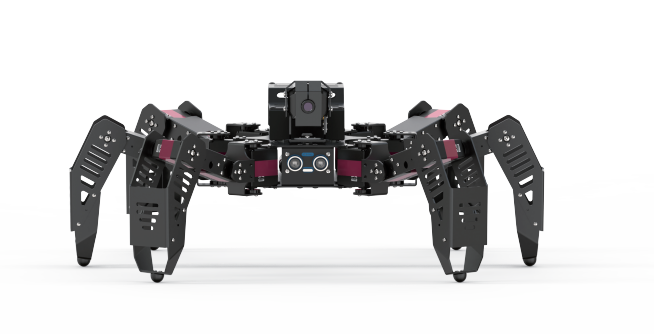

# 1. Getting Ready

## 1. SpiderPi Instruction

### 1.1 Introduction

SpiderPi intelligent vision hexapod robot is powered by Raspberry Pi 5. The image processing library is OpenCV and the programming language is Python. Equipped with a 2-DOF high-definition camera, SpiderPi can perform facial recognition, color recognition, tag recognition, color tracking, line following, etc. With SpiderPi, you will learn robot machine vision, OpenCV and robot knowledge.

### 1.2 Packing List

### 1.3 Usage Precautions

(1) Please pay attention to the following points when using and storing this product:

(2) This product contains conductive components. Avoid contact with metal objects when powered on.

(3) After the robot is powered on, do not forcibly move the servo, as this may cause damage.

(4) If the robot runs for an extended period, the servos may become hot. Allow the robot to "rest" and wait for the servos to cool before resuming operation.

(5) Keep your face, glasses, and other body parts away from the robot while it is operating. Do not place fingers within the joint movement range to prevent injury. Also, be cautious of falls from high edges.

(6) The robot's servos are precision components and consumable parts. They may need replacement after long-term or intensive use.

(7) If the product will not be used for an extended period, fully charge the battery, remove it, and store it in a cool, dry place.

 ### 1.4 Copyright Notice

This manual is the property of Shenzhen Hiwonder Technology Co., Ltd. No organization or individual is permitted to reproduce, copy, translate, or distribute any content from this manual without authorization.

Any unauthorized use or infringement of this manual's copyright will be subject to legal action by our company.

### 1.5 Disclaimer

The product described in this manual (including hardware, software, etc.) is provided "as is." Every effort has been made to ensure the accuracy of this manual, but we cannot guarantee it is completely free from errors or omissions. This document is regularly reviewed, and we welcome feedback for improvements.

Product features and specifications may change with version upgrades. For the latest product information, please contact customer service when placing your order.

Furthermore, unless explicitly stated by Hiwonder, we are not responsible for any losses resulting from product malfunctions or damage under extreme conditions outside of typical use cases.

## 2. Charging and Power-On Status Description

**Lithium batteries must be disconnected during transportation. Therefore, users should first connect the battery connector cable upon receiving the robot, then charge it. Only after the charging process is complete can the robot be powered on for the first time.**

### 2.1 Charging

:::{Note}
Please check whether the connector cable is properly connected before charging. Connect the red wire to red one and the black wire to black before charging.
:::

(1) please connect the red wire to red one and the black wire to black before charging.

(2) Plug end of the charger to the hole of the Raspberry Pi extension board on the back.

(3) When the charger is connected to an AC power outlet, if the LED indicator is RED, it means that the battery is charging. If the LED indicator turns GREEN, it means the battery is charged and ready to use, and not keep charging.

### 2.2 Turn on SpiderPi

(1) Lift the legs of SpiderPi, place its bottom flat on the tabletop.

(2) Switch on Raspberry Pi expansion board on the back. The LED1 and LED2 of the Raspberry Pi will be on.

The Raspberry Pi is a small minicomputer. It usually takes about 1 minute to boot up from the time it is Powered ON, which is normal and expected.

(3) Wait for about 30 seconds, the buzzer will send a "beep" sound. The robot will be in its initial standing posture. LED1 on the expansion board at the back of the robot will remain on, while LED2 blinks once every second, indicating that the device has started up successfully.

(4) Raspberry Pi will be in a AP hotspot mode and launch a Wi-Fi hotspot with a network named with the first letters "HW".

### 2.3 Check Power Level

The SpiderPi's tail is equipped with a voltage display module, which allows real-time monitoring of the robot's current battery level, as shown below:

The working voltage range of SpiderPi is 9V to12.6V. When the battery is fully charged, the voltage display module will show "12.6". Please recharge SpiderPi in time when the current voltage is less than 10V.
