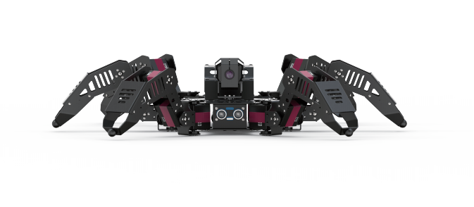

# 学前先看

## 1. 认识SpiderPi

### 1.1 产品简介

SpiderPi智能视觉六足机器人以树莓派5为主控，OpenCV为图像处理库，采用Python语言编程。

它搭载2自由度高清晰度广角摄像头，能完成人脸识别、颜色识别、标签识别、颜色追踪、视觉巡线等多种AI智能玩法。在这个视觉六足机器人平台上，用户可以学习机器视觉、OpenCV、机器人技术等知识。

为了满足不同学习需要，我们还准备了以下版本供大家选择。

第一种为标准版，可以实现AI视觉玩法。

第二种为豪华版，在AI视觉玩法的基础上，增加了语音识别与语音合成模块及地图，能实现语音交互及智能搬运玩法。

### 1.2 发货清单

## 2. 机器人充电及开机

### 2.1 充电方法

1)  充电前请检查对接线是否对接，电池对接线请以红对红、黑对黑的形式进行对接。

2)  将充电器的插头端连接背部树莓派扩展板的圆孔内，如下图所示：

3)  充电器指示灯在未通电的状态下为绿色，通电后指示灯为红色，代表充电中（充电时长约为3个小时左右），当指示灯由红色变为绿色代表充电完成。充电完成后，请尽快拔掉充电器，切勿一直充电！

### 2.2 开关机

1)  将机器人腿部抬起，机器人的底部平放并紧贴在台面上。

2)  将机器人背面底部的树莓派扩展板开关由“**OFF**”推动到“**ON**”，此时扩展板的LED1、LED2将常亮。

树莓派本身也是电脑，开机启动需要一小段时间，请耐心等待。

3)  等待30秒钟左右，蜂鸣器会“滴”的一声，同时机器人会呈初始站立姿态，机器人背部的扩展板上LED1保持常亮、LED2每隔1秒闪烁一次，即设备启动完毕。

4)  机器人出厂默认为AP直连模式，并将产生一个以HW开头的热点。

接下来您可前往“**[上手试玩]()**”继续学习后续内容。

### 2.3 查看电量

SpiderPi尾部搭载了一个电压显示模块，可实时观察机器人当前的电量情况，如下图所示：

SpiderPi的工作电压范围大小为9V-12.6V，当电量充满时，电压显示模块会显示“12.6”，当前电压小于10V时，请及时给SpiderPi充电。
