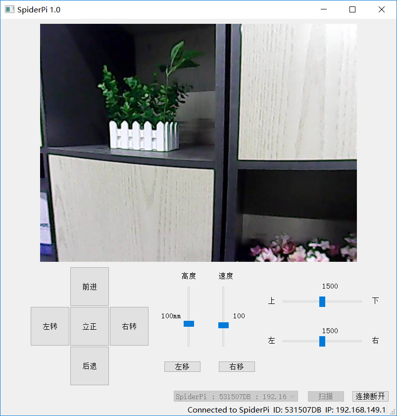
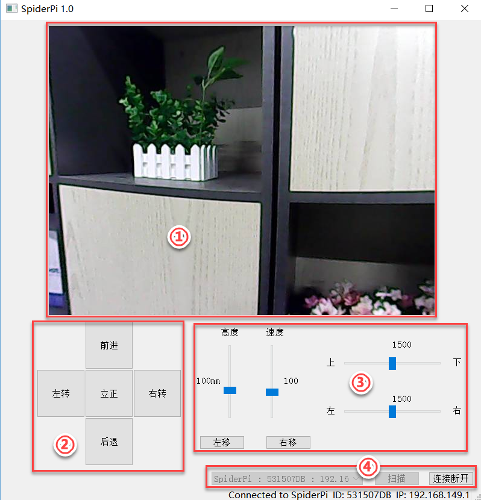
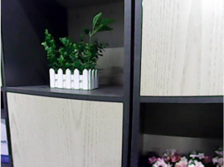
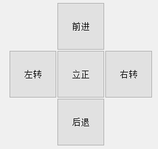
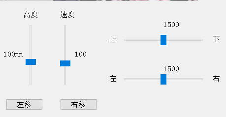
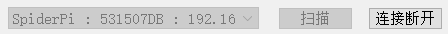

# 电脑端控制机器人课程

## 1. PC软件的打开和连接

**为了避免操控冲突及出现问题，在使用电脑端控制软件时，请断开手机APP和远程VNC连接。**

### 1.1 控制软件打开

在本节文件夹下将电脑端控制软件解压至任意英文路径下，然后打开文件夹内的图示应用（在打开应用时请关闭防火墙）。

:::{Note}
如果打开后出现下图报错提示，原因通常为保存文件的文件夹含有中文名称。请将本软件内的所有文件放置在英文目录下。
:::

### 1.2 控制软件连接

1)  打开开关，启动树莓派。

2)  树莓派在开机成功后，会自动生成一个“HW”开头的热点。打开电脑（台式电脑需自备无线网卡）网络设定，选择该热点。

3)  然后打开控制软件，点击“**扫描**”，等待片刻，扫描结果可在下方图示红框中所看到。

4)  扫描完成后，点击“**连接**”即可。

### 1.3 PC控制

1)  按照上节课（“**1.1** **PC软件的打开和连接**”）中的内容，扫描和连接设备。稍等片刻，软件上方会出现摄像头的实时回传画面。

2)  接下来可以通过点击界面下方的按键或滑动滑杆，来控制机器人运动，主界面分布及功能说明如下所示：

| **图标** | **功能区** | **功能说明** |
|:--:|:--:|:--:|
|  | 画面回传区 | 显示摄像头回传的画面 |
|  | 机体操控区 | 可进行机体的基本操控 |
|  | 云台、姿态及速度调节区 | 可对云台、机器人姿态（高中低）、移动速度进行调节 |
|  | 连接状态区 | 可对设备产生的热点进行扫描、连接、断开连接 |
