# 8. PC Software Control

## 1.Control Software Opening and Connection

### 1.1 Turn on PC Software

:::{Note}
Please turn off the APP and VNC connection when run the PC software.
:::

Extract the PC control software to file under English path and then open the icon in the file. (Please turn off firewall before opening the application)

:::{Note}
If the error message appears, the reason is that the folder is saved by the file contains the Chinese. Please place all files from the software in the English directory.
:::

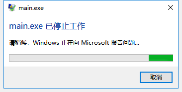

### 1.2 PC Software Connection

(1) Turn on the switch to start SpiderPi. 

(2) After turning on, Raspberry Pi will be in a AP hotspot mode and launch a Wi-Fi hotspot with a network named with the first letters "HW". (Desktop computers require your own wireless network card) 

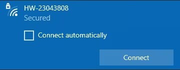

(3) Open PC software, click "Scan" and wait for a moment to receive the data as below picture.

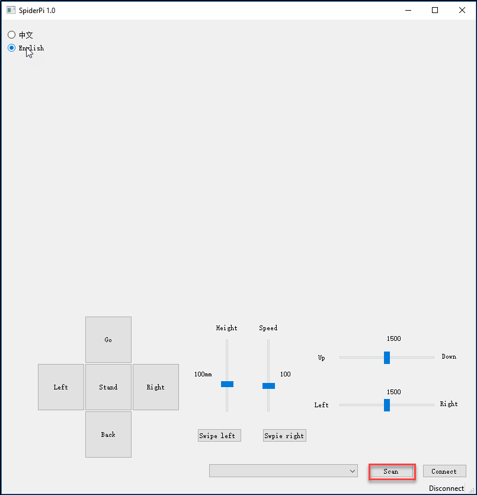

(4) Click "Connect" after scanning.

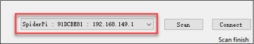

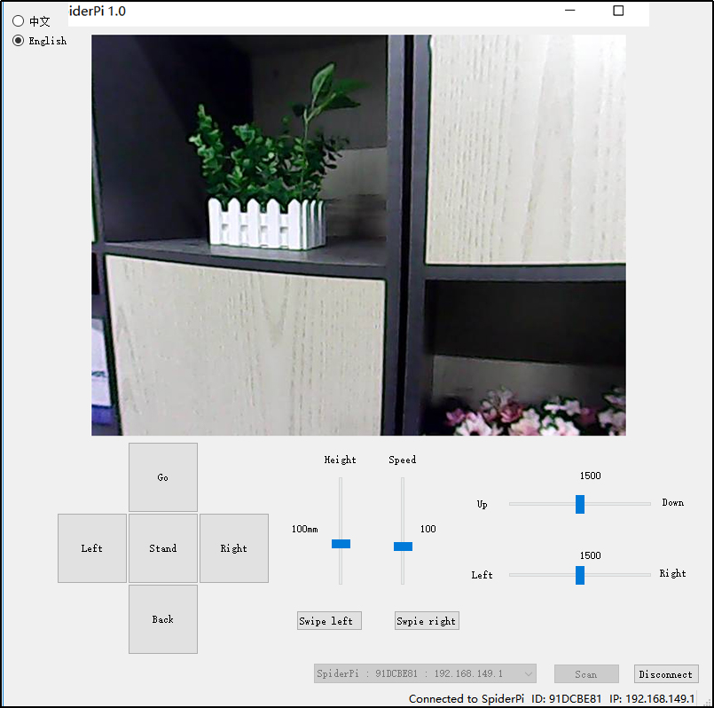

## 2.PC Control Instruction

(1) After successful scanning, let's move to the device connection. Then the real-time returned screen will appear at the software.

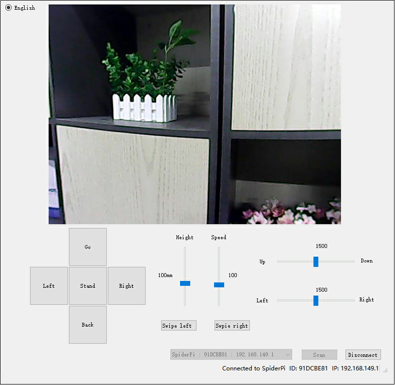

(2) Click the buttons to control the SpiderPi's movement.

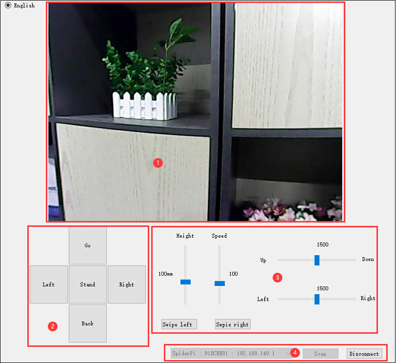

| Icon                                                         | Function                                                |
| ------------------------------------------------------------ | ------------------------------------------------------- |
| 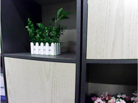 | Display the returned image                              |
| 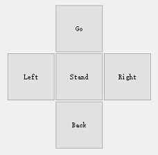 | Call to operation                                       |
| 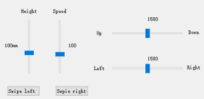 | Adjust rotation, robotic stance (high to low) and speed |
| 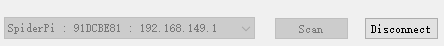 | Scan, connect or turn off the launched hotspot          |
