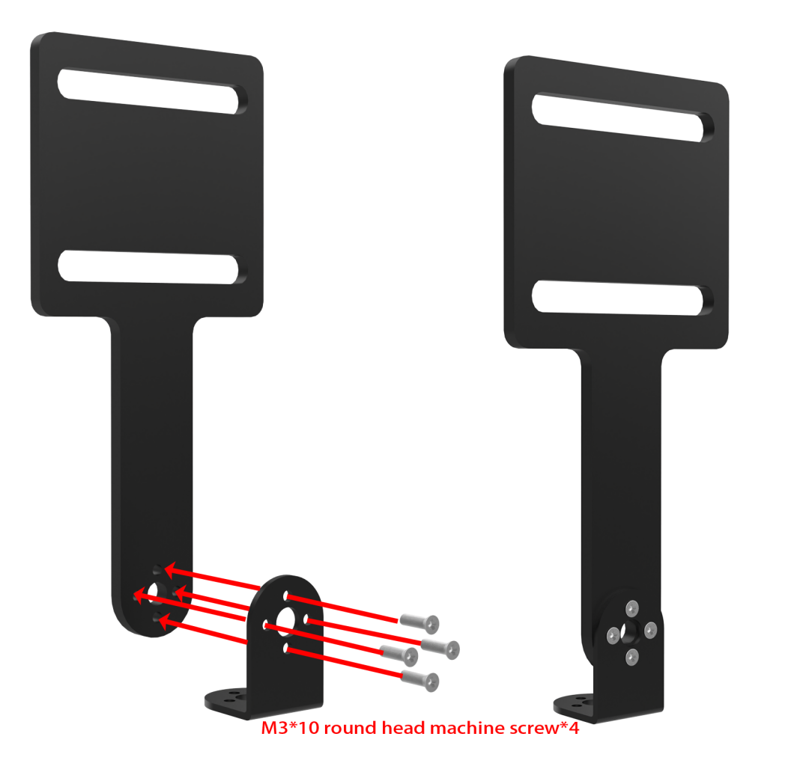
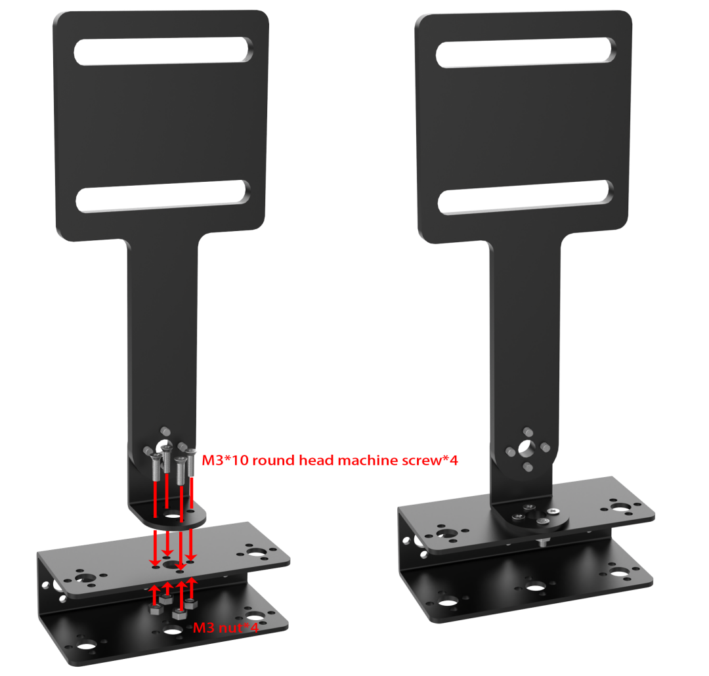
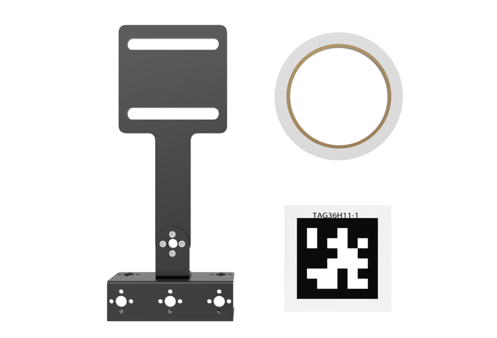
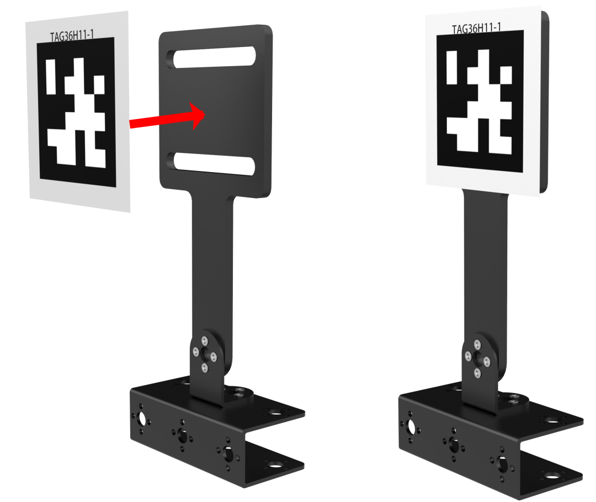
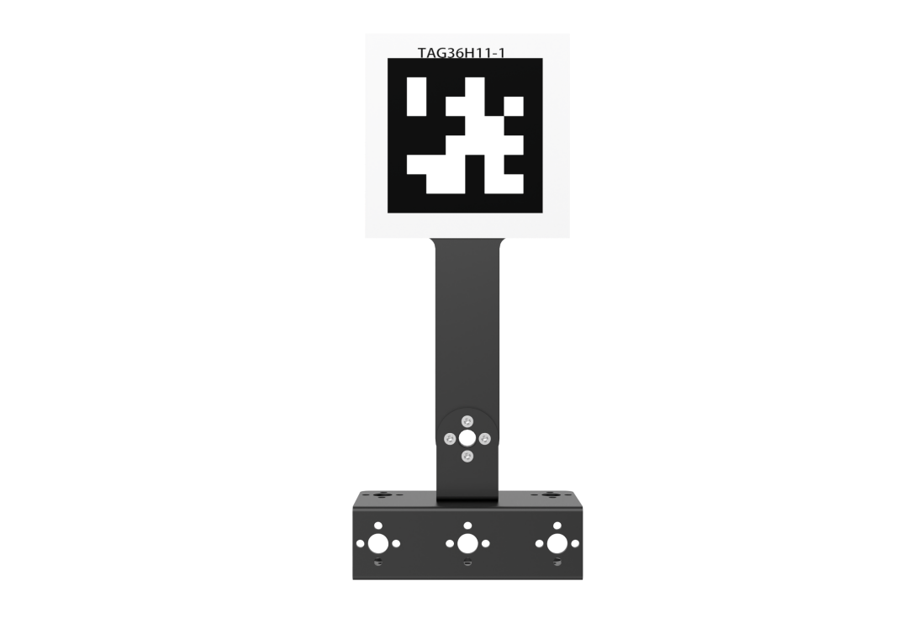

# 8. AI Transport Lesson

## 8.1 Transport Bracket Assembly

<p class="step">Step1:</p>



<p class="step">Step2:</p>



<p class="step">Step3:</p>





<p class="step">Post installation</p>



## 8.2 AI Transport

### 8.2.1 Program Description

In the era of Industry 4.0, robots are widely used in the field of intelligent logistics, which can achieve high-efficiency management and improve the service. We are going to learn how SpiderPi robot realizes the function of AI Transport in this section.

The first stage is recognition. Program SpiderPi to search the recognized object on the map.

When a recognizable color appears in the visual range, SpiderPi starts to process the object color recognition. Convert the image to Lab, image binarization, and then perform operations such as expansion and corrosion to obtain an outline containing only the target color.

The second stage is transport. According to the processing of the image feedback information, SpiderPi will judge the distance of the items when multiple items appear. And then move the items according to the distance.

Set the AprilTag according to the corresponding color as the sign of the transport destination. Program the SpiderPi to scan on the map and detect whether is the target tag and then execute the actions. If the target tag is found, SpiderPi will place the item directly.

If the tag is not the target, SpiderPi will determine the location of the target tag based on the scanned tag, and then turn to the target until the target tag is scanned.

### 8.2.2 Operation Instruction

(1) The function of this section should be operated on the provided map. The right side is the items placement zone and the left side is the receiving space.


(2) Place the map on the smooth floor. Place the SpiderPi and color blocks in the placement zone.

(3) Turn on robot and connect to Raspberry Pi desktop with VNC.

### 8.2.3 Start and Close the Game

:::{Note}
The input command is case-sensitive, and keywords can be auto-completed using the Tab key.
:::

(1) Power on the robot and use VNC Viewer to connect to the remote desktop.


(2) Click the  in the top left corner of the system desktop or press the shortcut "**Ctrl+Alt+T**" to open the LX terminal.

(3) Execute the command to navigate to the directory where the program is located, then press Enter: 

```bash
cd spiderpi/functions
```

(4) Enter the command and press Enter to start the program:

```bash
python3 self_transport.py
```

(5) To close the program, simply press "**Ctrl+C**" in the LX terminal. If it does not close, press it multiple times.

### 8.2.4 Program Outcome

:::{Note}
It is suggested to place the map on the flat group for the performance.
:::

Place SpiderPi and blocks on the placement zone and start AI transport. SpiderPi will move the blocks to the corresponding AprilTag in order according to the distance.


### 8.2.5 Program Analysis

The source code of the program is located in: [/home/pi/spiderpi/extend/self_transport.py](https://store.hiwonder.com.cn/docs/spiderpi/source_code/self_transport.zip)

* **Transportation Color and Preset Position Parameter** 

In this game, three colors of objects, red, green, and blue, are set for transporting, and the objects are moved to the corresponding tag positions, as shown below:

The first parameter `frame_resize` is the input image;

The second parameter `(3, 3)` is the size of the Gaussian kernel. A larger kernel usually leads to a greater degree of filtering, making the output image more blurry and increasing the computational complexity;

{lineno-start=321}

```python
color_list = ['red', 'green', 'blue']
```

{lineno-start=46}

```python
color_tag = {'red': 1,
             'green': 2,
             'blue': 3
             }
```

* **Start Detecting Transportation Object** 

**(1) Detect Transportation Object**

At the beginning, SpiderPi rotates left and right to locate the object to be transported, as shown below:

{lineno-start=}

```python
    if not __isRunning or stop_detect:
        if step == 5:
            object_center_x = 0
        return img
```

{lineno-start=518}

```python
                        color_list.remove(object_color)
                        if color_list == []:
                            color_list = ['red', 'green', 'blue']
                        find_box = not find_box
                        object_center_x = -2
                        step = 1
                        stop_detect = False
```

{lineno-start=356}

```python
            elif object_center_x >= 0:  # 如果找到目标(if the target is detected)
                if step == 1:  # 左右调整，保持在正中(adjust left and right to keep it in the center)
                    if find_box:
                        if object_center_x - CENTER_X > 160:  # 不在中心，根据方向让机器人转向一步(If it is not in the center, turn the robot one step according to the direction)
                            ik.right_move(current_pos, mode, 50, 80, 1)
                        elif object_center_x - CENTER_X < -160:
                            ik.left_move(current_pos, mode, 50, 80, 1)
                        elif -10 > object_angle > -45:
                            ik.turn_left(current_pos, mode, 15, 80, 1)
                        elif -80 < object_angle <= -45:
                            ik.turn_right(current_pos, mode, 15, 80, 1)
                        elif object_center_x - CENTER_X > 80:  # 不在中心，根据方向让机器人转向一步(If it is not in the center, turn the robot one step according to the direction)
                            ik.right_move(current_pos, mode, 20, 80, 1)
                        elif object_center_x - CENTER_X < -80:
                            ik.left_move(current_pos, mode, 20, 80, 1)
                        else:
                            step = 2
```

**(2) Color Detection Parameter**

Detect the color to locate the position of the object. The code is shown below:

{lineno-start=358}

```python
if find_box:
        color, color_center_x, color_center_y, color_angle = colorDetect(img)  # 颜色检测，返回颜色，中心坐标，角度(detect color to return color, center coordinates, and angle)
        object_color, object_center_x, object_center_y, object_angle = color, color_center_x, color_center_y, color_angle
```

During the process of detecting object color, the following detection parameters are mainly involved:

① Before converting the image to the LAB space, the image needs to be denoised. Call the `GaussianBlur()` function to perform Gaussian filtering, as shown below:

{lineno-start=184}

```python
    frame_gb = cv2.GaussianBlur(frame_resize, (3, 3), 3)
```

The first parameter `frame_resize` is the input image;

The second parameter `(3, 3)` is the size of the Gaussian kernel. A larger kernel usually leads to a greater degree of filtering, making the output image more blurry and increasing the computational complexity;

The third parameter `3`  is the standard deviation of the Gaussian function along the X direction. It is used to control the change near its mean value in the Gaussian filter. If this value is increased, the range of changes allowed around the mean value will increase. If it is decreased, the range of changes allowed around the mean value will decrease.

② Call the `inRange` function to binarize the input image, as shown below:

{lineno-start=191}

```python
frame_mask = cv2.inRange(frame_lab,
                                     (lab_data[i]['min'][0],
                                      lab_data[i]['min'][1],
                                      lab_data[i]['min'][2]),
                                     (lab_data[i]['max'][0],
                                      lab_data[i]['max'][1],
                                      lab_data[i]['max'][2])) 
```

③ It is necessary to perform erosion and dilation on the image, which reduces interference and make the image smoother, as shown below:

{lineno-start=198}

```python
eroded = cv2.erode(frame_mask, cv2.getStructuringElement(cv2.MORPH_RECT, (3, 3)))  # 腐蚀(erode)
dilated = cv2.dilate(eroded, cv2.getStructuringElement(cv2.MORPH_RECT, (3, 3)))  # 膨胀(dilate)
```

The `getStructuringElement` function is used to generate structure elements of different shapes;

The first parameter `cv2.MORPH_RECT` is the shape of the kernel, which is a rectangle;

The second parameter `(3, 3)` is the size of the rectangle, which is 3x3.

④ Find the largest contour of the object, as shown below:

{lineno-start=161}

```python
def get_area_max_contour(contours):
    contour_area_temp = 0
    contour_area_max = 0

    area_max_contour = None
    max_area = 0

    for c in contours:  # 历遍所有轮廓(traverse through all contours)
        contour_area_temp = math.fabs(cv2.contourArea(c))  # 计算轮廓面积(calculate contour area)
        if contour_area_temp > contour_area_max:
            contour_area_max = contour_area_temp
            if contour_area_temp >= 100:  # 只有在面积大于设定时，最大面积的轮廓才是有效的，以过滤干扰(Only when the area is greater than the set value, the contour with the maximum area is considered valid to filter out interference)
                area_max_contour = c
                max_area = contour_area_temp

    return area_max_contour, max_area  # 返回最大的轮廓, 面积(Return the largest contour and its area)
```

Set that only the contour with the maximum area is valid when its area is greater than 100 via the command `if contour_area_temp > 100`. This avoids interference.

⑤ When SpiderPi detects a colored object, the `cv2.drawContours()` function is used to draw the contour of the colored object, as shown below:

{lineno-start=212}

```python
cv2.drawContours(img, [box], -1, (0, 255, 255), 2)
```

The first parameter `img` is the input image;

The second parameter `[box]` is the contour itself, which is a list in Python;

The third parameter `-1` is the index of the contour, and the numerical value represents all the contours in the list to be drawn;

The fourth parameter `(0, 255, 255)` is the color of the contour, in the order of B, G, R, which is yellow;

The fifth parameter `2` is the width of the contour. If it is `-1`, it means to fill the contour with the specified color.

After the robot recognizes a colored object, the `cv2.circle()` function is used to draw the center point of the colored object in the transmitted image, as shown below:

{lineno-start=215}

```python
ptime_start_x, ptime_start_y = box[0, 0], box[0, 1]
                pt3_x, pt3_y = box[2, 0], box[2, 1]
                center_x_, center_y_ = int((ptime_start_x + pt3_x) / 2), int((ptime_start_y + pt3_y) / 2)  # 中心点(center point)
                cv2.circle(img, (center_x_, center_y_), 5, (0, 255, 255), -1)  # 画出中心点(draw the center point)
```

**(2) Start Transporting Object**

Once the color object is detected, SpiderPi starts to transport the object. The transporting includes getting close to the object, picking up the object, locating the transport position, transporting the object, and placing the object down.

**(3) Approach Object**

Before starting to transport the object, the robot first approaches the object gradually, as shown below:

{lineno-start=358}

```python
 if find_box:
        color, color_center_x, color_center_y, color_angle = colorDetect(img)
```

{lineno-start=406}

```python
                elif step == 2:  # 接近物体(approach the object)
                    if find_box:
                        if 240 < object_center_y:
                            ik.back(current_pos, mode, 50, 80, 1)
                            step = 1
                        elif 100 < object_center_y < 150:
                            ik.go_forward(current_pos, mode, 40, 80, 1)
                            step = 1
                        elif 0 < object_center_y <= 100:
                            ik.go_forward(current_pos, mode, 80, 100, 1)
                            step = 1
                        else:
                            step = 3
    
                elif step == 3:  # 再次左右调整(adjust left and right again)
                    if find_box:
                        if 100 <= object_center_x - CENTER_X:  # 不在中心，根据方向让机器人转向一步(If it is not in the center, turn the robot one step according to the direction)
                            if state != 'r_m':
                                ik.stand(current_pos)
                            state = 'r_m'
                            ik.right_move(current_pos, mode, 20, 80, 1)
                            
                        elif object_center_x - CENTER_X < -100:
                            if state != 'l_m':
                                ik.stand(current_pos)
                            state = 'l_m'
                            ik.left_move(current_pos, mode, 20, 80, 1)
                        elif 40 <= object_center_x - CENTER_X:  # 不在中心，根据方向让机器人转向一步(If it is not in the center, turn the robot one step according to the direction)
                            if state != 'r':
    
                elif step == 4:  # 靠近物体(approach the object)
                    if find_box:
                        if object_center_y < 130:
                            ik.go_forward(current_pos, mode, 20, 80, 1)
                        else:
                            if abs(object_center_x - CENTER_X) <= 40:
                                stop_detect = True
                                step = 5
                            else:
                                step = 3
```

During the process of approaching the object, it is necessary to control the SpiderPi's movement. Let's use the `ik.go_move(current_pos, mode, 20, 80, 1)` as an example:

`go_move`  represents moving forward, and similar functions are used for other movements.

The first parameter `current_pos` represents the posture of the robot.

The second parameter `mode` with a value of 2 represents the hexapod mode.

The third parameter `20` represents the step length, in units of mm (or angle in degrees when turning).

The fourth parameter `80` represents the time required to set the step length or angle of control motion parameter 3, in units of ms.

The fifth parameter `1` represents the number of times to execute the movement. If it is set to 0, indicating an infinite loop.

**(4) Get up Object**

After approaching the object, SpiderPi picks up the object for transport, as shown in the following steps:

{lineno-start=502}

```python
                    if find_box:
                        current_pos = copy.deepcopy(ik.initial_pos_quadruped)
                        Pick.pick(True)
                        board.pwm_servo_set_position(0.5, [[1, 1500]])
                        mode = 4
                        find_box = not find_box
                        object_center_x = -2
                        step = 1
                        stop_detect = False
```

:::{Note}

In the `Pick.pick(True)` function, `True` represents picking up the object, while `False` represents putting it down.

:::

**(5) Locate Transportation Position**

Before transporting the object, SpiderPi can detect and recognize tags to locate the place for the color object, as shown below:

{lineno-start=559}

```python
else:
        tag_data = apriltagDetect(img)
```

During the process, the following control parameters are mainly involved:

① After obtaining the information of the four corner points of the tag, call the `cv2.drawContours()` function to draw the contour of the tag, as shown below:

{lineno-start=212}

```python
cv2.drawContours(img, [box], -1, (0, 255, 255), 2)
```

② Once SpiderPi recognizes the tag, the `cv2.circle()` function is used to draw the center point of the tag on the transmitted image, as shown below:

{lineno-start=218}

```python
cv2.circle(img, (center_x_, center_y_), 5, (0, 255, 255), -1)
```

**(6) Transport Object**

After picking up the object, transport it to the corresponding position, as shown below:

{lineno-start=562}

```python
        if tag_data[color_tag[object_color] - 1][0] != -1:  # 如果检测到目标arpiltag(If the target apriltag is detected)
            object_center_x, object_center_y, object_angle, object_distance = tag_data[color_tag[object_color] - 1]
```

After picking up the object, `step = 1` is set to adjust the left and right position of SpiderPi to face the tag location, as shown below:

{lineno-start=356}

```python
           elif object_center_x >= 0:  # 如果找到目标(if the target is detected)
                if step == 1:  # 左右调整，保持在正中(adjust left and right to keep it in the center)
                    if find_box:
                        if object_center_x - CENTER_X > 160:  # 不在中心，根据方向让机器人转向一步(If it is not in the center, turn the robot one step according to the direction)
                            ik.right_move(current_pos, mode, 50, 80, 1)
                        elif object_center_x - CENTER_X < -160:
                            ik.left_move(current_pos, mode, 50, 80, 1)
                        elif -10 > object_angle > -45:
                            ik.turn_left(current_pos, mode, 15, 80, 1)
                        elif -80 < object_angle <= -45:
                            ik.turn_right(current_pos, mode, 15, 80, 1)
                        elif object_center_x - CENTER_X > 80:  # 不在中心，根据方向让机器人转向一步(If it is not in the center, turn the robot one step according to the direction)
                            ik.right_move(current_pos, mode, 20, 80, 1)
                        elif object_center_x - CENTER_X < -80:
                            ik.left_move(current_pos, mode, 20, 80, 1)
                        else:
                            step = 2
```

Set `step = 2`, `step = 3`, `step = 4` one by one to control SpiderPi to transport the object to the tag location, as shown in the following steps:

{lineno-start=406}

```python
                elif step == 2:  # 接近物体(approach the object)
                    if find_box:
                        if 240 < object_center_y:
                            ik.back(current_pos, mode, 50, 80, 1)
                            step = 1
                        elif 100 < object_center_y < 150:
                            ik.go_forward(current_pos, mode, 40, 80, 1)
                            step = 1
                        elif 0 < object_center_y <= 100:
                            ik.go_forward(current_pos, mode, 80, 100, 1)
                            step = 1
    
                elif step == 3:  # 再次左右调整(adjust left and right again)
                    if find_box:
                        if 100 <= object_center_x - CENTER_X:  # 不在中心，根据方向让机器人转向一步(If it is not in the center, turn the robot one step according to the direction)
                            if state != 'r_m':
                                ik.stand(current_pos)
                            state = 'r_m'
                            ik.right_move(current_pos, mode, 20, 80, 1)
                            
                        elif object_center_x - CENTER_X < -100:
                            if state != 'l_m':
                                ik.stand(current_pos)
                            state = 'l_m'
                            ik.left_move(current_pos, mode, 20, 80, 1)
                        elif 40 <= object_center_x - CENTER_X:  # 不在中心，根据方向让机器人转向一步(If it is not in the center, turn the robot one step according to the direction)
                            if state != 'r':
                                ik.stand(current_pos)
                            state = 'r'
                            ik.turn_right(current_pos, mode, 5, 80, 1)
                        elif object_center_x - CENTER_X < -40:
                            if state != 'l':
                                ik.stand(current_pos)
                            state = 'l'
                            ik.turn_left(current_pos, mode, 5, 80, 1)
                        else:
                            step = 4
```

**(7) Put down Object**

After the transportation is completed, SpiderPi places the object down, as shown below:

{lineno-start=430}

```python
else:
      ik.go_forward(current_pos, mode, 60, 150, 1)
      current_pos = copy.deepcopy(ik.initial_pos)
      Pick.pick(False)
      mode = 2
      board.pwm_servo_set_position(0.5, [[1, servo_data['servo1']]])
      ik.back(current_pos, mode, 50, 100, 3)                       
      color_list.remove(object_color)
```

In the `Pick.pick(True)` function, `True` represents picking up the object, while `False` represents putting it down.

## 8.3 Intelligent Cleanup

### 8.3.1 Program Description

SpiderPi can clean up objects by transport. It is mainly divided into recognition and transport.

The first is recognition stage. Through the cooperation of the body and station, SpiderPi can search recognition object within the read closed line.

Convert the image to Lab space, perform binarization, and then perform operations such as expansion and corrosion to obtain an outline containing only the built-in colors of the program, and then frame the color outline to realize the color recognition of the object.

After recognizing red, green and blue, red represents the line, and then compare their coordinates to determine whether the blue and green objects are within the red line.

If it is within the red line, based on the processing of the image feedback information, judge the distances and pick the items in turns. 

If the corresponding item cannot be searched within the current camera's visible range, SpiderPi will rotate and change the search area until the target item is found. Then place the items outside the line.

### 8.3.2 Operation Preparation

(1) Use the tape to lay a red circle.

(2) Randomly place the robot and the blocks into the circle.

### 8.3.3 Start and Close the Game

:::{Note}
The input command is case-sensitive, and keywords can be auto-completed using the Tab key.
:::

(1) Power on the robot and use VNC Viewer to connect to the remote desktop.


(2) Click the  in the top left corner of the system desktop or press the shortcut "**Ctrl+Alt+T**" to open the LX terminal.

(3) Execute the command to navigate to the directory where the program is located, then press Enter: 

```bash
cd spiderpi/functions
```

(4) Enter the command and press Enter to start the program:

```bash
python3 transport_cleaning.py
```

(5) To close the program, simply press "**Ctrl+C**" in the LX terminal. If it does not close, press it multiple times.

### 8.3.4 Project Outcome

:::{Note}
Do not place the red block within the red line.
:::

After starting the game, place the blue and green blocks randomly within the red circle. The SpiderPi robot will move the blocks out of the circle according to the distance. 


### 8.3.5 Program Analysis

The source code of the program is located in: [/home/pi/spiderpi/extend/transport_cleaning.py](https://store.hiwonder.com.cn/docs/spiderpi/source_code/transport_cleaning.zip)

* **Detect Red Line Parameter** 

In this game, the first step is to detect the red line, and the code is shown below:

{lineno-start=336}

```python
red_color, red_center_x, red_center_y, red_angle = colorDetect(img, ['red']) 
```

The main detection parameters involved in the process of detecting the red line are as follows:

(1) Before converting the image to the LAB space, the image needs to be  denoised. The `GaussianBlur()` function is used for Gaussian filtering, as shown below:

{lineno-start=155}

```python
frame_gb = cv2.GaussianBlur(frame_resize, (3, 3), 3)
```

The first parameter `frame_resize` is the input image;

The second parameter `(3, 3)` is the size of the Gaussian kernel. A larger kernel size usually leads to a greater degree of filtering, making the output image more blurred and increasing the complexity of the calculation;

The third parameter `3` is the standard deviation of the Gaussian function along the X direction. It is used in the Gaussian filter to control the changes near its mean value. If this value is increased, the range of changes allowed around the mean value is also increased; if it is decreased, the range of changes allowed around the mean value is decreased.

(2) The input image is binarized using the `inRange` function, as shown in the figure below:

{lineno-start=162}

```python
            frame_mask = cv2.inRange(frame_lab,
                                     (lab_data[i]['min'][0],
                                      lab_data[i]['min'][1],
                                      lab_data[i]['min'][2]),
                                     (lab_data[i]['max'][0],
                                      lab_data[i]['max'][1],
                                      lab_data[i]['max'][2]))
```

(3) It is necessary to perform erosion and dilation on the image, which reduces interference and make the image smoother, as shown below:

{lineno-start=172}

```python
eroded = cv2.erode(frame_mask, cv2.getStructuringElement(cv2.MORPH_RECT, (3, 3)))  # 腐蚀(erode)
dilated = cv2.dilate(eroded, cv2.getStructuringElement(cv2.MORPH_RECT, (3, 3)))  # 膨胀(dilate)
```

The `getStructuringElement` function is used to generate structuring elements of different shapes;

The first parameter `cv2.MORPH_RECT` is the shape of the kernel, which is a rectangle;

The second parameter `(3, 3)` is the size of the rectangle, which is 3x3.

(4) Find the largest contour of the object, as shown below:

{lineno-start=132}

```python
    def get_area_max_contour(contours):
        contour_area_temp = 0
        contour_area_max = 0
        
    area_max_contour = None
    max_area = 0
    
    for c in contours:  # 历遍所有轮廓(traverse through all contours)
        contour_area_temp = math.fabs(cv2.contourArea(c))  # 计算轮廓面积(calculate contour area)
        if contour_area_temp > contour_area_max:
            contour_area_max = contour_area_temp
            if contour_area_temp >= 10:  # 只有在面积大于设定时，最大面积的轮廓才是有效的，以过滤干扰(Only when the area is greater than the set value, the contour with the maximum area is considered valid to filter out interference)
                area_max_contour = c
                max_area = contour_area_temp
    
    return area_max_contour, max_area  # 返回最大的轮廓, 面积(Return the area of the largest contour)
```

Set that only the contour with the maximum area is valid when its area is greater than 100 via the command `if contour_area_temp > 100`. This avoids interference.

(5) When SpiderPi detects a colored object, the `cv2.drawContours()` function is used to draw the contour of the colored object, as shown below:

{lineno-start=186}

```python
cv2.drawContours(img, [box], -1, (0, 255, 255), 2)  # 画出四个点组成的矩形(draw the rectangle composed of the four points)
```

The first parameter `img` is the input image;

The second parameter `[box]` is the contour itself, which is a list in Python;

The third parameter `-1` is the index of the contour, and the numerical value represents all the contours in the list to be drawn;

The fourth parameter `(0, 255, 255)` is the color of the contour, in the order of B, G, R, which is yellow;

The fifth parameter `2` is the width of the contour. If it is `-1`, it means to fill the contour with the specified color.

(6) After the robot recognizes a colored object, the `cv2.circle()` function is used to draw the center point of the colored object in the transmitted image, as shown below:

{lineno-start=189}

```python
ptime_start_x, ptime_start_y = box[0, 0], box[0, 1]
pt3_x, pt3_y = box[2, 0], box[2, 1]
center_x_, center_y_ = int((ptime_start_x + pt3_x) / 2), int((ptime_start_y + pt3_y) / 2)  # 中心点(center point)
cv2.circle(img, (center_x_, center_y_), 5, (0, 255, 255), -1)  # 画出中心点(draw the center point)
distance = pow(center_x_ - img_w / 2, 2) + pow(center_y_ - img_h, 2)
if distance < center_max_distance:  # 寻找距离最近的物体来搬运(locate and transport the closest object)
	center_max_distance = distance
	color = i
	center_x, center_y, angle = center_x_, center_y_, angle_     
```

The first parameter `img` is the input image, which is the image of the recognized color object;

The second parameter `(centerX, centerY)` is the center coordinates of the circle to be drawn (determined according to the detected object);

The third parameter  `5`  is the radius of the circle to be drawn;

The fourth parameter `(0, 255, 255)` is the color of the circle to be drawn, in the order of B, G, R, which is yellow;

The fifth parameter `-1` means to fill the circle with the color specified in parameter 4. If it is a number, it represents the line width of the circle to be drawn.

* **Start Detecting Blue and Green Sponge Blocks** 

After finding the red line, the next step is to detect the blue and green sponge blocks inside the line. The detection method is the same as detecting the red line, and the code is shown below:

{lineno-start=232}

```python
if find_box:
	color, color_center_x, color_center_y, color_angle = colorDetect(img, ['green', 'blue']) 
	object_color, object_center_x, object_center_y, object_angle = color, color_center_x, color_center_y, color_angle
```

* **Start Transporting Sponge Block** 

After detecting the blue and green sponge blocks, the robot starts to transport the sponge blocks. This process includes finding, approaching, picking up, transporting, and putting down the sponge blocks.

**(1) Detect Transportation Object**

After detecting the blue and green sponge blocks, SpiderPi adjusts its left-right orientation to face the sponge blocks directly. The specific settings are shown below:

{lineno-start=300}

```python
find_box = not find_box
object_center_x = -2
step = 1
stop_detect = False
```

{lineno-start=227}

```python
        if __isRunning:
            if object_center_x >= 0:  # 如果找到目标(if the target is detected)
                if find_box and red_center_y > object_center_y and object_center_y > 0:
                    ik.turn_right(current_pos, mode, 15, 100, 1)
                elif step == 1:  # 左右调整，保持在正中(adjust left and right to keep it in the center)
                    if find_box:
                        if object_center_x - CENTER_X > 160:  # 不在中心，根据方向让机器人转向一步(If it is not in the center, turn the robot one step according to the direction)
                            ik.right_move(current_pos, mode, 50, 80, 1)
                        elif object_center_x - CENTER_X < -160:
                            ik.left_move(current_pos, mode, 50, 80, 1)
                        elif -10 > object_angle > -45:
                            ik.turn_left(current_pos, mode, 15, 80, 1)
                        elif -80 < object_angle <= -45:
                            ik.turn_right(current_pos, mode, 15, 80, 1)
                        elif object_center_x - CENTER_X > 80:  # 不在中心，根据方向让机器人转向一步(If it is not in the center, turn the robot one step according to the direction)
                            ik.right_move(current_pos, mode, 20, 80, 1)
                        elif object_center_x - CENTER_X < -80:
                            ik.left_move(current_pos, mode, 20, 80, 1)
                        else:
                            step = 2
```

During the process of adjustment, it is necessary to control the 

SpiderPi's movement. Let's use the `ik.left_move(current_pos, mode, 20, 80, 1)` as an example:

`left_move` represents moving to the left, and similar functions are used for other movements.

The first parameter `current_pos` represents the posture of the robot.

The second parameter `mode` with a value of 2 represents the hexapod mode.

The third parameter `20` represents the step length, in units of mm (or angle in degrees when going straight).

The fourth parameter `80` represents the time required to set the step 

length or angle of control motion parameter 3, in units of ms.

The fifth parameter `1` represents the number of times to execute the movement. If it is set to 0, indicating an infinite loop.

**(2) Approach Sponge Block**

Before transporting, control SpiderPi to gradually approach the sponge block to be transported, as shown in the following steps:

{lineno-start=252}

```python
elif step == 2:  # 接近物体(approach the object)
	if 240 < object_center_y:
		ik.back(current_pos, mode, 50, 80, 1)
		step = 1
	elif 100 < object_center_y < 150:
		ik.go_forward(current_pos, mode, 40, 80, 1)
		step = 1
	elif 0 < object_center_y <= 100:
		ik.go_forward(current_pos, mode, 80, 100, 1)
		step = 1
	else:
		step = 3
	elif step == 3:  # 再次左右调整(adjust left and right again)
		if 100 <= object_center_x - CENTER_X:
			ik.right_move(current_pos, mode, 20, 80, 1)
		elif object_center_x - CENTER_X < -100:
			ik.left_move(current_pos, mode, 20, 80, 1)
		elif 40 <= object_center_x - CENTER_X:
			ik.turn_right(current_pos, mode, 5, 80, 1)
		elif object_center_x - CENTER_X < -40:
			ik.turn_left(current_pos, mode, 5, 80, 1)
        else:
			step = 4
	elif step == 4:  # 靠近物体(approach the object)
		if find_box:
			if object_center_y < 150:
				ik.go_forward(current_pos, mode, 15, 80, 1)
         else:
         	if abs(object_center_x - CENTER_X) <= 40:
         	stop_detect = True
         	step = 5
```

**(3) Pick up Sponge Block**

After approaching the sponge block to be transported, control SpiderPi to pick up it, as shown below:

{lineno-start=285}

```python
elif step == 5:  # 拿起或者放下物体(pick up or put down the object)
	if find_box:
		current_pos = copy.deepcopy(ik.initial_pos_quadruped)
		Pick.pick(True)
                        mode = 4
                        find_box = not find_box
                        object_center_x = -2
                        step = 1
                        stop_detect = False
```

:::{Note}
In the `Pick.pick(True)` function, `True` represents picking up the object, while `False` represents putting it down.
:::

**(4) Transport Sponge Block**

After picking up the sponge block, transport it outside the closed red line circle, as shown below:

{lineno-start=341}

```python
else:
    object_color, object_center_x, object_center_y, object_angle = red_color, red_center_x, red_center_y, red_angle
```

{lineno-start=285}

```python
                elif step == 5:  # 拿起或者放下物体(pick up or put down the object)
                    if find_box:
                        current_pos = copy.deepcopy(ik.initial_pos_quadruped)
                        Pick.pick(True)
                        mode = 4
                        find_box = not find_box
                        object_center_x = -2
                        step = 1
                        stop_detect = False
                    else:
                        ik.go_forward(current_pos, mode, 40, 150, 2)
                        current_pos = copy.deepcopy(ik.initial_pos)
                        Pick.pick(False)
                        mode = 2
                        ik.back(current_pos, mode, 50, 100, 3)                       
                        find_box = not find_box
                        object_center_x = -2
                        step = 1
                        stop_detect = False
```

Then, `step = 1` is set to adjust the left and right position of SpiderPi, as shown below:

{lineno-start=226}

```python
    while True:
        if __isRunning:
            if object_center_x >= 0:  # 如果找到目标(if the target is detected)
                if find_box and red_center_y > object_center_y and object_center_y > 0:
                    ik.turn_right(current_pos, mode, 15, 100, 1)
                elif step == 1:  # 左右调整，保持在正中(adjust left and right to keep it in the center)
                    if find_box:
                        if object_center_x - CENTER_X > 160:  # 不在中心，根据方向让机器人转向一步(If it is not in the center, turn the robot one step according to the direction)
                            ik.right_move(current_pos, mode, 50, 80, 1)
                        elif object_center_x - CENTER_X < -160:
                            ik.left_move(current_pos, mode, 50, 80, 1)
                        elif -10 > object_angle > -45:
                            ik.turn_left(current_pos, mode, 15, 80, 1)
                        elif -80 < object_angle <= -45:
                            ik.turn_right(current_pos, mode, 15, 80, 1)
                        elif object_center_x - CENTER_X > 80:  # 不在中心，根据方向让机器人转向一步(If it is not in the center, turn the robot one step according to the direction)
                            ik.right_move(current_pos, mode, 20, 80, 1)
                        elif object_center_x - CENTER_X < -80:
                            ik.left_move(current_pos, mode, 20, 80, 1)
```

Set `step = 2`, `step = 3`, `step = 4` one by one to control SpiderPi to transport the sponge block outside the closed red line circle, as shown below:

```python
            if object_center_x >= 0:  # 如果找到目标(if the target is detected)
                if find_box and red_center_y > object_center_y and object_center_y > 0:
                    ik.turn_right(current_pos, mode, 15, 100, 1)
                elif step == 1:  # 左右调整，保持在正中(adjust left and right to keep it in the center)
                    if find_box:
                        if object_center_x - CENTER_X > 160:  # 不在中心，根据方向让机器人转向一步(If it is not in the center, turn the robot one step according to the direction)
                            ik.right_move(current_pos, mode, 50, 80, 1)
                        elif object_center_x - CENTER_X < -160:
                            ik.left_move(current_pos, mode, 50, 80, 1)
                        elif -10 > object_angle > -45:
                            ik.turn_left(current_pos, mode, 15, 80, 1)
                        elif -80 < object_angle <= -45:
                            ik.turn_right(current_pos, mode, 15, 80, 1)
                        elif object_center_x - CENTER_X > 80:  # 不在中心，根据方向让机器人转向一步(If it is not in the center, turn the robot one step according to the direction)
                            ik.right_move(current_pos, mode, 20, 80, 1)
                        elif object_center_x - CENTER_X < -80:
                            ik.left_move(current_pos, mode, 20, 80, 1)
                        else:
                            step = 2
```

{lineno-start=264}

```python
                elif step == 3:  # 再次左右调整(adjust left and right again)
                    if 100 <= object_center_x - CENTER_X:  # 不在中心，根据方向让机器人转向一步(If it is not in the center, turn the robot one step according to the direction)
                        ik.right_move(current_pos, mode, 20, 80, 1)
                    elif object_center_x - CENTER_X < -100:
                        ik.left_move(current_pos, mode, 20, 80, 1)
                    elif 40 <= object_center_x - CENTER_X:  # 不在中心，根据方向让机器人转向一步(If it is not in the center, turn the robot one step according to the direction)
                        ik.turn_right(current_pos, mode, 5, 80, 1)
                    elif object_center_x - CENTER_X < -40:
                        ik.turn_left(current_pos, mode, 5, 80, 1)
                    else:
                        step = 4
```

**(5) Put down Sponge Block**

After the transportation is completed, SpiderPi places the sponge block down, as shown below:

{lineno-start=294}

```python
                     else:
                         ik.go_forward(current_pos, mode, 40, 150, 2)
                         current_pos = copy.deepcopy(ik.initial_pos)
                         Pick.pick(False)
                         mode = 2
                         ik.back(current_pos, mode, 50, 100, 3)                       
                         find_box = not find_box
                         object_center_x = -2
                         step = 1
                         stop_detect = False
```

:::{Note}
In the `Pick.pick(True)` function, `True` represents picking up the object, while  `False`  represents putting it down.
:::

## 8.4 Tag Tracking

### 8.4.1 Program Description

AprilTag, a visual positioning marker, is similar to a QR code or bar code. It can quickly detect the mark and calculate the relative position. It can be mainly applied to various tasks, including AR, robot and camera calibration.

First, detect the AprilTag label through positioning, image segmentation and contour search. Then the quadrilateral is detected after the contour is positioned, and the straight line is fitted to form a closed loop by acquiring the four corner points.

After the recognition, SpiderPi will rotate according to the angle of the label.

### 8.4.2 Start and Close the Game

:::{Note}
The input command is case-sensitive, and keywords can be auto-completed using the Tab key.
:::

(1) Power on the robot and use VNC Viewer to connect to the remote desktop.


(2) Click the  in the top left corner of the system desktop or press the shortcut "**Ctrl+Alt+T**" to open the LX terminal.

(3) Execute the command to navigate to the directory where the program is located, then press Enter: 

```bash
cd spiderpi/functions
```

(4) Enter the command and press Enter to start the program:

```bash
python3 apriltag_follow.py
```

(5) To close the program, simply press "**Ctrl+C**" in the LX terminal. If it does not close, press it multiple times.

### 8.4.3 Project Outcome

Start the function, take the label card and align it with the camera for identification. SpiderPi will move to track the card.


### 8.4.4 Program Analysis

The source code of the program is located in:[/home/pi/spiderpi/extend/apriltag_follow.py](https://store.hiwonder.com.cn/docs/spiderpi/source_code/apriltag_follow.py)

* **Tag Detection Parameter** 

In this game, the detected label cards have tags on them, as shown below:

{lineno-start=170}

```python
    if not __isRunning:
        return img
    
    tag = apriltagDetect(img)
    if tag[0] != -1:
        centerX, centerY, apriltag_width = tag[0], tag[1], tag[2]
        angle, distance = calculate_rotation(centerX, img_w, apriltag_width)
        #print(angle, distance)
    else:
        angle, distance  = 0, 0
    
    return img
```

The main control parameters involved in the process are as follows:

(1) After obtaining the information of the four corner points of the tag code, use the `cv2.drawContours()` function to draw the contour of the tag, as shown below:

{lineno-start=145}

```python
cv2.drawContours(img, [np.array(corners, np.intp)], -1, (0, 255, 255), 2)
```

The first parameter `img` is the input image;

The second parameter `[np.array(corners, np.int)]` is the contour itself, which is a list in Python;

The third parameter `-1` is the index of the contour, and the numerical value here represents all the contours in the list;

The fourth parameter `(0, 255, 255)` is the contour color, in the order of B, G, R, which is yellow here;

The fifth parameter `2` is the contour width. If it is  `-1` , it means filling the contour with the specified color.

(2) After SpiderPi recognizes the tag, it can use the `cv2.circle()` function to draw the center point of the tag in the transmitted image, as shown below:

{lineno-start=151}

```python
cv2.circle(img, (object_center_x, object_center_y), 5, (0, 255, 255), -1)
```

The first parameter `img`  is the input image, which is the image where the tag is recognized;

The second parameter `(object_center_x, object_center_y)` is the coordinates of the center point of the circle to be drawn (determined by the detected object);

The third parameter  `5`  is the radius of the circle to be drawn;

The fourth parameter `(0, 255, 255)` is the color of the circle to be drawn, in the order of B, G, R, which is yellow;

The fifth parameter `-1` means to fill the circle with the color specified in parameter 4. If it is a number, it represents the line width of the circle to be drawn.

* **Execute Action Parameter** 

After recognizing the label, SpiderPi can be controlled to move along with the tag, as shown below:

{lineno-start=96}

```python
def move():

    while True:
        if __isRunning:
            if distance > 0:
                if angle > 5:
                    if 40 > angle:
                        ik.turn_right(ik.initial_pos, 2, angle, 50, 1)
                    else:
                        time.sleep(0.01)
                elif angle < -5:
                    if -40 < angle:
                        ik.turn_left(ik.initial_pos, 2, -angle, 50, 1)
                    else:
                        time.sleep(0.01)
                elif 250 < distance:
                    d_d = int(distance - 250)
                    if d_d > 150:
                        ik.go_forward(ik.initial_pos, 2, 150, 60, 1)
                    elif d_d > 10:
                        ik.go_forward(ik.initial_pos, 2, d_d, 50, 1)
                    else:
                        time.sleep(0.01)
                elif 0 < distance < 150:
                    ik.back(ik.initial_pos, 2, 150, 100, 1)
                else:
                    time.sleep(0.01)
            else:
                time.sleep(0.01)
```

Let's use the `ik.go_forward(ik.initial_pos, 2, 150, 60, 1)` as an example:

`go_move` represents moving forward, and similar functions are used for other movements.

The first parameter `ik.initial_pos` represents the posture of the robot.

The second parameter `2` represents the hexapod mode.

The third parameter `150` represents the step length, in units of mm (or angle in degrees when turning).

The fourth parameter `60` represents the time required to set the step length or angle of control motion parameter 3, in units of ms.

The fifth parameter `1` represents the number of times to execute the movement. If it is set to 0, indicating an infinite loop.

 

 
