# 语音交互及智能搬运课程

## 1. 语音模块安装与接线

【视频】

## 2. 语音控制SpiderPi

### 2.1 玩法简要说明

语音作为一种自然简单的方法是一种有效便捷的控制方式，让机器人能够"听懂"人类的语言，并能做出正确的反馈是我们当前人机的交互目标。

下面我们来看一下本课功能的实现流程：

首先，我们需要导入一些必要的库，比如SpiderPi动作组库。接着开启语音识别模块的功能（即ASR）对用户的指令进行收集、解析。然后通过TTS技术，SpiderPi机器人会对用户的指令做出反馈，并运行相关动作组，从而实现语音控制的效果。

### 2.2 玩法开启及关闭步骤

:::{Note}
指令输入需严格区分大小写及空格。
:::

1.  将机器人开机，然后通过VNC远程连接树莓派桌面。关于VNC的安装及连接，可参考"**[远程工具安装与连接]()**"。

2.  在树莓派的桌面双击的"Terminator"图标，打开命令行终端。

3. 输入指令，按下回车键，则定位到存放了玩法程序的目录。

```commandline
cd /home/pi/spiderpi/extend/
```

4. 输入指令，然后按下回车键将玩法启动。

```commandline
python3 asr_control.py
```

5. 如需关闭此玩法，只需要在 LX 终端界面中按下"**Ctrl+C**"。如果关闭失败，可多次按下。

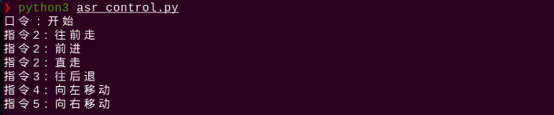

### 2.3 功能实现

我们可以靠近语音识别模块的麦克风，首先要说"**开始**"（程序设置的词条）。当模块上的 STA 指示灯变为蓝色常亮时，我们再说出其它设置词条，例如"**qianjin（前进）**"、"**wang hou tui（往后退）**"等。

当识别到后，语音识别模块上的 STA 指示灯会熄灭，语音播报模块将播放"**收到**"的声音作为反馈，然后机器人便进行执行一次动作。

执行完后我们可以继续说出其它设置的关键词（但每次必须先说"**开始**"），这样语音识别模块将继续进行识别。

程序完整设置的关键字如下表所示：

| **序号** |   **唤醒词**    |
| :------: | :-------------: |
|    1     | kai shi（开始） |

<table class="docutils-nobg" border="1" style="text-align:center">
	<thead><tr><th>序号</th><th>关键字</th></tr></thead>
    <tbody>
    	<tr><td rowspan="3">2</td><td>wang qian zou（往前走）</td></tr>
        <tr><td>qian jin（前进）</td></tr>
        <tr><td>zhi zou （直走）</td></tr>
        <tr><td>3</td><td>wang hou tui（往后退）</td></tr>
        <tr><td>4</td><td>xiang zuo yi dong（向左移动）</td></tr>
        <tr><td>5</td><td>xiang you yi dong（向右移动）</td></tr>
    </tbody>
</table>

### 2.4 功能延伸

- #### 2.4.1 语音识别模块

**增加或修改检测词条**

:::{Note}
这里只是增加了一个语音识别的新词条，在识别后并无任何执行动作。如需加入识别后的动作，请详细参考源码程序注释。
:::

我们以增加一个**挥手**的词条为例，将上述词条的按照同样的格式进行复制，将序号修改为6，名称为"**hui shou**"，如下图所示：

```py
if debug:
    asr.eraseWords()
    asr.setMode(2)
    asr.addWords(1, 'kai shi')
    asr.addWords(2, 'wang qian zou')
    asr.addWords(2, 'qian jin')
    asr.addWords(2, 'zhi zou')
    asr.addWords(3, 'wang hou tui')
    asr.addWords(4, 'xiang zuo yi dong')
    asr.addWords(5, 'xiang you yi dong')
    asr.addWords(6, 'hui shou')
```

说明：

1. 程序中默认添加了5个关键词条。词条asr.addWords(1, 'kai shi')中的第一个参数是词条的编号，词条的编号需要随着词条数量进行手动依次增加；第二个参数是词条的内容，这里需要将识别的内容以拼音的形式进行添加，汉字拼音之间以空格隔开。

例如："**ni hao**"为正确，"**nihao**"为错误。

2. 在添加词条时，需要注意：最多可以设置50个词条识别句，词条识别句可以是单字，词组或短句，每句长度为不超过10个汉字或者79个字节的拼音串。

```py
debug = True

if debug:
    asr.eraseWords()
    asr.setMode(2)
    asr.addWords(1, 'kai shi')
    asr.addWords(2, 'wang qian zou')
    asr.addWords(2, 'qian jin')
    asr.addWords(2, 'zhi zou')
    asr.addWords(3, 'wang hou tui')
    asr.addWords(4, 'xiang zuo yi dong')
    asr.addWords(5, 'xiang you yi dong')
```

**修改唤醒词条**

本小节我们将唤醒词修改为"**准备**"为例进行展示：

1)  首先程序中默认为口令模式。在口令模式下，每次执行语音识别，都需要先说出唤醒的词条，再接着说设置的词条，机器人才会执行检测词条对应的动作。程序设置词条的第一个词条作为启动语音识别的唤醒词条。

```py
asr.addWords(1, 'kai shi')
```

2)  我们按下"**i**"进入编辑模式，将"**kai shi**"修改为"**zhun bei**"。

```py
asr.addWords(1, 'zhun bei')
```

**修改识别模式**

语音识别模块支持 3 种语音识别模式，分别是循环识别模式、口令模式、按键模式。

1)  循环模式是让语音识别模块一直循环检测词条；

2)  口令模式是每次检测前，都需要说出第一个词条作为启动检测的口令，然后再说出检测的词条；

3)  按键模式是只有按下语音识别模块上的按键，才会开始检测词条；

4)  程序中默认设置为口令模式，即 asr.setMode()的值为 2。如果要修改语音识别的模式，可以在程序中如下位置进行修改：

```py
asr.setMode(2)
```

5)  如果要设置为循环模式，需要将 asr.setMode()值修改为1；如果要设置为按键模式，需要将asr.setMode()值修改为3。

- #### 2.4.2 语音合成模块

**修改播放内容**

1)  程序默认播放内容是"**准备就绪**"，如下图所示：

```py
tts.TTSModuleSpeak('[h0][v10][m3]', '准备就绪')
```

2)  如需修改播放的内容，直接修改文本的内容就可以了，例如我们修改为"**SpiderPi准备就绪**"，如下图所示：

```py
tts.TTSModuleSpeak('[h0][v10][m3]', 'SpiderPi准备就绪')
```

**修改播放音量**

1)  程序中默认的音量是最大音量10，如下图所示：

```py
    tts.TTSModuleSpeak('[h0][v10][m3]', '我准备好了')
```

2)  如需修改音量，直接修改\[v10\]中的数值即可，例如我们修改为"**\[v5\]**"，如下图所示：

注意：音量范围为0-10。

```py
    tts.TTSModuleSpeak('[h0][v5][m3]', '准备就绪')
```

因篇幅展示受限，更多参数可参考本节所在目录附带的"**语音合成模块更多说明**"。

### 2.5 程序参数说明

根据实现的效果，梳理程序的过程逻辑，如下图所示：

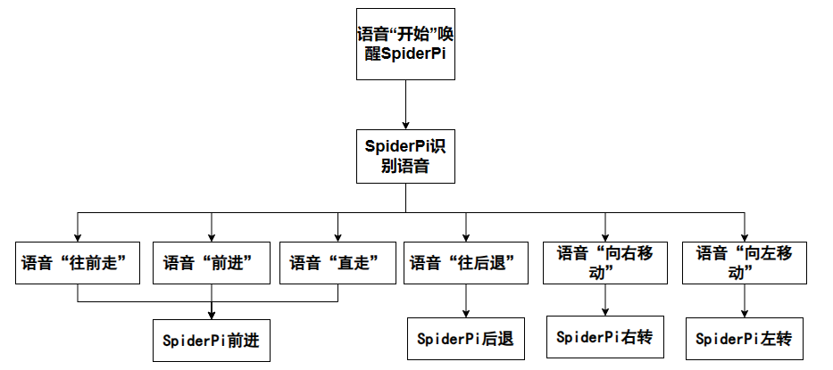

该程序的源代码位于：**/home/pi/SpiderPi/Functions/ASRControl.py**

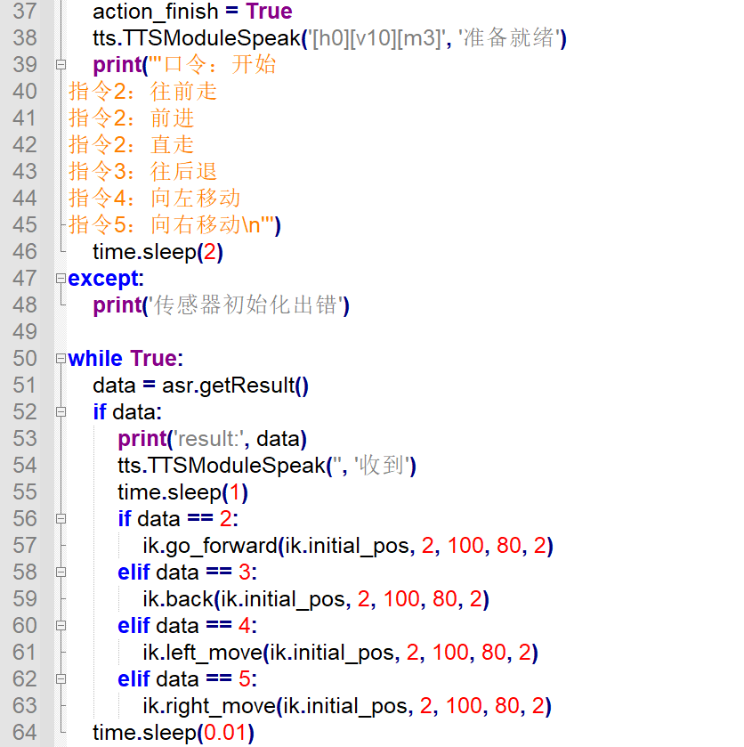

- #### 2.5.1 语音识别和语音输出参数

在这个玩法中，语音识别模块负责识别外界声音，语音合成模块负责输出声音，过程中涉及的主要参数如下：

1)  初始时，需设置唤醒词和控制语音，如下图所示：

```py
    if debug:
        asr.eraseWords()
        asr.setMode(2)
        asr.addWords(1, 'kai shi')
        asr.addWords(2, 'wang qian zou')
        asr.addWords(2, 'qian jin')
        asr.addWords(2, 'zhi zou')
        asr.addWords(3, 'wang hou tui')
        asr.addWords(4, 'xiang zuo yi dong')
        asr.addWords(5, 'xiang you yi dong')
```

以"**asr.addWords(1, 'kai shi')**"为例：

第一个参数"**1**"是控制语音序号，1默认设置为唤醒词；

第二个参数"**'kai shi'**"是控制语音的中文拼音。

2)  通过语音合成模块发出声音，如下图所示：

```py
tts.TTSModuleSpeak('[h0][v10][m3]', '准备就绪')
```

第一个参数"**"\[h0\]\[v10\]\[m3\]"**"是控制发声的方法，\[h0\]设置单词发音方式，0表示自动判断单词发音方式，1表示字母发音方式，2表示单词发音方式；

\[v10\]设置音量，音量范围为0-10，10为最大音量；

**注意：\[m3\]为音色，默认为女声，且不支持更改。**

第二个参数"**"准备就绪"**"是语音合成模块输出声音内容。

- #### 2.5.2 执行动作参数

当接收到语音信息，语音合成模块输出对应的声音，同时机器人执行对应动作，具体设置如下图所示：

```py
while True:
    data = asr.getResult()
    if data:
        print('result:', data)
        tts.TTSModuleSpeak('', '收到')
        time.sleep(1)
        if data == 2:
            ik.go_forward(ik.initial_pos, 2, 100, 80, 2)
        elif data == 3:
            ik.back(ik.initial_pos, 2, 100, 80, 2)
        elif data == 4:
            ik.left_move(ik.initial_pos, 2, 100, 80, 2)
        elif data == 5:
            ik.right_move(ik.initial_pos, 2, 100, 80, 2)
```

以"**ik.go_forward(ik.initial_pos, 2, 100, 80, 2)**"为例：

"**go_forward**"代表前进，其他类似；

第一个参数"**ik.initial_pos**"代表姿态；

第二个参数"**2**"代表模式为六足模式；

第三个参数"**100**"代表步幅，单位为mm （转弯时为角度，单位度）；

第四个参数"**80**"代表控制运动参数3设置的步幅或角度所需时间，单位为ms；

第五个参数"**2**"代表执行次数，设置为0时表示无限循环。

设置时，语音控制指令所对应的序号，如下图所示：

```py
asr.addWords(1, 'kai shi')
asr.addWords(2, 'wang qian zou')
asr.addWords(2, 'qian jin')
asr.addWords(2, 'zhi zou')
asr.addWords(3, 'wang hou tui')
asr.addWords(4, 'xiang zuo yi dong')
asr.addWords(5, 'xiang you yi dong')
```

## 3. 颜色识别播报

### 3.1 玩法简要说明

TTS（文语转换技术），又称之为语音合成技术，它能够将计算机产生的、或外部输入的文字信息转变为可以听得懂的语音输出。对常见的数字、号码、时间、日期、度量符号等信息，能够根据内部的文本匹配规则进行正确的识别和处理。

本节课我们让SpiderPi机器人识别不同颜色，并且通过语音合成模块播报作为反馈。

首先对视觉范围内的图像进行处理，将图像转换为Lab空间，进行二值化处理，再经过膨胀腐蚀等操作，可获得只包含目标颜色的轮廓，然后将该颜色轮廓框起，便实现了物体颜色的识别。

语音合成功能支持多种文本控制标记，可以设置发音人、音量、语速、语调等参数，模拟真人发生的效果。

当获得颜色识别结果后，语音合成需对颜色的判断，根据判断结果设置不同的语音参数。然后再通过对颜色的文本数据进行处理，与语音库进行匹配，将文本转换为音素序列，再将音素序列生成语音。

最后输出结果，从而达到颜色识别播报的功能。

### 3.2 玩法开启及关闭步骤

:::{Note}
指令输入需严格区分大小写及空格。
:::

1.  将机器人开机，然后通过VNC远程连接树莓派桌面。关于VNC的安装及连接，可参考"**[远程工具安装与连接]()**"。

2)  在树莓派的桌面双击的"Terminator"图标，打开命令行终端。

3)  输入指令，按下回车键，则定位到存放了玩法程序的目录。

```commandline
cd /home/pi/spiderpi/extend/
```

4. 输入指令 ，然后按下回车键将玩法启动。

```commandline
python3 color_detect_and_tts.py
```

5. 如需关闭此玩法，只需要在LX终端界面中按下 " **Ctrl+C** " 。如果关闭失败，可多次按下。

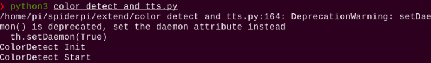

### 3.3 功能实现

:::{Note}
建议在平整空旷的地面进行操作，并且每次保持仅有单个颜色物品出现在摄像头可识别范围。
:::

当听到 SpiderPi机器人播报"**我准备好了**" 的语音后，将不同颜色的物品依次置于摄像头前，当识别到后，便会播报该颜色对应的词条。

颜色与词条的关系如下表：

| **颜色** |  **词条**  |
| :------: | :--------: |
|   红色   | 检测到红色 |
|   绿色   | 检测到绿色 |
|   蓝色   | 检测到蓝色 |

### 3.4 功能延伸

我们可以根据实际情况来修改语音播报的内容以及音量。其中音量的可调节范围为1-10，默认的音量值为10。玩法启动后，默认会播报"**我准备好了**"。

本节我们以音量修改为5，玩法启动后的默认播报修改为"**你好**"为例。具体步骤如下：

1)  输入指令 ，按下回车键，进入玩法程序。

```py
cd /home/pi/spiderpi/extend/
```

2. 输入指令,按下回车，进入编辑模式。

```commandline
vim color_detect_and_tts.py
```

3. 找到代码"**tts.TTSModuleSpeak('\[h0\]\[v10\]\[m3\]', '我准备好了')**"。

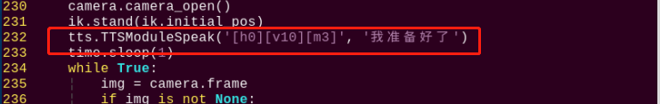

:::{Note}
在键盘输入代码位置序号后按下"**Shift+G**"键，即可直接跳转到对应位置。（本节旨在介绍快速跳转方法，故代码位置序号仅供参考，请以实际为准。）
:::

上图红框为设置语音合成的代码。其中，"**\[h0\]**"代表发音方式为自动发音，"**\[v10\]**"代表音量为10（音量范围：1-10），而"**我准备好了**"是语音播报的内容。

4)  因此我们只需修改"**\[v10\]**"和"**我准备好了**"，便可修改播报音量以及玩法启动后的默认播报内容，

5)  按下 "**i**" 进入编辑模式。

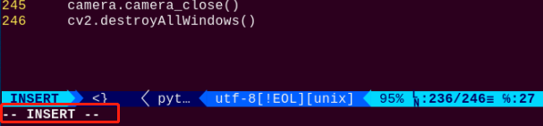

6. 然后将音量参数改成"**\[v5\]**"。语音播报内容修改为 "准备好了"，如下图所示：

```py
tts.TTSModuleSpeak('[h0][v5][m3]', '我准备好了')
```

7. 最后按下"**Esc**"进入末行命令模式，再输入指令即可保存退出。（先输入英文:，再输入wq）

```commandline
:wq
```

### 3.5 程序参数说明

根据实现的效果，梳理程序的过程逻辑，如下图所示：

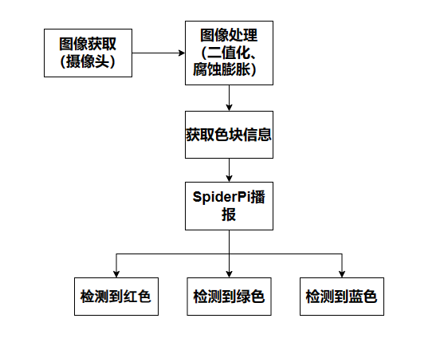

该程序的源代码位于：**/home/pi/spiderpi/extend/color_detect_and_tts.py**

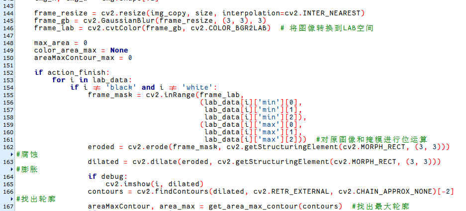

- #### 3.5.1 语音合成参数

在这个玩法中，通过语音合成模块播放声音，过程中主要涉及的参数如下：

```py
tts.TTSModuleSpeak('[h0][v10][m3]', '我准备就绪好了')
```

第一个参数"**"\[h0\]\[v10\]\[m3\]"**"是控制发声的方法，\[h0\]设置单词发音方式，0表示自动判断单词发音方式，1表示字母发音方式，2表示单词发音方式；\[v10\]设置音量，音量范围为0-10，10为最大音量；

**注意：\[m3\]设置选择发音人，已默认为女声，无法更改。**

第二个参数"**'我准备好了'**"是语音合成模块输出声音内容。

- #### 3.5.2 颜色检测参数

在这个玩法程序中，需要对物体颜色进行检测，检测过程中主要涉及的检测参数如下：

1)  在将图像转换到LAB空间前，需要对图像进行减噪处理，使用GaussianBlur()函数进行高斯滤波，如下图所示：

```py
frame_gb = cv2.GaussianBlur(frame_resize, (3, 3), 3) 
```

第一个参数"**frame_resize**"是输入图像；

第二个参数"**(3, 3)**"是高斯内核大小。较大的内核通常会导致更大程度的过滤，令输出图像更为模糊，且还会增加计算的复杂性；

第三个参数"**3**"是高斯函数沿X方向的标准差。在高斯滤波器中用于控制其平均值附近的变化。该数据增大，平均值周围允许的变化范围随之增大；若减小，则平均值周围允许的变化范围减小。

2)  通过使用inRange函数对输入图像进行二值化处理，如下图所示：

```py
frame_mask = cv2.inRange(frame_lab,
                         (lab_data[i]['min'][0],
                          lab_data[i]['min'][1],
                          lab_data[i]['min'][2]),
                         (lab_data[i]['max'][0],
                          lab_data[i]['max'][1],
                          lab_data[i]['max'][2]))  #对原图像和掩模进行位运算
```

3)  为了降低干扰，让图像更加平滑，需要进行腐蚀和膨胀处理，如下图所示：

```py
eroded = cv2.erode(frame_mask, cv2.getStructuringElement(cv2.MORPH_RECT, (3, 3)))  #腐蚀
dilated = cv2.dilate(eroded, cv2.getStructuringElement(cv2.MORPH_RECT, (3, 3))) #膨胀
```

处理中使用getStructuringElement()函数，用于生成不同形态的结构元素。

第一个参数"**cv2.MORPH_RECT**"是内核形状，此处为矩形；

第二个参数"**(3, 3)**"是矩形尺寸，此处为3×3。

4)  找出物体的最大轮廓，如下图所示：

```py
# 找出面积最大的轮廓
# 参数为要比较的轮廓的列表
def get_area_max_contour(contours):
    contour_area_temp = 0
    contour_area_max = 0

    area_max_contour = None
    max_area = 0

    for c in contours:  # 历遍所有轮廓
        contour_area_temp = math.fabs(cv2.contourArea(c))  # 计算轮廓面积
        if contour_area_temp > contour_area_max:
            contour_area_max = contour_area_temp
            if contour_area_temp >= 100:  # 只有在面积大于设定时，最大面积的轮廓才是有效的，以过滤干扰
                area_max_contour = c
                max_area = contour_area_temp

                return area_max_contour, max_area  # 返回最大的轮廓, 面积
```

为了避免干扰，通过"**if contour_area_temp \>100**"指令设置，只有面积大于100时，最大面积的轮廓才有效。

- #### 3.5.3 颜色识别参数

颜色识别过程中主要涉及的控制参数如下：

1)  当机器人识别到带有设置颜色物品，可以用cv2.circle()函数在回传画面内绘制圆圈，将目标物体圈出，如下图所示：

```py
cv2.circle(img, (centerX, centerY), radius, range_rgb[color_area_max], 2)#画圆
```

第一个参数"**img**"是输入图像，此处为识别到对应颜色物品的图像；

第二个参数"**(centerX, centerY)**"是所画圆的中心点坐标（根据检测物体决定）；

第三个参数"**radius**"是所画圆的半径（根据检测物体决定）；

第四个参数"**range_rgb\[color_area_max\]**"是所画圆的线条颜色（根据检测物体，代码中设置）；

第五个参数"**2**"是所画圆的线条宽度。

2)  在识别到颜色物品后，设置画圆的线条颜色和语音播放相关信息，如下图所示：

```py
if color_area_max == 'red':  #红色最大
    color = 1
elif color_area_max == 'green':  #绿色最大
    color = 2
elif color_area_max == 'blue':  #蓝色最大
    color = 3
else:
    color = 0
    color_list.append(color)
```

```py
if len(color_list) == 5:  #多次判断
    # 取平均值
    color = int(round(np.mean(np.array(color_list))))
    color_list = []
    if color == 1:
        detect_color = 'red'
        draw_color = range_rgb["red"]
    elif color == 2:
        detect_color = 'green'
        draw_color = range_rgb["green"]
    elif color == 3:
        detect_color = 'blue'
        draw_color = range_rgb["blue"]
    else:
        detect_color = 'None'
        draw_color = range_rgb["black"]
```

```py
range_rgb = {
    'red': (0, 0, 255),
    'blue': (255, 0, 0),
    'green': (0, 255, 0),
    'black': (0, 0, 0),
    'white': (255, 255, 255),
}
```

- #### 3.5.4 语音播报参数

检测到颜色物品，通过语音合成模块播报对应结果，如下图所示：

```py
if detect_color != 'None':
    if detect_color == 'red':
        speaker = '[m3]'
    elif detect_color == 'green':
        speaker = '[m51]'
    elif detect_color == 'blue':
        speaker = '[m55]'
        tts.TTSModuleSpeak(speaker, '检测到' + color_dict[detect_color])
```

## 4. 智能搬运

### 4.1 组装搬运道具

- #### Step 1

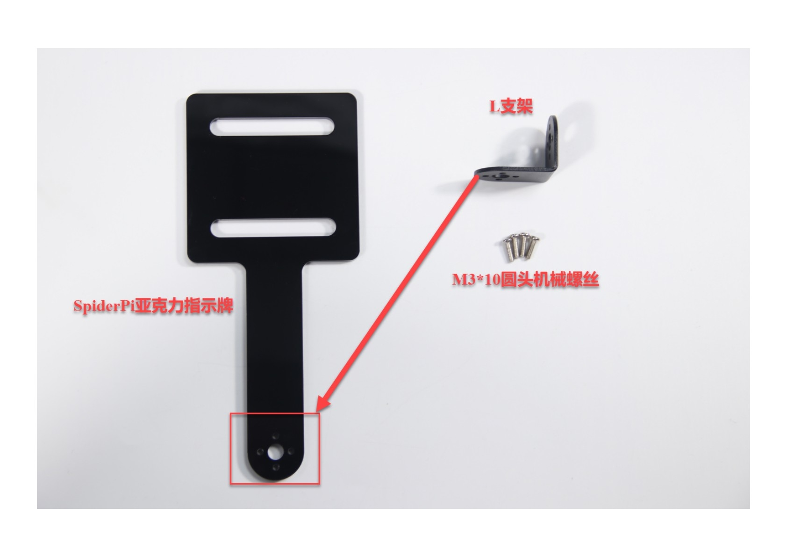

- #### Step 2

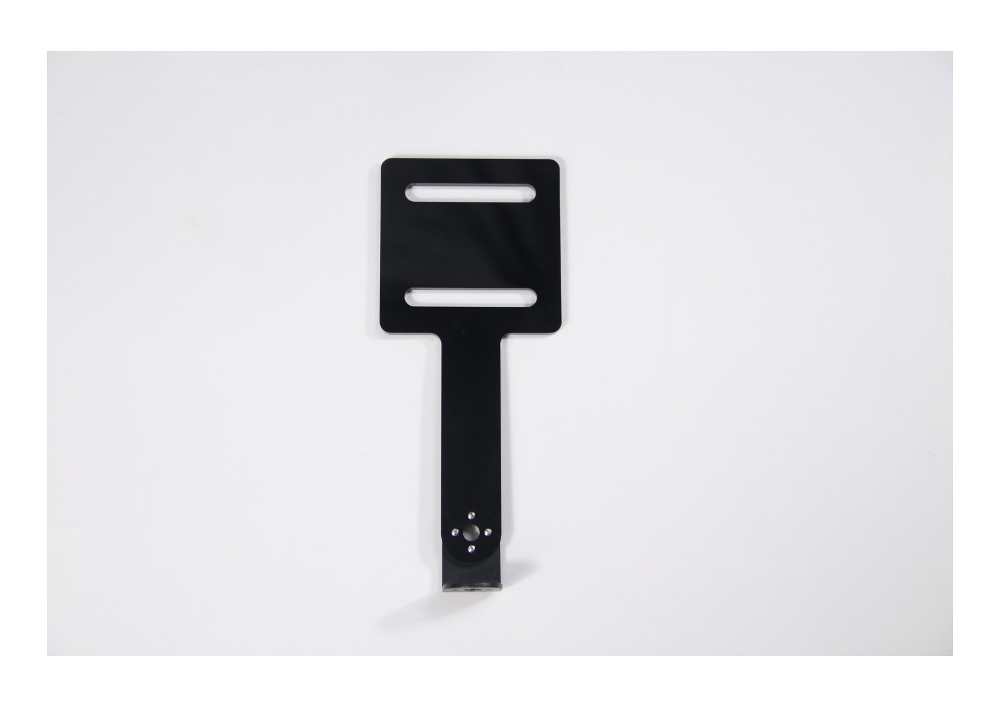

- #### Step 3

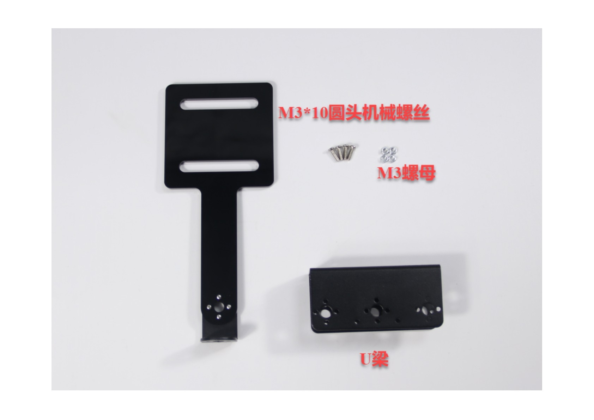

- #### Step 4

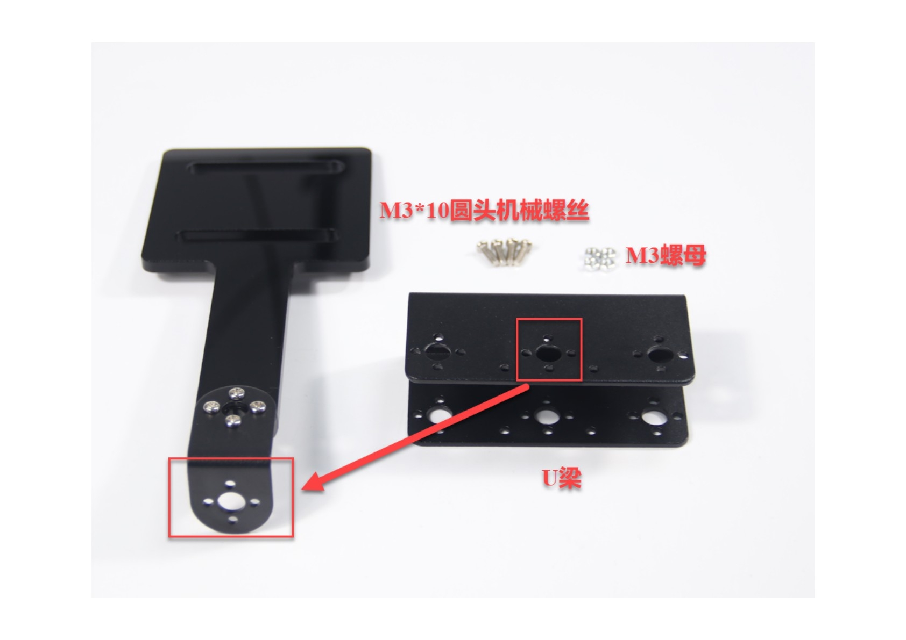

- #### Step 5

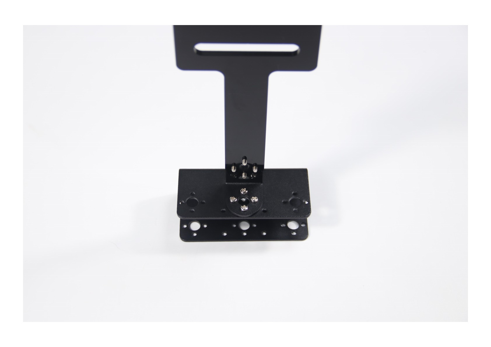

- #### Step 6

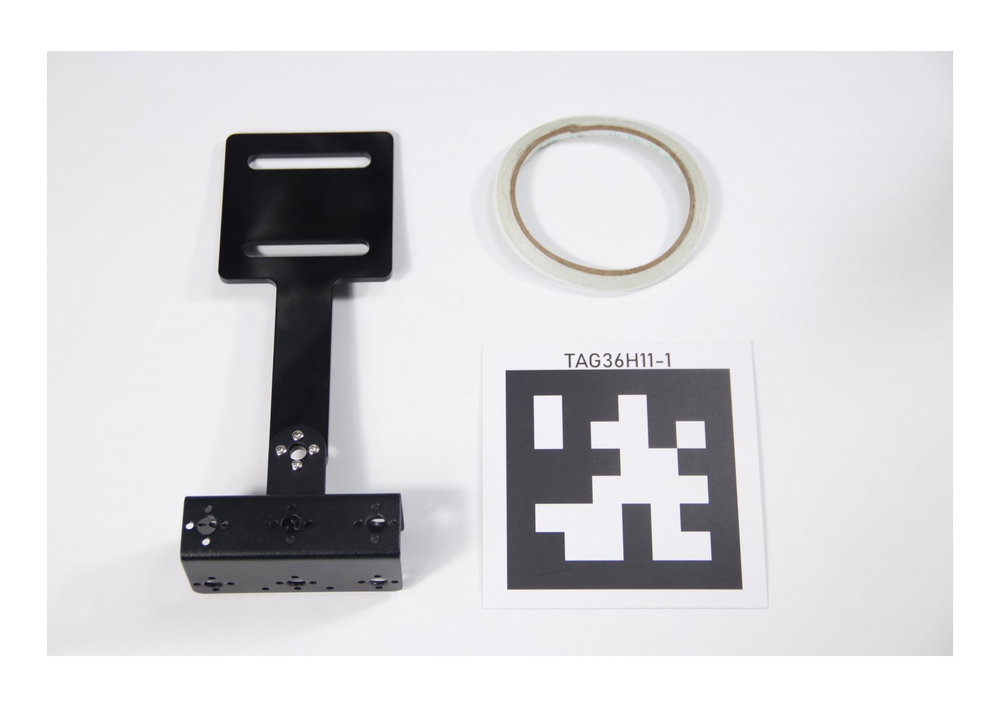

- #### Step 7

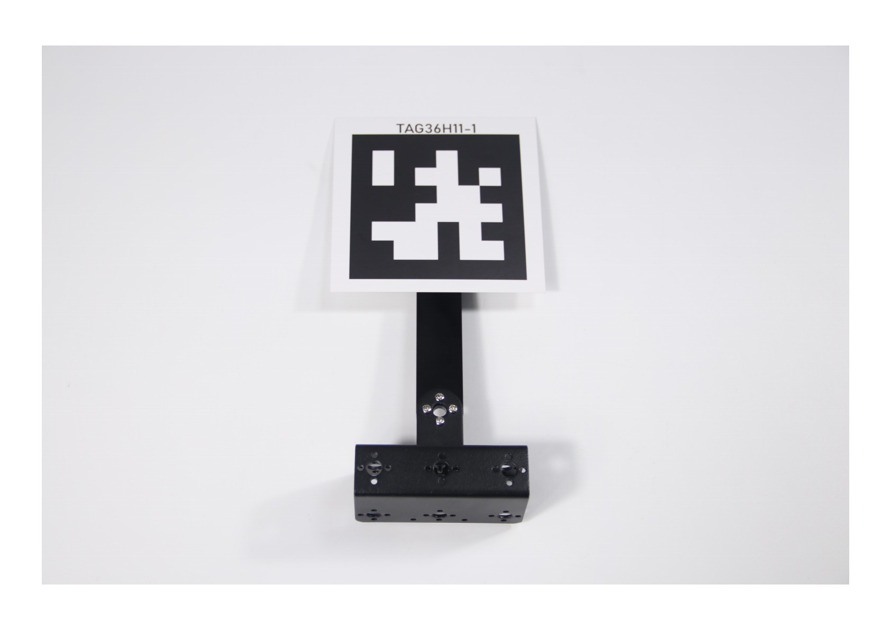

### 4.2 玩法简要说明

工业4.0时代，机器人广泛应用于智能物流领域，能够实现高效率管理，提高物流行业的服务水平，从而达到降低成本，减少自然资源和社会资源消耗的目的。

我们这节课主要学习一下SpiderPi机器人是如何实现物品搬运的功能。主要分为两个阶段进行：识别阶段和搬运阶段。

首先是识别阶段，通过机体和云台配合，让SpiderPi机器人在地图上"搜寻"可识别物品。

当视觉范围内出现可识别的颜色后，机器人便开始对物体颜色识别进行处理。先将图像转换为Lab空间，进行二值化处理，再经过膨胀腐蚀等操作，可获得只包含程序内置颜色的轮廓，然后将该颜色轮廓框起，便实现了物体颜色的识别。

识别阶段完成后，SpiderPi机器人进入搬运阶段。

根据对图像反馈信息的处理，当有多个物品在视线范围内时，可对物品的距离远近进行判断。依照判断结果，优先选择搬运其中距离最近的物品。控制机体接近并在达到设定范围时将其搬起举至头顶。

同时根据物品颜色可以匹配其对应的AprilTag标签，也就是确定该物品搬运的终点位置。然后通过控制云台和机体运动，在地图上进行扫描，当扫描到标签时，依据是否为目标标签，执行不同的动作。

如果扫描到的是目标标签，则会直接搬运到目标点，然后放下物品。

如果扫描到了其它标签，则会根据扫描到的标签来判断目标标签的位置，然后控制SpiderPi机器人向目标转向，直到扫描到目标标签，再将搬运到目标点，放下物品。

### 4.3 实验准备

1)  本节课我们需要在套餐附赠的地图上进行操作，首先来看下它的区域划分，主要分为两部分，其中虚线左侧是搬运终点区，右侧是物品放置区。

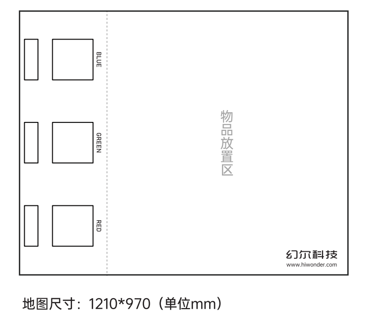

2)  将地图平铺在空旷平整的地面，再将机器人和三种颜色的海绵块随机放置到物品放置区域。

3)  打开机器人的开关，然后通过VNC远程连接树莓派桌面。

### 4.4 玩法开启及关闭步骤

:::{Note}
指令的输入需严格区分大小写，另外可按键盘"**Tab**"键进行关键词补齐。。
:::

1.  将机器人开机，然后通过VNC远程连接树莓派桌面。关于VNC的安装及连接，可参考"**[远程工具安装与连接]()**"。

2)  在树莓派的桌面双击的"Terminator"图标，打开命令行终端。

3)  输入指令，按下回车键，则定位到存放了玩法程序的目录。

```commandline
cd /home/pi/spiderpi/extend/
```

4. 输入指令，然后按下回车将玩法启动。

```commandline
python3 self_transport.py
```

5. 如需关闭此玩法，可在LX终端界面中按下"**Ctrl+C**"。如果关闭失败，可多次按下。

### 4.5 功能实现

:::{Note}
建议在平整空旷的地面下进行摆放地图。
:::

将机器人和红绿蓝三种颜色的海绵块随机放置到地图的放置区内。启动智能搬运玩法后，机器人将会按照距离的远近依次搬运海绵块到对应的AprilTag标签前，直至三个色块都搬运完成。

### 4.6 语音搬运玩法与智能搬运玩法对比

<table style="text-align:center" class="docutils-nobg" border="1">
<colgroup>
<col  />
<col  />
<col  />
</colgroup>
<tbody>
<tr>
<td></td>
<td><strong>语音控制搬运</strong></td>
<td><strong>智能搬运</strong></td>
</tr>
<tr>
<td rowspan="2">控制方式</td>
<td colspan="2">命令行启动玩法后</td>
</tr>
<tr>
<td>语音控制</td>
<td>自动工作</td>
</tr>
<tr>
<td>应用场景</td>
<td>安静环境（语音指令有效距离小于30cm）</td>
<td><p>安静或嘈杂环境皆可</p>
<p>（无距离要求）</p></td>
</tr>
<tr>
<td>工作模式</td>
<td>单次搬运</td>
<td>连续搬运</td>
</tr>
</tbody>
</table>


### 4.7 程序参数说明

根据实现的效果，梳理程序的过程逻辑，如下图所示：

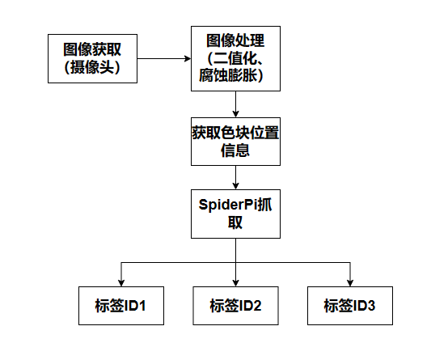

该程序的源代码位于：**/home/pi/spiderpi/extend/self_transport.py**

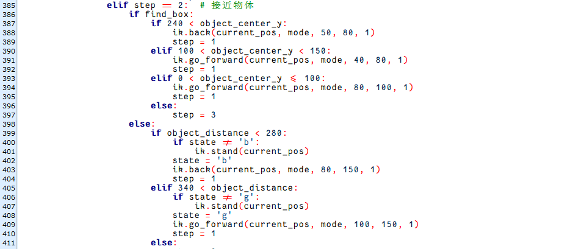

- #### 4.7.1 搬运颜色及预设位置参数

在这个玩法里，设置搬运红绿蓝3种颜色物体，并将物体搬运到对应标签位置，如下图所示：

```py
object_color = 'red'
head_turn = 'left_right'
color_list = ['red', 'green', 'blue']
```

```py
color_tag = {'red': 1,
             'green': 2,
             'blue': 3
            }
```

- #### 4.7.2 开始检测找出搬运物体

**检测搬运物体**

开始时，机器人调整左右方向，找到需要搬运的物体，具体设置如下图：

```py
if not __isRunning or stop_detect:
    if step == 5:
        object_center_x = 0
        return img
```

```py
color_list.remove(object_color)
if color_list == []:
    color_list = ['red', 'green', 'blue']
    find_box = not find_box
    object_center_x = -2
    step = 1
```

```py
elif object_center_x >= 0:  # 如果找到目标(if the target is detected)
    if step == 1:  # 左右调整，保持在正中(adjust left and right to keep it in the center)
        if find_box:
            if object_center_x - CENTER_X > 160:  # 不在中心，根据方向让机器人转向一步(If it is not in the center, turn the robot one step according to the direction)
                ik.right_move(current_pos, mode, 50, 80, 1)
            elif object_center_x - CENTER_X < -160:
                ik.left_move(current_pos, mode, 50, 80, 1)
            elif -10 > object_angle > -45:
                ik.turn_left(current_pos, mode, 15, 80, 1)
            elif -80 < object_angle <= -45:
                ik.turn_right(current_pos, mode, 15, 80, 1)
            elif object_center_x - CENTER_X > 80:  # 不在中心，根据方向让机器人转向一步(If it is not in the center, turn the robot one step according to the direction)
                ik.right_move(current_pos, mode, 20, 80, 1)
            elif object_center_x - CENTER_X < -80:
                ik.left_move(current_pos, mode, 20, 80, 1)
            else:
                step = 2
```

**颜色检测参数**

检测物体时，通过检测颜色，达到检测目的，代码如下图：

```py
# 如果是搬运阶段(if it is transport phrase)
if find_box:
    color, color_center_x, color_center_y, color_angle = colorDetect(img)  # 颜色检测，返回颜色，中心坐标，角度
```

检测物体颜色过程中主要涉及的检测参数如下：

1)  在将图像转换到LAB空间前，需要对图像进行减噪处理，使用GaussianBlur()函数进行高斯滤波，如下图所示：

```py
frame_gb = cv2.GaussianBlur(frame_resize, (3, 3), 3)
```

第一个参数"**frame_resize**"是输入图像；

第二个参数"**(3, 3)**"是高斯内核大小。较大的内核通常会导致更大程度的过滤，令输出图像更为模糊，且还会增加计算的复杂性；

第三个参数"**3**"是高斯函数沿X方向的标准差。在高斯滤波器中用于控制其平均值附近的变化。该数据增大，平均值周围允许的变化范围随之增大；若减小，则平均值周围允许的变化范围减小。

2)  通过使用inRange函数对输入图像进行二值化处理，如下图所示：

```py
frame_mask = cv2.inRange(frame_lab,
                         (lab_data[i]['min'][0],
                          lab_data[i]['min'][1],
                          lab_data[i]['min'][2]),
                         (lab_data[i]['max'][0],
                          lab_data[i]['max'][1],
                          lab_data[i]['max'][2]))  #对原图像和掩模进行位运算
```

3)  为了降低干扰，让图像更加平滑，需要对图片进行腐蚀和膨胀处理，如下图所示：

```py
eroded = cv2.erode(frame_mask, cv2.getStructuringElement(cv2.MORPH_RECT, (3, 3)))  # 腐蚀(erode)
dilated = cv2.dilate(eroded, cv2.getStructuringElement(cv2.MORPH_RECT, (3, 3)))  # 膨胀(dilate)
```

处理中使用getStructuringElement函数，用于生成不同形态的结构元素；

第一个参数"**cv2.MORPH_RECT**"是内核形状，此处为矩形；

第二个参数"**(3, 3)**"是矩形尺寸，此处为3×3。

4)  找出物体的最大轮廓，如下图所示：

```py
# 找出面积最大的轮廓(find the contour with the maximum area)
# 参数为要比较的轮廓的列表(parameter is the list of contour to be compared)
def get_area_max_contour(contours):
    contour_area_temp = 0
    contour_area_max = 0

    area_max_contour = None
    max_area = 0

    for c in contours:  # 历遍所有轮廓(traverse through all contours)
        contour_area_temp = math.fabs(cv2.contourArea(c))  # 计算轮廓面积(calculate contour area)
        if contour_area_temp > contour_area_max:
            contour_area_max = contour_area_temp
            if contour_area_temp >= 100:  # 只有在面积大于设定时，最大面积的轮廓才是有效的，以过滤干扰(Only when the area is greater than the set value, the contour with the maximum area is considered valid to filter out interference)
                area_max_contour = c
                max_area = contour_area_temp

                return area_max_contour, max_area  # 返回最大的轮廓, 面积(Return the largest contour and its area)
```

为了避免干扰，通过"**if contour_area_temp \> 100**"指令设置，只有面积大于100时，最大面积的轮廓才有效。

5)  当机器人识别到颜色物体，通过cv2.drawContours()函数来绘制颜色物体的轮廓，如下图所示：

```py
cv2.drawContours(img, [np.array(corners, np.int32)], -1, (0, 255, 255), 2)
```

第一个参数"**img**"是输入图像；

第二个参数" **\[box\]**"是轮廓本身，在Python中为list；

第三个参数"**-1**"是轮廓的索引，此处数值代表绘制轮廓list内的所有轮廓；

第四个参数"**(0, 255, 255)**"是轮廓颜色，其顺序为B、G、R，此处为黄色；

第五个参数"**2**"是轮廓宽度，若为"**-1**"，则代表用指定颜色填充轮廓。

6)  机器人识别到颜色物体后，同时用cv2.circle()函数在回传画面内绘制颜色物体的中心点，如下图所示：

```py
# 获取矩形的对角点(obtain the diagonal points of the rectangle)
ptime_start_x, ptime_start_y = box[0, 0], box[0, 1]
pt3_x, pt3_y = box[2, 0], box[2, 1]
center_x_, center_y_ = int((ptime_start_x + pt3_x) / 2), int((ptime_start_y + pt3_y) / 2)  # 中心点(center point)
cv2.circle(img, (center_x_, center_y_), 5, (0, 255, 255), -1)  # 画出中心点(draw the center point)
```

第一个参数"**img**"是输入图像，此处为识别到颜色物体的图像；

第二个参数"**(centerX, centerY)**"是所画圆的中心点坐标（根据检测物体决定）；

第三个参数"**5**"是所画圆的半径；

第四个参数"**(0, 255, 255)**"是所画圆的颜色，其顺序为B、G、R，此处为黄色；

第五个参数"**-1**"则代表用参数4中颜色填充圆，如果是数字代表所画圆的线条宽度。

- #### 4.7.3 开始搬运物体

在检测到颜色物体后，机器人开始搬运物体，可以分为靠近物体、拿起物体、找到搬运位置、搬运物体和放下物体几个步骤。

**靠近物体**

开始搬运前，首先控制机器人逐渐靠近需要搬运的物品，如下图所示：

```py
# 如果是搬运阶段(if it is transport phrase)
if find_box:
    color, color_center_x, color_center_y, color_angle = colorDetect(img)  # 颜色检测，返回颜色，中心坐标，角度(detect color to return color, center coordinates, and angle)
    object_color, object_center_x, object_center_y, object_angle = color, color_center_x, color_center_y, color_angle
```

```py
elif step == 2:  # 接近物体(approach the object)
    if find_box:
        if 240 < object_center_y:
            ik.back(current_pos, mode, 50, 80, 1)
            step = 1
        elif 100 < object_center_y < 150:
            ik.go_forward(current_pos, mode, 40, 80, 1)
            step = 1
        elif 0 < object_center_y <= 100:
            ik.go_forward(current_pos, mode, 80, 100, 1)
            step = 1
        else:
            step = 3
```

```py
elif step == 3:  # 再次左右调整(adjust left and right again)
    if find_box:
        if 100 <= object_center_x - CENTER_X:  # 不在中心，根据方向让机器人转向一步(If it is not in the center, turn the robot one step according to the direction)
            if state != 'r_m':
                ik.stand(current_pos)
                state = 'r_m'
                ik.right_move(current_pos, mode, 20, 80, 1)

            elif object_center_x - CENTER_X < -100:
                if state != 'l_m':
                    ik.stand(current_pos)
                    state = 'l_m'
                    ik.left_move(current_pos, mode, 20, 80, 1)
                elif 40 <= object_center_x - CENTER_X:  # 不在中心，根据方向让机器人转向一步(If it is not in the center, turn the robot one step according to the direction)
                    if state != 'r':
                        ik.stand(current_pos)
                        state = 'r'
                        ik.turn_right(current_pos, mode, 5, 80, 1)
```

```py
elif step == 4:  # 靠近物体(approach the object)
    if find_box:
        if object_center_y < 130:
            ik.go_forward(current_pos, mode, 20, 80, 1)
        else:
            if abs(object_center_x - CENTER_X) <= 40:
                stop_detect = True
                step = 5
            else:
                step = 3
```

靠近物体过程中，需要控制SpiderPi运动，以"ik.go_move(current_pos, mode, 20, 80, 1)"为例：

"**go_move**"代表向前移动，其他类似；

第一个参数"**current_pos**"代表姿态；

第二个参数"**mode**"数值为2代表模式为六足模式；

第三个参数"**20**"代表步幅，单位为mm （转弯时为角度，单位度）；

第四个参数"**80**"代表控制运动参数3设置的步幅或角度所需时间，单位为ms；

第五个参数"**1**"代表执行次数，设置为0时表示无限循环。

**拿起物体**

靠近物体后，控制机器人拿起需要搬运的物品，如下图所示：

```py
elif step == 5:  # 拿起或者放下物体(pick up or put down the object)
    if find_box:
        current_pos = copy.deepcopy(ik.initial_pos_quadruped)
        Pick.pick(True)
        board.pwm_servo_set_position(0.5, [[1, 1500]])
        mode = 4
        find_box = not find_box
        object_center_x = -2
        step = 1
        stop_detect = False
```

"**Pick.pick(True)**"程序中，"**True**"：拿起物品，"**False**"：放下物品。

**找到搬运位置**

在搬运物体前，通过检测识别标签，找到颜色物体放置位置，如下所示：

```py
tag_data = apriltagDetect(img)  # apriltag检测(apriltag detection)
```

过程中主要涉及的控制参数如下：

1)  在获取标签码四个角点的信息后，通过cv2.drawContours()函数来绘制标签的轮廓，如下图所示：

```py
cv2.circle(frame, (object_center_x, object_center_y), 5, (0, 255, 255), -1)
```

2)  机器人识别到标签后，同时用cv2.circle()函数在回传画面内绘制标签的中心点，如下图所示：

```py
object_center_x, object_center_y = int(detection.center[0]), int(detection.center[1])  # 中心点(center point)
cv2.circle(frame, (object_center_x, object_center_y), 5, (0, 255, 255), -1)
object_angle = roll
```

**搬运物品**

拿起后物品后，将物品搬运到对应位置，如下图所示：

```py
if tag_data[color_tag[object_color] - 1][0] != -1:  # 如果检测到目标arpiltag(If the target apriltag is detected)
    object_center_x, object_center_y, object_angle, object_distance = tag_data[color_tag[object_color] - 1]
```

```py
elif step == 5:  # 拿起或者放下物体(pick up or put down the object)
    if find_box:
        current_pos = copy.deepcopy(ik.initial_pos_quadruped)
        Pick.pick(True)
        board.pwm_servo_set_position(0.5, [[1, 1500]])
        mode = 4
        find_box = not find_box
        object_center_x = -2
        step = 1
        stop_detect = False
    else:
        ik.go_forward(current_pos, mode, 60, 150, 1)
        current_pos = copy.deepcopy(ik.initial_pos)
        Pick.pick(False)
        mode = 2
```

拿起物品后，设置"**step = 1**"，接着控制机器人左右位置调整，正面朝向标签位置，如下图所示：

```py
elif object_center_x >= 0:  # 如果找到目标(if the target is detected)
    if step == 1:  # 左右调整，保持在正中(adjust left and right to keep it in the center)
        if find_box:
            if object_center_x - CENTER_X > 160:  # 不在中心，根据方向让机器人转向一步(If it is not in the center, turn the robot one step according to the direction)
                ik.right_move(current_pos, mode, 50, 80, 1)
            elif object_center_x - CENTER_X < -160:
                ik.left_move(current_pos, mode, 50, 80, 1)
            elif -10 > object_angle > -45:
                ik.turn_left(current_pos, mode, 15, 80, 1)
            elif -80 < object_angle <= -45:
                ik.turn_right(current_pos, mode, 15, 80, 1)
            elif object_center_x - CENTER_X > 80:  # 不在中心，根据方向让机器人转向一步(If it is not in the center, turn the robot one step according to the direction)
                ik.right_move(current_pos, mode, 20, 80, 1)
            elif object_center_x - CENTER_X < -80:
                ik.left_move(current_pos, mode, 20, 80, 1)
            else:
                step = 2
```

再接着，逐渐设置"**step = 2**"、"**step = 3**"、"**step = 4**"控制机器人将物品搬运到标签位置，如下图所示：

```py
elif step == 2:  # 接近物体(approach the object)
    if find_box:
        if 240 < object_center_y:
            ik.back(current_pos, mode, 50, 80, 1)
            step = 1
        elif 100 < object_center_y < 150:
            ik.go_forward(current_pos, mode, 40, 80, 1)
            step = 1
        elif 0 < object_center_y <= 100:
            ik.go_forward(current_pos, mode, 80, 100, 1)
            step = 1
```

```py
elif step == 3:  # 再次左右调整(adjust left and right again)
    if find_box:
        if 100 <= object_center_x - CENTER_X:  # 不在中心，根据方向让机器人转向一步(If it is not in the center, turn the robot one step according to the direction)
            if state != 'r_m':
                ik.stand(current_pos)
                state = 'r_m'
                ik.right_move(current_pos, mode, 20, 80, 1)

            elif object_center_x - CENTER_X < -100:
                if state != 'l_m':
                    ik.stand(current_pos)
                    state = 'l_m'
                    ik.left_move(current_pos, mode, 20, 80, 1)
                elif 40 <= object_center_x - CENTER_X:  # 不在中心，根据方向让机器人转向一步(If it is not in the center, turn the robot one step according to the direction)
                    if state != 'r':
                        ik.stand(current_pos)
                        state = 'r'
                        ik.turn_right(current_pos, mode, 5, 80, 1)
                    elif object_center_x - CENTER_X < -40:
```

```py
elif step == 4:  # 靠近物体(approach the object)
    if find_box:
        if object_center_y < 130:
            ik.go_forward(current_pos, mode, 20, 80, 1)
        else:
            if abs(object_center_x - CENTER_X) <= 40:
                stop_detect = True
                step = 5
            else:
                step = 3
            else:
                if object_distance > 340:
                    ik.go_forward(current_pos, mode, 60, 150, 1)
                else:
                    if abs(object_center_x - CENTER_X) <= 40:
                        stop_detect = True
                        step = 5
                    else:
```

搬运过程中，如果没有检测到目标标签，就通过其他标签来判断相对位置，如下图所示：

```py
else:  # 如果没有检测到目标arpiltag，就通过其他arpiltag来判断相对位置(If the target apriltag is not detected, determine the relative position of the target AprilTag by using other AprilTags)
    turn = getTurn(color_tag[object_color], tag_data)
```

```py
def getTurn(tag_id, tag_data):
    tag_1 = tag_data[0]
    tag_2 = tag_data[1]
    tag_3 = tag_data[2]
    
    if tag_id == 1:  # 目标apriltag为1(the target apriltag is 1)
        if tag_2[0] == -1:  # 没有检测到apriltag 2(apriltag 2 is not detected)
            if tag_3[0] != -1:  # 检测到apriltag 3， 则apriltag 1在apriltag 3左边，所以左转(If AprilTag 3 is detected and AprilTag 1 is to the left of AprilTag 3, then turn left)
                return 'left'
        else:  # 检测到apriltag 2，则apriltag 1在apriltag 2左边，所以左转(If AprilTag 2 is detected and AprilTag 1 is to the left of AprilTag 2, then turn left)
            return 'left'
    elif tag_id == 2:
        if tag_1[0] == -1:
            if tag_3[0] != -1:
                return 'left'
        else:
            return 'right'
    elif tag_id == 3:
        if tag_1[0] == -1:
            if tag_2[0] != -1:
                return 'right'
        else:
            return 'right'

    return 'None'
```

**放下物品**

搬运完成后，放下物品，如下图所示：

```py
else:
    ik.go_forward(current_pos, mode, 60, 150, 1)
    current_pos = copy.deepcopy(ik.initial_pos)
    Pick.pick(False)
```

:::{Note}
"**Pick.pick(False)**"程序中，"**True**"：拿起物品，"**False**"：放下物品。
:::

## 5. 智慧物品清理

### 5.1 玩法简要说明

SpiderPi机器人可以通过搬运实现物品清理，下面我们来看一下本节功能的实现流程：

主要分为两个阶段进行：识别阶段和搬运阶段。

首先是识别阶段，通过机体和云台配合，让SpiderPi机器人在红色闭合线内"搜寻"可识别物品。

先将图像转换为Lab空间，进行二值化处理，再经过膨胀腐蚀等操作，可获得只包含程序内置颜色的轮廓，然后将该颜色轮廓框起，便实现了物体颜色的识别。

在识别出红绿蓝三种颜色后，其中红色表示线，然后比较它们的坐标，从而判断出蓝色和绿色物体是否在红线内。

如果在红线内便根据对图像反馈信息的处理，当有多个物品在视线范围内时，可对物品的距离远近进行判断。依照判断结果，优先选择搬运其中距离最近的物品。控制机体接近并在达到设定范围时将其搬起举至头顶。

如果在当前摄像头可视范围内搜索不到对应的物品，将操控机体进行转动，改变搜索的区域，直至找到目标物品为止。

最后在搬起后进行直走，直到走到红线边，将物品放置在线外后即完成搬运工作。

### 5.2 实验准备

1)  本节课我们可以通过电工胶带铺设一个红色圆环形的闭合线条。

2)  将机器人和蓝、绿二色的海绵块随机放置到线条内。

### 5.3 玩法开启及关闭步骤

:::{Note}
指令的输入需严格区分大小写，另外可按键盘"**Tab**"键进行关键词补齐。。
:::

1.  将机器人开机，然后通过VNC远程连接树莓派桌面。关于VNC的安装及连接，可参考"**[远程工具安装与连接]()**"。

2.  在树莓派的桌面双击的"Terminator"图标，打开命令行终端。

```commandline
cd /home/pi/spiderpi/extend/
```

3. 输入指令，然后按下回车键将玩法启动。

```commandline
python3 transport_cleaning.py
```

4.  如需关闭此玩法，可在 LX 终端界面中按下"Ctrl+C"。如果关闭失败，可多次按下。

### 5.4 功能实现

:::{Note}
请勿将红色海绵块放置在红色线条内。
:::

在开启玩法后，将蓝色和绿色海绵块随机放置在铺设好的红色线条内。SpiderPi机器人会根据色块距离的远近顺序，依次将海绵方块搬运到红色闭合线条圈外。

### 5.5 程序参数说明

根据实现的效果，梳理程序的过程逻辑，如下图所示：

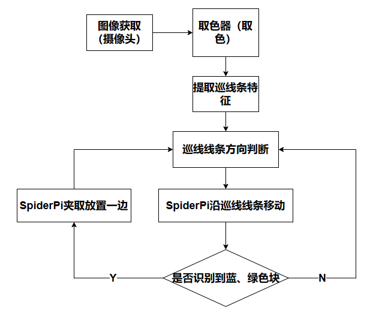

该程序的源代码位于：**/home/pi/spiderpi/extend/transport_cleaning.py**

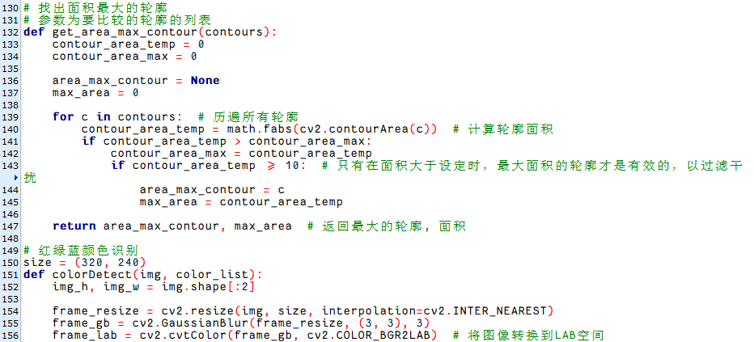

- #### 5.5.1 检测红色线条参数

在这个玩法里，首先需要检测红色线条，代码如下图：

```py
red_color, red_center_x, red_center_y, red_angle = colorDetect(img, ['red'])  # 颜色检测，返回颜色，中心坐标，角度(detect color to return color, center coordinates, and angle)
```

检测红色线条过程中主要涉及的检测参数如下：

1)  在将图像转换到LAB空间前，需要对图像进行减噪处理，使用GaussianBlur()函数进行高斯滤波，如下图所示：

```py
frame_resize = cv2.resize(img, size, interpolation=cv2.INTER_NEAREST)
frame_gb = cv2.GaussianBlur(frame_resize, (3, 3), 3)
frame_lab = cv2.cvtColor(frame_gb, cv2.COLOR_BGR2LAB)  # 将图像转换到LAB空间(convert the image to LAB space)
```

第一个参数"**frame_resize**"是输入图像；

第二个参数"**(3, 3)**"是高斯内核大小。较大的内核通常会导致更大程度的过滤，令输出图像更为模糊，且还会增加计算的复杂性；

第三个参数"**3**"是高斯函数沿X方向的标准差。在高斯滤波器中用于控制其平均值附近的变化。该数据增大，平均值周围允许的变化范围随之增大；若减小，则平均值周围允许的变化范围减小。

2)  通过使用inRange函数对输入图像进行二值化处理，如下图所示：

```py
frame_mask = cv2.inRange(frame_lab,
                         (lab_data[i]['min'][0],
                          lab_data[i]['min'][1],
                          lab_data[i]['min'][2]),
                         (lab_data[i]['max'][0],
                          lab_data[i]['max'][1],
                          lab_data[i]['max'][2]))  #对原图像和掩模进行位运算(perform bitwise operation to original image and mask)
```

3)  为了降低干扰，让图像更加平滑，需要对图片进行腐蚀和膨胀处理，如下图所示：

```py
eroded = cv2.erode(frame_mask, cv2.getStructuringElement(cv2.MORPH_RECT, (3, 3)))  # 腐蚀(erode)
dilated = cv2.dilate(eroded, cv2.getStructuringElement(cv2.MORPH_RECT, (3, 3)))  # 膨胀(dilate)
```

处理中使用getStructuringElement函数，用于生成不同形态的结构元素；

第一个参数"**cv2.MORPH_RECT**"是内核形状，此处为矩形；

第二个参数"**(3, 3)**"是矩形尺寸，此处为3×3。

4)  找出物体的最大轮廓，如下图所示：

```py
for c in contours:  # 历遍所有轮廓(traverse through all contours)
    contour_area_temp = math.fabs(cv2.contourArea(c))  # 计算轮廓面积(calculate contour area)
    if contour_area_temp > contour_area_max:
        contour_area_max = contour_area_temp
        if contour_area_temp >= 10:  # 只有在面积大于设定时，最大面积的轮廓才是有效的，以过滤干扰(Only when the area is greater than the set value, the contour with the maximum area is considered valid to filter out interference)
            area_max_contour = c
            max_area = contour_area_temp

            return area_max_contour, max_area  # 返回最大的轮廓, 面积(Return the area of the largest contour)
```

为了避免干扰，通过"**if contour_area_temp \> 10**"指令设置，只有面积大于10时，最大面积的轮廓才有效。

5)  当机器人识别到红色线条，通过cv2.drawContours()函数来绘制颜色物体的轮廓，如下图所示：

```py
cv2.drawContours(img, [box], -1, (0, 255, 255), 2)  # 画出四个点组成的矩形(draw the rectangle composed of the four points)
```

第一个参数"**img**"是输入图像；

第二个参数"**\[box\]**"是轮廓本身，在Python中为list；

第三个参数"**-1**"是轮廓的索引，此处数值代表绘制轮廓list内的所有轮廓；

第四个参数"**(0, 255, 255)**"是轮廓颜色，其顺序为B、G、R，此处为黄色；

第五个参数"**2**"是轮廓宽度，若为"**-1**"，则代表用指定颜色填充轮廓。

6)  机器人识别到红色线条后，同时用cv2.circle()函数在回传画面内绘制红色线条的中心点，如下图所示：

```py
# 获取矩形的对角点(obtain the diagonal points of the rectangle)
ptime_start_x, ptime_start_y = box[0, 0], box[0, 1]
pt3_x, pt3_y = box[2, 0], box[2, 1]
center_x_, center_y_ = int((ptime_start_x + pt3_x) / 2), int((ptime_start_y + pt3_y) / 2)  # 中心点(center point)
cv2.circle(img, (center_x_, center_y_), 5, (0, 255, 255), -1)  # 画出中心点(draw the center point)

distance = pow(center_x_ - img_w / 2, 2) + pow(center_y_ - img_h, 2)
if distance < center_max_distance:  # 寻找距离最近的物体来搬运(locate and transport the closest object)
    center_max_distance = distance
    color = i
    center_x, center_y, angle = center_x_, center_y_, angle_
```

第一个参数"**img**"是输入图像，此处为识别到颜色物体的图像；

第二个参数" **(center_x\_, center_y\_)**"是所画圆的中心点坐标（根据检测物体决定）；

第三个参数"**5**"是所画圆的半径；

第四个参数"**(0, 255, 255)**"是所画圆的颜色，其顺序为B、G、R，此处为黄色；

第五个参数"**-1**"则代表用参数4中颜色填充圆，如果是数字代表所画圆的线条宽度。

- #### 5.5.2 开始检测蓝色和绿色海绵块

找到红色线条后，接着检测线条内的蓝色和绿色海绵块，检测方法和检测红色线条一样，代码如下图：

```py
if find_box:
    color, color_center_x, color_center_y, color_angle = colorDetect(img, ['green', 'blue'])  # 颜色检测，返回颜色，中心坐标，角度(detect color to return color, center coordinates, and angle)
    object_color, object_center_x, object_center_y, object_angle = color, color_center_x, color_center_y, color_angle

```

- #### 5.5.3 开始搬运海绵块

在检测到蓝色和绿色海绵块后，机器人开始搬运海绵块，可以分为寻找海绵块、靠近海绵块、拿起海绵块、搬运海绵块和放下海绵块几个步骤。

1. 检测搬运物体

检测到蓝色和绿色海绵块后，机器人调整左右方向，正对海绵块，具体设置如下图：

```py
object_color, object_center_x, object_center_y, object_angle = red_color, red_center_x, red_center_y, red_angle
```

```py
if not __isRunning or stop_detect:
    if step == 5:
        object_center_x = 0
```

```py
find_box = not find_box
object_center_x = -2
step = 1
stop_detect = False
```

```py
if __isRunning:
    if object_center_x >= 0:  # 如果找到目标(if the target is detected)
        if find_box and red_center_y > object_center_y and object_center_y > 0:
            ik.turn_right(current_pos, mode, 15, 100, 1)
        elif step == 1:  # 左右调整，保持在正中(adjust left and right to keep it in the center)
            if find_box:
                if object_center_x - CENTER_X > 160:  # 不在中心，根据方向让机器人转向一步(If it is not in the center, turn the robot one step according to the direction)
                    ik.right_move(current_pos, mode, 50, 80, 1)
                elif object_center_x - CENTER_X < -160:
                    ik.left_move(current_pos, mode, 50, 80, 1)
                elif -10 > object_angle > -45:
                    ik.turn_left(current_pos, mode, 15, 80, 1)
                elif -80 < object_angle <= -45:
                    ik.turn_right(current_pos, mode, 15, 80, 1)
                elif object_center_x - CENTER_X > 80:  # 不在中心，根据方向让机器人转向一步(If it is not in the center, turn the robot one step according to the direction)
                    ik.right_move(current_pos, mode, 20, 80, 1)
                elif object_center_x - CENTER_X < -80:
                    ik.left_move(current_pos, mode, 20, 80, 1)
                else:
                    step = 2
```

调整机器人时，需要控制机器人运动，以"ik.left_move(current_pos, mode, 20, 80, 1)"为例：

"**left_move**"代表向左移动，其他类似；

第一个参数"**current_pos**"代表姿态；

第二个参数"**mode**"数值为2代表模式为六足模式；

第三个参数"**20**"代表角度，单位度（直走时为步幅，单位为mm）；

第四个参数"**80**"代表控制运动参数3设置的角度或步幅所需时间，单位为ms；

第五个参数"**1**"代表执行次数，设置为0时表示无限循环。

2. 靠近海绵块

开始搬运前，首先控制机器人逐渐靠近需要搬运的海绵块，如下图所示：

```py
elif step == 2:  # 接近物体(approach the object)
    if 240 < object_center_y:
        ik.back(current_pos, mode, 50, 80, 1)
        step = 1
    elif 100 < object_center_y < 150:
        ik.go_forward(current_pos, mode, 40, 80, 1)
        step = 1
    elif 0 < object_center_y <= 100:
        ik.go_forward(current_pos, mode, 80, 100, 1)
        step = 1
    else:
        step = 3
```

```py
elif step == 3:  # 再次左右调整(adjust left and right again)
    if 100 <= object_center_x - CENTER_X:  # 不在中心，根据方向让机器人转向一步(If it is not in the center, turn the robot one step according to the direction)
        ik.right_move(current_pos, mode, 20, 80, 1)
    elif object_center_x - CENTER_X < -100:
        ik.left_move(current_pos, mode, 20, 80, 1)
    elif 40 <= object_center_x - CENTER_X:  # 不在中心，根据方向让机器人转向一步(If it is not in the center, turn the robot one step according to the direction)
        ik.turn_right(current_pos, mode, 5, 80, 1)
    elif object_center_x - CENTER_X < -40:
        ik.turn_left(current_pos, mode, 5, 80, 1)
    else:
```

```py
elif step == 4:  # 靠近物体(approach the object)
    if find_box:
        if object_center_y < 150:
            ik.go_forward(current_pos, mode, 15, 80, 1)
        else:
            if abs(object_center_x - CENTER_X) <= 40:
                stop_detect = True
                step = 5
            else:
```

3. 拿起海绵块

靠近海绵块后，控制机器人拿起需要搬运的海绵块，如下图所示：

```py
elif step == 5:  # 拿起或者放下物体(pick up or put down the object)
    if find_box:
        current_pos = copy.deepcopy(ik.initial_pos_quadruped)
        Pick.pick(True)
        mode = 4
        find_box = not find_box
        object_center_x = -2
        step = 1
        stop_detect = False
```

:::{Note}
**"**Pick.pick(True)**"程序中，"**True**"：拿起物品，"**False**"：放下物品。
:::

4. 搬运海绵块

拿起后海绵块后，将海绵块搬运到红色闭合线条圈外，如下图所示：

```py
else:
    object_color, object_center_x, object_center_y, object_angle = red_color, red_center_x, red_center_y, red_angle
```

```py
elif step == 5:  # 拿起或者放下物体(pick up or put down the object)
    if find_box:
        current_pos = copy.deepcopy(ik.initial_pos_quadruped)
        Pick.pick(True)
        mode = 4
        find_box = not find_box
        object_center_x = -2
        step = 1
        stop_detect = False
    else:
        ik.go_forward(current_pos, mode, 40, 150, 2)
        current_pos = copy.deepcopy(ik.initial_pos)
        Pick.pick(False)
        mode = 2
        ik.back(current_pos, mode, 50, 100, 3)                       
        find_box = not find_box
        object_center_x = -2
        step = 1
        stop_detect = False
```

拿起海绵块后，设置"step = 1"，接着控制机器人左右位置调整，如下图所示：

```py
if object_center_x >= 0:  # 如果找到目标(if the target is detected)
    if find_box and red_center_y > object_center_y and object_center_y > 0:
        ik.turn_right(current_pos, mode, 15, 100, 1)
    elif step == 1:  # 左右调整，保持在正中(adjust left and right to keep it in the center)
        if find_box:
            if object_center_x - CENTER_X > 160:  # 不在中心，根据方向让机器人转向一步(If it is not in the center, turn the robot one step according to the direction)
                ik.right_move(current_pos, mode, 50, 80, 1)
            elif object_center_x - CENTER_X < -160:
                ik.left_move(current_pos, mode, 50, 80, 1)
            elif -10 > object_angle > -45:
                ik.turn_left(current_pos, mode, 15, 80, 1)
            elif -80 < object_angle <= -45:
                ik.turn_right(current_pos, mode, 15, 80, 1)
            elif object_center_x - CENTER_X > 80:  # 不在中心，根据方向让机器人转向一步(If it is not in the center, turn the robot one step according to the direction)
                ik.right_move(current_pos, mode, 20, 80, 1)
            elif object_center_x - CENTER_X < -80:
                ik.left_move(current_pos, mode, 20, 80, 1)
```

再接着，逐渐设置"**step = 2**"、"**step = 3**"、"**step = 4**"控制机器人将物品搬运到红色闭合线条圈外，如下图所示：

```py
elif step == 1:  # 左右调整，保持在正中(adjust left and right to keep it in the center)
```

```py
elif step == 3:  # 再次左右调整(adjust left and right again)
```

5. 放下海绵块

搬运完成后，放下海绵块，如下图所示：

```py
Pick.pick(True)
```

:::{Note}
"Pick.pick(False)"程序中，"True"：拿起物品，"False"：放下物品
:::

## 6. 标签追随

### 6.1 玩法简要说明

AprilTag作为一种视觉定位标志符，类似于二维码或者条形码，可以快速地检测标志并计算相对位置，它主要可应用于各种任务，包括AR、机器人和相机校准等。

下面我们看下本节课整体实现的流程：

首先需要对AprilTag标签进行检测，通过定位、图像分割、轮廓查找来实现。接着在轮廓定位后进行四边形的检测，通过对四个角点的获取，将直线拟合形成一个闭环。

接着在识别到后，会调用机体舵机，最后根据标签的角度进行机体移动。

### 6.2 玩法开启及关闭步骤

:::{Note}
指令的输入需严格区分大小写，另外可按键盘"**Tab**"键进行关键词补齐。。
:::

1.  将机器人开机，然后通过VNC远程连接树莓派桌面。关于VNC的安装及连接，可参考"**[远程工具安装与连接]()**"。
2.  在树莓派的桌面双击的"Terminator"图标，打开命令行终端。
3.  输入指令，按下回车键，则定位到存放了玩法程序的目录。

```commandline
cd /home/pi/spiderpi/extend/
```

4.  输入指令，然后按下回车键将玩法启动。

```commandline
python3 apriltag_follow.py
```

5. 如需关闭此玩法，只需要在LX终端界面中按下"**Ctrl+C**"。如果关闭失败，可多次按下。

### 6.3 功能实现

玩法开启后，取出附带的标签卡片，依次对准摄像头模块进行识别。手持卡片进行移动，机器人便跟随卡片进行追踪。

### 6.4 程序参数说明

根据实现的效果，梳理程序的过程逻辑，如下图所示：

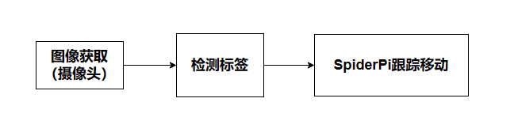

该程序的源代码位于：**/home/pi/spiderpi/extend/apriltag_follow.py**

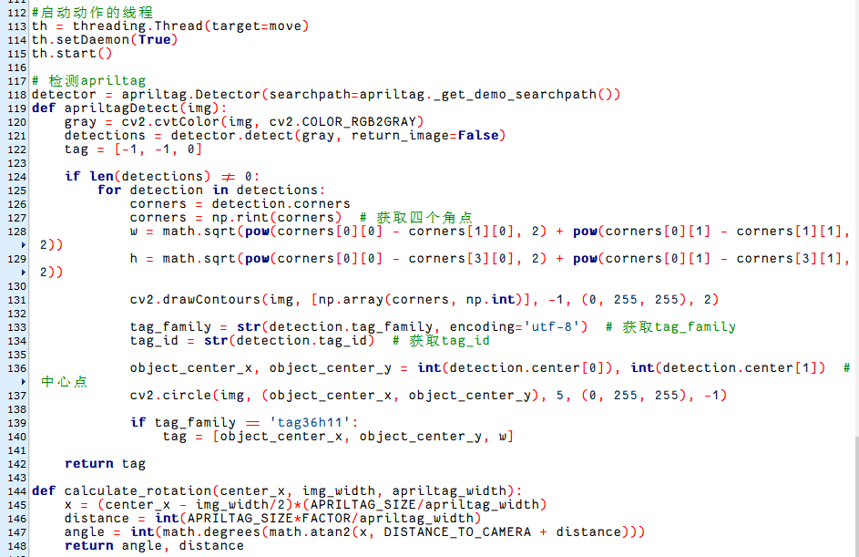

- #### 标签检测参数

在这个玩法中，检测的标签卡片的标签，如下图所示：

```py
tag = apriltagDetect(img)
```

过程中主要涉及的控制参数如下：

1)  在获取标签码四个角点的信息后，通过cv2.drawContours()函数来绘制标签的轮廓，如下图所示：

```py
cv2.drawContours(img, [np.array(corners, np.intp)], -1, (0, 255, 255), 2)
```

第一个参数"**img**"是输入图像；

第二个参数"**\[np.array(corners, np.int)\]**"是轮廓本身，在Python中为list；

第三个参数"**-1**"是轮廓的索引，此处数值代表绘制轮廓list内的所有轮廓；

第四个参数"**(0, 255, 255)**"是轮廓颜色，其顺序为B、G、R，此处为黄色；

第五个参数"**2**"是轮廓宽度，若为"**-1**"，则代表用指定颜色填充轮廓。

2)  机器人识别到标签后，同时用cv2.circle()函数在回传画面内绘制标签的中心点，如下图所示：

```py
cv2.circle(img, (object_center_x, object_center_y), 5, (0, 255, 255), -1)
```

第一个参数"**img**"是输入图像，此处为识别到标签的图像；

第二个参数"**(object_center_x, object_center_y)**"是所画圆的中心点坐标（根据检测物体决定）；

第三个参数"**5**"是所画圆的半径；

第四个参数"**(0, 255, 255)**"是所画圆的颜色，其顺序为B、G、R，此处为黄色；

第五个参数"**-1**"则代表用参数4中颜色填充圆，如果是数字代表所画圆的线条宽度。

- #### 执行动作参数

识别到标签卡片后，控制机器人随着卡片的移动而移动，如下图所示：

```py
def move():

    while True:
        if __isRunning:
            if distance > 0:
                if angle > 5:
                    if 40 > angle:
                        ik.turn_right(ik.initial_pos, 2, angle, 50, 1)
                    else:
                        time.sleep(0.01)
                elif angle < -5:
                    if -40 < angle:
                        ik.turn_left(ik.initial_pos, 2, -angle, 50, 1)
                    else:
                        time.sleep(0.01)
                elif 250 < distance:
                    d_d = int(distance - 250)
                    if d_d > 150:
                        ik.go_forward(ik.initial_pos, 2, 150, 60, 1)
                    elif d_d > 10:
                        ik.go_forward(ik.initial_pos, 2, d_d, 50, 1)
                    else:
                        time.sleep(0.01)
                elif 0 < distance < 150:
                    ik.back(ik.initial_pos, 2, 150, 100, 1)
                else:
                    time.sleep(0.01)
            else:
                time.sleep(0.01)
```

以"**ik.go_forward(ik.initial_pos, 2, 150, 60, 1)**"为例：

"**go_forward**"代表前进，其他类似；

第一个参数"**ik.initial_pos**"代表姿态；

第二个参数"**2**"代表模式为六足模式；

第三个参数"**150**"代表步幅，单位为mm （转弯时为角度，单位度）；

第四个参数"**60**"代表控制运动参数3设置的步幅或角度所需时间，单位为ms；

第五个参数"**1**"代表执行次数，设置为0时表示无限循环。
