# 2. Quick User Experience

## [1. APP Installation and Connection ]()

## 2.  APP Control

### 2.1 Preparation

Install APP and connect SpiderPi to APP according to the instruction in [**1. APP Installation and Connection**]().

### 2.2 Experience Robot Games

After connecting, click SpiderPi icon to enter the mode selection interface.

In the mode selection interface, click the icon corresponding to the game to enter the game interface.

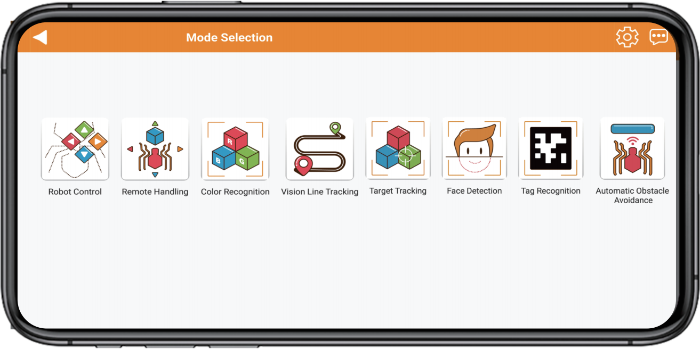

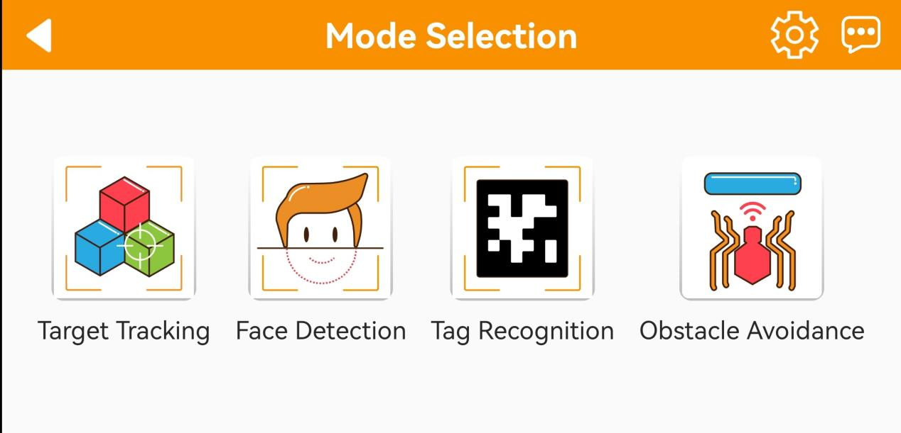

**2.2.1 Robot Control**

This game allows you to control the movement and the action group execution of the robot in real time. The interface consists of four parts, and the descriptions and function icons of each part are shown below:

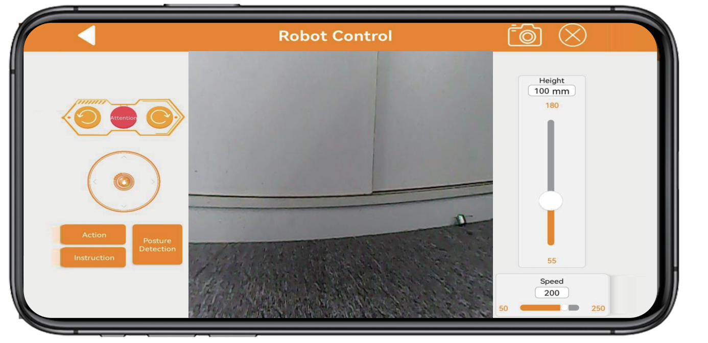

The interface of "**Robot Control**" can be divided into three parts. The left side of the interface can control the movement of the SpiderPi by dragging the slider. Other function icons can refer to the following table:

|                                **Icon**                                | **Corresponding Function** |
|:--------------------------------------------------------------------:|:--:|
| 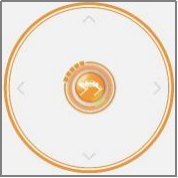 | Drag to control SpiderPi's movement. |
| 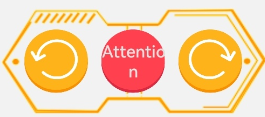 | Clicking on the icons from left to right can control the robot to perform left slide, stand at attention, and right slide, respectively. |
|    | Make SpiderPi perform provided built-in actions. |
|    | Provide a guide for the remote control of the SpiderPi. |
| 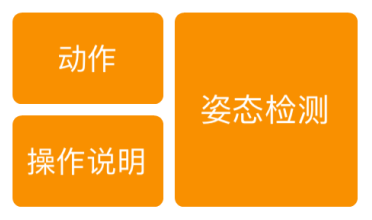 | Make SpiderPi perform forward and backward posture detection. |
| 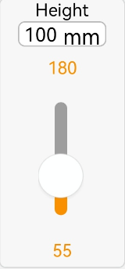 | Adjust SpiderPi's high, medium, and low posture. |
| 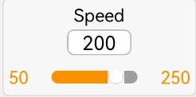 | Adjust SpiderPi's movement speed. |

The middle part of the interface shows the live camera feed, and dragging the interface can rotate the camera. 

:::{Note}
The head servo of the camera adopts limit protection. When it reaches the limit position, there will be a vibration feedback when sliding the screen again. Please stop rotate it at this time.
:::

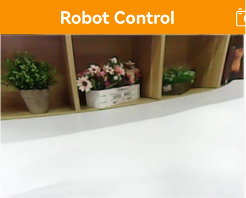

If you want to back to the games option interface, you can click the blank area, then the title bar will appear. Next, click  at the left side.

**2.2.2 Remote Control Transportation**

This game allows real-time control of the robot's movements to complete tasks such as grasping, transporting, and placing color blocks. The interface is divided into four parts, each with its description and functional icon as shown below:

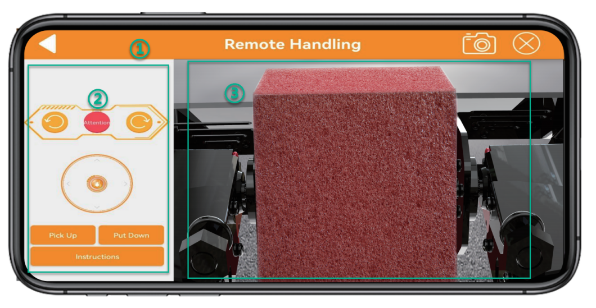

① The status bar is at the top of the interface.

② The left side of the interface controls the movement area of the SpiderPi by sliding the joystick.

③ The right side of the interface displays the live camera feed. If you want to back to the games option interface, you can click the blank area, then the title bar will appear. Next, click  at the left side.

**2.2.3 Color Recognition**

This game can recognize red, green, and blue. SpiderPi will nod when it detects red and shake its head when it detects blue or green.

:::{Note}

* Please start this game under a well-lit environment, but try to keep it from direct light.
* When recognizing, please do not have the same or similar colored object within the detected range to avoid interference.
*  If the recognition effect is not good enough, please refer to  [3.Adjust Color Threshold]().

:::

(1) This game allows real-time control of the robot's movements to complete tasks such as grasping, transporting, and placing color blocks. The interface is divided into four parts, each with its description and functional icon as shown below:

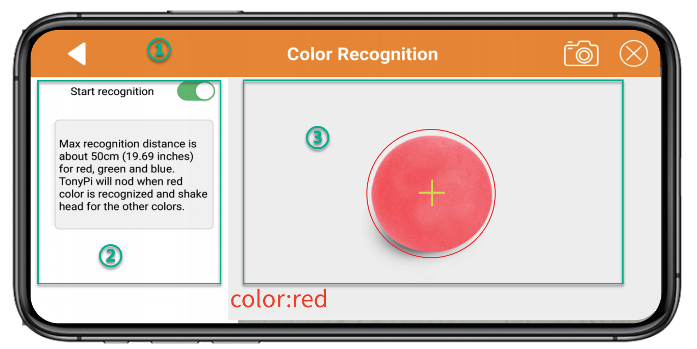

① The status bar is located at the top of the interface.

② The left side of the interface is the area for enabling, disabling the game and adjusting the color threshold.

③ The right side of the interface is the area for displaying the live camera feed.

(2) Click the "**Start Recognition**" allows you to place red, blue, and green objects one by one in front of the camera. 

| **Recognized Color** |                         **Outcome**                          |
| :------------------: | :----------------------------------------------------------: |
|         Red          | The buzzer emits a "beep" sound, and the camera nods its head. |
|        Green         | The buzzer emits a "beep" sound, and the camera shakes its head. |
|         Blue         | The buzzer emits a "beep" sound, and the camera shakes its head. |

(3) If you want to back to the games option interface, you can click the blank area, then the title bar will appear. Next, click  at the left side.

**2.2.4 Line Following**

Click "**Line Following**" to enter this game. After activating it, the SpiderPi will move forward along a black, white or red line.

:::{Note}

* Please start this game under a well-lit environment, but try to keep it from direct light.
* When recognizing, please do not have the same or similar colored object within the detected range to avoid interference.
* If the recognition effect is not good enough, please refer to  [3.Adjust Color Threshold]().
:::

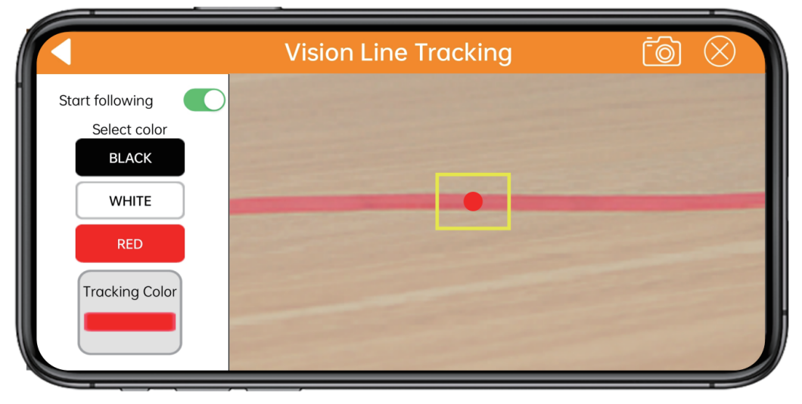

① The status bar is located at the top of the interface.

② The line tracking switch area is located on the left side of the interface

③ The camera live feed area is located on the right side of the interface.

(1) Click "**Start following**" to enter this game and select color. Then SpiderPi will follow the targeted line.

|                               Icon Button                               | **Function Instruction** |
|:--------------------------------------------------------------------:|:--:|
|  | Select the targeted color. |
| 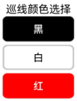 | Display the selected tracking color. |

(2) If you want to back to the games option interface, you can click the blank area, then the title bar will appear. Next, click  at the left side.

**2.2.5 Target Tracking**

(1) Click "**Target Tracking**" to enter the game interface. Once activated, this game enables the pan-tilt of SpiderPi to move along with the movement of the target color.

:::{Note}

① Please start this game under a well-lit environment, but try to keep it from direct light.

② When recognizing, please do not have the same or similar colored object within the detected range to avoid interference.

③ If the recognition effect is not good enough, please refer to  [3.Adjust Color Threshold]().

:::

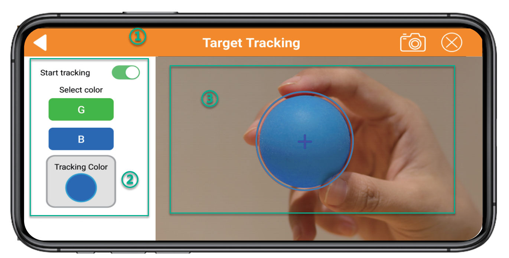

① The status bar is located at the top of the interface.
② The tracking switch area is located on the left side of the interface
③ The camera live feed area is located on the right side of the interface.

(2) If you want to back to the games option interface, you can click the blank area, then the title bar will appear. Next, click  at the left side.

**2.2.6 Face Recognition**

:::{Note}

* Please start this game in a well-lit environment, but keep robot from the direct light.
* When recognizing, one human face only is allowed to appear within the detected range. Otherwise, it will affect the game result. 
* The max recognition distance is about 1 meter.

:::

(1) Click "**Face Recognition**" to enter this game.

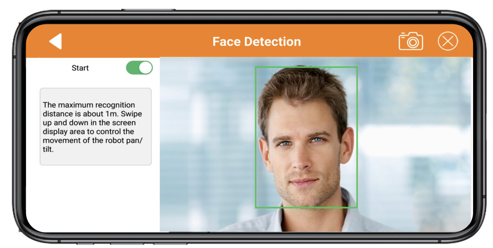

(2) After clicking "**Start**", the pan-tilt of the SpiderPi will move left and right. When the face is detected, it will make a "Hello" action.

(3) If you want to back to the games option interface, you can click the blank area, then the title bar will appear. Next, click  at the left side.

**2.2.7 Tag Recognition**

(1) Click "**Tag Recognition**" in mode selection interface to enter this game. This allows SpiderPi's camera to recognize different QR code tags and execute corresponding actions.

:::{Note}

* When recognizing QR codes, the distance should not be too close or too far. The best distance between the QR code image and the camera is 35cm.
* Please start this game in a well-lit environment, but keep robot from the direct light.

:::

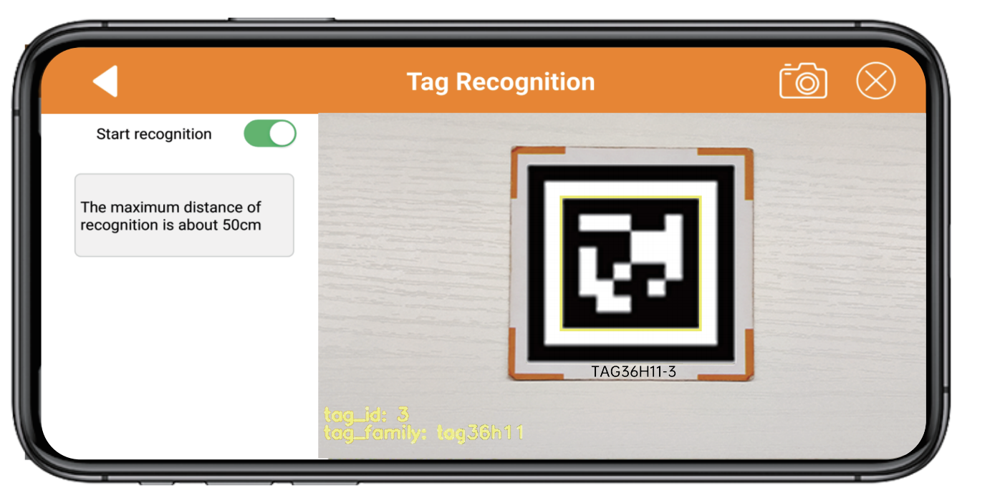

(1) Click "**Tag Recognition**" in mode selection interface to enter this game. This allows SpiderPi's camera to recognize different QR code tags and execute corresponding actions.

| **ID** | **Corresponding Action** |
| :----: | :----------------------: |
|   1    |       Wave "Hello"       |
|   2    |      Walk in place       |
|   3    |      Twist the body      |

(2) Click "**Start**". Then SpiderPi will identify tags within the detected range and carry out different actions according to the recognized ID. 

**2.2.8 Obstacle Avoidance**

Click "Obstacle Avoidance" to enter the game interface. After this game is activated, the SpiderPi can use ultrasonic to detect obstacles ahead to avoid them.

:::{Note}
 Do not detect object at close range for a long time.
:::

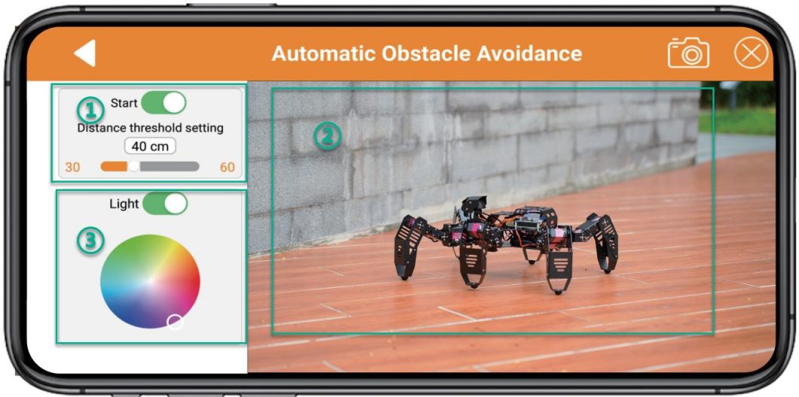

① The left side of the interface includes the obstacle avoidance game switch and the obstacle threshold setting area.

② The middle of the interface is the camera transmission image area.

③ The right side of the interface includes the setting area for the RGB light and motor speed.

(1) Click "Start avoidance". SpiderPi will move forwards and it will turn left when detecting obstacle ahead. Then continue moving forward until there is no obstacle.

| Button Icon | Function Instruction |
|:--:|:--:|
| 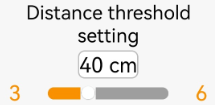 | Start or close this game. |
|  | Set obstacle threshold in the unit of mm. |
| 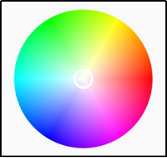 | Turn on or off RGB light. |
|  | Adjust RGB light color. |

(3) If you want to back to the games option interface, you can click the blank area, then the title bar will appear. Next, click  at the left side.

## [3. Adjust Color Threshold]() ##

