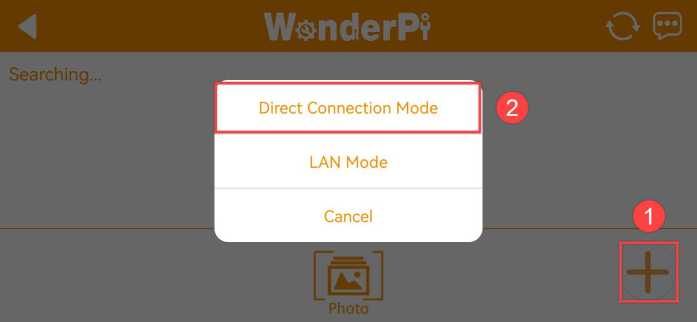
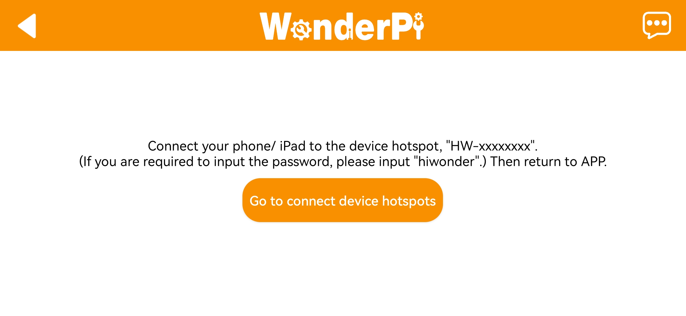
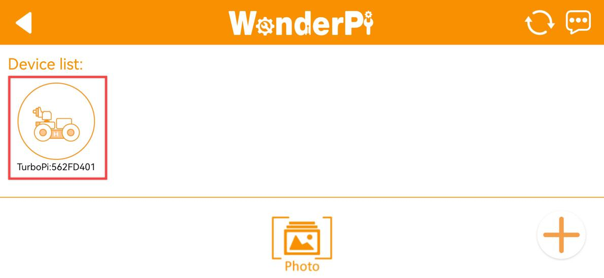
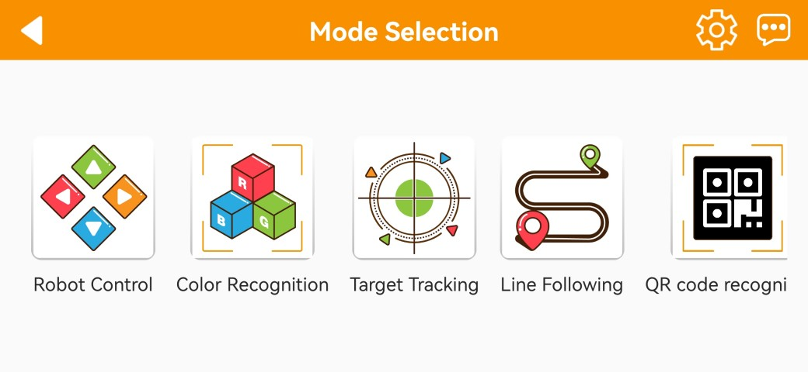
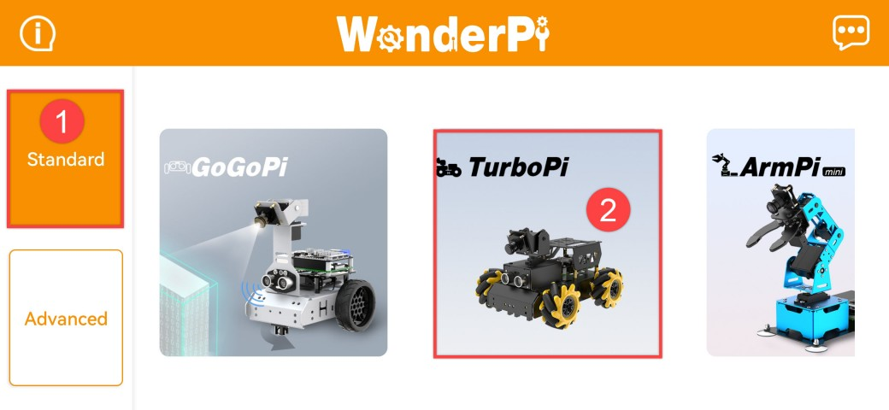
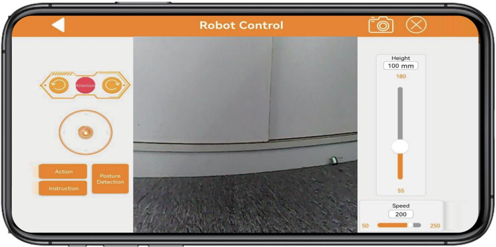
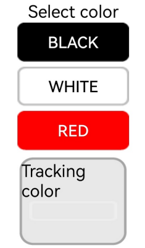
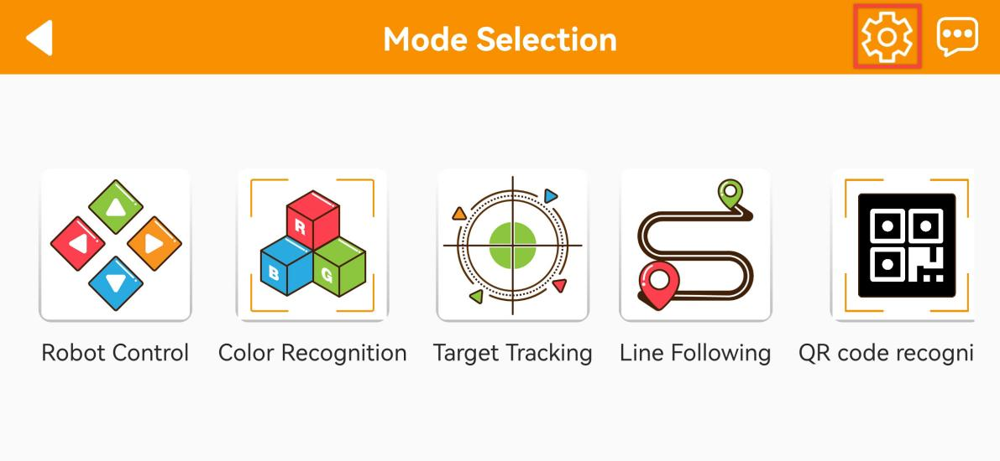

# 2. Quick User Experience

## 2.1 APP Installation and Connection 

The following instructions use TurboPi as an example and apply to other Hiwonder Raspberry Pi series products as well.
In this section, you will learn how to use APP "**WonderPi**" to control TurboPi. The installation method is as follows.

:::{Note}

① Make sure all APP permissions are turned on in settings, otherwise APP functions will be limited!

② Turn on Location and WiFi before operation.

:::

### 2.1.1 Installation

**[APP Installation Pack (Android)](https://play.google.com/store/apps/details?id=com.Wonder.Pi)**

**[APP Installation Pack (iOS)](https://apps.apple.com/cn/app/wonderpi/id1477946178)**

:::{Note}
- Please turn TurboPi on before connecting. 

- Make sure all APP permissions are turned on in settings, otherwise APP functions will be limited!

- Turn on Location and WiFi before operation.

:::

### 2.1.2 APP Connection

(1) Start robot. (The switch is on Raspberry Pi expansion board). For detailed instruction, please refer to the file in "**[Getting Ready\1.3 Charging and Power-On Status Explanation](https://docs.hiwonder.com/projects/SpiderPi/en/latest/docs/1.getting_ready.html#charging-and-power-on-status-description)**".

(2) After TurboPi boots up successfully, it enters AP direct connection mode, and generates a WiFi starting with **"HW"**. Join this WiFi, and then you can experience robot games

* **Introduction to Connection Mode**

There are two connection modes, namely direct connection mode and LAN mode. APP functions are the same under these two modes.

(1) **AP direct connection mode:** RaspberryPi generates a WiFi which can be connected by phones. But this WiFi has no internet access. 

(2) **STA LAN mode:** Raspberry Pi actively connects to specific WiFi. In this mode, you can access internet.

* **Direct Connection Mode (MUST-READ)** 

:::{Note}
After TurboPi boots up successfully, it enters AP direct connection mode, and generates a WiFi starting with **"HW"**.
:::

(1) Open"**WonderPi**". Select **"Standard ->TurboPi"** in sequence.

(2) Tap **"+"** in bottom right corner, and then select **Direct Connection Mode**.

(3) Tap **"Go to connect device hotspot"**. Join WiFi starting with "**HW**". The password is **"hiwonder"**.

(4) Return back to APP after connection.

:::{Note}
 For iOS user, please don't return to APP until WiFi icon appears on status bar, otherwise robot cannot be searched. If robot cannot be searched by APP, tap  to refresh.
:::

(5) APP automatically connects to robot. When robot icon below occurs, connection completes. 

:::{Note}
if you are informed of "**No Internet. Whether to keep connection**", just select "**keep connected**".
:::

(6) Tap robot icon to enter mode selection interface.

For detailed introduction to robot games, please refer to the file in "**[2.2 APP Control](#anchor_2)**".

**1.2.3  LAN Connection Mode**

(1) Disconnect the WiFi generated by TurboPi. Connect your phone to a WiFi. Take **"Hiwonder"** as example.

(2) After connection, open **"WonderPi"**. Select **"Standard ->TurboPi"** in sequence.

(3) Tap **"+"** in bottom right corner, and then select LAN Mode.

(4) Input the password of the WiFi your phone joins. Ensure the password you input is correct, otherwise APP fails to connect to robot. Tap **"OK"**.

(5) Tap "**Go to connect device hotspot**".

(6) Join the WiFi starting with **"HW".** The password is **"hiwonder"**. After connection, return back to APP.

(7) APP automatically configures network.

(8) After a while, robot icon below occurs, and LED on expansion board keeps on.

(9) Long press robot icon to check TurboPi's IP and ID.

(10) Tap robot icon to enter mode selection interface.

For detailed introduction to robot games, please refer to the file in "**[2.2 APP Control](#anchor_2)**".

## 2.2  APP Control

### 2.2.1 Preparation

Install APP and connect SpiderPi to APP according to the instruction in [**2.1 APP Installation and Connection**](#anchor_2_3).

### 2.2.2 Experience Robot Games

After connecting, click SpiderPi icon to enter the mode selection interface.

In the mode selection interface, click the icon corresponding to the game to enter the game interface.

* **Robot Control** 

This game allows you to control the movement and the action group execution of the robot in real time. The interface consists of four parts, and the descriptions and function icons of each part are shown below:

The interface of "**Robot Control**" can be divided into three parts. The left side of the interface can control the movement of the SpiderPi by dragging the slider. Other function icons can refer to the following table:

|                                **Icon**                                | **Corresponding Function** |
|:--------------------------------------------------------------------:|:--:|
|  | Drag to control SpiderPi's movement. |
|  | Clicking on the icons from left to right can control the robot to perform left slide, stand at attention, and right slide, respectively. |
|    | Make SpiderPi perform provided built-in actions. |
|    | Provide a guide for the remote control of the SpiderPi. |
|  | Make SpiderPi perform forward and backward posture detection. |
|  | Adjust SpiderPi's high, medium, and low posture. |
|  | Adjust SpiderPi's movement speed. |

The middle part of the interface shows the live camera feed, and dragging the interface can rotate the camera. 

:::{Note}
The head servo of the camera adopts limit protection. When it reaches the limit position, there will be a vibration feedback when sliding the screen again. Please stop rotate it at this time.
:::

If you want to back to the games option interface, you can click the blank area, then the title bar will appear. Next, click  at the left side.

* **Remote Control Transportation** 

This game allows real-time control of the robot's movements to complete tasks such as grasping, transporting, and placing color blocks. The interface is divided into four parts, each with its description and functional icon as shown below:

① The status bar is at the top of the interface.

② The left side of the interface controls the movement area of the SpiderPi by sliding the joystick.

③ The right side of the interface displays the live camera feed. If you want to back to the games option interface, you can click the blank area, then the title bar will appear. Next, click  at the left side.

* **Color Recognition** 

This game can recognize red, green, and blue. SpiderPi will nod when it detects red and shake its head when it detects blue or green.

:::{Note}
* Please start this game under a well-lit environment, but try to keep it from direct light.
* When recognizing, please do not have the same or similar colored object within the detected range to avoid interference.
*  If the recognition effect is not good enough, please refer to  [2.3 Adjust Color Threshold](#anchor_2_3).
:::

(1) This game allows real-time control of the robot's movements to complete tasks such as grasping, transporting, and placing color blocks. The interface is divided into four parts, each with its description and functional icon as shown below:

① The status bar is located at the top of the interface.

② The left side of the interface is the area for enabling, disabling the game and adjusting the color threshold.

③ The right side of the interface is the area for displaying the live camera feed.

(2) Click the "**Start Recognition**" allows you to place red, blue, and green objects one by one in front of the camera. 

| **Recognized Color** |                         **Outcome**                          |
| :------------------: | :----------------------------------------------------------: |
|         Red          | The buzzer emits a "beep" sound, and the camera nods its head. |
|        Green         | The buzzer emits a "beep" sound, and the camera shakes its head. |
|         Blue         | The buzzer emits a "beep" sound, and the camera shakes its head. |

(3) If you want to back to the games option interface, you can click the blank area, then the title bar will appear. Next, click  at the left side.

* **Line Following** 

Click "**Line Following**" to enter this game. After activating it, the SpiderPi will move forward along a black, white or red line.

:::{Note}

* Please start this game under a well-lit environment, but try to keep it from direct light.
* When recognizing, please do not have the same or similar colored object within the detected range to avoid interference.
* If the recognition effect is not good enough, please refer to  [2.3 Adjust Color Threshold](#anchor_2_3).
:::

① The status bar is located at the top of the interface.

② The line tracking switch area is located on the left side of the interface

③ The camera live feed area is located on the right side of the interface.

(1) Click "**Start following**" to enter this game and select color. Then SpiderPi will follow the targeted line.

|                               Icon Button                               | **Function Instruction** |
|:--------------------------------------------------------------------:|:--:|
|  | Select the targeted color. |
|  | Display the selected tracking color. |

(2) If you want to back to the games option interface, you can click the blank area, then the title bar will appear. Next, click  at the left side.

* **Target Tracking** 

(1) Click "**Target Tracking**" to enter the game interface. Once activated, this game enables the pan-tilt of SpiderPi to move along with the movement of the target color.

:::{Note}

① Please start this game under a well-lit environment, but try to keep it from direct light.

② When recognizing, please do not have the same or similar colored object within the detected range to avoid interference.

③ If the recognition effect is not good enough, please refer to  [2.3 Adjust Color Threshold](#anchor_2_3).

:::

① The status bar is located at the top of the interface.

② The tracking switch area is located on the left side of the interface

③ The camera live feed area is located on the right side of the interface.

(2) If you want to back to the games option interface, you can click the blank area, then the title bar will appear. Next, click  at the left side.

* **Face Recognition** 

:::{Note}

* Please start this game in a well-lit environment, but keep robot from the direct light.
* When recognizing, one human face only is allowed to appear within the detected range. Otherwise, it will affect the game result. 
* The max recognition distance is about 1 meter.

:::

(1) Click "**Face Recognition**" to enter this game.

(2) After clicking "**Start**", the pan-tilt of the SpiderPi will move left and right. When the face is detected, it will make a "**Hello**" action.

(3) If you want to back to the games option interface, you can click the blank area, then the title bar will appear. Next, click  at the left side.

* **Tag Recognition** 

(1) Click "**Tag Recognition**" in mode selection interface to enter this game. This allows SpiderPi's camera to recognize different QR code tags and execute corresponding actions.

:::{Note}

* When recognizing QR codes, the distance should not be too close or too far. The best distance between the QR code image and the camera is 35cm.
* Please start this game in a well-lit environment, but keep robot from the direct light.

:::

(1) Click "**Tag Recognition**" in mode selection interface to enter this game. This allows SpiderPi's camera to recognize different QR code tags and execute corresponding actions.

| **ID** | **Corresponding Action** |
| :----: | :----------------------: |
|   1    |       Wave "Hello"       |
|   2    |      Walk in place       |
|   3    |      Twist the body      |

(2) Click "**Start**". Then SpiderPi will identify tags within the detected range and carry out different actions according to the recognized ID. 

* **Obstacle Avoidance** 

Click "**Obstacle Avoidance**" to enter the game interface. After this game is activated, the SpiderPi can use ultrasonic to detect obstacles ahead to avoid them.

:::{Note}
 Do not detect object at close range for a long time.
:::

① The left side of the interface includes the obstacle avoidance game switch and the obstacle threshold setting area.

② The middle of the interface is the camera transmission image area.

③ The right side of the interface includes the setting area for the RGB light and motor speed.

(1) Click **"Start avoidance"**. SpiderPi will move forwards and it will turn left when detecting obstacle ahead. Then continue moving forward until there is no obstacle.

| Button Icon | Function Instruction |
|:--:|:--:|
|  | Start or close this game. |
|  | Set obstacle threshold in the unit of mm. |
|  | Turn on or off RGB light. |
|  | Adjust RGB light color. |

(3) If you want to back to the games option interface, you can click the blank area, then the title bar will appear. Next, click  at the left side.

## 2.3 Adjust Color Threshold

Different light source will have different influence on the colors, which will result in recognition discrepancy. To tackle this problem, you can adjust color threshold via "**WonderPi**" APP.

### 2.3.1 Preparation

Start TurboPi. Open "**WonderPi**" APP, and connect it to TurboPi. For how to connect robot to APP, operate referring to "**[2.1 APP Installation and Connection](#anchor_2_3)**".

### 2.3.2 Interface Layout

Tap  in upper right corner to enter color threshold adjustment interface.

The table below list function of specific icon.

<table class="docutils-nobg" border="1">
<colgroup>
<col  />
<col  />
</colgroup>
<tbody>
<tr>
<td ><strong>Icon</strong></td>
<td ><strong>Function</strong></td>
</tr>
<tr>
<td ></td>
<td >
Processed camera returned image.

Target object is white, and other area is black.
</td>
</tr>
<tr>
<td ></td>
<td >Raw camera returned image.</td>
</tr>
<tr>
<td ></td>
<td >Select the color to be adjusted.</td>
</tr>
<tr>
<td ></td>
<td >
Adjust L component of camera returned image. "L_min" is lower limit and "L_max" is upper limit.

</tr>
<tr>
<td ></td>
<td >
Adjust A component of camera returned image. "a_min" is lower limit and "a_max" is upper limit.

</tr>
<tr>
<td ></td>
<td >
Adjust B component of camera returned image. "b_min" is lower limit and "b_max" is upper limit.

</tr>
<tr>
<td ></td>
<td >Get instruction to check how to adjust color threshold.</td>
</tr>
<tr>
<td ></td>
<td >Save the adjusted color threshold.</td>
</tr>
<tr>
<td ></td>
<td >Return back to mode selection interface.</td>
</tr>
<tr>
<td ></td>
<td >Hide navigation bar.</td>
</tr>
<tr>
<td ></td>
<td >Display Hiwonder info.</td>
</tr>
</tbody>
</table>

### 2.3.3 Adjust Color Threshold

(1) Select color to be adjusted. Take red as example.

(2) Put red object within camera recognition zone. Set L_min, a_min and b_min to 0, and L_max, a_max and b_max to 255.

(3) Tap "Instruction" icon to check how to adjust color threshold.

:::{Note}
if you need to close Instruction window, select "**OK**".
:::

(4) Red approaches "**+a**" zone, so you need to adjust A component.

(5) Keep "**a_max**" value the same, and then increase "**a_min**" value till red object turns white and other area is black.

(6) Adjust "**L**" and "**B**" values. If it belongs to light red, increase L_min. Otherwise, decrease L_max. If it belongs to warm tone, increase B_min. Otherwise, decrease B_max.

(7) Remember to save the value after adjustment.

