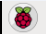
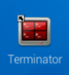
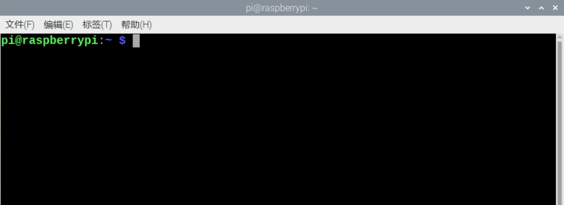
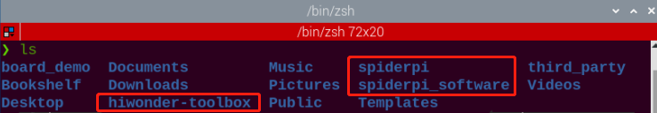

# 4. Remote Desktop Installation and Connection

## [1. Remote Desktop Installation and Connection]()

## 2. System Introduction

### 2.1 Desktop Instruction

After remote connection via VNC, the Raspberry Pi system desktop is as shown in the figure below:

|                             Icon                             |                           Function                           |
| :----------------------------------------------------------: | :----------------------------------------------------------: |
|  | SpiderPi PC software which includes action editing, calling, and etc. |
|  |            Color model parameter adjustment tool.            |
|  |            Color model parameter adjustment tool.            |
|  | Terminator terminal, which is used to input command to proceed operation. |
|  |                    Raspberry Pi menu bar.                    |
|  |                     System file folder.                      |

### 2.2 Programming Instruction

The input command must be case sensitive and space, and the keyword supports "TAB" key to fill.

(1)  Click  or press "Ctrl+Alt+T" to open LX terminal.



(2) Enter "ls" command and then press "Enter" to list all the documents. As shown in the figure below:

<div style="width: fit-content;margin:0 auto">

| **Directory**        | **Function**                                         |
| -------------------- | ---------------------------------------------------- |
| SpiderPi             | Store all the games and related program source code. |
| SpiderPi_PC_Software | SpiderPi PC software source code (based on Qt).      |
| hiwonder-toolbox     | Wi-Fi management tool.                               |

</div>

:::{Note}
For AI vision games, you only need to check the folder "SpiderP".
:::

(3)  Enter "cd SpiderPi" to open all the games and program source code. In the SpiderPi, enter "ls" command in the following three main directories. As shown below:

```bash
cd SpiderPi
```

```bash
ls
```



<div style="width: fit-content;margin:0 auto">

| **Directory** | **Function**                                                 |
| ------------- | ------------------------------------------------------------ |
| Functions     | The directory where the AI vision game program is located.   |
| SpiderPi.py   | Main program for running the games (auto-start has been set) |
| spiderpi_sdk  | Underlying file path (for hardware control)                  |

</div>
(4)  Enter the "cd functions" and "ls" instructions in turn again. Let's take a look at the corresponding games of the program:

```bash
cd functions
```

```bash
ls
```

<div style="width: fit-content;margin:0 auto">

| **Program Name**   | **Game**            |
| ------------------ | ------------------- |
| RemoteControl.py   | Body remote control |
| color_detect.py    | Color recognition   |
| color_track.py     | Color tracking      |
| face_detect.py     | Facial recognition  |
| visual_patrol.py   | Line following      |
| avoidance.py       | Obstacle avoidance  |
| apriltag_detect.py | Tag recognition     |

</div>

### 2.3 Game in Advanced Tutorial

<div style="width: fit-content;margin:0 auto">

| **Program**           | **Game**                    |
| --------------------- | --------------------------- |
| transport_cleaning.py | Intelligent object cleaning |
| self_transport.py     | Intelligent transport       |
| apriltag_follow.py    | Tag tracking                |

</div>