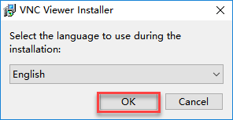
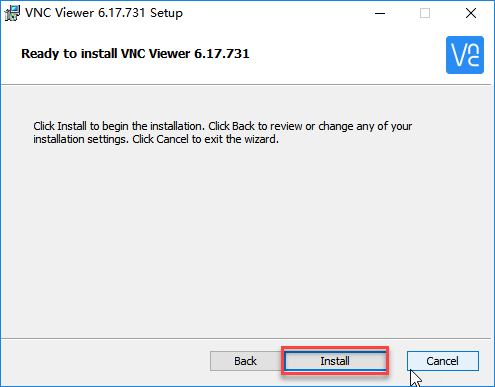
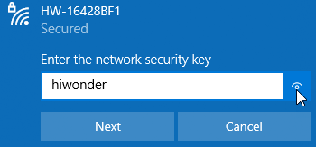
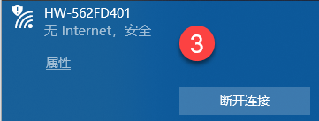
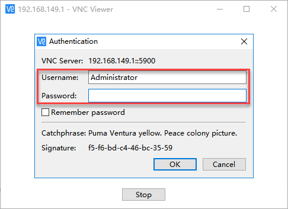
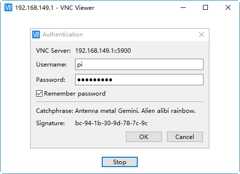
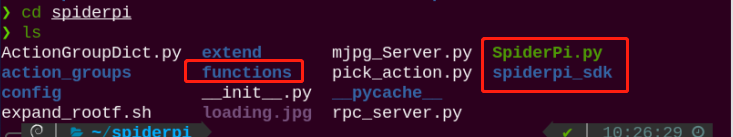
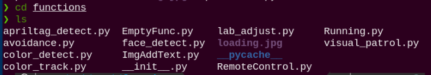

# 远程工具安装及连接

## 1. 远程工具安装与连接

本章节的学习需要准备一台笔记本电脑，如使用台式电脑请自备无线网卡。

### 1.1 准备工作

- #### VNC远程工具的安装

如果你希望通过电脑端来执行玩法，并尝试后期查看玩法代码并修改程序，那么需要先完成本章的学习，安装好VNC软件。

VNC是一款图形化远程控制软件。我们可以通过连接树莓派的Wi-Fi热点，直接在自己电脑上控制树莓派。接下来将会分步讲解如何使用VNC。

1)  双击本文件夹中的“**VNC-Viewer-6.17.731-Windows**”文件，在弹出的对话框中选择安装语言为“**English**”，单击“**OK**”按钮。



2)  在弹出的界面单击“**Next**”按钮。


3)  在新的提示框中勾选同意协议，然后单击“**Nex**t”，接着弹出安装位置设置，保持默认设置，继续单击“**Next**”。


4)  在新弹出的页面中单击“**Install**”。



5)  等待安装，片刻之后出现安装完成提示页面，单击“**Finish**”按钮即可完成安装，安装后打开VNC。


6)  VNC完成连接，直接打开图标即可。

- #### 设备开机

按照前面所学，在连接适配器后推动树莓派扩展板的开关。稍等片刻后树莓派扩展板上的LED1由常亮变为每隔2秒闪烁一次，同时手掌上的所有舵机呈现抓取姿态，即为成功开机标志。

### 1.2 设备连接

1)  机器人在开机后，会产生一个HW开头的热点，我们可以打开电脑Wi-Fi搜索到以HW开头的热点，如下图所示：



2)  点击连接，输入密码“**hiwonder**”。




3)  在打开的VNC Viewer中输入树莓派默认的IP地址：192.168.149.1，然后按回车，如果提示不是安全连接的话单击“**Continue**”。


4. 此时弹出一个提示框，要求输入账号（Username）和密码（Password），账号输入：**pi**，密码输入：**raspberrypi**，勾选上记住密码框，然后单击“OK”，此时即可看到远程打开的树莓派的桌面了。






5. 在桌面上有一个警告对话框（树莓派本身特性），单击“**确定**”关闭即可。（如果是黑屏，只有一个鼠标，则可尝试重新启动树莓派。）

:::{Note}
各实验玩法详细启动步骤请参考随后的每章节的课程学习。
:::

## 2. 系统目录简要说明

### 2.1 桌面分布

通过VNC远程连接后，树莓派系统桌面如下图所示：


| **图标** | **功能** |
|:--:|:--:|
|  | SpiderPi上位机，集动作编辑、调用等功能 |
|  | 颜色模型参数调节工具 |
|  | 命令行终端，用于输入指令进行操作 |
|  | 回收站 |
|  | 树莓派菜单栏 |
|  | 系统文件夹 |

### 2.2 程序结构说明

指令的输入需严格区分大小写及空格，关键词支持“**TAB**”键补齐。

1. 单击图标，或键盘按下“**Ctrl+Alt+T**”，打开LX终端。


2. 输入指令，然后按下回车，列出当前所有文件。主要来看这三个目录，如下图所示：

```commandline
ls
```


|    **目录名**     |             **作用**             |
| :---------------: | :------------------------------: |
|     spiderpi      |  存放所有玩法及涉及到的程序源码  |
| spiderpi_software | SpiderPi上位机源码（基于QT框架） |
| hiwonder-toolbox  |          Wi-Fi管理工具           |

注意：AI视觉玩法只需了解“**SpiderPi**”这个文件夹即可。

3)  接下来进入玩法及程序源码目录，依次输入指令。列出该目录下的所有文件夹及文件。在SpiderPi内我们主要了解以下三个目录，如下图所示：

```commandline
cd spiderpi
```

```commandline
ls
```



|    目录名    |              目录作用              |
| :----------: | :--------------------------------: |
|  functions   |       AI视觉玩法程序所在目录       |
| SpiderPi.py  | 主程序，处理玩法调用（已设置自启） |
| spiderpi_sdk |    底层文件路径（用于硬件控制）    |

4)  最后我们再依次指令，了解一下程序所对应的玩法：

```commandline
cd functions
```

```commandline
ls
```



|     **程序名**     |       **对应玩法**       |
| :----------------: | :----------------------: |
|  RemoteControl.py  | 遥控图传（仅作了解即可） |
|  color_detect.py   |         颜色识别         |
|   color_track.py   |         颜色跟踪         |
|   face_detect.py   |         人脸识别         |
|  visual_patrol.py  |         智能巡线         |
|    avoidance.py    |         自动避障         |
| apriltag_detect.py |         标签识别         |

### 2.3 豪华版程序对应玩法

注：豪华版玩法需前往“**[语音交互及智能搬运课程]()**”中学习。

|       **程序名**        |   **对应玩法**   |
| :---------------------: | :--------------: |
|     asr_control.py      | 语音控制SpiderPi |
|  transport_cleaning.py  |   智慧物品清理   |
|    self_transport.py    |     智能搬运     |
| color_detect_and_tts.py |   颜色识别播报   |
|   apriltag_follow.py    |     标签跟随     |
