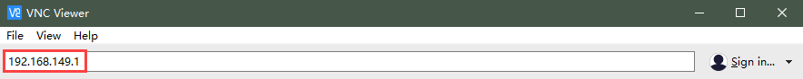
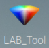
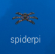

# 3. Remote Desktop Installation and Connection

## 3.1 VNC Installation and Connection

**3.1.1 Preparation**

* **Hardware**

Prepare a computer. If you are using desktop computer, wireless network card is required.The network card should support 5G band.

* **Install VNC**

VNC is a graphical remote desktop control software. Through connecting your computer to the WiFi generated by Raspberry Pi, you can control Raspberry Pi. Installation of VNC is as below.

(1) Double-click the installation program **"VNC-Viewer-6.17.731-Windows"** in the same directory as this section. Select the installation language as "**English**" and lick "**OK**".


(2) Click "**Next**".


(3) Tick **"I accept the terms in the License Agreement"**. Then click **"Next"**.


(4) Remain default location where the software is installed. Click **"Next"** to proceed next interface. Then directly click **"Install"**.


(5) When the installation completes, click **"Finish"**.


(6) Click  to open VNC.

* **Start Robot**

Start Robot When LED1 on expansion board starts flickering and buzzer emits one beep, robot boots up successfully.

**3.1.2 Connect to Robot**

(1) After turning Robot on successfully, the default mode is AP direct connection mode. Robot generates a WiFi starting with HW. Connect your computer to this WiFi.


(2) Input password. The password is **"hiwonder"**.


(3) After connection, open VNC Viewer. Input the default IP address of Raspberry Pi, **192.168.149.1**, and then press Enter. If you receive security warning, select **"Continue"**.



(4) Input username and password. **(Username: pi;Password: raspberrypi)**. Click **"OK"** to enter Raspberry Pi desktop.


(5) The desktop is as pictured. If black screen occurs or only cursor leaves on the screen, restart Raspberry Pi.


**3.1.3 Introduction to Desktop**

The desktop is as pictured after connecting Robot through VNC successfully.


The following table demonstrates common functions:

<table  class="docutils-nobg" border="1" style="text-align:center;">
<colgroup>
<col  />
<col  />
</colgroup>
<tbody>
<tr>
<td >Icon</td>
<td >Function</td>
</tr>
<tr>
<td ></td>
<td ><p>Application menu. Click to select different applications.</p>
<p></p></td>
</tr>
<tr>
<td ></td>
<td >Browser.</td>
</tr>
<tr>
<td ></td>
<td >File manager.</td>
</tr>
<tr>
<td ></td>
<td >LX terminal. Click to input command line in the opened interface.</td>
</tr>
<tr>
<td ></td>
<td >Trash. You can find the files deleted here.</td>
</tr>
<tr>
<td ></td>
<td >PC software. You can adjust pan tilt and adjust color threshold on it.</td>
</tr>
<tr>
<td ></td>
<td >Full screen or exit full screen.。</td>
</tr>
<tr>
<td ></td>
<td >Exit full screen.</td>
</tr>
<tr>
<td ></td>
<td ><p>Shut down, reboot and logout</p>
<p></p></td>
</tr>
</tbody>
</table>

## 3.2 System Introduction

### 3.2.1 Desktop Instruction

After remote connection via VNC, the Raspberry Pi system desktop is as shown in the figure below:

|                             Icon                             |                           Function                           |
| :----------------------------------------------------------: | :----------------------------------------------------------: |
|  | SpiderPi PC software which includes action editing, calling, and etc. |
|  |            Color model parameter adjustment tool.            |
|  |            Color model parameter adjustment tool.            |
|  | Terminator terminal, which is used to input command to proceed operation. |
|  |                    Raspberry Pi menu bar.                    |
|  |                     System file folder.                      |

### 3.2.2 Programming Instruction

The input command must be case sensitive and space, and the keyword supports "**TAB**" key to fill.

(1)  Click  or press "**Ctrl+Alt+T**" to open LX terminal.


(2) Enter "**ls**" command and then press "**Enter**" to list all the documents. As shown in the figure below:

<div style="width: fit-content;margin:0 auto">

| **Directory**        | **Function**                                         |
| -------------------- | ---------------------------------------------------- |
| SpiderPi             | Store all the games and related program source code. |
| SpiderPi_PC_Software | SpiderPi PC software source code (based on Qt).      |
| hiwonder-toolbox     | Wi-Fi management tool.                               |

</div>

:::{Note}
For AI vision games, you only need to check the folder "**SpiderPi**".
:::

(3)  Enter **"cd SpiderPi"** to open all the games and program source code. In the SpiderPi, enter "**ls**" command in the following three main directories. As shown below:

```bash
cd SpiderPi
```

```bash
ls
```


<div style="width: fit-content;margin:0 auto">

| **Directory** | **Function**                                                 |
| ------------- | ------------------------------------------------------------ |
| Functions     | The directory where the AI vision game program is located.   |
| SpiderPi.py   | Main program for running the games (auto-start has been set) |
| spiderpi_sdk  | Underlying file path (for hardware control)                  |

</div>

(4)  Enter the **"cd functions"** and **"ls"** instructions in turn again. Let's take a look at the corresponding games of the program:

```bash
cd functions
```

```bash
ls
```

<div style="width: fit-content;margin:0 auto">

| **Program Name**   | **Game**            |
| ------------------ | ------------------- |
| RemoteControl.py   | Body remote control |
| color_detect.py    | Color recognition   |
| color_track.py     | Color tracking      |
| face_detect.py     | Facial recognition  |
| visual_patrol.py   | Line following      |
| avoidance.py       | Obstacle avoidance  |
| apriltag_detect.py | Tag recognition     |

</div>

### 3.2.3 Game in Advanced Tutorial

<div style="width: fit-content;margin:0 auto">

| **Program**           | **Game**                    |
| --------------------- | --------------------------- |
| transport_cleaning.py | Intelligent object cleaning |
| self_transport.py     | Intelligent transport       |
| apriltag_follow.py    | Tag tracking                |

</div>