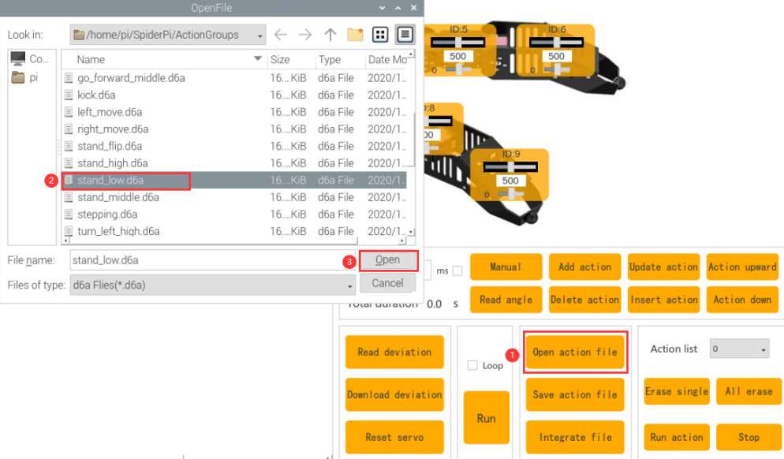
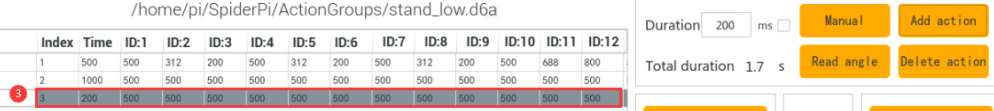
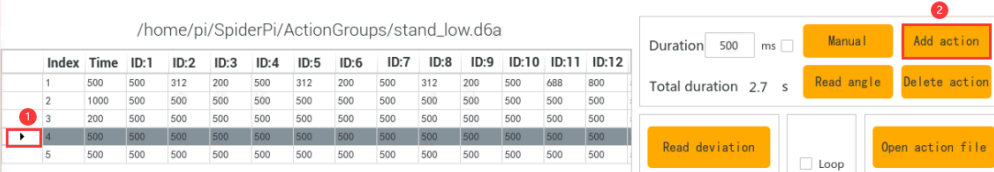
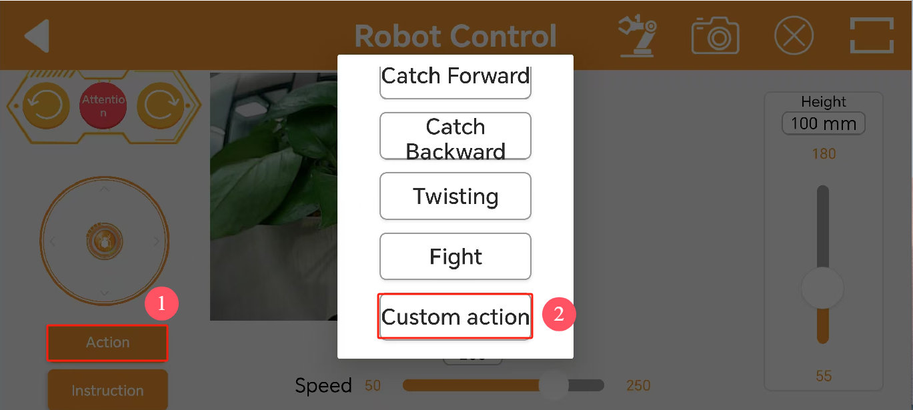
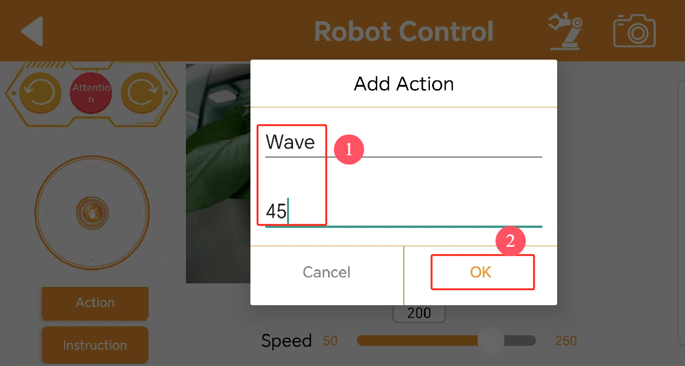

# 上位机动作编辑课程

## 1. 上位机的介绍

本节主要是对SpiderPi上位机软件进行介绍，让大家快速熟悉此上位机的使用。

首先连接VNC远程桌面，然后在桌面位置双击打开上位机软件"**SpiderPi**"。（出现弹窗提示时，直接点击"**执行**" 即可）


SpiderPi上位机软件"**中文**"模式下的主界面可分为以下区域：


1.  **舵机操控区**

我们可以通过调整舵机操控区域显示的对应舵机滑杆值，从而调整舵机位置。

| **图标** | **功能说明** |
|:--:|:--:|
|  | 代表舵机的ID号，这里以9号舵机为例。 |
|  | 用于调整舵机位置，最小值为0，最大值为1000。 |
|  | 用于调整舵机偏差，最小值为-125，最大值为125。 |

2.  **动作详情列表**

动作详情列表显示了当前动作组内每个动作的执行时间，以及每个动作分布的舵机值。


| **图标** | **功能说明** |
|:--:|:--:|
|  | 动作组编号。 |
|  | 动作运行的时间，即执行该动作所需时间。 |
|  | 对应该ID下的动作数值，双击下方数值可直接修改。 |

3.  **动作组设置区域**

| **图标** | **功能说明** |
|:--:|:--:|
|  | 动作运行的持续时间，鼠标单击图标中数值，可进行修改。注意：需搭配"**更新动作**"按扭生效，另外时间数值范围为20-9999。 |
|  | 动作组中所有动作运行完成所需的总时间。 |
|  | 点击后机器人的关节会变得松弛，此时我们就可以用手把机器人掰成想要的造型了。 |
|  | 将掰成形状的角度信息读取出来。（需要搭配"**手掰编程**"按钮使用） |
|  | 将舵机操控区域的舵机数值以一个动作的形式，添加至动作详情列表的最后一行。 |
|  | 删除动作详情列表里选中的动作。 |
|  | 替换动作详情列表里面选中动作的角度数值。 （角度数值替换为舵机操控区域的舵机值，动作运行时间替换为"**时间**"内设定的时间） |
|  | 在选中的动作上面插入一行动作。 （其中动作的时间为"**时间**"内的时间，角度数值为舵机操控区域的舵机值） |
|  | 将选中的动作向上移动一行。（原上一行的动作将下移） |
|  | 将选中的动作向下移动一行。 （原下一行的动作将上移） |
|  | 单击该按钮后将会执行一次动作详情列表的所有动作。（需先选中第一个动作） |
|  | 如果勾选了"**循环**"，机器人便重复运行动作。 |
|  | 将已保存的动作组数据加载到动作详情列表中。 |
|  | 将动作详情列表里的动作保存到指定位置。 |
|  | 打开一个动作组后，点击此按钮，可继续打开另一个动作组文件，并将两个动作组文件合并为一个新动作组。 |
|  | 可显示已保存的动作组，且动作组在右侧菜单栏选中后，可配合"**动作运行**"在机器人上执行。 |
|  | 删除在动作组菜单栏中当前选中的动作组。 |
|  | **（慎点）删除所有动作组文件。** |
|  | 执行动作组（在动作组菜单栏中选定的动作组）一次。 |
|  | 停止正在运行的动作组。 |

4.  **偏差设置区域（此区域功能按键了解即可）**

| **图标** | **功能说明** |
|:--:|:--:|
|  | 单击后即可自动读取保存的偏差值。 |
|  | 单击后即可将将上位机调整好的偏差值下载到机器人中。 |
|  | 单击后即可将舵机操控区域的所有舵机数值恢复至500位置。 |

## 2. 动作调用教学

### 2.1 实现目标

本节主要通过SpiderPi上位机，对内置动作组进行调用。

### 2.2 动作组调用

1)  将设备开机，并参照课程资料的"**[远程工具安装与连接]()**"内容，通过VNC远程连接工具连接。


2)  双击，选择"**Execute**"打开上位机。


3)  点击"**打开动作文件**"将本文同路径下的动作组文件打开。


4)  此时动作详情列表会显示已打开的动作组。


5)  点击"运行"即可。


6)  也可点击动作组的下拉按钮，选择要运行的动作组，再点击动作组运行即可。


<p id="anchor_3"></p>

## 3. 动作编辑教学

### 3.1 实现目标 

创建一个机器人进行"打招呼"的动作组，该动作组由10个独立的动作组成。

### 3.2 动作实现 

- #### 3.2.1 动作设计

1)  在SpiderPi机器人启动后，我们先让机器人低姿态立正。点击"**打开动作文件**"按钮，然后点击，将动作数值同步更新到舵机操控区。



2)  接下来，我们先让机器人右前腿抬起。参考下图红框所示的舵机数值进行调整即可。然后点击动作编辑区域的"**添加动作**"按钮，将动作加至动作列表内。在后续步骤中，我们将动作数值调整后，都需要添加至动作列表内。


3)  为了机器人运行更加稳当，第3个动作我们设置为过渡动作，将时间修改为200ms，并将步骤2的动作再次添加。


4)  第4个动作我们将时间修改回500ms，让抬起的右腿向右侧转动，因此我们只需调整16号舵机即可。


5)  第5个动作，让抬起的右腿向左侧转动，再次调整16号舵机即可。



6)  第6个动作，再次让右腿向右侧转动。我们这里采取复制动作的方式来快速实现。将鼠标光标移动到4号动作上，然后点击将动作数值更新，再次点击"**添加动作**"即可。


7)  第7个动作我们让右腿向左侧转动，可以采取步骤6的方法复制5号动作。

8)  8号动作回到刚抬起右腿时的状态，也就是复制2号动作。（参考步骤6）

9)  9号动作我们用来过渡，将时间修改为200ms，并将步骤8的动作再次添加。



10) 最后一个动作，让机器人回到低姿态立正位置，复制1号动作。（参考步骤6）

10) 该动作组的全部数值参数如下表所示：（红色为需要调整的数值)


- #### 3.2.2 动作保存

为了便于后期的调试和管理，我们可以将动作保存起来。单击"**保存动作文件**"按钮，在打开的界面中选择路径"**/home/pi/spiderpi/action_groups/**"，输入动作组名 称（如"**greet**"），然后，单击"**Save**"即可。


## 4. 串联动作文件

### 4.1 实现目标 

串联动作文件是将两个动作组文件首尾串联起来组成一个新的动作组文件，这样可实现

动作组文件之间的合并。本节以串联"**挥手**"和"**原地踏步**"动作为例进行展示。

### 4.2 动手实现 

1)  连接VNC后，打开SpiderPi上位机。

2)  点击动作组设置区的"打开动作文件"按钮，在打开的弹窗界面中选择"**wave.d6a**"，双击打开。 (可前往"**/home/pi/spiderpi/action_groups/**"内打开SpiderPi动作列表参考对应关系)


3)  打开后即可看到动作组详情列表中该动作组的详细参数。


4)  再次点击"**串联动作文件**"，选择"**stepping.d6a**"。双击打开。然后2号动作组文件即可串联进来。


5)  点击"**运行**"，将串联的新动作组在线运行一遍。


6)  点击"**保存动作文件**"按钮，输入新动作组的名称（如"**wave and stepping**"），再点击"**Save**"，将新串联的动作组进行保存，以便后期调试。

:::{Note}
命名动作组时切勿使用空格键，以免导致后期调试出现保存不成功的情况，空格建议使用下划线"-"来代替。
:::


## 5. APP自定义调用

实现目标：将本单元前面"**[动作编辑教学](#anchor_3)**"中的动作组文件，通过手机APP自定义功能来执行。我们这里以执行打招呼动作为例。

### 5.1 准备工作

1. 连接好**VNC**后，打开系统桌面的文件管理器。


2. 前往"**/home/pi/spiderpi"**路径，找到**ActionGroupDict.py**文件，然后右键打开。这里以**Text Editor**方式为例进行打开：


3. 然后，我们复制第22号动作所在行，选中右键复制或按下"**Ctrl+C**"即可。


4. 将程序粘贴至新的一行。序号设定为45号，名称填写为"**greet**"（参考 **/home/pi/spiderpi/ActionGroups** 内的动作组文件名称）。


:::{NOte}
动作组序号请勿选用已定义序号和255号，动作组名称请与存储目录 **/home/pi/TonyPi/action_groups** 内的名称保持一致。
:::

5. 按下**Ctrl+S**保存，并退出。

6. 最后，输入命令重启树莓派即可。（**此步骤一定要进行**）

```commandline
sudo reboot
```

### 5.2 操作步骤

1. 打开手机APP，通过前面所学连接机器人，进入"机体遥控"界面，。


2.  然后，先点击"**动作**"按钮，接着在弹出的界面中点击**"自定义动作"**。



3. 在弹出的界面中分别填写保存的动作组名称（用户可自定义）和序号（为**ActionGroupDict.py**中填写的动作组序号），点击**"好的"**进行保存。



4. 添加完成后，单击依次点击"**动作-\>自定义动作-\>招手**"该动作名称按钮便可以执行一次。


5. 如需修改或删除动作，直接长按动作名称，选择对应的操作即可。


