# 5. PC Software&Programming

## 1. PC Software Introduction

This section mainly introduces the SpiderPi PC software, which can help you quickly understand how to use it.

First connect to VNC remote desktop and double-click "**SpiderPi**" to start it. (Click "**Execute**" in the pop-up window ).


The main interface of the SpiderPi PC software in "**English**" mode consists of four areas, as shown below:


**① Servo operation area**

Drag the corresponding servo to adjust the servo position:

| **Icon** | **Function** |
|:--:|:--:|
|  | ID number.Take NO.9 servo as example. |
|  | Adjust servo position from 0 to 1000. |
|  | Adjust servo deviation from -125 to 125. |

**② Action data list**

Action list display the running time and servo data of the current action.

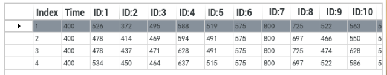


| **Icon** | Function |
|:--:|:--:|
|  | Action group NO. |
|  | Running time of the action. |
|  | Action data of the corresponding servo. Double click the figureto revise. |

**③ Action group setting**

| **Icon** | **Function** |
|:--:|:--:|
|  | Action running duration time, click the icon in the value, can be modified. Note: the "Update Action" button is needed to take effect. In addition, the value range of the time is 20-9999. |
|  | The total running time of all the actions in an group action to complete run. |
|  | Click to add the new action. |
|  | Delete action is delete the selected action in the list. |
|  | Update the selected action. |
|  | Insert the new action on the action list. Action time(ms). |
| 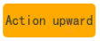 | Move up the selected action. |
|  | Move down the selected action. |
|  | Click to run all the actions on the edited list once. |
|  | If "Loop" is ticked, SpiderPi will repeat the action. |
|  | Click to open and select the provided action groups. |
|  | Save the current actions in the action list into the computer. |
|  | Click to integrate provided action group. Choose one action group, click integrate and then choose another one. |
|  | Display the saved action groups. |
|  | Delete the current action group file. |
|  | (Be careful!)Deleted all the action group files. |
|  | Run the selected action group once. |
|  | Stop running the action group. |

④ Servo deviation setting area

| Icon | Function |
|:--:|:--:|
|  | Click to read the save the servo deviation. |
|  | Click to download the deviation adjustment in the PC software. |
|  | Click to return all the servos the middle position(500). |

## 2. Call Action Group

### 2.1 Goal

This section focuses on how to call the built-in action group via SpiderPi PC software.

### 2.2 Call Action Group

(1) Power on the robot.

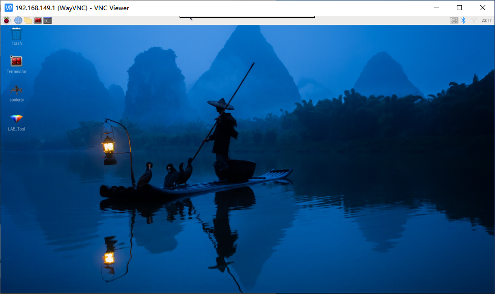

(2) Click，Select"**Execute**"to open the PC software.

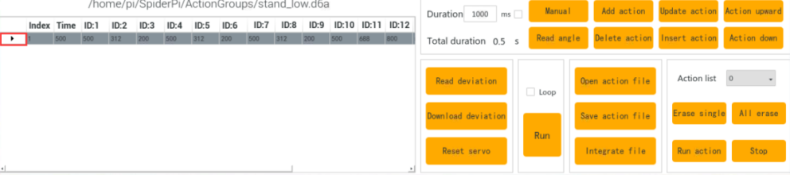

(3) Click "**Open action file**" to open the action group file located in the same directory as this lesson.

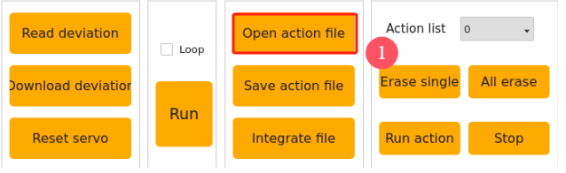


(4) The action data list will display the opened action group.


(5) Click "**Run**" .


(6) You can click the dropdown button of the action group, and select the action group to be run. Then, click "**Run action group**".


<p id="anchor_3"></p>

## 3. Action Group Programming

### 3.1 Project Outcome

Create an action group consisting of 10 actions to allow the SpiderPi to "Wave".

### 3.2 Complete Program

**(1) Action Programming**

① After starting, program SpiderPi to stand in the low stance. Click "Open action group file" button andto update the action value to the servo control area.


② Program SpiderPi to rise the right No.1 leg. Please adjust according to the below servo data and click "**Add action**" button to add the action data. Do not forget to add each single action into the list. 


③ For the better performance, set the No.3 action as the preparation. Modify the time to 200ms and add the step 2 again.

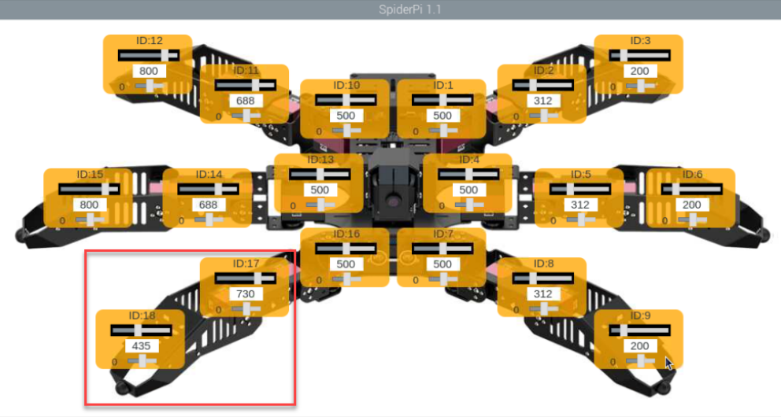

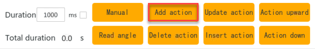

④ Modify the time back to 500ms and wave the raised leg, which requires to advise the ID:16 servo.


⑤ Rotate the raised right leg to left which is to adjust the ID:16 servo again.

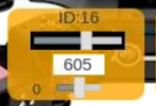

⑥ Program the raised leg to turn as the No.6 action. Just copy the previous action. Move the mouse to the 4th action, then click to update the action value, click "**Add Action**" again.


⑦ No.7 action we let the right leg rotate to the left, and the method of step 6 can be taken to copy the No. 5 action. 

⑧ No. 8 moves back to the status when the right leg is just raised, that is, copy 2 action. (Reference Step 6) 

⑨ No. 9 action we use to transition, modify the time to 200ms, and add the action of step 8 again.


⑩ The last action allows the robot to return to a low posture, copy the No.1 action. (Reference Step 6) 

The full numerical parameters of the action group are shown in the following table: (red is a value that needs to be adjusted) 


**(2) Save Action group** 

After programming, please save the action group for future debugging. Click "**Save action file**", choose the path "/home/pi/SpiderPi/ActionGroups", name it (suck as"greet") and then click "**Save**" button.

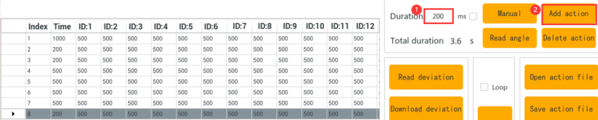

## 4. Integrate Action Groups

### 4.1 Project Outcome

Integrate the provided basic actions to become a new action group. This section takes the integrate "Wave" and "stepping"action as an example.

### 4.2 Complete Program

① Connect VNC and open SpiderPi PC software.

② Click "**Integrate file**", choose and double click **"wave.d6a**" to open.(And "/home/pi/SpiderPi/ActionGroups" file)


③ Then the action list displays the detailed parameter of action group.


④ Click "**Integrate file**" again, choose "**stepping.d6a**" and double click to select it.


⑤ Click "**Run**" to execute the new integrated actions online.


⑥ Click "**Save action file**" button and enter new action group name (such as "wave and stepping" ) to save the new integrated action group for the future debugging.

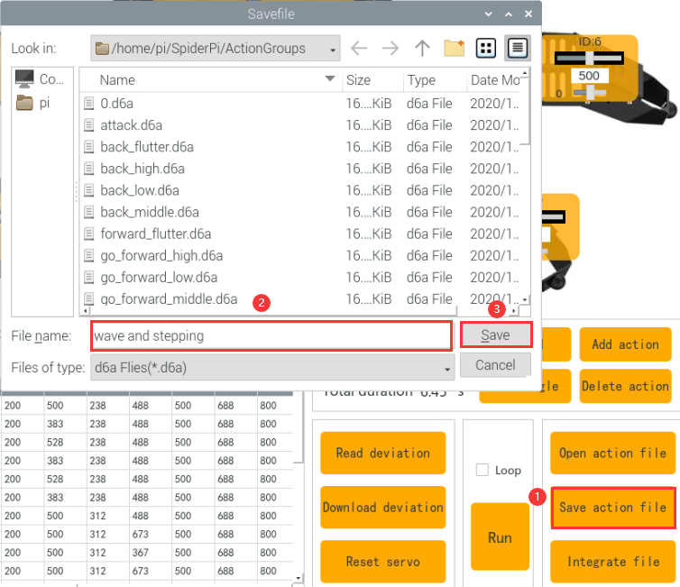

## 5. App Custom Calling

### 5.1 Goal

Execute the action group file in [3. Action Group Programming](#anchor_3)  using the custom function in the app. Let's demonstrate on executing the "greeting" action.

**5.2 Getting Ready**

(1) After connecting VNC, open the file manager on the system desktop.


(2) Access the path `/home/pi/spiderpi`. Find the file "ActionGroupDict.py", and open it with the "Text Editor".


(3) Copy the line where the action 22 is located. 


(4) Paste the code on a new line. Set the number as 45 and name it as "greet". Please refer to the names of the action group files in `/home/pi/spiderpi/ActionGroups`.

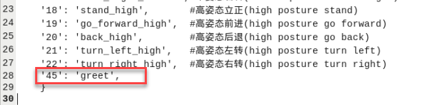

:::{NOte}
Please avoid using numbers that have been defined or the number 255. Keep the action group name consistent with the names in the storage directory (/home/pi/TonyPi/action_groups).
:::

(5) Press "Ctrl+S" to save and exit.

(6) Run the command to reboot the Raspberry Pi. (This step must be performed.)

```bash
sudo reboot
```

### 5.2 Operation Steps

(1) Open the app, and connect to the robot. Enter the "Robot Control" interface.


(2) Click the "**Action**" button. Then, click "**Custom actions**" in the pop-up window.


(3) Fill in the saved action group name and the number. Click "**OK**" to save.

The name can be customized. The number should be the same as the filled one in ActionGroupDict.py.


(4) After adding, click "Action -\> Custom action -\> Wave" to execute the action.


(5) If you want to modify or delete an action, long-press the action name and select the corresponding operation.


