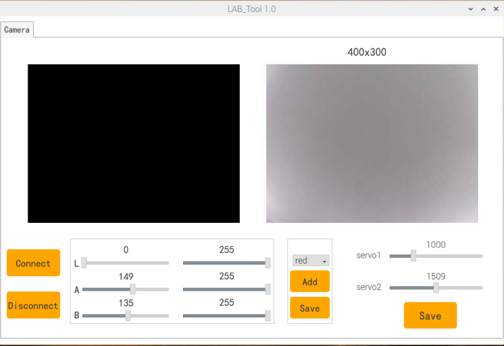
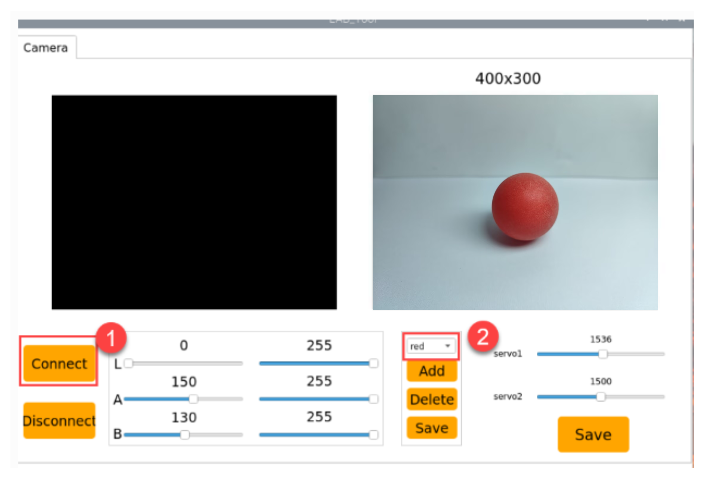
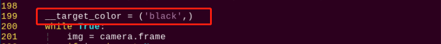

# AI视觉项目课程

## 1. 识别单个颜色

本节通过摄像头来识别颜色,识别到红色小球时，蜂鸣器发出滴滴报警声，并在回传画面中圈出，打印 "**Color: red**"。

### 1.1 实现原理

颜色识别的实现分为颜色识别和识别后的执行反馈两部分。

首先颜色识别部分，先进行高斯滤波（对图像中进行减噪），通过Lab颜色空间来对物品的颜色进行转换(关于Lab颜色空间的这个部分可以前往教程资料中 "**[OpenCV视觉基础课程](https://docs.hiwonder.com/projects/General_basic_courses/en/latest/docs/6_opencv.html)**"进行详细学习。

接着通过颜色阈值对圆圈中的物体颜色进行识别，再对图像部分进行掩膜（掩膜是用选定的图像、图形或物体，对处理的图像进行全局或者局部遮挡）。

然后经过对物品图片开闭运算处理后，最后将轮廓最大的物体用圆圈圈出。

开运算：先对图像腐蚀后膨胀。作用：用来消除小的物体，平滑形状边界，并且不改变其面积。可以去除小颗粒噪声，断开物体之间的粘连。

闭运算：先对图像膨胀后腐蚀。作用：用来填充物体内的小空洞，连接邻近的物体，连接断开的轮廓线，平滑其边界的同时不改变面积。

在识别后对蜂鸣器进行设置，使小车根据不同颜色来做出对应的反馈。比如识别红色，蜂鸣器响一声。

关于详细对应的反馈效果，可参考本文档[3.实现效果](#anchor_1_3)。

### 1.2 玩法开启及关闭步骤

:::{Note}
指令输入需严格区分大小写及空格，关键字可以使用"Tab"键进行补齐。
:::

1. 将设备开机，并参照课程资料的"**远程工具安装与连接**"内容，通过VNC远程连接工具连接。


2. 点击系统桌面左上角的图标，打开LX终端。


3. 输入指令，按下回车，则可定位到存放玩法程序的目录。

```commandline
cd spiderpi/functions
```

4. 输入指令，然后按下回车键，玩法启动。

```commandline
python3 color_recognition.py
```

5. 如需关闭此玩法，只需要在LX终端界面中按下"Ctrl+c"。若关闭失败，可多次按下。

<p id="anchor_1_3"></p>

### 1.3 实现效果

玩法开启后，通过摄像头来识别颜色,识别到红色小球时，蜂鸣器发出滴滴报警声，并在回传画面中圈出，打印 "Color：red"

:::{Note}
- 识别过程中，请尽量保证在光线充足环境下进行识别，避免因光线问题导致识别不准确。
- 识别过程中，摄像头视觉范围之内的背景中，不要出现与要识别颜色相近或相同的物体，避免误识别。
:::

### 1.4 功能延伸

- #### 更换默认识别颜色

颜色识别程序内置了三种颜色：红色、绿色以及蓝色，其中默认识别到红色，蜂鸣器发出滴滴响声，并在回传画面中圈出，打印 "Color：red"。

**这里我们将识别颜色更换为绿色为例，具体修改步骤如下所示：**

1. 输入指令切换到源码路径下的指令，按下回车。

```commandline
cd spiderpi/functions
```

2. 然后再输入指令打开程序文件的指令，按下回车。

```commandline
sudo vim color_recognition.py
```

3. 找到下图所示代码：


4. 按下键盘上的"**i**"键，进入到编辑模式。


5)  将步骤3中代码更换为下图代码：


6. 接下来，保存我们修改的内容。按下"**Esc**"键，然后依次输入"**:wq**"（注意wq前为冒号：），回车即可保存并退出。


7. 输入开启颜色识别玩法的指令，按下回车。

```commandline
sudo python3 color_recognition.py
```

### 1.5 程序分析

该程序的源代码位于： **/home/pi/spiderpi/functions/color_recognition.py**

根据实现的效果，梳理程序的过程逻辑，如下图所示：


- #### 1.5.1 导入功能库

```py
import sys
import cv2
import math
import time
import threading
import numpy as np
from common import misc
from common import yaml_handle
from calibration.camera import Camera
from sensor.ultrasonic_sensor import Ultrasonic
```

1)  导入opencv、时间、数学、线程相关的库。我们如果想要调用功能库里的函数，就可以使用"功能库名+函数名（参数，参数...）"如：

```py
time.sleep(0.01)
```

就是调用"**time**"库中的"**sleep**"函数，sleep()的作用是延时。

在python中有一些已经内置的库，我们直接导入调用就可以，比如"**time**"、"**cv2**"、"**math**"等。我们也可以自己写一个库，比如上面的"**yaml_handle**"文件读取库。

2. 实例化函数库，我们有些函数库的名称太长，并且不容易记忆，为了方便调用函数，我们经常会对函数库进行实例化，如：

```py
from calibration.camera import Camera
```

进行实例化后，在使用Board库中的函数，就可以像这样"**Board.函数名(参数,参数...)**"直接调用了，非常方便。

- #### 1.5.2 主函数分析

python程序中"**\_\_name\_\_ == '\_\_main\_\_:'**"就是程序的主函数。

**读取摄像头图像**

```py
camera = Camera()
```

当玩法启动时，获取视频流并存储在"cap"中。

**进入图像处理**

读取到图像时，调用run()函数进行图像处理。

```py
while True:
    img = camera.frame
    if img is not None:
        frame = img.copy()
        Frame = run(frame)
        cv2.imshow('Frame', Frame)
        key = cv2.waitKey(1)
        if key == 27:
            break
```

1)  函数img.copy()的作用是将"**img**"的内容复制给"**frame**"。

2)  函数run()进行图像处理。

```py
def run(img):
    global draw_color
    global color_list
    global detect_color
    global action_finish

    img_copy = img.copy()
    img_h, img_w = img.shape[:2]

    if not __isRunning:
        return img

    frame_resize = cv2.resize(img_copy, size, interpolation=cv2.INTER_NEAREST)
    frame_gb = cv2.GaussianBlur(frame_resize, (3, 3), 3)      
    frame_lab = cv2.cvtColor(frame_gb, cv2.COLOR_BGR2LAB)  # 将图像转换到LAB空间(convert the image to LAB space)
```

- 对图片大小进行缩放，方便处理。


```py
frame_resize = cv2.resize(img_copy, size, interpolation=cv2.INTER_NEAREST)
```

第一个参数"**img_copy**"是输入图像。

第二个参数"**size**"是输出图像的大小。大小可以自己设定。

第三个参数"**interpolation=cv2.INTER_NEAREST**"是插值方式。INTER_NEAREST：最邻近插值。INTER_LINEAR：双线性插值，如果最后一个参数你不指定，将默认使用这种方法。INTER_CUBIC：4x4像素邻域内的双立方插值。INTER_LANCZOS4：8x8像素邻域内的Lanczos插值。

- 高斯滤波

  图像中总是会混入噪声，影响图像的质量，让特征不明显。根据不同的噪声种类选择对应的滤波方法，常见的有：高斯滤波、中值滤波、均值滤波等。

  高斯滤波是一种线性平滑滤波，适用于消除高斯噪声，广泛应用于图像处理的减噪过程。

```py
frame_gb = cv2.GaussianBlur(frame_resize, (3, 3), 3)  
```

第一个参数"**frame_resize**"是输入图像。

第二个参数"**(3, 3)**"是高斯内核大小。

第三个参数"**3**"是X方向上的高斯核标准偏差。

- 将图像转换到LAB空间，其中函数cv2.cvtColor()是颜色空间转换函数。

```py
frame_lab = cv2.cvtColor(frame_gb, cv2.COLOR_BGR2LAB)  # 将图像转换到LAB空间(convert the image to LAB space)
```

第一个参数"**frame_gb**"是输入图像。

第二个参数"**cv2.COLOR_BGR2LAB**"是转换格式。"**cv2.COLOR_BGR2LAB**"是将BGR格式转换到LAB格式。如果要转换到RGB就可以使用"**cv2.COLOR_BGR2RGB**"。

- 将图像转换成二值图像，只有0和1，图像变得简单并且数据量减小，更容易处理。

  采用cv2库中的inRange()函数对图像进行二值化处理。


```py
frame_mask = cv2.inRange(frame_lab,
                         (lab_data[i]['min'][0],
                          lab_data[i]['min'][1],
                          lab_data[i]['min'][2]),
                         (lab_data[i]['max'][0],
                          lab_data[i]['max'][1],
                          lab_data[i]['max'][2]))  #对原图像和掩模进行位运算(perform bitwise operation to original image and mask)
```

第一个参数"**frame_lab**"是输入图像；

第二个参数"**(lab_data\[i\]\['min'\]\[0\],lab_data\[i\]\['min'\]\[1\],lab_data\[i\]\['min'\]\[2\])**"是颜色阈值下限；

第三个参数"**(lab_data\[i\]\['max'\]\[0\],lab_data\[i\]\['max'\]\[1\],lab_data\[i\]\['max'\]\[2\])**"是颜色阈值上限；

- 为了降低干扰，令图像更平滑，需要对图像进行腐蚀和膨胀操作，腐蚀（erosion）和膨胀（dilation）是两种基本的形态学操作，常用于图像处理，特别是在二值化图像的处理中。这两种操作通常用于去除小的噪声、分离和识别图像中的物体、以及调整图像的大小等。

```py
eroded = cv2.erode(frame_mask, cv2.getStructuringElement(cv2.MORPH_RECT, (3, 3)))  #腐蚀(erode)
dilated = cv2.dilate(eroded, cv2.getStructuringElement(cv2.MORPH_RECT, (3, 3))) #膨胀(dilate)
```

第一个参数是输入图像；

第二个参数是结构元素（也称为内核），它定义了操作的性质。内核的大小和形状决定了腐蚀和膨胀的程度。

- 获取最大面积轮廓

  完成上述的图像处理后，需要获取识别目标的轮廓，此处涉及cv2库中的findContours()函数。

```py
contours = cv2.findContours(dilated, cv2.RETR_EXTERNAL, cv2.CHAIN_APPROX_NONE)[-2]  #找出轮廓(find contours)
```

第一个参数"dilated"是输入图像；

第二个参数"**cv2.RETR_EXTERNAL**"是轮廓的检索模式；

第三个参数"**cv2.CHAIN_APPROX_NONE)\[-2\]**"是轮廓的近似方法。

在获得的轮廓中寻找面积最大的轮廓，而为了避免干扰，需要设定一个最小值，仅当面积大于该值时，目标轮廓才有效。

```py
areaMaxContour, area_max = get_area_max_contour(contours)  #找出最大轮廓(find the largest contour)
if areaMaxContour is not None:
    if area_max > max_area:#找最大面积(find the maximum area)
        max_area = area_max
        color_area_max = i
        areaMaxContour_max = areaMaxContour
```

**显示回传画面**

```py
frame = img.copy()
Frame = run(frame)
cv2.imshow('Frame', Frame)
key = cv2.waitKey(1)
if key == 27:
    break
```

函数cv2.imshow()的作用是在窗口显示图像，"**'Frame'**"是窗口名称、"**Frame**"是显示内容。后面一定要有cv2.waitKey()，否则无法显示。

函数cv2.waitKey()的作用是等待按键输入，参数"**1**"是延迟时间。

- #### 1.5.3 驱动蜂鸣器

```py
board.set_buzzer(2400, 0.1, 0.2, 1)
time.sleep(0.2)
```

函数set_buzzer()是驱动蜂鸣

代码time.sleep(0.1)为延时函数，"**0.2**"是响的时间。

## 2. 颜色分类

将红色小球放置到摄像头前，机器人在识别到后将会"点头"；将蓝色或绿色小球放置到摄像头前，机器人识别到后将会"摇头"。

### 2.1 玩法简要说明

人类的眼睛可以很轻松的区分世界上不同的颜色，对于机器人而言，怎样可以识别物体颜色呢？我们可以给SpiderPi机器人加上摄像头视觉模块，通过视觉识别来识别不同的颜色。

下面我们看下本节课整体实现的流程：

首先需要对颜色进行识别，我们使用Lab颜色空间来进行处理。先将RGB颜色空间转换为Lab，然后进行二值化处理，再经过膨胀腐蚀等操作，可获得只包含目标颜色的轮廓，再将该颜色轮廓用圆圈框起，便可实现物体颜色的识别。

接着根据识别的颜色进行判断，如果满足设定的颜色，即让头部舵机进行上下转动，否则进行左右转动。

### 2.2 玩法开启及关闭步骤

:::{Note}
指令输入需严格区分大小写及空格，关键字可以使用"Tab"键进行补齐。
:::

1.  将机器人开机，然后通过VNC远程连接树莓派桌面。关于VNC的安装及连接，可参考"**[开发环境搭建\1. 远程工具安装与连接]()**"。

2)  在树莓派的桌面双击的"**Terminator**"图标，打开命令行终端。

```commandline
cd spiderpi/functions/
```

3. 输入指令，然后按下回车键将玩法启动。

```commandline
python3 color_detect.py
```

4. 如需关闭此玩法，只需要在LX终端界面中按下"Ctrl+C"。如果关闭失败，可多次按下。

### 2.3 功能实现

:::{Note}
程序默认识别颜色为红色。如需切换蓝色或绿色，可参考[4.1 更换默认识别颜色](#anchor_2_4_1)。
:::

将红色小球放置到摄像头前，机器人在识别到后将会"点头"；将蓝色或绿色小球放置到摄像头前，机器人识别到后将会"摇头"。

### 2.4 功能延伸

<P id="anchor_2_4_1"></p>

- #### 2.4.1 更换默认识别颜色

颜色识别程序内置了三种颜色：红色、绿色以及蓝色，其中默认识别到红色，机器人便执行点头动作。

**这里我们以识别颜色更换为绿色为例，具体的修改步骤如下所示：**

1.  首先需要切换至玩法程序所在的目录内，输入指令，按下回车。

```commandline
cd spiderpi/functions/
```

其次我们通过vim编辑器进入该玩法内，输入指令，并按下回车。

```commandline
vim color_detect.py
```

2.  通过键盘输入"**126**"，然后按下"**shift+g**"键即可直接跳转到需要修改的位置。


3. 接着按下"**i**"进入编辑模式，然后将**（if detect_color == 'red'）**的"**red**"直接修改为"**green**"，将第140行**（elif detect_color== 'green' or detect_color == 'blue'）**的"**green**"改为"**red**"即可。（如需更换为蓝色，同理）


4. 最后按下"**Esc**"进入末行命令模式，输入指令即可保存退出。（先输入英文:，再输入wq）

```commandline
:wq
```

- ####  2.4.2 增加新的识别颜色

除了内置红、绿、蓝三种识别的颜色，我们还可以设置其它可识别的颜色。**比如我们以新增橙色为例进行展示，具体的修改步骤如下：**

1)  打开VNC，输入指令并按下回车，打开Lab颜色设置文件。

```commandline
vim /home/pi/spiderpi/config/lab_config.yaml
```

可使用截图或文件备份的方式记录初始数值。


2)  单击系统桌面调试工具图标，然后弹出的提示框内直接选择"**执行**"即可。


3)  点击左下角"**Connect**"按钮，当摄像头回传画面出现在界面上时表示连接成功。右侧方框选择"**red**"。



4)  然后将摄像头对准想要识别的颜色，拖动L、A、B应的滑杆，直到左侧画面里要识别的颜色区域变为白色，其他区域变成黑色。

例如本节我们想要识别橙色，可将橙色物体放到摄像头视野内，调整L、A、B对应滑杆，直到左侧画面里橙色部分变为白色，其他颜色都变为黑色，接着点击"**red**"下方的"**保存**"按钮写入修改的数据。


5)  修改完成后，我们可以检查一下修改的值是否成功被写入进去，再次输入指令并按下回车，查看颜色设置参数。

```commandline
vim /home/pi/spiderpi/config/lab_config.yaml
```

为了避免对玩法造成影响，在后面修改完毕后，建议通过LAB_Tool工具将数值修改回初始值。

6)  观察上图红框位置，发现修改的值已经被写入配置程序中了，按"Esc"，在下方输入指令，退出并保存。

```commandline
:wq
```

7. 按照[更换默认识别颜色](#anchor_2_4_1)的内容，将默认识别到后让SpiderPi机器人点头的颜色设置为红色。


8. 再次启动该玩法，将橙色物品放置到摄像头前，即可看到机器人将执行"**点头**"动作。如需要增加其它颜色作为可识别颜色，可参考前面步骤进行操作。

### 2.5 程序分析

根据实现的效果，梳理程序的过程逻辑，如下图所示：


该程序的源代码位于：**/home/pi/spiderpi/functions/color_detect.py**


- #### 2.5.1 导入功能库

```py
import sys
import cv2
import math
import time
import threading
import numpy as np
from common import misc
from common import yaml_handle
from calibration.camera import Camera
from sensor.ultrasonic_sensor import Ultrasonic
```

1)  导入opencv、时间、数学、线程相关的库。我们如果想要调用功能库里的函数，就可以使用"**功能库名+函数名（参数，参数...）**"如：

```py
time.sleep(0.01)
```

就是调用"**time**"库中的"**sleep**"函数，sleep()的作用是延时。

在python中有一些已经内置的库，我们直接导入调用就可以，比如"**time**"、"**cv2**"、"**math**"等。我们也可以自己写一个库，比如上面的"**yaml_handle**"文件读取库。

2. 实例化函数库。我们有些函数库的名称太长，并且不容易记忆，为了方便调用函数，我们经常会对函数库进行实例化，如：

```py
from common.ros_robot_controller_sdk import Board
board = Board()
```

进行实例化后，在使用Board库中的函数，就可以像这样"**Board.函数名(参数,参数...)**"直接调用了，非常方便。

- #### 2.5.2 主函数分析

python程序中"**\_\_name\_\_ == '\_\_main\_\_:'**"就是程序的主函数。首先调用函数init()进行初始化配置。本程序中初始化包括：舵机回到初始位置、读取颜色阈值文件。一般还有端口、外设、定时中断等配置，这些都要在初始化内容中完成。

```py
if __name__ == '__main__':
    from common.ros_robot_controller_sdk import Board

    board = Board()
    ultrasonic = Ultrasonic()
```

**读取摄像头图像**

```py
while True:
    img = camera.frame
```

当玩法启动时，将图像存储在"**img**"中。

**进入图像处理**

读取到图像时，调用run()函数进行图像处理。

```py
img = camera.frame
if img is not None:
    frame = img.copy()
    Frame = run(frame
```

1)  函数img.copy()的作用是将"**img**"的内容复制给"**frame**"。

2)  函数run()进行图像处理。

```py
def run(img):
    global draw_color
    global color_list
    global detect_color
    global action_finish

    img_copy = img.copy()
    img_h, img_w = img.shape[:2]

    if not __isRunning:
        return img

    frame_resize = cv2.resize(img_copy, size, interpolation=cv2.INTER_NEAREST)
    frame_gb = cv2.GaussianBlur(frame_resize, (3, 3), 3)      
    frame_lab = cv2.cvtColor(frame_gb, cv2.COLOR_BGR2LAB)  # 将图像转换到LAB空间(convert the image to LAB space)

    max_area = 0
    color_area_max = None    
    areaMaxContour_max = 0

    if action_finish:
        for i in lab_data:
            if i != 'black' and i != 'white':
                frame_mask = cv2.inRange(frame_lab,
                                         (lab_data[i]['min'][0],
                                          lab_data[i]['min'][1],
                                          lab_data[i]['min'][2]),
                                         (lab_data[i]['max'][0],
                                          lab_data[i]['max'][1],
                                          lab_data[i]['max'][2]))  #对原图像和掩模进行位运算(perform bitwise operation to original image and mask)
                eroded = cv2.erode(frame_mask, cv2.getStructuringElement(cv2.MORPH_RECT, (3, 3)))  #腐蚀(erode)
                dilated = cv2.dilate(eroded, cv2.getStructuringElement(cv2.MORPH_RECT, (3, 3))) #膨胀(dilate)
                if debug:
                    cv2.imshow(i, dilated)
                    contours = cv2.findContours(dilated, cv2.RETR_EXTERNAL, cv2.CHAIN_APPROX_NONE)[-2]  #找出轮廓(find contours)
                    areaMaxContour, area_max = get_area_max_contour(contours)  #找出最大轮廓(find the largest contour)
                    if areaMaxContour is not None:
                        if area_max > max_area:#找最大面积(find the maximum area)
```

- **对图片大小进行缩放，方便处理**

```py
frame_resize = cv2.resize(img_copy, size, interpolation=cv2.INTER_NEAREST)
```

第一个参数"**img_copy**"是输入图像。

第二个参数"**size**"是输出图像的大小。大小可以自己设定。

第三个参数"**interpolation=cv2.INTER_NEAREST**"是插值方式。INTER_NEAREST：最邻近插值。INTER_LINEAR：双线性插值，如果最后一个参数你不指定，将默认使用这种方法。INTER_CUBIC：4x4像素邻域内的双立方插值。INTER_LANCZOS4：8x8像素邻域内的Lanczos插值。

- **高斯滤波**

图像中总是会混入噪声，影响图像的质量，让特征不明显。根据不同的噪声种类选择对应的滤波方法，常见的有：高斯滤波、中值滤波、均值滤波等。

高斯滤波是一种线性平滑滤波，适用于消除高斯噪声，广泛应用于图像处理的减噪过程。

```py
eroded = cv2.erode(frame_mask, cv2.getStructuringElement(cv2.MORPH_RECT, (3, 3)))  #腐蚀(erode)
```

第一个参数"**frame_resize**"是输入图像。

第二个参数"**(3, 3)**"是高斯内核大小。

第三个参数"**3**"是X方向上的高斯核标准偏差。

- 将图像转换到LAB空间，其中函数cv2.cvtColor()是颜色空间转换函数。

```py
eroded = cv2.erode(frame_mask, cv2.getStructuringElement(cv2.MORPH_RECT, (3, 3)))  #腐蚀(erode)
```

第一个参数"**frame_gb**"是输入图像。

第二个参数"**cv2.COLOR_BGR2LAB**"是转换格式。"**cv2.COLOR_BGR2LAB**"是将BGR格式转换到LAB格式。如果要转换到RGB就可以使用"**cv2.COLOR_BGR2RGB**"。

- 将图像转换成二值图像，只有0和1，图像变得简单并且数据量减小，更容易处理。

采用cv2库中的inRange()函数对图像进行二值化处理。

```py
frame_mask = cv2.inRange(frame_lab,
                         (lab_data[i]['min'][0],
                          lab_data[i]['min'][1],
                          lab_data[i]['min'][2]),
                         (lab_data[i]['max'][0],
                          lab_data[i]['max'][1],
                          lab_data[i]['max'][2]))  #对原图像和掩模进行位运算(perform bitwise operation to original image and mask)
```

第一个参数"**frame_lab**"是输入图像；

第二个参数"**(lab_data\[i\]\['min'\]\[0\],lab_data\[i\]\['min'\]\[1\],lab_data\[i\]\['min'\]\[2\])**"是颜色阈值下限；

第三个参数"**(lab_data\[i\]\['max'\]\[0\],lab_data\[i\]\['max'\]\[1\],lab_data\[i\]\['max'\]\[2\])**"是颜色阈值上限；

- erode()函数用于对图像进行腐蚀操作。

以代码"**eroded = cv2.erode(frame_mask, cv2.getStructuringElement(cv2.MORPH_RECT, (3, 3))**"为例，括号内的参数含义如下：

```py
eroded = cv2.erode(frame_mask, cv2.getStructuringElement(cv2.MORPH_RECT, (3, 3)))  #腐蚀(erode)
dilated = cv2.dilate(eroded, cv2.getStructuringElement(cv2.MORPH_RECT, (3, 3))) #膨胀(dilate)
```

第一个参数"**frame_mask**"是输入图像；

第二个参数"**cv2.getStructuringElement(cv2.MORPH_RECT, (2, 2))**"是决定操作性质的结构元素或内核。其中，括号内的第一个参数是内核形状，第二个参数是内核尺寸。

dilate()函数用于对图像进行膨胀操作。此函数括号内参数的含义与erode()函数的相同。

- **获取最大面积轮廓**

  完成上述的图像处理后，需要获取识别目标的轮廓，此处涉及cv2库中的findContours()函数。

```py
contours = cv2.findContours(dilated, cv2.RETR_EXTERNAL, cv2.CHAIN_APPROX_NONE)[-2]  #找出轮廓(find contours)
```

第一个参数"**dilated**"是输入图像；

第二个参数"**cv2.RETR_EXTERNAL**"是轮廓的检索模式；

第三个参数"**cv2.CHAIN_APPROX_NONE)\[-2\]**"是轮廓的近似方法。

在获得的轮廓中寻找面积最大的轮廓，而为了避免干扰，需要设定一个最小值，仅当面积大于该值时，目标轮廓才有效。

```py
areaMaxContour, area_max = get_area_max_contour(contours)  #找出最大轮廓(find the largest contour)
if areaMaxContour is not None:
    if area_max > max_area:#找最大面积(find the maximum area)
        max_area = area_max
        color_area_max = i
        areaMaxContour_max = areaMaxContour
```

```py
def get_area_max_contour(contours):
    contour_area_temp = 0
    contour_area_max = 0

    area_max_contour = None
    max_area = 0

    for c in contours:  # 历遍所有轮廓(iterate through all contours)
        contour_area_temp = math.fabs(cv2.contourArea(c))  # 计算轮廓面积(calculate the contour area)
        if contour_area_temp > contour_area_max:
            contour_area_max = contour_area_temp
            if contour_area_temp >= 100:  # 只有在面积大于设定时，最大面积的轮廓才是有效的，以过滤干扰(Only the contour with the area larger than 300, which is greater than 300, is considered valid to filter out disturbance)
                area_max_contour = c
                max_area = contour_area_temp

                return area_max_contour, max_area  # 返回最大的轮廓, 面积(return the largest contour and its area)
```

- 通过判断语句得到图像中面积最大的颜色

```py
if color_area_max == 'red':  #红色最大(red is the maximum)
    color = 1
elif color_area_max == 'green':  #绿色最大(green is the maximum)
    color = 2
elif color_area_max == 'blue':  #蓝色最大(blue is the maximum)
    color = 3
else:
    color = 0
    color_list.append(color)

    if len(color_list) == 3:  #多次判断(multiple judgements)
        # 取平均值(get mean)
        color = int(round(np.mean(np.array(color_list))))
        color_list = []
        if color == 1:
            detect_color = 'red'
            draw_color = range_rgb["red"]
        elif color == 2:
            detect_color = 'green'
            draw_color = range_rgb["green"]
        elif color == 3:
            detect_color = 'blue'
            draw_color = range_rgb["blue"]
        else:
            detect_color = 'None'
            draw_color = range_rgb["black"]               
        else:
            detect_color = 'None'
            draw_color = range_rgb["black"]
```

**显示回传画面**

```py
Frame = run(frame)
cv2.imshow('Frame', Frame)
key = cv2.waitKey(1)
if key == 27:
    break
```

函数cv2.imshow()的作用是在窗口显示图像，"**'frame'**"是窗口名称、"**Frame**"是显示内容。后面一定要有cv2.waitKey()，否则无法显示。

函数cv2.waitKey()的作用是等待按键输入，参数"**1**"是延迟时间。

- #### 2.5.3 子线程分析

小车移动函数move()作为子线程运行，当识别到颜色后，就会执行move()函数。

主要是对图像处理结果进行判断，再执行不同的反馈。

```py
def move():
    global draw_color
    global detect_color
    global action_finish

    while True:
        if debug:
            return
        if __isRunning:
            if detect_color != 'None':
                action_finish = False
                if detect_color == 'red':
                    board.pwm_servo_set_position(0.2, [[1, 1200]])
                    time.sleep(0.2)
                    board.pwm_servo_set_position(0.2, [[1, 1800]])
                    time.sleep(0.2)
                    board.pwm_servo_set_position(0.2, [[1, 1200]])
                    time.sleep(0.2)
                    board.pwm_servo_set_position(0.2, [[1, 1800]])
                    time.sleep(0.2)
                    board.pwm_servo_set_position(0.2, [[1, 1500]])
                    time.sleep(0.1)
                    detect_color = 'None'
                    draw_color = range_rgb["black"]                    
                    time.sleep(1)
                elif detect_color == 'green' or detect_color == 'blue':
                    board.pwm_servo_set_position(0.2, [[2, 1200]])
                    time.sleep(0.2)
                    board.pwm_servo_set_position(0.2, [[2, 1800]])
                    time.sleep(0.2)
                    board.pwm_servo_set_position(0.2, [[2, 1200]])
                    time.sleep(0.2)
                    board.pwm_servo_set_position(0.2, [[2, 1800]])
                    time.sleep(0.2)
                    board.pwm_servo_set_position(0.2, [[2, 1500]])
                    time.sleep(0.1)
                    detect_color = 'None'
                    draw_color = range_rgb["black"]                    
                    time.sleep(1)
                else:
                    time.sleep(0.01)                
                action_finish = True                
                detect_color = 'None'
            else:
               time.sleep(0.01)
        else:
            time.sleep(0.01)
```

**云台舵机执行移动**

判断识别的颜色与设定颜色是否一致，执行点头或者摇头的动作。

```py
if detect_color == 'red':
    board.pwm_servo_set_position(0.2, [[1, 1200]])
    time.sleep(0.2)
    board.pwm_servo_set_position(0.2, [[1, 1800]])
    time.sleep(0.2)
    board.pwm_servo_set_position(0.2, [[1, 1200]])
    time.sleep(0.2)
    board.pwm_servo_set_position(0.2, [[1, 1800]])
    time.sleep(0.2)
    board.pwm_servo_set_position(0.2, [[1, 1500]])
    time.sleep(0.1)
    detect_color = 'None'
    draw_color = range_rgb["black"]                    
    time.sleep(1)
elif detect_color == 'green' or detect_color == 'blue':
    board.pwm_servo_set_position(0.2, [[2, 1200]])
    time.sleep(0.2)
    board.pwm_servo_set_position(0.2, [[2, 1800]])
    time.sleep(0.2)
    board.pwm_servo_set_position(0.2, [[2, 1200]])
    time.sleep(0.2)
    board.pwm_servo_set_position(0.2, [[2, 1800]])
    time.sleep(0.2)
    board.pwm_servo_set_position(0.2, [[2, 1500]])
    time.sleep(0.1)
    detect_color = 'None'
    draw_color = range_rgb["black"]                    
    time.sleep(1)
```

函数Board.setPWMServoPulse()是控制单个舵机，以代码"**Board.setPWMServoPulse(1, 1800, 200)**"为例：

第一个参数"**1**"是舵机id。

第二个参数"**1800**"是舵机脉冲。

第三个参数"**200**"是运行时间。单位毫秒。

## 3. 颜色位置识别

本节课可以通过摄像头进行颜色识别红绿蓝三色小球，并在回传画面中圈出，显示其XY坐标位置。

### 3.1 实现原理

目标追踪的实现可分为颜色识别和位置标记两部分。

首先颜色识别部分，先进行高斯滤波（对图像中进行减噪），通过Lab颜色空间来对物品的颜色进行转换(关于Lab颜色空间的这个部分可以前往"**[OpenCV视觉基础课程](https://docs.hiwonder.com/projects/General_basic_courses/en/latest/docs/6_opencv.html)**"课程进行详细学习)。

接着通过颜色阈值对圆圈中的物体颜色进行识别，再对图像部分进行掩膜（掩膜是用选定的图像、图形或物体，对处理的图像进行全局或者局部遮挡）。

然后经过对物品图片开闭运算处理后，最后将轮廓最大的物体用圆圈圈出。

开运算：先对图像腐蚀后膨胀。作用：用来消除小的物体，平滑形状边界，并且不改变其面积。可以去除小颗粒噪声，断开物体之间的粘连。

闭运算：先对图像膨胀后腐蚀。作用：用来填充物体内的小空洞，连接邻近的物体，连接断开的轮廓线，平滑其边界的同时不改变面积。

位置标记需要使用特定的检测算法。其基本原理是在图像中寻找符合预定义特征或模式的区域，然后返回这些区域的位置和边界框。

### 3.2 玩法开启及关闭步骤

:::{Note}
指令的输入需严格区分大小写和空格，另外可按键盘"Tab"键进行关键词补齐。
:::

1. 将设备开机，并参照课程资料的"**[远程桌面工具安装与连接\1. 远程工具安装与连接]()**"内容，通过VNC远程连接工具连接。


2. 点击系统桌面左上角的图标，打开LX终端。


3. 在打开的界面中，输入进入玩法程序所在目录的指令，按下回车键。

```commandline
cd spiderpi/functions
```

4)  输入指令，然后按下回车，启动玩法。


```commandline
python3 color_position_recognition.py
```

5. 如需关闭此玩法，只需要在LX终端界面中按下"**Ctrl+c**"。若关闭失败，可多次按下。

### 3.3 实现效果

**程序默认的追踪颜色为红绿蓝三色小球，识别完成后在回传画面中圈出，并显示其XY坐标位置**。

:::{Note}
- 识别过程中，请尽量保证在光线充足环境下进行识别，避免因光线问题导致识别不准确。
- 识别过程中，摄像头视觉范围之内的背景中，不要出现与要识别颜色相近或相同的物体，避免误识别。
- 若颜色识别不准确可参照下文"**颜色调节阈值**"，对颜色阈值进行设置。
:::
- 
### 3.4 功能延伸

- #### 3.4.1 调节颜色阈值

在玩法体验的过程中，如识别物体颜色效果不佳，则需调节颜色阈值。**本节以调节红色为例，其他颜色设置方法皆可参考，操作步骤如下：**

1)  双击系统桌面图标，在弹出的界面中点击"**执行**"。


2)  进入界面后，点击"**Connect**"。


3)  连接成功后，在界面右下角的颜色选项栏中选择"**red**"。



4)  若在弹出的界面中未出现回传画面，说明摄像头未连接成功，需检查一下摄像头连接线是否连接好。

下图界面右侧是实时回传画面，左侧是需要被采集的颜色。将摄像头对准红色色块，然后拖动下方的六个滑杆，使得左侧画面中红色色块的区域全部变为白色，其它区域为黑色。接着点击"Save"按钮保存数据。


- #### 3.4.2 增加新的识别颜色

除了内置三种识别的颜色，我们还可以设置其它可识别的颜色，**比如我们以紫色作为新增的识别颜色为例，具体的修改步骤如下：**

1)  双击系统桌面图标，然后弹出的提示框内直接选择"**执行**"即可。


2)  在弹出的界面中依次选择"**Connect**"。


3)  点击"**Add**"，然后为新增颜色命名（这里以"**purple**"为例），再点击"**OK**"。


4)  然后点击颜色选框的下拉按钮，选择"**purple**"。


5)  将摄像头对准紫色物体，拖动L、A、B应的滑杆，直到左侧画面里要识别的颜色区域变为白色，其他区域变成黑色。


6)  最后，再点击"**Save**"，保存一下调节好的颜色阈值。


7)  修改完成后，我们可以检查一下修改的值是否成功被写入进去，输入指令，并按下回车，进入到程序代码所在目录。

```commandline
cd spiderpi/config
```

8)  再输入指令，并按下回车，打开程序文件。

```commandline
sudo vim lab_config.yaml
```

9)  打开颜色阈值程序文件后，即可查看紫色阈值参数。


10. 输入":q"后，按下回车，退出此文件。

11. 输入指令，按下回车，切换到主目录。

```commandline
cd
```

12. 输入指令，按下回车，则可定位到存放玩法程序的目录。

```commandline
cd spiderpi/functions
```

13) 然后再输入指令打开程序文件的指令，按下回车。

```commandline
sudo vim color_position_recognition.py
```

14. 接着找到如下图所示代码。


15. 按下键盘上的"**i**"键，进入到编辑模式。


16. 手动输入添加"**'purple': (128,** **0,** **128)**"，如下图所示：(128, 0, 128)为紫色的RGB紫，用户可通过网络搜索关键词"紫色RGB值"来获取。

**'purple': (128, 0, 128),**


17. 找到图示代码，插入红框中的代码段。


18. 按下键盘上的"ESC"按键，输入'：wq'，退出并保存代码。


19. 输入指令,并按下回车开启玩法。

```commandline
python3 color_position_recognition.py
```

20) 如果需要添加其他颜色作为可识别颜色，可参考前面步骤进行操作。

### 3.5 程序说明

该程序的源代码位于：**/home/pi/spiderpi/functions/color_position_recognition.py**

根据实现的效果，梳理程序的过程逻辑，如下图所示：


- #### 3.5.1 导入功能库

```py
import sys
import cv2
import math
import time
from common import misc
from common.pid import PID
from common import yaml_handle
from calibration.camera import Camera 
from sensor.ultrasonic_sensor import Ultrasonic
```

1)  导入opencv、时间、数学、线程、逆运动学相关的库。我们如果想要调用功能库里的函数，就可以使用"**功能库名+函数名（参数，参数...）**"如：

```py
time.sleep(0.01)
```

就是调用"**time**"库中的"**sleep**"函数。sleep()的作用是延时。

在python中有一些已经内置的库，我们直接导入调用就可以，比如"**time**"、"**cv2**"、"**math**"等。我们也可以自己写一个库，比如上面的"**yaml_handle**"文件读取库等。

2)  实例化函数库，我们有些函数库的名称太长，并且不容易记忆，为了方便调用函数，我们经常会对函数库进行实例化，如：

```py
from calibration.camera import Camera
```

进行实例化后，在使用Misc库中的函数，就可以像这样"**Misc.函数名(参数,参数...)**"直接调用了，非常方便。

- #### 3.5.2 主函数分析

python程序中"**\_\_name\_\_ == '\_\_main\_\_:'**"就是程序的主函数。加载相机校准参数，并使用这些参数来校正图像的畸变和进行图像的裁剪，以便更好地进行后续处理，如特征检测、图像识别等。

```py
if __name__ == '__main__':

    from common.ros_robot_controller_sdk import Board

    board = Board()
    ultrasonic = Ultrasonic()

    debug = False
    if debug:
        print('Debug Mode')

        init()
        start()
        camera = Camera()
        camera.camera_open(correction=True) # 开启畸变矫正,默认不开启(enable the distortion correction which is not started by default)
```

**读取摄像头图像**

```py
camera = Camera()
```

当玩法启动时，首先读取摄像头。

**进入图像处理**

1)  函数run()进行图像处理。

```py
Frame = run(frame) 
```

```py
def run(img):
    global x_dis, y_dis

    img_copy = img.copy()
    img_h, img_w = img.shape[:2]

    if not __isRunning or __target_color == ():
        return img

    cv2.line(img, (int(img_w/2 - 10), int(img_h/2)), (int(img_w/2 + 10), int(img_h/2)), (0, 255, 255), 2)
    cv2.line(img, (int(img_w/2), int(img_h/2 - 10)), (int(img_w/2), int(img_h/2 + 10)), (0, 255, 255), 2)

    img_hisEqul = his_hqul_color(img_copy)

    frame_resize = cv2.resize(img_hisEqul, size, interpolation=cv2.INTER_NEAREST)
    frame_gb = cv2.GaussianBlur(frame_resize, (5, 5), 5)   
    frame_lab = cv2.cvtColor(frame_gb, cv2.COLOR_BGR2LAB)  # 将图像转换到LAB空间(convert the image to LAB space)
```

- 对图片大小进行缩放，方便处理。

```py
frame_resize = cv2.resize(img_hisEqul, size, interpolation=cv2.INTER_NEAREST)
```

第一个参数"**img_copy**"是输入图像。

第二个参数"**size**"是输出图像的大小。大小可以自己设定。

第三个参数"**interpolation=cv2.INTER_NEAREST**"是插值方式。INTER_NEAREST：最邻近插值。INTER_LINEAR：双线性插值，如果最后一个参数你不指定，将默认使用这种方法。INTER_CUBIC：4x4像素邻域内的双立方插值。INTER_LANCZOS4：8x8像素邻域内的Lanczos插值。

- 高斯滤波

  图像中总是会混入噪声，影响图像的质量，让特征不明显。根据不同的噪声种类选择对应的滤波方法，常见的有：高斯滤波、中值滤波、均值滤波等。

  高斯滤波是一种线性平滑滤波，适用于消除高斯噪声，广泛应用于图像处理的减噪过程。

```py
frame_gb = cv2.GaussianBlur(frame_resize, (5, 5), 5)
```

第一个参数"**frame_resize**"是输入图像。

第二个参数"**(3, 3)**"是高斯内核大小。

第三个参数"**3**"是X方向上的高斯核标准偏差。

- 将图像转换到LAB空间，其中函数cv2.cvtColor()是颜色空间转换函数。

```py
frame_lab = cv2.cvtColor(frame_gb, cv2.COLOR_BGR2LAB)  # 将图像转换到LAB空间(convert the image to LAB space)
```

第一个参数"**frame_gb**"是输入图像。

第二个参数"**cv2.COLOR_BGR2LAB**"是转换格式。"**cv2.COLOR_BGR2LAB**"是将BGR格式转换到LAB格式。如果要转换到RGB就可以使用"**cv2.COLOR_BGR2RGB**"。

- 将图像转换成二值图像，只有0和1，图像变得简单并且数据量减小，更容易处理。

  采用cv2库中的inRange()函数对图像进行二值化处理。

```py
frame_mask = cv2.inRange(frame_lab,
                         (lab_data[i]['min'][0],
                          lab_data[i]['min'][1],
                          lab_data[i]['min'][2]),
                         (lab_data[i]['max'][0],
                          lab_data[i]['max'][1],
                          lab_data[i]['max'][2]))  #对原图像和掩模进行位运算(perform bitwise operation to original image and mask)
```

第一个参数"**frame_lab**"是输入图像；

第二个参数"**(lab_data\[i\]\['min'\]\[0\],lab_data\[i\]\['min'\]\[1\],lab_data\[i\]\['min'\]\[2\])**"是颜色阈值下限；

第三个参数"**(lab_data\[i\]\['max'\]\[0\],lab_data\[i\]\['max'\]\[1\],lab_data\[i\]\['max'\]\[2\])**"是颜色阈值上限；

- 为了降低干扰，令图像更平滑，需要对图像进行腐蚀和膨胀操作，腐蚀和膨胀是一种形态学操作，腐蚀通常用于减小图像中前景对象的尺寸或消除小的对象；膨胀通常用于增大图像中前景对象的尺寸或填补对象内部的小洞。

```py
eroded = cv2.erode(frame_mask, cv2.getStructuringElement(cv2.MORPH_RECT, (3, 3)))  #腐蚀(erode)
dilated = cv2.dilate(eroded, cv2.getStructuringElement(cv2.MORPH_RECT, (3, 3))) #膨胀(dilate)
```

- 获取最大面积轮廓

  完成上述的图像处理后，需要获取识别目标的轮廓，此处涉及cv2库中的findContours()函数。

```py
contours = cv2.findContours(dilated, cv2.RETR_EXTERNAL, cv2.CHAIN_APPROX_NONE)[-2]  # 找出轮廓(find contours)
```

第一个参数"dilated"是输入图像；

第二个参数"**cv2.RETR_EXTERNAL**"是轮廓的检索模式；

第三个参数"**cv2.CHAIN_APPROX_NONE)\[-2\]**"是轮廓的近似方法。

在获得的轮廓中寻找面积最大的轮廓，而为了避免干扰，需要设定一个值，仅当面积大于该值时，目标轮廓才有效。

```py
areaMaxContour, area_max = get_area_max_contour(contours)  #找出最大轮廓(find the largest contour)
if areaMaxContour is not None:
    if area_max > max_area:#找最大面积(find the maximum area)
        max_area = area_max
        color_area_max = i
        areaMaxContour_max = areaMaxContour
    if max_area > 100:  # 有找到最大面积(the maximum area has been found)
```

- 获取位置信息

  采用cv2库中的cv2.putText() 函数在图像上绘制文本

```py
cv2.putText(img, "Color: " + detect_color, (10, img.shape[0] - 10), cv2.FONT_HERSHEY_SIMPLEX, 0.65, draw_color, 2)
```

第一个参数"img"是输入图像；

第二个参数 "Color: " + detect_color"是要绘制的文本内容，通常以字符串形式传入；

第三个参数"(10, img.shape\[0\] - 10)"是文本在图像中的起始坐标点，即文本左下角的位置（x, y）；

第四个参数"cv2.FONT_HERSHEY_SIMPLEX"表示使用简单的字体；

第五个参数"0.65" 字体大小的缩放因子，指定文本字体的大小缩小到默认大小的0.65倍；

第六个参数"draw_color"是文本的颜色；

第七个参数"2"是文本字体的线条粗细。

**显示回传画面**

```py
while True:
    img = camera.frame
    if img is not None:
        frame = img.copy()
        Frame = run(frame)
        cv2.imshow('Frame', Frame)
        key = cv2.waitKey(1)
        if key == 27:
            break
```

函数cv2.imshow()的作用是在窗口显示图像，"**'Frame'**"是窗口名称、"**frame**"是显示内容。后面一定要有cv2.waitKey()，否则无法显示。

函数cv2.waitKey()的作用是等待按键输入，参数"**1**"是延迟时间。

## 4. 颜色追踪

手持绿色小球进行缓慢移动，机器人头部将跟随目标颜色的移动而转动。

### 4.1 玩法简要说明

下面我们看下本节课整体实现的流程：

首先需要对颜色进行识别，我们使用Lab颜色空间来进行处理。先将RGB颜色空间转换为Lab，然后进行二值化处理，再经过膨胀腐蚀等操作，可获得只包含目标颜色的轮廓，再将该颜色轮廓用圆圈框起，便可实现物体颜色的识别。

接着在识别到后对云台部分进行处理，以图像的中心点的x、y坐标作为设定值，以当前获取的x、y坐标作为输入值进行更新pid。

然后根据图像位置的反馈进行计算，最后通过目标位置的变化使云台舵机跟随转动，从而达到颜色跟踪的效果。

### 4.2 玩法开启及关闭步骤

:::{Note}
指令的输入需严格区分大小写和空格，另外可按键盘"Tab"键进行关键词补齐。
:::

1.  将机器人开机，然后通过VNC远程连接树莓派桌面。关于VNC的安装及连接，可参考"**[远程工具安装与连接]()**"。

2)  在树莓派的桌面双击的"**Terminator**"图标，打开命令行终端。

```commandline
cd spiderpi/functions/
```

3)  输入指令，然后按下回车键将玩法启动。


```commandline
python3 color_track.py
```

4. 如需关闭此玩法，只需要在LX终端界面中按下"Ctrl+C"。如果关闭失败，可多次按下。

### 4.3 功能实现

**程序默认识别和追踪的颜色为绿色。如需切换为蓝色，可参考[4.1 更换默认识别颜色](#anchor_4_4_1)。另外手持小球移动时不宜过快，并应满足摄像头识别的范围。**

玩法开启后，手持绿色小球进行缓慢移动，机器人头部将跟随目标颜色的移动而转动。

### 4.4 功能延伸

<P id="anchor_4_4_1"></p>

- #### 4.4.1 更换默认识别颜色

颜色追踪程序内置了两种颜色：绿色和蓝色，其中默认识别到绿色，机器人头部便跟随绿色物体的移动而转动。

**这里我们将识别颜色更换为蓝色为示例，具体修改步骤如下所示：**

1)  首先需要切换至玩法程序所在的目录内，输入指令，并按下回车。

```commandline
cd spiderpi/functions/
```

2. 其次我们通过vim编辑器进入该玩法内，输入指令，并按下回车。

```commandline
vim color_track.py
```

3. 通过键盘输入"**206**"，然后按下"**shift+g**"键即可直接跳转到需要修改的位置。


4. 接着按下"**i**"进入编辑模式，然后将**（\_target_color = ('green')）**内的"**green**"直接修改为"**blue**"即可。


5. 最后按下"**Esc**"进入末行命令模式，输入指令即可保存退出。（先输入英文:，再输入wq）

```commandline
:wq
```


- #### 4.4.2 增加新的识别颜色

:::{Note}
为了更好的体验效果，尽量不增加红色作为识别颜色。
:::

除了内置两种的识别颜色，我们还可以设置其它可识别的颜色。**比如我们以新增橙色为例进行展示，具体的修改步骤如下：**

1)  打开VNC，输入指令，并按下回车，打开Lab颜色设置文件。

```commandline
vim /home/pi/spiderpi/config/lab_config.yaml
```

**可使用截图或文件备份的方式记录初始数值。**


2)  单击系统桌面调试工具图标，然后弹出的提示框内直接选择"执行"即可。


3. 点击左下角"**Connect**"按钮，当摄像头回传画面出现在界面上时表示连接成功。右侧方框选择"**green**"。


4. 然后将摄像头对准想要识别的颜色，拖动L、A、B应的滑杆，直到左侧画面里要识别的颜色区域变为白色，其他区域变成黑色。

例如本节我们想要识别橙色，可将橙色物体放到摄像头视野内，调整L、A、B对应滑杆，直到左侧画面里橙色部分变为白色，其他颜色都变为黑色，接着点击"**green**"下方的"**保存**"按钮写入修改的数据。


5. 修改完成后，我们可以检查一下修改的值是否成功被写入进去，再次输入命令 ，并按下回车，查看颜色设置参数。

```commandline
vim /home/pi/spiderpi/config/lab_config.yaml
```


**为了避免对玩法造成影响，在后面修改完毕后，建议通过LAB_Tool工具将数值修改回初始值。**

6. 观察上图红框位置，发现修改的值已经被写入配置程序中了，按"**Esc**"，在下方输入指令，退出并保存。

```commandline
:wq
```

7. 按照[更换默认识别颜色](#anchor_4_4_1)的内容将默认识别的颜色修改为绿色。

```py
_target_color = ('green',)
```

8. 再次启动该玩法，可手持橙色物品在摄像头前进行移动，SpiderPi机器人头部将随着目标颜色的移动而转动。如需要增加其它颜色作为可识别颜色，可参考前面步骤进行操作。

### 4.5 程序说明

根据实现的效果，梳理程序的过程逻辑，如下图所示：


该程序的源代码位于：**/home/pi/spiderpi/functions/color_track.py**


- #### 4.5.1 导入功能库

```py
import sys
import cv2
import math
import time
from common import misc
from common.pid import PID
from common import yaml_handle
from calibration.camera import Camera 
from sensor.ultrasonic_sensor import Ultrasonic
import kinematics as kinematics

ik = kinematics.IK()
```

1)  导入opencv、时间、数学、线程、逆运动学相关的库。我们如果想要调用功能库里的函数，就可以使用"**功能库名+函数名（参数，参数...）**"如：

```py
time.sleep(0.02)
```

就是调用"**time**"库中的"**sleep**"函数。sleep()的作用是延时。

在python中有一些已经内置的库，我们直接导入调用就可以，比如"**time**"、"**cv2**"、"**math**"等。我们也可以自己写一个库，比如上面的"**yaml_handle**"文件读取库等。

2)  实例化函数库，我们有些函数库的名称太长，并且不容易记忆，为了方便调用函数，我们经常会对函数库进行实例化，如：

```py
import HiwonderSDK.Board as Board
```

进行实例化后，在使用Board库中的函数，就可以像这样"**Board.函数名(参数,参数...)**"直接调用了，非常方便。

- #### 4.5.2 主函数分析

python程序中"**\_\_name\_\_ == '\_\_main\_\_:'**"就是程序的主函数。首先调用函数init()进行初始化配置。本程序中初始化包括：舵机回到初始位置、读取颜色阈值文件。一般还有端口、外设、定时中断等配置。这些都要在初始化内容中完成。

初始化工作好之后，设定好默认追踪的颜色为红色，开启车身跟随。

```py
if __name__ == '__main__':
    import HiwonderSDK.Sonar as Sonar
    from CaneraCalibration.CalibrationConfig import *
	
    # 加载参数
    param_data = np.load(calibration+param_path + '.npz')
```

**读取摄像头图像**

```py
while True:
    img = my_canera.frame
```

当玩法启动时，将图像存储在"**img**"中。

**进入图像处理**

读取到图像时，调用run()函数进行图像处理。

```py
if img is not None:
    frame = img.copy()
    frame = cv2.reamap(frame, mapx, mapy, cv2.INTER_LINEAR) # 畸变矫正
```

1)  函数img.copy()的作用是将"**img**"的内容复制给"**frame**"。

2)  函数run()进行图像处理。


```py
def run(img):
    global x_dis, y_dis

    img_copy = img.copy()
    img_h, img_w = img.shape[:2]

    if not __isRunning or __target_color == ():
        return img

    cv2.line(img, (int(img_w/2 - 10), int(img_h/2)), (int(img_w/2 + 10), int(img_h/2)), (0, 255, 255), 2)
    cv2.line(img, (int(img_w/2), int(img_h/2 - 10)), (int(img_w/2), int(img_h/2 + 10)), (0, 255, 255), 2)

    img_hisEqul = his_hqul_color(img_copy)

    frame_resize = cv2.resize(img_hisEqul, size, interpolation=cv2.INTER_NEAREST)
    frame_gb = cv2.GaussianBlur(frame_resize, (5, 5), 5)   
    frame_lab = cv2.cvtColor(frame_gb, cv2.COLOR_BGR2LAB)  # 将图像转换到LAB空间(convert the image to LAB space)

    area_max = 0
    areaMaxContour = 0
    for i in lab_data:
        if i in __target_color:
            detect_color = i
            frame_mask = cv2.inRange(frame_lab,
                                     (lab_data[i]['min'][0],
                                      lab_data[i]['min'][1],
                                      lab_data[i]['min'][2]),
                                     (lab_data[i]['max'][0],
                                      lab_data[i]['max'][1],
                                      lab_data[i]['max'][2]))  #对原图像和掩模进行位运算(perform bitwise operation to original image and mask)
            eroded = cv2.erode(frame_mask, cv2.getStructuringElement(cv2.MORPH_RECT, (3, 3)))  #腐蚀(erode)
            dilated = cv2.dilate(eroded, cv2.getStructuringElement(cv2.MORPH_RECT, (3, 3))) #膨胀(dilate)
            if debug:
                cv2.imshow(i, dilated)
                contours = cv2.findContours(dilated, cv2.RETR_EXTERNAL, cv2.CHAIN_APPROX_NONE)[-2]  # 找出轮廓(find contours)
                areaMaxContour, area_max = get_area_maxContour(contours)  # 找出最大轮廓(find the largest contour)
```

- 对图片大小进行缩放，方便处理。

```py
frame_resize = cv2.resize(img_hisEqul, size, interpolation=cv2.INTER_NEAREST)
```

第一个参数"**img_hisEqul**"是输入图像。

第二个参数"**size**"是输出图像的大小。大小可以自己设定。

第三个参数"**interpolation=cv2.INTER_NEAREST**"是插值方式。INTER_NEAREST：最邻近插值。INTER_LINEAR：双线性插值，如果最后一个参数你不指定，将默认使用这种方法。INTER_CUBIC：4x4像素邻域内的双立方插值。INTER_LANCZOS4：8x8像素邻域内的Lanczos插值。

- 高斯滤波

图像中总是会混入噪声，影响图像的质量，让特征不明显。根据不同的噪声种类选择对应的滤波方法，常见的有：高斯滤波、中值滤波、均值滤波等。

高斯滤波是一种线性平滑滤波，适用于消除高斯噪声，广泛应用于图像处理的减噪过程。

```py
frame_gb = cv2.GaussianBlur(frame_resize, (5, 5), 5)   
```

第一个参数"**frame_resize**"是输入图像。

第二个参数"**(5, 5)**"是高斯内核大小。

第三个参数"**5**"是X方向上的高斯核标准偏差。

- 将图像转换到LAB空间，其中函数cv2.cvtColor()是颜色空间转换函数。

```py
frame_lab = cv2.cvtColor(frame_gb, cv2.COLOR_BGR2LAB)  # 将图像转换到LAB空间(convert the image to LAB space)
```

第一个参数"**frame_gb**"是输入图像。

第二个参数"**cv2.COLOR_BGR2LAB**"是转换格式。"**cv2.COLOR_BGR2LAB**"是将BGR格式转换到LAB格式。如果要转换到RGB就可以使用"**cv2.COLOR_BGR2RGB**"。

- 将图像转换成二值图像，只有0和1，图像变得简单并且数据量减小，更容易处理。

  采用cv2库中的inRange()函数对图像进行二值化处理。


```py
frame_mask = cv2.inRange(frame_lab,
                         (lab_data[i]['min'][0],
                          lab_data[i]['min'][1],
                          lab_data[i]['min'][2]),
                         (lab_data[i]['max'][0],
                          lab_data[i]['max'][1],
                          lab_data[i]['max'][2]))  #对原图像和掩模进行位运算(perform bitwise operation to original image and mask)
```

第一个参数"**frame_lab**"是输入图像；

第二个参数"**(lab_data\[i\]\['min'\]\[0\],lab_data\[i\]\['min'\]\[1\],lab_data\[i\]\['min'\]\[2\])**"是颜色阈值下限；

第三个参数"**(lab_data\[i\]\['max'\]\[0\],lab_data\[i\]\['max'\]\[1\],lab_data\[i\]\['max'\]\[2\])**"是颜色阈值上限；

- erode()函数用于对图像进行腐蚀操作。

以代码"**eroded = cv2.erode(frame_mask, cv2.getStructuringElement(cv2.MORPH_RECT, (3, 3))**"为例，括号内的参数含义如下：

```py
eroded = cv2.erode(frame_mask, cv2.getStructuringElement(cv2.MORPH_RECT, (3, 3)))  #腐蚀(erode)
dilated = cv2.dilate(eroded, cv2.getStructuringElement(cv2.MORPH_RECT, (3, 3))) #膨胀(dilate)
```

第一个参数"**frame_mask**"是输入图像；

第二个参数"**cv2.getStructuringElement(cv2.MORPH_RECT, (2, 2))**"是决定操作性质的结构元素或内核。其中，括号内的第一个参数是内核形状，第二个参数是内核尺寸。

dilate()函数用于对图像进行膨胀操作。此函数括号内参数的含义与erode()函数的相同。

- 获取最大面积轮廓

完成上述的图像处理后，需要获取识别目标的轮廓，此处涉及cv2库中的findContours()函数。

```py
contours = cv2.findContours(dilated, cv2.RETR_EXTERNAL, cv2.CHAIN_APPROX_NONE)[-2]  # 找出轮廓(find contours)
```

第一个参数"**dilated**"是输入图像；

第二个参数"**cv2.RETR_EXTERNAL**"是轮廓的检索模式；

第三个参数"**cv2.CHAIN_APPROX_NONE)\[-2\]**"是轮廓的近似方法。

在获得的轮廓中寻找面积最大的轮廓，而为了避免干扰，需要设定一个值，仅当面积大于该值时，目标轮廓才有效。

```py
areaMaxContour, area_max = get_area_maxContour(contours)  # 找出最大轮廓(find the largest contour)

if area_max > 50:  # 有找到最大面积(the maximum area has been found)
```

- 获取位置信息

采用cv2库中的cv2.minEnclosingCircle函数获取目标轮廓的最小外接圆，并得到最小外接圆的圆心坐标和半径。

```py
(centerX, centerY), radius = cv2.minEnclosingCircle(areaMaxContour) #获取最小外接圆(the minimum bounding rectangle)
centerX = int(misc.map(centerX, 0, size[0], 0, img_w))
centerY = int(misc.map(centerY, 0, size[1], 0, img_h))
radius = int(misc.map(radius, 0, size[0], 0, img_w))
cv2.circle(img, (int(centerX), int(centerY)), int(radius), range_rgb[detect_color], 2)
```

**显示回传画面**

```py
Frame = run(frame)           
cv2.imshow('Frame', Frame)
key = cv2.waitKey(1)
if key == 27:
    break
```

函数cv2.imshow()的作用是在窗口显示图像，"**'frame'**"是窗口名称、"**frame_resize**"是显示内容。后面一定要有cv2.waitKey()，否则无法显示。

函数cv2.waitKey()的作用是等待按键输入，参数"**1**"是延迟时间。

- #### 4.5.3 子线程分析

当识别到颜色后，对应的会控制云台摄像头进行追踪。

云台追踪使用PID算法，让摄像头中心靠近目标中心坐标。

PID算法是应用最为广泛的一种自动控制器。在过程控制中，按误差的比例（P）、积分（I）和微分（D）进行控制。

```py
# use_time = 0
x_pid.SetPoint = img_w/2  #设定(set)
x_pid.update(centerX)  #当前(current)
dx = int(x_pid.output)
# use_time = abs(dx*0.00025)
x_dis += dx  #输出(output)

x_dis = 500 if x_dis < 500 else x_dis          
x_dis = 2500 if x_dis > 2500 else x_dis

y_pid.SetPoint = img_h/2
y_pid.update(centerY)
dy = int(y_pid.output)
# use_time = round(max(use_time, abs(dy*0.00025)), 5)
y_dis += dy

y_dis = 1000 if y_dis < 1000 else y_dis
y_dis = 2000 if y_dis > 2000 else y_dis    

if not debug:
    board.pwm_servo_set_position(0.02, [[1, y_dis], [2, x_dis]])

    time.sleep(0.02)
```

云台追踪以"**Board.setPWMServoPulse(1, y_dis, 20)**"为例，其括号内的参数含义如下：

第一个参数："**1**"指的是舵机的ID，即是1号舵机；

第二个参数："**y_dis**"指的是舵机脉宽，1号舵机的脉宽范围是1200~1900；

第三个参数："**20**"指的是舵机的运行时间；

## 5. 智能巡线

将机器人放置在黑色线条上面，机器人可沿黑色轨迹的方向前进。

### 5.1 玩法简要说明

巡线是机器人比赛中的常见项目，传统的巡线项目通过二路或者四路巡线传感器来进行实现，而在SpiderPi机器人中仅需通过视觉模块识别线条颜色，再经过图像算法处理，即可实现巡线移动。

下面我们看下本节课整体实现的流程：

首先需要对线条颜色进行识别，我们使用Lab颜色空间来进行处理。先将RGB颜色空间转换为Lab，然后进行二值化处理，再经过膨胀腐蚀等操作，可获得只包含目标颜色的轮廓，再将该颜色轮廓用圆圈框起，便可实现颜色的识别。

接着在识别到后对云台部分进行处理，以图像的中心点的x、y坐标作为设定值，以当前获取的x、y坐标作为输入值进行更新pid。

然后根据图像中线条位置的反馈进行计算，最后通过位置的变化使机器人跟随线条轨迹进行移动，从而达到智能巡线的效果。

### 5.2 玩法开启及关闭步骤

:::{Note}
指令的输入需严格区分大小写和空格，另外可按键盘"Tab"键进行关键词补齐。
:::

1.  将机器人开机，然后通过VNC远程连接树莓派桌面。关于VNC的安装及连接，可参考"**[远程工具安装与连接]()**"。

2)  在树莓派的桌面双击的"**Terminator**"图标，打开命令行终端。

```commandline
cd spiderpi/functions/
```

3. 输入指令，然后按下回车键将玩法启动。

```commandline
python3 visual_patrol.py
```

4)  如需关闭此玩法，只需要在LX终端界面中按下"**Ctrl+C**"。如果关闭失败，可多次按下。

### 5.3 功能实现

:::{Note}
程序默认识别颜色为黑色。如需切换白色或红色，可参考[4.1 切换默认巡线的颜色](#anchor_5_4_1)。
:::

可通过电工胶带铺设黑色线条，然后将机器人放置在黑色线条上面，机器人可沿黑色轨迹的方向前进。

### 5.4 功能延伸

<p id="anchor_5_4_1"></p>

- #### 5.4.1 更换默认巡线的颜色

程序内置了三种颜色：黑色、红色以及白色，其中巡线默认颜色为黑色。**这里我们以更换为白色线条为例，修改步骤如下所示：**

1)  首先需要切换至玩法程序所在的目录内，输入指令，并按下回车。

```commandline
cd spiderpi/functions/
```

2. 其次我们通过vi编辑器进入该玩法内，输入指令，并按下回车。

```commandline
vim visual_patrol.py
```

3)  在键盘输入"199"，按下"**shift+g**"键即可直接跳转到需要修改的位置。


4. 接着按下"**i**"进入编辑模式，然后将**（\_target_color = ('red)）**内的"**black**"直接修改为"**white**"即可。（如需更换为红色，修改为"**red**"）

 

5. 最后按下"**Esc**"进入末行命令模式，输入指令即可保存退出。（先输入英文:，再输入wq）

```commandline
:wq
```

- #### 4.5.2 增加新的巡线颜色

除了内置的三种巡线颜色，我们还可以设置其它可识别的颜色，**比如我们以蓝色作为新增的巡线颜色为例，具体的修改步骤如下：**

1)  打开VNC，输入指令并按下回车，打开Lab颜色设置文件。

```commandline
vim /home/pi/spiderpi/config/lab_config.yaml
```

**可使用截图或文件备份的方式记录初始数值。**


2)  单击系统桌面调试工具图标，然后弹出的提示框内直接选择"**执行**"即可。


3)  点击左下角"**Connect**"按钮，当摄像头回传画面出现在界面上时表示连接成功。右侧方框选择"**black**"。


4)  然后将摄像头对准想要识别的颜色，拖动L、A、B应的滑杆，直到左侧画面里要识别的颜色区域变为白色，其他区域变成黑色。

例如我们这里是想要增加识别蓝色，可将蓝色线条置于摄像头视野内，调整L、A、B对应滑杆，直到左侧画面里蓝色部分变为白色，其他颜色都变为黑色，接着点击"**black**"下方的"**保存**"按钮写入修改的数据。


为了避免对玩法造成影响，在后面修改完毕后，建议通过LAB_Tool工具将数值修改回初始值。

5)  修改完成后，我们可以检查一下修改的值是否成功被写入进去，再次输入命令，查看颜色设置参数。

```commandline
vim /home/pi/spiderpi/config/lab_config.yaml
```

6. 观察上图红框位置，发现修改的值已经被写入配置程序中了，按"Esc"，在下方输入指令并按下回车，退出并保存。

```commandline
:wq
```

7. 按照[更换默认巡线的颜色](#anchor_5_4_1)的内容将默认巡线颜色设置为黑色。



8. 当再次启动该玩法，便可以看到机器人将沿着蓝色的线前进。如果需要添加其他颜色作为可识别颜色，可参考前面步骤进行操作。

### 5.5 程序参数说明

该程序的源代码位于：**/home/pi/spiderpi/functions/visual_patrol.py**


根据实现的效果，梳理程序的过程逻辑，如下图所示：


- #### 5.5.1 导入库文件

```py
import sys
import cv2
import time
import math
import threading
import numpy as np
from common import yaml_handle
from calibration.camera import Camera 
from common import kinematics
import numpy as np
from common import misc
from sensor.ultrasonic_sensor import Ultrasonic
```

1)  导入opencv、时间、数学、线程相关的库。我们如果想要调用功能库里的函数，就可以使用"**功能库名+函数名（参数，参数...）**"如：

```py
time.sleep(0.01)
```

就是调用"**time**"库中的"**sleep**"函数，sleep()的作用是延时。

在python中有一些已经内置的库，我们直接导入调用就可以，比如"**time**"、"**cv2**"、"**math**"等。我们也可以自己写一个库，比如上面的"**yaml_handle**"文件读取库。

2. 实例化函数库。我们有些函数库的名称太长，并且不容易记忆，为了方便调用函数，我们经常会对函数库进行实例化，如：

```py
from common.ros_robot_controller_sdk import Board
```

进行实例化后，在使用Board库中的函数，就可以像这样"**Board.函数名(参数,参数...)**"直接调用了，非常方便。

- #### 5.5.2 定义全局变量

```py
if sys.version_info.major == 2:
    print('Please run this program with python3!')
    sys.exit(0)

lab_data = None
servo_data = None
def load_config():
    global lab_data, servo_data
    
    lab_data = yaml_handle.get_yaml_data(yaml_handle.lab_file_path)
    servo_data = yaml_handle.get_yaml_data(yaml_handle.servo_file_path)

load_config()

__target_color = ('red',)
```

- #### 5.5.3 主函数分析

python程序中"**\_\_name\_\_ == '\_\_main\_\_:'**"就是程序的主函数。首先调用函数init()进行初始化配置。本程序中初始化包括：舵机回到初始位置、读取颜色阈值文件。一般还有端口、外设、定时中断等配置，这些都要在初始化内容中完成。

**读取摄像头图像**

```py
whiole True:
    img = camera.frame
```

当玩法启动时，将图像存储在"**img**"中。

**进入图像处理**

读取到图像时，调用run()函数进行图像处理。

```py
frame = img.copy()
frame = run(frame)
cv2.imshow('frame', frame)
```

1)  函数img.copy()的作用是将"**img**"的内容复制给"**frame**"。

2)  函数run()进行图像处理。

```py
def run(img):
    global line_center
    global __target_color

    if not __isRunning or __target_color == ():
        return img

    frame_gb = cv2.GaussianBlur(img, (3, 3), 3)

    for r in roi:
        blobs = frame_gb[r[0]:r[1], r[2]:r[3]]
        frame_lab = cv2.cvtColor(blobs, cv2.COLOR_BGR2LAB)  # 将图像转换到LAB空间(convert the image to LAB space)

        for i in lab_data:
            if i in __target_color:
                detect_color = i
                frame_mask = cv2.inRange(frame_lab,
                                         (lab_data[i]['min'][0],
                                          lab_data[i]['min'][1],
                                          lab_data[i]['min'][2]),
                                         (lab_data[i]['max'][0],
                                          lab_data[i]['max'][1],
                                          lab_data[i]['max'][2]))  #对原图像和掩模进行位运算(perform bitwise operation to original image and mask)
                eroded = cv2.erode(frame_mask, cv2.getStructuringElement(cv2.MORPH_RECT, (3, 3)))  #腐蚀(erode)
                dilated = cv2.dilate(eroded, cv2.getStructuringElement(cv2.MORPH_RECT, (3, 3)))  #膨胀(dilate)
                cnts = cv2.findContours(dilated, cv2.RETR_EXTERNAL, cv2.CHAIN_APPROX_TC89_L1)[-2]  #找出所有轮廓(find all contours)
                cnt_large, area = get_area_maxContour(cnts)  #找到最大面积的轮廓(find the largest contour)
                if area > 10:
                    rect = cv2.minAreaRect(cnt_large)  #最小外接矩形(the minimum bounding rectangle)

                    box = np.intp(cv2.boxPoints(rect))  #最小外接矩形的四个顶点(the four corner points of the minimum bounding rectangle)
                    for j in range(4):
                        box[j, 1] = box[j, 1] + r[0]

                        cv2.drawContours(img, [box], -1, (0, 255, 255), 2)  #画出四个点组成的矩形形(draw the rectangle composed of the four points)

                        #获取矩形的对角点(obtain the diagonal points of the rectangle)
                        pt1_x, pt1_y = box[0, 0], box[0, 1]
                        pt3_x, pt3_y = box[2, 0], box[2, 1]
                        line_center_x, line_center_y = (pt1_x + pt3_x) / 2, (pt1_y + pt3_y) / 2  #中心点(center point)
                        cv2.circle(img, (int(line_center_x), int(line_center_y)), 5, (0, 0, 255), -1)  #画出中心点(draw the center point)
                        line_center = line_center_x
                    else:
                        if line_center != -2:
                            line_center = -1

                            return img
```

- **高斯滤波**

图像中总是会混入噪声，影响图像的质量，让特征不明显。根据不同的噪声种类选择对应的滤波方法，常见的有：高斯滤波、中值滤波、均值滤波等。

高斯滤波是一种线性平滑滤波，适用于消除高斯噪声，广泛应用于图像处理的减噪过程。

```py
frame_gb = cv2.GaussianBlur(img, (3, 3), 3)
```

第一个参数"**img**"是输入图像。

第二个参数"**(3, 3)**"是高斯内核大小。

第三个参数"**3**"是X方向上的高斯核标准偏差。

- 将图像转换到LAB空间，其中函数cv2.cvtColor()是颜色空间转换函数。

```py
frame_lab = cv2.cvtColor(blobs, cv2.COLOR_BGR2LAB)  # 将图像转换到LAB空间(convert the image to LAB space)
```

第A一个参数"**blobs**"是输入图像。

第二个参数"**cv2.COLOR_BGR2LAB**"是转换格式。"**cv2.COLOR_BGR2LAB**"是将BGR格式转换到LAB格式。如果要转换到RGB就可以使用"**cv2.COLOR_BGR2RGB**"。

- 将图像转换成二值图像，只有0和1，图像变得简单并且数据量减小，更容易处理。

采用cv2库中的inRange()函数对图像进行二值化处理。

```py
frame_mask = cv2.inRange(frame_lab,
                         (lab_data[i]['min'][0],
                          lab_data[i]['min'][1],
                          lab_data[i]['min'][2]),
                         (lab_data[i]['max'][0],
                          lab_data[i]['max'][1],
                          lab_data[i]['max'][2]))  #对原图像和掩模进行位运算(perform bitwise operation to original image and mask)
```

第一个参数"**frame_lab**"是输入图像；

第二个参数"**(lab_data\[i\]\['min'\]\[0\],lab_data\[i\]\['min'\]\[1\],lab_data\[i\]\['min'\]\[2\])**"是颜色阈值下限；

第三个参数"**(lab_data\[i\]\['max'\]\[0\],lab_data\[i\]\['max'\]\[1\],lab_data\[i\]\['max'\]\[2\])**"是颜色阈值上限；

- erode()函数用于对图像进行腐蚀操作。

以代码"**eroded = cv2.erode(frame_mask, cv2.getStructuringElement(cv2.MORPH_RECT, (3, 3))**"为例，括号内的参数含义如下：

```py
eroded = cv2.erode(frame_mask, cv2.getStructuringElement(cv2.MORPH_RECT, (3, 3)))  #腐蚀(erode)
dilated = cv2.dilate(eroded, cv2.getStructuringElement(cv2.MORPH_RECT, (3, 3)))  #膨胀(dilate)
```

第一个参数"**frame_mask**"是输入图像；

第二个参数"**cv2.getStructuringElement(cv2.MORPH_RECT, (2, 2))**"是决定操作性质的结构元素或内核。其中，括号内的第一个参数是内核形状，第二个参数是内核尺寸。

dilate()函数用于对图像进行膨胀操作。此函数括号内参数的含义与erode()函数的相同。

- **获取最大面积轮廓**

完成上述的图像处理后，需要获取识别目标的轮廓，此处涉及cv2库中的findContours()函数。

```py
cnts = cv2.findContours(dilated, cv2.RETR_EXTERNAL, cv2.CHAIN_APPROX_TC89_L1)[-2]  #找出所有轮廓(find all contours)
```

第一个参数"**dilated**"是输入图像；

第二个参数"**cv2.RETR_EXTERNAL**"是轮廓的检索模式；

第三个参数"**cv2.CHAIN_APPROX_NONE)\[-2\]**"是轮廓的近似方法。

在获得的轮廓中寻找面积最大的轮廓，而为了避免干扰，需要设定一个最小值，仅当面积大于该值时，目标轮廓才有效。

```py
cnt_large, area = get_area_maxContour(cnts)  #找到最大面积的轮廓(find the largest contour)
if area > 10:
    rect = cv2.minAreaRect(cnt_large)  #最小外接矩形(the minimum bounding rectangle)

    box = np.intp(cv2.boxPoints(rect))  #最小外接矩形的四个顶点(the four corner points of the minimum bounding rectangle)
    for j in range(4):
        box[j, 1] = box[j, 1] + r[0]

        cv2.drawContours(img, [box], -1, (0, 255, 255), 2)  #画出四个点组成的矩形形(draw the rectangle composed of the four points)
```

```py
def get_area_maxContour(contours):
    contour_area_temp = 0
    contour_area_max = 0

    area_max_contour = None
    max_area = 0

    for c in contours:  # 历遍所有轮廓(traverse through all contours)
        contour_area_temp = math.fabs(cv2.contourArea(c))  # 计算轮廓面积(calculate contour area)
        if contour_area_temp > contour_area_max:
            contour_area_max = contour_area_temp
            if contour_area_temp >= 10:  # 只有在面积大于设定时，最大面积的轮廓才是有效的，以过滤干扰(Only when the area is greater than the set value, the contour with the maximum area is considered valid to filter out interference)
                area_max_contour = c
                max_area = contour_area_temp

                return area_max_contour, max_area  # 返回最大的轮廓(Return the largest contour)
```

- 计算并画出三个矩形的中心点，通过line_centerx变量判SpiderPi的偏转程度。

```py
#获取矩形的对角点(obtain the diagonal points of the rectangle)
pt1_x, pt1_y = box[0, 0], box[0, 1]
pt3_x, pt3_y = box[2, 0], box[2, 1]
line_center_x, line_center_y = (pt1_x + pt3_x) / 2, (pt1_y + pt3_y) / 2  #中心点(center point)
cv2.circle(img, (int(line_center_x), int(line_center_y)), 5, (0, 0, 255), -1)  #画出中心点(draw the center point)
line_center = line_center_x
else:
    if line_center != -2:
        line_center = -1
```

**显示回传画面**

```py
cv2.imshow('Frame', Frame)
key = cv2.waitKey(1)
if key == 27:
    break
```

函数cv2.imshow()的作用是在窗口显示图像，"**'frame'**"是窗口名称、"**Frame**"是显示内容。后面一定要有cv2.waitKey()，否则无法显示。

函数cv2.waitKey()的作用是等待按键输入，参数"**1**"是延迟时间。

- #### 5.5.4 子线程分析

小车移动函数move()作为子线程运行，当识别到颜色后，就会执行move()函数。

主要是对图像处理结果进行判断，再执行不同的反馈，包括了RGB灯、蜂鸣器等模块的控制。

```py
def move():
    global last_line_center
    global line_center

    while True:
        if __isRunning:
            if line_center >= 0:              
                if abs(line_center -img_center_x) < 60:
                    ik.go_forward(ik.initial_pos, 2, 60, 50, 1)
                elif line_center -img_center_x >= 60:
                    ik.turn_right(ik.initial_pos, 2, 30, 50, 1)
                else:
                    ik.turn_left(ik.initial_pos, 2, 30, 50, 1)
                last_line_center = line_center

            elif line_center == -1:
                if last_line_center >= img_center_x:
                    ik.turn_left(ik.initial_pos, 2, 30, 50, 1)
                else:
                    ik.turn_right(ik.initial_pos, 2, 30, 50, 1)
                    print(ik.turn_right)
        else:
            time.sleep(0.01)
```

函数ik.go_forward()是控制SpiderPi前进，以代码"**ik.go_forward(ik.initial_pos, 2, 30, 50, 1)**"为例：

第一个参数"**ik.initial_pos**"是SpiderPi的初始姿态。

第二个参数"**2**"是SpiderPi的运动模式。2为六足模式，4为四足模式，当为4足模式时相应的姿态需要为initial_pos_quadruped。

第三个参数"**30**"是步幅，单位mm （转弯时为角度，单位度）。

第四个参数"**50**"是速度，单位mm/s。

第五个参数"**1**"是执行次数，单位0时表示无限循环。

ik.back()是控制SpiderPi后退；ik.turn_left()是控制SpiderPi原地左转，第三个参数为转弯角度；ik.turn_right()是控制SpiderPi原地右转，第三个参数为转弯角度；ik.left_move()是控制SpiderPi左平移；ik.right_move()是控制SpiderPi右平移；ik.stand()是控制SpiderPi站立。

## 6. 标签检测

### 6.1 玩法简要说明

机器人通过识别到标签时，蜂鸣器发出声音，并返回回传画面，并打印标签的 tag_id 及 tag_family 信息。。

AprilTag 作为一种视觉定位标志符，类似于二维码或者条形码，可以用于快速地检测标志 并计算出相对位置，能够满足实时性的要求。

同时，它也可被应用于各种任务，包括 AR、机器人和相机校准等。目前，AprilTag 可以直 接用打印机打印出来，并且其检测程序可以计算相对于相机的精确 3D 位置、方向和 ID。


本节课我们通过结合 OpenCV 与 AprilTag，完成一个检测 AprilTag 标签的小项目。当摄 像头识别到标签时，机器人板载蜂鸣器则发出声音作为提示，并返回回传画面。

### 6.2 玩法开启及关闭

:::{Note}
指令输入需严格区分大小写及空格，关键字可以使用"Tab"键进行补齐。
:::

1)  将机器人开机，然后通过VNC远程连接树莓派桌面。关于VNC的安装及连接，可参考"**[远程工具安装与连接]()**"。


2)  点击系统桌面左上角的图标，打开LX终端。


3)  输入指令，按下回车键,则可定位到存放玩法程序的目录。

```commandline
cd spiderpi/functions
```

4. 输入指令，然后按下回车键将玩法启动。

```commandline
python3 apriltag_recognition.py
```

5. 如需关闭此玩法，只需要在LX终端界面中按下"**Ctrl+C**"。如果关闭失败，可多次按下。

### 6.3 实现效果

:::{Note}
本玩法标签放置位置尽量在纯色背景或白色背景下进行，深色背景（例如黑色）会影响标签识别的效果。
:::

开启玩法后，可将自带的 AprilTag 标签放置在摄像头前。当机器人识别到后，蜂鸣器会发声提示。回传画面将显示捕捉到的标签画面并将标签圈出，同时显示标签的 tag_id 及 tag\_ family 信息。

### 6.4 程序参数说明

该程序的源代码位于：**/home/pi/spiderpi/functions/apriltag_recognition.py**

- **图像获取及处理**

首先对图像进行处理，所谓对图像的处理即对数字的处理。我们先导入包：

```py
import sys
import math
import threading
import time
import cv2
import numpy as np
from common import yaml_handle
from calibration.camera import Camera 
from common import kinematics
import common.apriltag as apriltag
```

其次，初始化并开启摄像头，进行图像获取，然后对图像进行复制、重映射、显示。

```py
while True:
    img = camera.frame
    if img is not None:
        frame = img.copy()
        Frame = run(frame)           
        cv2.imshow('Frame', Frame)
```

接着，我们需要将RGB格式图像转换为灰度图像信息。代码如下：

```py
gray = cv2.cvtColor(img, cv2.COLOR_BGR2GRAY)
```

- **标签检测**

  在图像处理完毕后，我们需要对标签进行检测处理。通过调用 tag 的库文件对获取的图像进行检测。代码实现如下所示：


```py
# 检测apriltag(detect apriltag)
detector = apriltag.Detector(searchpath=apriltag._get_demo_searchpath())
```

在检测后将会获取标签码四个角点的信息：

```py
corners = np.rint(detection.corners)  # 获取四个角点(obtain the four corner points)
```

接下来需要绘制 Tag 标签的轮廓。在 OpenCV 中我们通过 cv2.drawContours 函数来实现， 程序如下所示：

```py
cv2.drawContours(img, [np.array(corners, np.intp)], -1, (0, 255, 255), 2)
```

这个函数一共有五个参数，各个参数的含义如下所示：

第一个参数"img"：代表一张图片；

第二个参数"\[np.array(corners, np.int)\]"：代表轮廓；

第三个参数"-1"：代表轮廓的索引，-1 表示绘制所有轮廓；

第四个参数"(0, 255, 255)"：代表轮廓的颜色；

第五个参数"2"：代表轮廓的厚度。

- **获取标签信息**

  程序通过直接调用 Apriltag 库来进行编码与解码，以获取标签的信息。根据编码方式的不同， 生成不同的内点坐标。

  在确定的四边形中明确点阵坐标，为了进一步确定编码是否可靠，要同时与已知的编码库 进行匹配。

```py
tag_family = str(detection.tag_family, encoding='utf-8')  # 获取tag_family(obtain tag_family)
tag_id = int(detection.tag_id)  # 获取tag_id(obtain tag_id)

object_center_x, object_center_y = int(detection.center[0]), int(detection.center[1])  # 中心点(center point)

object_angle = int(math.degrees(math.atan2(corners[0][1] - corners[1][1], corners[0][0] - corners[1][0])))  # 计算旋转角(calculate rotation angle)

return tag_family, tag_id
```

## 7. 标签识别

通过识别标签卡片，机器人执行对应的动作。

### 7.1 玩法简要说明

AprilTag作为一种视觉定位标志符，类似于二维码或者条形码，可以快速地检测标志并计算相对位置，它主要可应用于各种任务，包括AR、机器人和相机校准等。

下面我们看下本节课整体实现的流程：

首先需要对AprilTag标签进行检测，通过定位、图像分割、轮廓查找来实现。接着在轮廓定位后进行四边形的检测，通过对四个角点的获取，将直线拟合形成一个闭环。

然后对检测的标签进行编码与解码处理，最后根据解码不同ID的标签下，依次添加对应的执行动作即可。

### 7.2 玩法开启及关闭步骤

:::{Note}
指令的输入需严格区分大小写和空格，另外可按键盘"Tab"键进行关键词补齐。
:::

1.  将机器人开机，然后通过VNC远程连接树莓派桌面。关于VNC的安装及连接，可参考"**[远程工具安装与连接]()**"。

2)  在树莓派的桌面双击的"**Terminator**"图标，打开命令行终端。 输入指令，按下回车键则可定位到存放了玩法程序的目录。

```commandline
cd spiderpi/functions
```

3. 输入指令，然后按下回车键将玩法启动。

```commandline
python3 apriltag_detect.p
```

4. 如需关闭此玩法，可在LX终端界面中按下"**Ctrl+C**"。如果关闭失败，可多次按下。

### 7.3 功能实现

:::{Note}
本玩法标签放置位置尽量在纯色背景或白色背景下进行，深色背景（例如黑色）会影响标签识别的效果。
:::

玩法开启后，取出附带的标签卡片，依次对准摄像头模块进行识别。当识别到后，机器人便执行对应的动作。

| **标签ID** | **执行动作** |
| :--------: | :----------: |
|     1      |     招手     |
|     2      |   原地踏步   |
|     3      |     扭腰     |

### 7.4 功能延伸

<p id="anchor_7_4_1"></p>

- #### 7.4.1 修改标签对应的动作

**程序默认识别到标签ID为1时，机器人便执行招手动作，这里示例将这个动作修改为踢腿，具体步骤如下：**

1)  首先需要切换至玩法程序所在的目录内，输入指令，并按下回车。

```commandline
cd spiderpi/functions/
```

2. 其次我们通过vim编辑器进入该玩法内，输入指令，并按下回车。

```commandline
vim apriltag_detect.py
```

3. 在键盘输入"**81**"，按下"**shfit+g**"键即可直接跳转到修改的位置。


4. 根据动作组所在路径"**/home/pi/spiderpi/action_groups/**"内的"**动作组文件说明**"，得知"**kick**"为踢腿。


5. 回到程序，首先按下"**i**"进入编辑模式，然后将"**AGC.run_action('wave')**"语句中的"**wave**"修改为"**kick**"。

**AGC.run_action('kick')**


6. 最后按下"**Esc**"进入末行命令模式，输入指令即可保存退出。（先输入英文:，再输入wq）

```commandline
:wq
```

- #### 7.4.2 修改/增加识别的标签

可在本节目录下的"ApirlTag标签集合"文件夹内找到标签汇总素材。（该目录需要先解压）

另外还需要注意以下几点：

- 无需自行在网上下载素材，使用我们提供的标签（共200张）即可。（标签素材可在本节目录下的"ApirlTag 标签集合"中找到）

- 自行打印标签的尺寸没有绝对大小要求，但需保证玩法开启后可以识别，因此不建议过大或过小。（识别到会画面会黄框圈出）

- 标签旁边区域最好为白色背景或全为白色背景，深色背景可能会影响识别效果。

这里我们以将标签ID4作为新增标签，识别到后机器人执行高姿态立正的动作，修改步骤如下所示：

1)  首先按照本文[修改标签对应的动作](#anchor_7_4_1)的相关步骤，进入玩法所在的目录并打开程序文件。


2)  接着需要复制上图中elif分支内的代码。这里可复制90-94行代码，将鼠标光标移动到97行elif前。


3)  键盘直接输入"**5yy**"（复制5行），可以看到下方会出现"**5 lines yanked**"的提示，即代表复制成功。


4)  接着需要把这5行代码进行粘贴，将鼠标光标移动101行的末尾，如下图箭头所指位置：


5)  在键盘输入"**p**"即可将前面复制的5行代码粘贴至下方，如下图所示：


6)  然后对复制的代码进行修改，输入"**i**"进入编辑模式。将tag_id的值修改为4，AGC.run_action内的动作组修改为"**stand_high**"，注释修改为"**高姿态立正**"。

```py
stand_high
```

可前往路径"**/home/pi/spiderpi/action_groups/**"查看内置动作组文件。


7)  至此我们已完成标签增加及对应动作的修改，最后按下"Esc"进入末行命令模式，输入指令即可保存退出。（先输入英文:，再输入wq）

```commandline
:wq
```

8. 在本节目录下的"ApirlTag标签集合"文件夹内找到ID4标签，可自行打印出来。


9)  通过前面所学命令行执行本节程序，验证效果：


### 7.5 程序说明

该程序的源代码位于：**/home/pi/spiderpi/functions/apriltag_detect.py**


根据实现的效果，梳理程序的过程逻辑，如下图所示：


- #### 7.5.1 导入功能库

```py
import sys
import math
import threading
import time
import cv2
import numpy as np
from common import yaml_handle
from calibration.camera import Camera 
from common import kinematics
import common.apriltag as apriltag
```

1)  导入opencv、时间、数学、线程、逆运动学相关的库。我们如果想要调用功能库里的函数，就可以使用"**功能库名+函数名（参数，参数...）**"如：

```py
time.sleep(0.01)
```

就是调用"**time**"库中的"**sleep**"函数。sleep()的作用是延时。

在python中有一些已经内置的库，我们直接导入调用就可以，比如"**time**"、"**cv2**"、"**math**"等。我们也可以自己写一个库，比如上面的"**yaml_handle**"文件读取库等。

2)  实例化函数库,我们有些函数库的名称太长，并且不容易记忆，为了方便调用函数，我们经常会对函数库进行实例化，如：

```py
from common.ros_robot_controller_sdk import Board
```

进行实例化后，在使用Board库中的函数，就可以像这样"**Board.函数名(参数,参数...)**"直接调用了，非常方便。

- #### 主函数分析

python程序中"**\_\_name\_\_ == '\_\_main\_\_:'**"就是程序的主函数。首先调用函数init()进行初始化配置。本程序中初始化包括：舵机回到初始位置、读取颜色阈值文件。一般还有端口、外设、定时中断等配置。这些都要在初始化内容中完成。

```py
if __name__ == '__main__':
    from common.ros_robot_controller_sdk import Board
    from sensor.ultrasonic_sensor import Ultrasonic
    from common.action_group_controller import ActionGroupController
    board = Board()
    ik = kinematics.IK(board)  # 实例化逆运动学库(instantiate inverse kinematics library)
    ultrasonic = Ultrasonic()
    AGC = ActionGroupController(board)
```

**处理图像**

- 初始化函数与变量

```py
debug = False
#HWSONAR = None

if sys.version_info.major == 2:
    print('Please run this program with python3!')
    sys.exit(0)

lab_data = None
servo_data = None
def load_config():
    global lab_data, servo_data
    
    lab_data = yaml_handle.get_yaml_data(yaml_handle.lab_file_path)
    servo_data = yaml_handle.get_yaml_data(yaml_handle.servo_file_path)

load_config()

# 初始位置(initial position)
def initMove():
    ultrasonic.setRGBMode(0)
    ultrasonic.setRGB(1, (0, 0, 0))
    ultrasonic.setRGB(2, (0, 0, 0)) 

    board.pwm_servo_set_position(0.5, [[1, 1500] , [2, servo_data['servo2']]])

tag_id = None
__isRunning = False
action_finish = True
# 变量重置(reset variables)
def reset():      
    global tag_id
    global action_finish
    
    tag_id = 0
    action_finish = True
```

- **获取角点信息**

通过np.rint()获取标签的四个角点。

```py
# 检测apriltag(detect apriltag)
detector = apriltag.Detector(searchpath=apriltag._get_demo_searchpath())
def apriltagDetect(img):   
    gray = cv2.cvtColor(img, cv2.COLOR_BGR2GRAY)
    detections = detector.detect(gray, return_image=False)

    if len(detections) != 0:
        for detection in detections:                       
            corners = np.rint(detection.corners)  # 获取四个角点(obtain the four corner points)
            cv2.drawContours(img, [np.array(corners, np.intp)], -1, (0, 255, 255), 2)

            tag_family = str(detection.tag_family, encoding='utf-8')  # 获取tag_family(obtain tag_family)
            tag_id = int(detection.tag_id)  # 获取tag_id(obtain tag_id)

            object_center_x, object_center_y = int(detection.center[0]), int(detection.center[1])  # 中心点(center point)
            
            object_angle = int(math.degrees(math.atan2(corners[0][1] - corners[1][1], corners[0][0] - corners[1][0])))  # 计算旋转角(calculate rotation angle)
            
            return tag_family, tag_id
            
    return None, None
```

- **检测标签**

1)  获取标签的角点信息后，通过调用cv2库中的drawContours()函数，标识出标签。

```py
cv2.drawContours(img, [np.array(corners, np.intp)], -1, (0, 255, 255), 2)
```

函数括号内的参数含义如下：

第一个参数"**img**"是输入图像；

第二个参数"**\[np.array(corners, np.int)\]**"是轮廓本身，在Python中为list；

第三个参数"**-1**"是轮廓的索引，此处数值代表绘制轮廓list内的所有轮廓；

第四个参数"**(0, 255, 255)**"是轮廓颜色，其顺序为B、G、R，此处为黄色；

第五个参数"**2**"是轮廓宽度。

2)  获取标签的ID（tag_id）。

```py
tag_family = str(detection.tag_family, encoding='utf-8')  # 获取tag_family(obtain tag_family)
tag_id = int(detection.tag_id)  # 获取tag_id(obtain tag_id)
```

3)  通过调用cv2库中的putText()函数，将标签的ID与类型打印在回传画面内。

```py
cv2.putText(img, "tag_id: None", (10, img.shape[0] - 30), cv2.FONT_HERSHEY_SIMPLEX, 0.65, [0, 255, 255], 2)
```

函数括号内的参数含义如下：

第一个参数是"**img**"是输入图像；

第二个参数是"**str(tag_id)**"是显示内容；

第三个参数是"**(10, img.shape\[0\] - 30)**"是显示位置；

第四个参数是"**cv2.FONT_HERSHEY_SIMPLEX**"是字体类型；

第五个参数是"**0.65**"是字体大小；

第六个参数是"**\[0, 255, 255\]**"是字体颜色，其顺序为B、G、R，此处为黄色；

第七个参数是"**2**"是字体粗细。

**控制动作**

获取标签ID后，通过调用ActionGroupControl库中runActionGroup()函数，控制SpiderPi机器人执行对应动作。

```py
def move():
    global tag_id
    global action_finish  
    
    while True:
        if debug:
            return
        if __isRunning:
            if tag_id is not None:
                action_finish = False
                time.sleep(0.5)
                if tag_id == 1:               
                    AGC.run_action('wave')#招手(wave)
                    tag_id = None
                    time.sleep(1)                  
                    action_finish = True                
                elif tag_id == 2:                    
                    AGC.run_action('stepping')#原地踏步(stepping)
                    tag_id = None
                    time.sleep(1)
                    action_finish = True          
                elif tag_id == 3:                   
                    AGC.run_action('twist_l')#扭腰(twist)
                    tag_id = None
                    time.sleep(1)
                    action_finish = True
                else:
                    action_finish = True
                    time.sleep(0.01)
            else:
               time.sleep(0.01)
        else:
            time.sleep(0.01)
```

## 8. 人脸检测

### 8.1 玩法简要说明

识别到人脸后，蜂鸣器发声滴滴报警，并在回传画面中圈出人脸。

人工智能中最为一个广泛的应用当属图像识别，而图像识别中的人脸识别是最火热的应用，常常应用于门锁和手机人脸解锁等场景。

本节我们训练好的人脸模型，首先进行缩放画面检测人脸。然后将识别到的人脸坐标转换为未缩放前的坐标，进而判断是否为最大的人脸，并将识别到的人脸框出，蜂鸣器发出滴滴声。

### 8.2 玩法开启及关闭

:::{Note}
指令输入需严格区分大小写及空格，关键字可以使用"Tab"键进行补齐。
:::

1. 将机器人开机，然后通过VNC远程连接树莓派桌面。关于VNC的安装及连接，可参考"**[远程工具安装与连接]()**"。


2. 点击系统桌面左上角的图标，打开LX终端。


3. 输入指令，按下回车键则可定位到存放了玩法程序的目录。

```commandline
cd spiderpi/functions
```

4. 输入指令，然后按下回车键将玩法启动。

```commandline
python3 face_recongition.py
```

5. 如需关闭此玩法，只需要在LX终端界面中按下"**Ctrl+C**"。如果关闭失败，可多次按下。

### 8.3 实现效果

:::{Note}
本玩法请尽量避免在强光照射下进行，如太阳光、近距离白炽灯照射等，强光会影响人脸识别的效果，因此建议本玩法在室内进行，并且人脸距离摄像头范围以50cm-1m内为佳。
:::

玩法开启后，当检测到人脸时，蜂鸣器发声滴滴报警，并在回传画面中圈出人脸

### 8.4 程序简要分析

该程序的源代码位于：**/home/pi/spiderpi/functions/face_recongition.py**


- #### 8.4.1 功能逻辑

根据实现效果，梳理该玩法的实现逻辑如下图所示：


通过摄像头获取图像信息，再进行图像处理，即对图像进行颜色空间转化，方便进行人脸检测。

接着对图像进行人脸检测，获取人脸检测结果并调用动作组进行反馈。

- #### 8.4.2 程序逻辑及对应的代码分析

**导入库文件**

```py
import sys
import cv2
import time
import sys
import threading
import mediapipe as mp
from common import yaml_handle
from calibration.camera import Camera 
from common.action_group_controller import ActionGroupController
from common.ros_robot_controller_sdk import Board
from calibration.camera import Camera 
from common import kinematics
```

**定义全局变量**

```py
debug = False
iHWSONAR = None
board = None
if sys.version_info.major == 2:
    print('Please run this program with python3!')
    sys.exit(0)
 
# 导入人脸识别模块(import facial recognition module)
Face = mp.solutions.face_detection
# 自定义人脸识别方法，最小的人脸检测置信度0.5(Customize face recognition method, and the minimum face detection confidence is 0.5)
faceDetection = Face.FaceDetection(min_detection_confidence=0.8)

lab_data = None
servo_data = None
```

**初始化与实例化工作**

```py
if __name__ == '__main__':
    from common.ros_robot_controller_sdk import Board
    from sensor.ultrasonic_sensor import Ultrasonic
    from common.action_group_controller import ActionGroupController

    board = Board()
    ik = kinematics.IK(board)  # 实例化逆运动学库(instantiate inverse kinematics library)
    ultrasonic = Ultrasonic()
    AGC = ActionGroupController(board)
    
    init()
    start()

    camera = Camera()
    camera.camera_open(correction=True)
```

对camera库进行实例化操作，并调用camera_open()函数开启相机畸变矫正。

```py
camera = Camera()
camera.camera_open(correction=True)
```

**图像处理**

将图像存储在img中，若图像不为空，调用run()函数进行图像处理。

```py
while True:
    img = camera.frame
    if img is not None:
        frame = img.copy()
        Frame = run(frame) 
```

- 对获取到的人脸图像信息进行坐标转化。

处理图像中的目标检测结果，并特别关注于面部检测（尽管从代码中无法直接确认，但根据上下文可以合理推断）。它首先检查每个检测到的目标的置信度（confidence），如果置信度高于某个阈值（conf_threshold），则进一步处理该目标的位置信息，并将其绘制在图像上。同时，它还计算了目标区域的面积，并跟踪最大面积的目标区域

```py
for index, detection in enumerate(results.detections):  # 返回人脸索引index(第几张脸)，和关键点的坐标信息(Return the face index (which face) and the coordinate information of the keypoints)
    scores = list(detection.score)
    if scores and scores[0] > 0.75:

        bboxC = detection.location_data.relative_bounding_box  # 设置一个边界框，接收所有的框的xywh及关键点信息(Set a bounding box to receive xywh and keypoint information for all boxes)

        # 将边界框的坐标点,宽,高从比例坐标转换成像素坐标(Convert the coordinates' width and height of the bounding box from proportional coordinates to pixel coordinates)
        bbox = (
            int(bboxC.xmin * img_w),
            int(bboxC.ymin * img_h),
            int(bboxC.width * img_w),
            int(bboxC.height * img_h)
        )
        cv2.rectangle(img, bbox, (0, 255, 0), 2)  # 在每一帧图像上绘制矩形框(draw a rectangle on each frame of the image)
```

- 通过调用cv2库中的rectangle()函数，用矩形方框标识出回传画面内的人脸。

```py
cv2.rectangle(img, bbox, (0, 255, 0), 2)  # 在每一帧图像上绘制矩形框(draw a rectangle on each frame of the image)
```

函数括号内的参数含义如下：

第一个参数"**img**"是输入图像；

第二个参数"**bbox**"是矩形的像素坐标；；

第三个参数"**(0, 255, 0)**"是矩形边线颜色，其顺序为B、G、R，此处为绿色；

第四个参数"**2**"是矩形边线宽度。值为"**-1**"时，代表用参数四指定颜色填充矩形。

**显示回传画面**

调用cv2库中的resize()函数对图形进行缩放，将其在回传画面中实时显示。

```py
Frame = run(frame)           
cv2.imshow('Frame', Frame)
key = cv2.waitKey(1)
if key == 27:
    break
```

在run()函数中，当检测到人脸时，蜂鸣器发出滴滴响声。

```py
board.set_buzzer(2400, 0.1, 0.2, 1)
```

## 9. 人脸识别

本节通过摄像头识别人脸，机器人将执行打招呼的动作。

### 9.1 玩法简要说明

人工智能中最为一个广泛的应用当属图像识别，而图像识别中的人脸识别是最火热的应用，常常应用于门锁和手机人脸解锁等场景。

本节我们训练好的人脸模型，首先进行缩放画面检测人脸。然后将识别到的人脸坐标转换为未缩放前的坐标，进而判断是否为最大的人脸，并将识别到的人脸框出。

然后设定云台舵机进行左右转动来获取人脸，通过调用动作组让机器人来执行识别后的反馈。

### 9.2 玩法开启及关闭步骤

:::{Note}
指令的输入需严格区分大小写和空格，另外可按键盘"Tab"键进行关键词补齐。
:::

1.  将机器人开机，然后通过VNC远程连接树莓派桌面。关于VNC的安装及连接，可参考"**[远程工具安装与连接]()**"。

2)  在树莓派的桌面双击的"**Terminator**"图标，打开命令行终端。输入指令，按下回车键则可定位到存放了玩法程序的目录。

```commandline
cd spiderpi/functions/
```

3. 输入指令，然后按下回车键将玩法启动。

```commandline
python3 face_detect.py
```

4. 如需关闭此玩法，只需要在LX终端界面中按下"**Ctrl+C**"。如果关闭失败，可多次按下。

### 9.3 功能实现

:::{Note}
本玩法请尽量避免在强光照射下进行，如太阳光、近距离白炽灯照射等，强光会影响人脸识别的效果，因此建议本玩法在室内进行，并且人脸距离摄像头范围以1m内为佳。
:::

玩法开启后，摄像头云台将向上抬起并进行左右转动。当识别到人脸后，云台会停止转动，此时机器人将执行招手的动作。

### 9.4 功能延伸

- #### 9.4.1 修改识别人脸后的动作

**内置动作组文件可在/home/pi/SpiderPi/ActionGroups内找到。**

程序默认设置为：当识别到人脸后，机器人将执行招手动作。这里我们将识别后的动作修改为扭身，可参考下方步骤进行：

1)  首先需要切换至玩法程序所在的目录内，输入指令，并按下回车。

```commandline
cd SpiderPi/Functions/
```

2. 通过vim编辑器进入该玩法内，输入指令，并按下回车。

```commandline
vim face_detect.py
```

3. 进入程序后，键盘输入"**95**"，然后按下"**Shift+g**"直接定位至程序修改处。


4)  上图的"**wave**"是机器人招手的名称，例如我们让机器人执行扭身动作，根据动作组所在路径"**/home/pi/spiderpi/action_groups/**"内的"**动作组文件说明**"，则需要将"**wave**"修改为"**twist**"。

**可前往动作组目录打开"SpiderPi动作组列表"参考动作组名称和文件的对应关系。**

点击"**i**"键进入编辑模式，将"**wave**"修改为"**twist**"。

5)  最后输入指令即可保存退出。（先输入英文:，再输入wq）

```commandline
:wq
```

### 9.5 程序说明

根据实现的效果，梳理程序的过程逻辑，如下图所示：


该程序的源代码位于：**/home/pi/spiderpi/functions/face_detect.py**


- #### 9.5.1 导入库文件

```py
import sys
import cv2
import time
import sys
import threading
import mediapipe as mp
from common import yaml_handle
from calibration.camera import Camera 
from common.action_group_controller import ActionGroupController
from common.ros_robot_controller_sdk import Board
from calibration.camera import Camera 
from common import kinematics
```

- #### 9.5.2 定义全局变量

```py
debug = False
iHWSONAR = None
board = None
if sys.version_info.major == 2:
    print('Please run this program with python3!')
    sys.exit(0)
 
# 导入人脸识别模块(import facial recognition module)
Face = mp.solutions.face_detection
# 自定义人脸识别方法，最小的人脸检测置信度0.5(Customize face recognition method, and the minimum face detection confidence is 0.5)
faceDetection = Face.FaceDetection(min_detection_confidence=0.8)

lab_data = None
servo_data = None
def load_config():
    global lab_data, servo_data
    
    lab_data = yaml_handle.get_yaml_data(yaml_handle.lab_file_path)
    servo_data = yaml_handle.get_yaml_data(yaml_handle.servo_file_path)
```

- #### 9.5.3 主函数分析

**初始化与实例化工作**

```py
if __name__ == '__main__':
    from common.ros_robot_controller_sdk import Board
    from sensor.ultrasonic_sensor import Ultrasonic
    from common.action_group_controller import ActionGroupController

    board = Board()
    ik = kinematics.IK(board)  # 实例化逆运动学库(instantiate inverse kinematics library)
    ultrasonic = Ultrasonic()
    AGC = ActionGroupController(board)
    
    init()
    start()
```

1)  调用init()函数对SpiderPi进行初始化工作。

```py
# 初始位置(initial position)
def initMove():
    ultrasonic.setRGBMode(0)
    ultrasonic.setRGB(1, (0, 0, 0))
    ultrasonic.setRGB(2, (0, 0, 0)) 

    board.pwm_servo_set_position(0.5, [[1, 1800] , [2, servo_data['servo2']]])
```

- 接着调用reset()函数对舵机等变量参数进行重置；

```py
# 变量重置(reset variables)
def reset():
    global d_pulse
    global start_greet
    global servo2_pulse    
    global action_finish


    start_greet = False
    action_finish = True
    servo2_pulse = servo_data['servo2']    
    initMove() 
```

2)  调用start()函数开启人脸追踪的玩法。

```py
# app开始玩法调用(call app start game)
def start():
    global __isRunning
    __isRunning = True
    print("FaceDetect Start")
```

3. 对camera库进行实例化操作，并调用camera_open()函数开启相机畸变矫正。

```py
camera = Camera()
camera.camera_open(correction=True)
```

**图像处理**

将图像存储在img中，若图像不为空，调用run()函数进行图像处理。

```py
while True:
    img = camera.frame
    if img is not None:
        frame = img.copy()
        Frame = run(frame)
```

- 对获取到的人脸图像信息进行坐标转化。

由于图像在预处理过程中，会经过缩放处理，得到的人脸坐标与实际画面是不匹配的。因此，在完成图像预处理后，需要对坐标进行转换。

```py
# 将边界框的坐标点,宽,高从比例坐标转换成像素坐标(Convert the coordinates' width and height of the bounding box from proportional coordinates to pixel coordinates)
bbox = (
    int(bboxC.xmin * img_w),
    int(bboxC.ymin * img_h),
    int(bboxC.width * img_w),
    int(bboxC.height * img_h)
)
cv2.rectangle(img, bbox, (0, 255, 0), 2)  # 在每一帧图像上绘制矩形框(draw a rectangle on each frame of the image)

# 获取识别框的信息, xy为左上角坐标点(Get information about the recognition box, where xy is the coordinates of the upper left corner)
x, y, w, h = bbox
center_x = int(x + (w / 2))
center_y = int(y + (h / 2))
area = int(w * h)
if action_finish:
    start_greet = True
```

- 通过调用cv2库中的rectangle()函数，用矩形方框标识出回传画面内的人脸。

```py
cv2.rectangle(img, bbox, (0, 255, 0), 2)  # 在每一帧图像上绘制矩形框(draw a rectangle on each frame of the image)
```

函数括号内的参数含义如下：

第一个参数：img :是要绘制矩形框的图像。

第二个参数：bbox :是包含矩形框坐标和尺寸的元组。

第三个参数：(0, 255, 0): 是矩形框的颜色（绿色，BGR格式）。

第4个参数 2 :是矩形框的线条粗细。

**显示回传画面**

调用cv2库中的resize()函数对图形进行缩放，将其在回传画面中实时显示。

```py
frame = img.copy()
Frame = run(frame)           
cv2.imshow('Frame', Frame)
key = cv2.waitKey(1)
if key == 27:
    break
```

- #### 9.5.4 子线程分析

运行子线程调用move()函数，来控制云台舵机移动。

```py
# 运行子线程(run sub-thread)
th = threading.Thread(target=move)
th.setDaemon(True)
th.start()
```

在move()函数中，使用滑动窗口方式来调整云台舵机的转动。

```py
def move():
    global start_greet
    global action_finish
    global d_pulse, servo2_pulse    
    
    while True:
        if __isRunning:
            if start_greet:
                start_greet = False
                action_finish = False
                AGC.run_action('wave') # 识别到人脸时执行的动作(If the face is detected, execute the action)

                action_finish = True
                time.sleep(0.5)
            else:
                if servo2_pulse > 2000 or servo2_pulse < 1000:
                    d_pulse = -d_pulse
            
                servo2_pulse += d_pulse       
                board.pwm_servo_set_position(0.05, [[2, servo2_pulse]])
                time.sleep(0.05)
        else:
            time.sleep(0.01)
```

舵机控制以代码" **board.pwm_servo_set_position(0.05, \[\[2, servo2_pulse\]\])**"为例，括号内的参数含义如下：

第一个参数"**2**"是舵机编号，为2号舵机；

第二个参数："**servo2_pulse**"是舵机的脉宽，范围在1000~1900之间；

第三个参数："**50**"，是舵机的运行时间，单位为ms。

## 10. 自动避障

### 10.1 玩法简要说明

超声波传感器可以测量与前方物体之间的距离。当大于设定的测量距离，机器人将向前移动；当小于测量距离，机器人将进行转向，避开前方物体。

### 10.2 玩法开启及关闭步骤

:::{Note}
指令输入需严格区分大小写及空格。
:::

1.  将机器人开机，然后通过VNC远程连接树莓派桌面。关于VNC的安装及连接，可参考"**第6章 开发环境搭建\第1课 远程工具安装与连接**"。

2.  在树莓派的桌面双击的"**Terminator**"图标，打开命令行终端。输入指令，按下回车键则可定位到存放了玩法程序的目录。

```commandline
cd spiderpi/functions/
```

3. 输入指令，然后按下回车键将玩法启动。

```commandline
python3 avoidance.py
```

4. 如需关闭此玩法，在LX终端界面中按下"**Ctrl+C**"即可。如果关闭失败，可多次按下。

### 10.3 功能实现

启动该玩法后，摄像头回传画面上将显示测量的距离，并且机器人在距离物体小于40cm时，会向左转，避开前方物体；当距离物体大于40cm后，将继续向前移动。

### 10.4 功能延伸

- #### 10.4.1 修改程序默认测距阈值

程序设置的默认测距阈值为40cm（**修改范围应在30-60之间**），**这里将阈值修改为50cm为例**，具体修改步骤如下：

1)  在终端输入指令并按下回车，打开程序文件。

```commandline
vim avoidance.py
```

2. 输入"**30**"，然后按下"**shift+g**"，跳转到指定位置，如图所示：


3. 按下按键"**i**"，进入编辑模式，将参数"**40.0**"修改为"**50.0**"。


4. 接着我们按下"**Esc**"，按下"**shift+:**"，在左侧下方输入指令（注意 wq 前先按下英文冒号：），然后按下回车保存并退出。

```commandline
:wq
```

5. 按照前面所学，再次启动该玩法，玩法默认测距阈值将由40cm修改为50cm。

### 10.5 程序分析

该程序的源代码位于：**/home/pi/spiderpi/functions/avoidance.py**


根据实现的效果，梳理程序的过程逻辑，如下图所示：


- #### 10.5.1 导入库文件

```py
import os
import sys
import cv2
import time
import threading
import numpy as np
import pandas as pd
from common import yaml_handle
from common import kinematics
from calibration.camera import Camera 
from sensor.ultrasonic_sensor import Ultrasonic
```

- #### 10.5.2 定义全局变量

```py
if sys.version_info.major == 2:
    print('Please run this program with python3!')
    sys.exit(0)

board = None
servo_data = None
def load_config():
    global lab_data, servo_data
    
    lab_data = yaml_handle.get_yaml_data(yaml_handle.lab_file_path)
    servo_data = yaml_handle.get_yaml_data(yaml_handle.servo_file_path)

load_config()

servo2_pulse = servo_data['servo2']
Threshold = 40.0 # 默认阈值40cm(default threshold is 40cm)
TextColor = (0, 255, 255)
TextSize = 12
```

- #### 10.5.3 主函数分析

**初始化与实例化工作**

```py
if __name__ == '__main__':
    from common.ros_robot_controller_sdk import Board


    board = Board()
    ik = kinematics.IK(board)
    ultrasonic = Ultrasonic()

    init()
    start()
    camera = Camera()
    camera.camera_open(correction=True) # 开启畸变矫正,默认不开启(enable distortion correction which is not started by default)
```

1)  调用init()函数对SpiderPi进行初始化工作。

```py
def init():
    reset()
    print('Avoidance Init')
```

- 接着调用reset()函数对舵机变量参数进行重置；

```py
def reset():
    board.pwm_servo_set_position(0.5, [[1, 1800] , [2, servo_data['servo2']]])
```

2)  对camera库进行实例化操作，并调用camera_open()函数开启相机畸变矫正。

```py
camera = Camera()
camera.camera_open(correction=True) # 开启畸变矫正,默认不开启(enable distortion correction which is not started by default)
```

**传感器检测处理**

1)  调用ultrasonic库中的getDistance()函数获取超声波的检测值，再将它存放到data列表中。


```py
# 数据处理，过滤异常值(process data and filter abnormal values)
distance_ = ultrasonic.getDistance() / 10.0
distance_data.append(distance_)
data = pd.DataFrame(distance_data)
```

2. 为了防止误识别，我们取识别五次的平均值，来判断是否识别到了障碍物。

```py
if __isRunning:
    # 数据处理，过滤异常值(process data and filter abnormal values)
    distance_ = ultrasonic.getDistance() / 10.0
    distance_data.append(distance_)
    data = pd.DataFrame(distance_data)
    data_ = data.copy()
    u = data_.mean()  # 计算均值(calculate mean)
    std = data_.std()  # 计算标准差(calculate standard deviation)

    data_c = data[np.abs(data - u) <= std]
    distance = data_c.mean()[0]
```

3. 再调用cv2库中的putText()函数，将超声波测距之打印在画面上。

```py
cv2.putText(img, "Dist:%.1fcm" % distance, (30, 480 - 30), cv2.FONT_HERSHEY_SIMPLEX, 1.2, TextColor, 2)
```

**显示回传画面**

调用cv2库中的show()显示画面，将其在回传画面中实时显示。

```py
if __name__ == '__main__':
    from common.ros_robot_controller_sdk import Board


    board = Board()
    ik = kinematics.IK(board)
    ultrasonic = Ultrasonic()

    init()
    start()
    camera = Camera()
    camera.camera_open(correction=True) # 开启畸变矫正,默认不开启(enable distortion correction which is not started by default)


    while True:
        img = camera.frame
        if img is not None:
            frame = img.copy()
            Frame = run(frame)           
            cv2.imshow('Frame', Frame)
            key = cv2.waitKey(1)
            if key == 27:
                break
        else:
            time.sleep(0.01)
    camera.camera_close()
    cv2.destroyAllWindows()
```

- #### 10.5.4 子线程分析

运行子线程，调用move()函数，来控制SpiderPi机器人的移动。

```py
threading.Thread(target=move, daemon=True).start()
```

在move()函数中，首先设定SpiderPi移动的速度。

```py
def move():
    while True:
        if __isRunning:
            if 0 < distance < Threshold:
                while distance < 25: # 小于25cm时后退(back up when the distance is less than 25cm)
                    ik.back(ik.initial_pos, 2, 80, 50, 1)
                for i in range(6): # 左转6次，每次15度，一共90度(Turn left 6 times with 15 degrees each time, a total of 90 degree)
                    if __isRunning:
                        ik.turn_left(ik.initial_pos, 2, 50, 50, 1)
            else: 
                ik.go_forward(ik.initial_pos, 2, 80, 50, 1)
        else:
            time.sleep(0.01)
```

函数ik.go_forward()是控制SpiderPi前进，以代码"**ik.go_forward(ik.initial_pos, 2, 80, 50, 1)**"为例：

第一个参数"**ik.initial_pos**"是SpiderPi的初始姿态。

第二个参数"**2**"是SpiderPi的运动模式。2为六足模式，4为四足模式，当为4足模式时相应的姿态需要为initial_pos_quadruped。

第三个参数"**80**"是步幅，单位mm （转弯时为角度，单位度）。

第四个参数"**50**"是速度，单位mm/s。

第五个参数"**1**"是执行次数，单位0时表示无限循环。

ik.back()是控制SpiderPi后退；ik.turn_left()是控制SpiderPi原地左转，第三个参数为转弯角度；ik.turn_right()是控制SpiderPi原地右转，第三个参数为转弯角度；ik.left_move()是控制SpiderPi左平移；ik.right_move()是控制SpiderPi右平移；ik.stand()是控制SpiderPi站立。