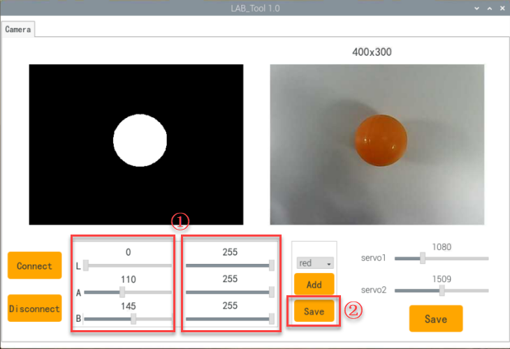
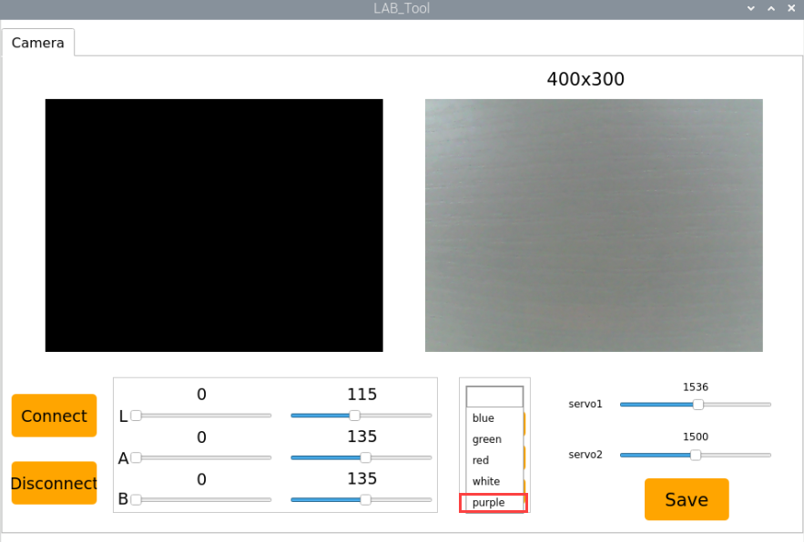
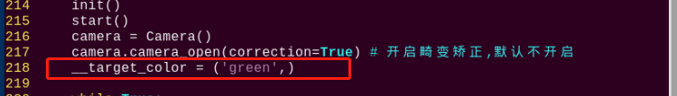
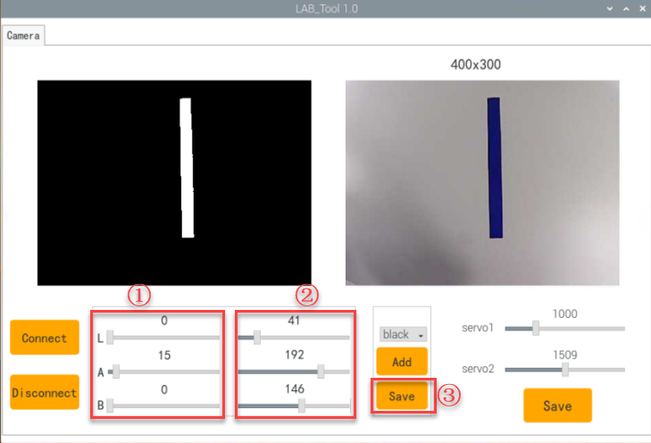

# 6. AI Vision Games Lesson

## 1. Single Color Recognition

In this section, the camera detects colors. When a red ball is recognized, the buzzer will emit a beep, and the red ball will be highlighted in the transmitted image with "Color: red" displayed.

### 1.1 Program Description

The implementation of color recognition consists of two parts: color detection and execution feedback after recognition.

First, for the color detection part, Gaussian filtering is applied to the image to reduce noise. The Lab color space is then used to convert the color of the object (you can learn more about the Lab color space in the "[OpenCV Vision Basic Course]()" section of the tutorial materials). 

Next, the object's color within the circle is recognized using color thresholding, followed by masking (masking involves using selected images, shapes, or objects to globally or locally obscure the image being processed). 

After performing morphological operations such as opening and closing on the object image, the object with the largest contour is circled. 

Opening: The image undergoes erosion followed by dilation. This operation removes small objects, smooths shape boundaries, and preserves the area. It can eliminate small noise particles and separate connected objects.  

Closing: The image undergoes dilation followed by erosion. This operation fills small holes within objects, connects nearby objects, closes broken contour lines, and smooths boundaries while preserving the area.

After recognition, the servo and buzzer are set up to provide feedback based on the detected color. For example, when red is detected, the buzzer will emit a sound.

For detailed feedback behavior, please refer to section 3. Function Implementation of this document.

### 1.2 Start and Close the Game

:::{Note}
The input command is case-sensitive, and keywords can be auto-completed using the Tab key.
:::

(1) Power on the robot and use VNC Viewer to connect to the remote desktop.


(2) Click the  in the top left corner of the system desktop or press the shortcut "**Ctrl+Alt+T**" to open the LX terminal.


(3) Execute the command to navigate to the directory where the program is located, then press Enter: 

```bash
cd spiderpi/functions
```

(4) Enter the command and press Enter to start the program:

```bash
python3 color_recognition.py
```

(5) To close the program, simply press "**Ctrl+C**" in the LX terminal. If it does not close, press it multiple times.

### 1.3 Program Outcome

After starting the game, the camera will be used to detect colors. When a red ball is recognized, the buzzer will emit a beep sound, and the ball will be circled in the transmitted image, with "Color: red" printed.

:::{Note}
* During the recognition process, ensure the environment is well-lit to avoid inaccurate recognition due to poor lighting conditions.
* Ensure that no objects with similar or matching colors to the target are present in the background within the camera's visual range, as this may cause misrecognition.
* If color recognition is inaccurate, refer to the section "" in this document to adjust the color threshold settings.
:::

### 1.4 Program Analysis

The source code of this program is saved in: [/home/pi/SpiderPi/function/color_recognition.py]()

**1.4.1 Import Function Library**

{lineno-start=1}

```python
import sys
import cv2
import math
import time
import threading
import numpy as np
from common import misc
from common import yaml_handle
from calibration.camera import Camera
from sensor.ultrasonic_sensor import Ultrasonic
```

(1) Import Libraries for OpenCV, Time, Math, and Threading .To use functions from a library, we can call them with the syntax:

**library_name.function_name(parameter1, parameter2, ...)**  

{lineno-start=199}

```python
time.sleep(0.01)
```

For example, to call the `sleep` function from the `time` library, we use: 
In Python, several libraries like `time`, `cv2`, and `math` are built-in and can be directly imported and used. You can also create your own libraries, like the "yaml_handle" file-reading library mentioned above.

(2) Some library names can be long and hard to remember. To simplify function calls, we often instantiate libraries. For example: 

{lineno-start=12}

```python
from calibration.camera import Camera
```

After instantiating the library, we can call functions from the `Board` library using the shorter syntax: 

Board.function_name(parameter1, parameter2, ...)

This makes it much easier and more convenient to use.

**1.4.2 Main Function Analysis**

In a Python program, the `if __name__ == '__main__':` block represents the main function of the program.

**(1) Reading Camera Image**

{lineno-start=186}

```python
camera = Camera()
```

When the game is started, the video stream is captured and stored in the variable `cap`.

**(2) Image Processing**

Once an image is captured, the `run()` function is called to process the image.

{lineno-start=189}

```python
while True:
    img = camera.frame
    if img is not None:
        frame = img.copy()
        Frame = run(frame)
        cv2.imshow('Frame', Frame)
        key = cv2.waitKey(1)
        if key == 27:
            break
```

① The function `img.copy()` creates a copy of the contents of `img` into `frame`.

② The `run()` function processes the image.

{lineno-start=108}

```python
def run(img):
    global draw_color
    global color_list
    global detect_color
    global action_finish

    img_copy = img.copy()
    img_h, img_w = img.shape[:2]

    if not __isRunning:
        return img

    frame_resize = cv2.resize(img_copy, size, interpolation=cv2.INTER_NEAREST)
    frame_gb = cv2.GaussianBlur(frame_resize, (3, 3), 3)      
    frame_lab = cv2.cvtColor(frame_gb, cv2.COLOR_BGR2LAB)  # 将图像转换到LAB空间(convert the image to LAB space)
```

**(3) Image resizing: This operation resizes the image to facilitate processing.**

{lineno-start=119}


```python
frame_resize = cv2.resize(img_copy, size, interpolation=cv2.INTER_NEAREST)
```

The first argument `img_copy` is the input image.

The second argument `size` is the desired output image size, which can be customized.

The third argument `interpolation=cv2.INTER_NEAREST` specifies the interpolation method. 

Options include:

`INTER_NEAREST`: Nearest neighbor interpolation.

`INTER_LINEAR`: Bilinear interpolation (default if no method is specified).

`INTER_CUBIC`: Bicubic interpolation using a 4x4 neighborhood of pixels.

`INTER_LANCZOS4`: Lanczos interpolation using an 8x8 neighborhood of pixels.

**(4) Gaussian Filtering**

To remove noise from the image, Gaussian filtering is applied. This filter smooths the image to improve feature visibility.

{lineno-start=120}

```python
frame_gb = cv2.GaussianBlur(frame_resize, (3, 3), 3)  
```

The first argument `frame_resize` is the input image.

The second argument `(3, 3)` specifies the size of the Gaussian kernel.

The third argument `3` is the standard deviation of the Gaussian kernel in the X direction.

**(5) Color Space Conversion:** 

The image is converted to the LAB color space using the function `cv2.cvtColor()`, which performs color space transformation.

{lineno-start=121}

```python
frame_lab = cv2.cvtColor(frame_gb, cv2.COLOR_BGR2LAB)  # 将图像转换到LAB空间(convert the image to LAB space)
```

The first argument `frame_gb` is the input image.

The second argument `cv2.COLOR_BGR2LAB` specifies the conversion from BGR to LAB. To convert to RGB, use `cv2.COLOR_BGR2RGB`.

**(6) Thresholding:** 

The image is converted to a binary image, which contains only 0s and 1s, simplifying the image and reducing the data volume for easier processing.

This is done using the `cv2.inRange()` function.

{lineno-start=131}

```python
frame_mask = cv2.inRange(frame_lab,
                         (lab_data[i]['min'][0],
                          lab_data[i]['min'][1],
                          lab_data[i]['min'][2]),
                         (lab_data[i]['max'][0],
                          lab_data[i]['max'][1],
                          lab_data[i]['max'][2]))  #对原图像和掩模进行位运算(perform bitwise operation to original image and mask)
```

The first argument `frame_lab` is the input image.

The second argument `(lab_data[i]['min'][0], lab_data[i]['min'][1], lab_data[i]['min'][2])` defines the lower bound of the color threshold.

The third argument `(lab_data[i]['max'][0], lab_data[i]['max'][1], lab_data[i]['max'][2])` defines the upper bound of the color threshold.

**(7) Morphological Operations (Erosion and Dilation):** 

Erosion and dilation operations are performed to reduce interference and smooth the image. These operations are commonly used in image processing to remove small noise, separate and identify objects, and adjust the image size.

{lineno-start=138}

```python
eroded = cv2.erode(frame_mask, cv2.getStructuringElement(cv2.MORPH_RECT, (3, 3)))  #腐蚀(erode)
dilated = cv2.dilate(eroded, cv2.getStructuringElement(cv2.MORPH_RECT, (3, 3))) #膨胀(dilate)
```

The first argument is the input image.

The second argument is the structuring element (kernel), which determines the nature of the operation. The size and shape of the kernel define the degree of erosion and dilation.

**(8) Contour Detection**

After image processing, the contours of the detected objects are extracted using the `cv2.findContours()` function.

{lineno-start=142}

```python
contours = cv2.findContours(dilated, cv2.RETR_EXTERNAL, cv2.CHAIN_APPROX_NONE)[-2]  #找出轮廓(find contours)
```

The first argument `dilated` is the input image.

The second argument `cv2.RETR_EXTERNAL` specifies the contour retrieval mode.

The third argument `cv2.CHAIN_APPROX_NONE)[-2]` is the contour approximation method.

The largest contour is selected based on area. A minimum area threshold is set to ignore smaller contours, ensuring only relevant contours are considered.

{lineno-start=143}

```python
areaMaxContour, area_max = get_area_max_contour(contours)  #找出最大轮廓(find the largest contour)
if areaMaxContour is not None:
    if area_max > max_area:#找最大面积(find the maximum area)
        max_area = area_max
        color_area_max = i
        areaMaxContour_max = areaMaxContour
```

**(9) Displaying the Processed Image**

```python
frame = img.copy()
Frame = run(frame)
cv2.imshow('Frame', Frame)
key = cv2.waitKey(1)
if key == 27:
    break
```

The `cv2.imshow()` function is used to display the image in a window. `"Frame"` is the window name and also the image content.

To ensure the image is displayed, `cv2.waitKey()` must follow. If not included, the image will not be shown.

**1.4.3 Driving the Buzzer**

{lineno-start=91}

```python
board.set_buzzer(2400, 0.1, 0.2, 1)
time.sleep(0.2)
```

The function `set_buzzer()` is used to activate the buzzer. 

The `time.sleep(0.1)` function introduces a delay, and `0.2` specifies the duration of the buzzer sound.

### 1.5 Function Extensions

**1.5.1 Adjusting Color Thresholds**

The color recognition program is pre-configured to recognize three colors: red, green, and blue. By default, the program identifies red, triggering the buzzer to emit a beep and drawing a circle around the red ball in the transmitted image, displaying "Color: red."

To change the recognized color to green, follow these steps:

(1) Enter the following command and press Enter to navigate to the source code directory:

```bash
cd spiderpi/functions
```

(2) Then, enter the following command and press Enter to open the program file:

```bash
sudo vim color_recognition.py
```

(3) Locate the code shown in the image below:


(4) Press the "**i**" key on the keyboard to enter edit mode.


(5) Replace "**red**" (highlighted in red in the image) with "**green**," as shown in the image below:


(6) To save your changes, press the "**Esc**" key, then type "**:wq**" (note the colon before "wq") and press Enter to save and exit.


(7) Enter the following command and press Enter to start the color recognition functionality: 

```bash
sudo python3 color_recognition.py
```

## 2. Color Recognition

SpiderPi will nod when it recognizes a red ball placed in front of the camera, and it will shake its head when it recognizes a blue or green ball placed in front of the camera.

### 2.1 Program Description

Human eyes can easily distinguish different colors in the world. How can robots recognize object colors? With camera vision module, SpiderPi can recognize different colors visually.

First, program SpiderPi to recognize colors with Lab color space. Convert the RGB color space to Lab, image binarization, and then perform operations such as expansion and corrosion to obtain an outline containing only the target color. Use circles to frame the color outline to realize object color recognition.

Secondly, judge the recognized color. If the sett color is detected the head servo will be turned up and down, otherwise it will be turned left and right.

### 2.2 Start and Close the Game

:::{Note}
The input command is case-sensitive, and keywords can be auto-completed using the Tab key.
:::

(1) Power on the robot and use VNC Viewer to connect to the remote desktop.


(2) Click the  in the top left corner of the system desktop or press the shortcut "**Ctrl+Alt+T**" to open the LX terminal.

(3) Execute the command to navigate to the directory where the program is located, then press Enter: 

```bash
cd spiderpi/functions
```

(4) Enter the command and press Enter to start the program:

```bash
python3 color_detect.py
```

(5) To close the program, simply press "**Ctrl+C**" in the LX terminal. If it does not close, press it multiple times.

### 2.3 Project Outcome

:::{Note}
The default color is red. If you want to change to blue or green, please refer to "4.1 Modify Default Recognition Color".
:::

Place the red ball in front of SpiderPi's camera and SpiderPi will nod its head when red ball is recognized. It will shake head is the green and blue balls are detected.

### 2.4 Program Analysis

The source code of the program is located in：[/home/pi/spiderpi/functions/color_detect.py]()

**2.4.1 Import Function Library**

{lineno-start=4}

```python
import sys
import cv2
import math
import time
import threading
import numpy as np
from common import misc
from common import yaml_handle
from calibration.camera import Camera
from sensor.ultrasonic_sensor import Ultrasonic
```

(1) Import the libraries related to OpenCV, time, math, and threads. If want to call a function in library, you can use `library name+function name (parameter, parameter)`. For example:

{lineno-start=273}

```python
time.sleep(0.01)
```

(2) Call `sleep` function in `time` library. The function `sleep ()` is used to delay. There are some built-in libraries in Python, so they can be called directly. 

For example, `time`, `cv2` and `math`. You can also write a new library like `yaml_handle`.
The name of function library is too long to memorize. For calling function easily, the library can be instantiated. For example:

The name of function library is too long to memorize. For calling function easily, the library can be instantiated. For example:

{lineno-start=249}

```python
from common.ros_robot_controller_sdk import Board
board = Board()
```

After instantiating, you can directly input and call the function `Board.function name (parameter, parameter)`.

**2.4.2 Main Function Analysis**

The python program `__name__ == '__main__:'` is the main function of program. Firstly, the function `init()` is called to initialize. The initialization in this program includes: return the servo to the initial position, read the color threshold file. Generally there are also configurations for ports, peripherals, timing interrupts, etc., which are all done in the process of initialization.

{lineno-start=248}

```python
if __name__ == '__main__':
    from common.ros_robot_controller_sdk import Board

    board = Board()
    ultrasonic = Ultrasonic()
```

**(1) Read the Captured Image**

{lineno-start=263}

```python
while True:
    img = camera.frame
```

When the the game is started, store the image in `img`.

**(2) Enter Image Processing**

The function `img.copy()` is used to copy the content of `img` to `frame`.

```python
img = camera.frame
if img is not None:
    frame = img.copy()
    Frame = run(frame)
```

① The function `img.copy()` is used to copy the content of `img` to `frame`.

② The function `run()` is used to process image.

{lineno-start=166}

```python
def run(img):
    global draw_color
    global color_list
    global detect_color
    global action_finish

    img_copy = img.copy()
    img_h, img_w = img.shape[:2]

    if not __isRunning:
        return img

    frame_resize = cv2.resize(img_copy, size, interpolation=cv2.INTER_NEAREST)
    frame_gb = cv2.GaussianBlur(frame_resize, (3, 3), 3)      
    frame_lab = cv2.cvtColor(frame_gb, cv2.COLOR_BGR2LAB)  # 将图像转换到LAB空间(convert the image to LAB space)

    max_area = 0
    color_area_max = None    
    areaMaxContour_max = 0

    if action_finish:
        for i in lab_data:
            if i != 'black' and i != 'white':
                frame_mask = cv2.inRange(frame_lab,
                                         (lab_data[i]['min'][0],
                                          lab_data[i]['min'][1],
                                          lab_data[i]['min'][2]),
                                         (lab_data[i]['max'][0],
                                          lab_data[i]['max'][1],
                                          lab_data[i]['max'][2]))  #对原图像和掩模进行位运算(perform bitwise operation to original image and mask)
                eroded = cv2.erode(frame_mask, cv2.getStructuringElement(cv2.MORPH_RECT, (3, 3)))  #腐蚀(erode)
                dilated = cv2.dilate(eroded, cv2.getStructuringElement(cv2.MORPH_RECT, (3, 3))) #膨胀(dilate)
                if debug:
                    cv2.imshow(i, dilated)
                    contours = cv2.findContours(dilated, cv2.RETR_EXTERNAL, cv2.CHAIN_APPROX_NONE)[-2]  #找出轮廓(find contours)
                    areaMaxContour, area_max = get_area_max_contour(contours)  #找出最大轮廓(find the largest contour)
                    if areaMaxContour is not None:
                        if area_max > max_area:#找最大面积(find the maximum area)
```

**(3) Image Resizing Process**

{lineno-start=178}

```python
frame_resize = cv2.resize(img_copy, size, interpolation=cv2.INTER_NEAREST)
```

The first parameter `img_copy` is the input image. 
The second parameter `size` is the size of the output image. The size can be set based on you own needs.
The third parameter `interpolation=cv2.INTER_NEAREST` is interpolation method. `INTER_NEAREST` is the nearest Neighbour Interpolation. `INTER_LINEAR` is the Bilinear Interpolation. If the last parameter is not modified, this method `INTER_LINEAR` will be used by default. `INTER_CUBIC`: Bicubic interpolation within a 4x4 pixel neighborhood. `INTER_LANCZOS4`: Lanczos interpolation within an 8x8 pixel neighborhood.

**(4) Gaussian filter**

Noise is always present in image to influence the image quality to weaken the features. Select the filter methods according to the different noises and the command method includes Gaussian filter, Median filtering, Mean filter, etc. Gaussian filter is a linear filter also smooths an image and reduces noise, which is widely used in processing image to eliminate noise.

{lineno-start=196}

```python
eroded = cv2.erode(frame_mask, cv2.getStructuringElement(cv2.MORPH_RECT, (3, 3)))  #腐蚀(erode)
```

The first parameter `frame_resize` is the input image. 

The second parameter `(3, 3)` is the kernel size. 

The third parameter `3` is the Gaussian kernel sigma value on x direction.

**(5) Covert to Color Space**

Use function `cv2.cvtColor()` to convert image to LAB space.

{lineno-start=196}

```python
eroded = cv2.erode(frame_mask, cv2.getStructuringElement(cv2.MORPH_RECT, (3, 3)))  #腐蚀(erode)
```

The first parameter `frame_gb` is the input image. 

The second parameter `cv2.COLOR_BGR2LAB` is the conversion format. `cv2.COLOR_BGR2LAB` can be used to convert used to change the BGR color space to LAB color space. When code is `cv2.COLOR_BGR2RGB` , BGR is converted to RGB.

**(6) Threshold Processing**

Thresholding can be used to create binary images, only 0 and 1. The image can be small size for better processing. Use `inRange()` function in cv2 library is used to process image with thresholding method.

{lineno-start=189}

```python
frame_mask = cv2.inRange(frame_lab,
                         (lab_data[i]['min'][0],
                          lab_data[i]['min'][1],
                          lab_data[i]['min'][2]),
                         (lab_data[i]['max'][0],
                          lab_data[i]['max'][1],
                          lab_data[i]['max'][2]))  #对原图像和掩模进行位运算(perform bitwise operation to original image and mask)
```

The first parameter `frame_lab` is the input image. 

The second parameter `(lab_data[i]['min'][0],lab_data[i]['min'] [1],lab_data[i]['min'][2])` is the lower limit of color threshold. 

The third parameter `(lab_data[i]['max'][0],lab_data[i]['max'] [1],lab_data[i]['max'][2])` is the upper limit of color threshold.

**(7) Erosion and Dilation**

Take the code `eroded = cv2.erode(frame_mask, cv2.getStructuringElement(cv2.MORPH_RECT, (3, 3))` as an example, the meanings of the parameters in the parenthesis are shown below:

{lineno-start=196}

```python
eroded = cv2.erode(frame_mask, cv2.getStructuringElement(cv2.MORPH_RECT, (3, 3)))  #腐蚀(erode)
dilated = cv2.dilate(eroded, cv2.getStructuringElement(cv2.MORPH_RECT, (3, 3))) #膨胀(dilate)
```

The first parameter `frame_lab` is the input image. 

The second parameter `(lab_data[i]['min'][0],lab_data[i]['min'] [1],lab_data[i]['min'][2])` is the lower limit of color threshold. 

The third parameter `(lab_data[i]['max'][0],lab_data[i]['max'] [1],lab_data[i]['max'][2])` is the upper limit of color threshold.

**(8) Erosion and Dilation**

Take the code `eroded = cv2.erode(frame_mask, cv2.getStructuringElement(cv2.MORPH_RECT, (3, 3))` as an example, the meanings of the parameters in the parenthesis are shown below:

{lineno-start=196}

```python
                eroded = cv2.erode(frame_mask, cv2.getStructuringElement(cv2.MORPH_RECT, (3, 3)))  #腐蚀(erode)
                dilated = cv2.dilate(eroded, cv2.getStructuringElement(cv2.MORPH_RECT, (3, 3))) #膨胀(dilate)contours = cv2.findContours(dilated, cv2.RETR_EXTERNAL, cv2.CHAIN_APPROX_NONE)[-2]  #找出轮廓(find contours)
```

The first parameter `frame_mask` is the input image. 

The second parameter `cv2.getStructuringElement(cv2.MORPH_RECT, (2, 2))` is the  structural element or kernel that determines the nature of the operation. The first parameter in the parentheses is the shape of the kernel, and the second parameter is the size of the kernel.

The `dilate()` function is used to perform the dilation operation on an image. The meaning of the parameters in the parentheses of this function is the same as that of the `erode()` function.

**(9) Find the Largest Contour**

After completing the above processing, use the function `findContours()` in cv2 library to obtain the contour of the recognized target.

{lineno-start=201}

```python
areaMaxContour, area_max = get_area_max_contour(contours)  #找出最大轮廓(find the largest contour)
if areaMaxContour is not None:
    if area_max > max_area:#找最大面积(find the maximum area)
        max_area = area_max
        color_area_max = i
        areaMaxContour_max = areaMaxContour
```

{lineno-start=43}

```python
def get_area_max_contour(contours):
    contour_area_temp = 0
    contour_area_max = 0

    area_max_contour = None
    max_area = 0

    for c in contours:  # 历遍所有轮廓(iterate through all contours)
        contour_area_temp = math.fabs(cv2.contourArea(c))  # 计算轮廓面积(calculate the contour area)
        if contour_area_temp > contour_area_max:
            contour_area_max = contour_area_temp
            if contour_area_temp >= 100:  # 只有在面积大于设定时，最大面积的轮廓才是有效的，以过滤干扰(Only the contour with the area larger than 300, which is greater than 300, is considered valid to filter out disturbance)
                area_max_contour = c
                max_area = contour_area_temp

                return area_max_contour, max_area  # 返回最大的轮廓, 面积(return the largest contour and its area)
```

**(10) Determine Maximum Color**

{lineno-start=214}

```python
if color_area_max == 'red':  #红色最大(red is the maximum)
    color = 1
elif color_area_max == 'green':  #绿色最大(green is the maximum)
    color = 2
elif color_area_max == 'blue':  #蓝色最大(blue is the maximum)
    color = 3
else:
    color = 0
    color_list.append(color)

    if len(color_list) == 3:  #多次判断(multiple judgements)
        # 取平均值(get mean)
        color = int(round(np.mean(np.array(color_list))))
        color_list = []
        if color == 1:
            detect_color = 'red'
            draw_color = range_rgb["red"]
        elif color == 2:
            detect_color = 'green'
            draw_color = range_rgb["green"]
        elif color == 3:
            detect_color = 'blue'
            draw_color = range_rgb["blue"]
        else:
            detect_color = 'None'
            draw_color = range_rgb["black"]               
        else:
            detect_color = 'None'
            draw_color = range_rgb["black"]
```

**(11) Display the Transmitted Image**

```python
Frame = run(frame)
cv2.imshow('Frame', Frame)
key = cv2.waitKey(1)
if key == 27:
    break
```

The function `cv2.imshow()` is used to display an image in a window. `frame` is the name of the window, and `Frame` is the content to be displayed. It is important to include `cv2.waitKey()` after this function, otherwise the image won't be displayed. 

The function `cv2.waitKey()` is used to wait for a key input, and the parameter `1` is the delay time.

**2.4.3 Subthread Analysis**

Run the `move()` function of the SpiderPi as a subthread. When a color is recognized, the `move()` function is executed. 

The function mainly involves processing the image results, making a judgment, and executing different feedback accordingly.

{lineno-start=112}

```python
def move():
    global draw_color
    global detect_color
    global action_finish

    while True:
        if debug:
            return
        if __isRunning:
            if detect_color != 'None':
                action_finish = False
                if detect_color == 'red':
                    board.pwm_servo_set_position(0.2, [[1, 1200]])
                    time.sleep(0.2)
                    board.pwm_servo_set_position(0.2, [[1, 1800]])
                    time.sleep(0.2)
                    board.pwm_servo_set_position(0.2, [[1, 1200]])
                    time.sleep(0.2)
                    board.pwm_servo_set_position(0.2, [[1, 1800]])
                    time.sleep(0.2)
                    board.pwm_servo_set_position(0.2, [[1, 1500]])
                    time.sleep(0.1)
                    detect_color = 'None'
                    draw_color = range_rgb["black"]                    
                    time.sleep(1)
                elif detect_color == 'green' or detect_color == 'blue':
                    board.pwm_servo_set_position(0.2, [[2, 1200]])
                    time.sleep(0.2)
                    board.pwm_servo_set_position(0.2, [[2, 1800]])
                    time.sleep(0.2)
                    board.pwm_servo_set_position(0.2, [[2, 1200]])
                    time.sleep(0.2)
                    board.pwm_servo_set_position(0.2, [[2, 1800]])
                    time.sleep(0.2)
                    board.pwm_servo_set_position(0.2, [[2, 1500]])
                    time.sleep(0.1)
                    detect_color = 'None'
                    draw_color = range_rgb["black"]                    
                    time.sleep(1)
                else:
                    time.sleep(0.01)                
                action_finish = True                
                detect_color = 'None'
            else:
               time.sleep(0.01)
        else:
            time.sleep(0.01)
```

**(1) Pan-tilt Servo Movement Execution**

Determine if the recognized color matches the set color, and perform a nod or shake head motion accordingly.

{lineno-start=123}

```python
if detect_color == 'red':
    board.pwm_servo_set_position(0.2, [[1, 1200]])
    time.sleep(0.2)
    board.pwm_servo_set_position(0.2, [[1, 1800]])
    time.sleep(0.2)
    board.pwm_servo_set_position(0.2, [[1, 1200]])
    time.sleep(0.2)
    board.pwm_servo_set_position(0.2, [[1, 1800]])
    time.sleep(0.2)
    board.pwm_servo_set_position(0.2, [[1, 1500]])
    time.sleep(0.1)
    detect_color = 'None'
    draw_color = range_rgb["black"]                    
    time.sleep(1)
elif detect_color == 'green' or detect_color == 'blue':
    board.pwm_servo_set_position(0.2, [[2, 1200]])
    time.sleep(0.2)
    board.pwm_servo_set_position(0.2, [[2, 1800]])
    time.sleep(0.2)
    board.pwm_servo_set_position(0.2, [[2, 1200]])
    time.sleep(0.2)
    board.pwm_servo_set_position(0.2, [[2, 1800]])
    time.sleep(0.2)
    board.pwm_servo_set_position(0.2, [[2, 1500]])
    time.sleep(0.1)
    detect_color = 'None'
    draw_color = range_rgb["black"]                    
    time.sleep(1)
```

The function `Board.setPWMServoPulse()` controls a single servo. Take the code `Board.setPWMServoPulse(1, 1800, 200)` as an example:

The first parameter `1` is the servo ID.

The second parameter `1800` is the pulse width of servo.

The third parameter `200` is the runtime in the unit of milliseconds.

### 2.5 Function Extension

**2.5.1 Modify Default Recognition Color**

Red, green and blue are the built-in colors in the color recognition program and the red is the default color. If it is recognized, SpiderPi will nod.

In the following steps, we're going to modify the recognized color as green. The specific modification steps are as follows: 

(1) Enter command to navigate to the directory where the game program is located, and press "**Enter**".

```bash
cd spiderpi/functions/
```

(2) Enter command  to go into the game program through vim editor.

```bash
vim color_detect.py
```

(3) Input "**126**" and press "**shift+g**" to the line for modification.


(4) Press "**i**" to enter the editing mode, then modify red in "**if detect_color == 'red'**" to green. And enter "**red**" instead of "**green**" in 140 line (elif detect_color== 'green' or detect_color == 'blue'). 

Same modify method if you want to recognize blue.


(5) Press "**Esc**" to enter last line command mode. Input "**:wq**" to save the file and exit the editor.

```bash
:wq
```

**2.5.2 Add Recognized Color**

In addition to the built-in recognized colors, you can set other recognized colors in the programming. Take orange as example: 

(1) Open VNC, input command to  open Lab color setting document.

```bash
vim /home/pi/spiderpi/config/lab_config.yaml
```

It is recommended to use screenshot to record the initial value.


(2) Click the debugging tool icon in the system desktop. Choose "**Run**" in the pop-up window.


(3) Click "**Connect**" button in the lower left hand. When the interface display the camera returned image, the connection is successful. Select "**red**" in the right box first. 	


(4) Drag the corresponding sliders of L, A, and B until the color area to be recognized in the left screen becomes white and other areas become black.Point the camera at the color you want to recognize. For example, if you want to recognize orange, you can put the orange ball in the camera's field of view. Adjust the corresponding sliders of L, A, and B until the orange part of the left screen becomes white and other colors become black, and then click " **Save**" button to keep the modified data.



(5) For the game's performance, it's recommended to use the LAB_Tool tool to modify the value back to the initial value after the modification is completed.

```bash
vim /home/pi/spiderpi/config/lab_config.yaml
```

For the game's performance, it's recommended to use the LAB_Tool tool to modify the value back to the initial value after the modification is completed.

(6) Check the data in red frame. If the edited value was written in the program, press "**Esc**" and enter "**:wq**" to save it and exit.

```bash
:wq
```

(7) The default recognized color can be set as red according to the "4.1Modify Default Recognition Color" in this text.


(8) Start the game again and put the orange object in front of the camera. SpiderPi will nod the head when the color is recognized. 

## 3.Target Position Recognition

In this lesson, the camera will be used to recognize red, green, and blue balls. The detected balls will be highlighted in the live feed, and their XY coordinates will be displayed.

### 3.1 Program Description

The implementation of target tracking can be divided into two parts: color recognition and position marking.

First, for the color recognition part, Gaussian filtering is applied to the image for noise reduction. The Lab color space is then used to convert the color of the objects (for more details on the Lab color space, please refer to the "[OpenCV Vision Basic Course]()").

Next, color thresholding is used to identify the color of objects within the circle. The image is then masked (masking involves using a selected image, shape, or object to globally or locally occlude the processed image).

After performing morphological operations (open and close operations) on the object's image, the largest contour is outlined with a circle.

Opening operation: The image is eroded first and then dilated. This operation is used to remove small objects, smooth shape boundaries, and preserve the overall area. It helps remove small noise particles and separate objects that are connected.

Closing operation: The image is dilated first and then eroded. This operation is used to fill small holes within the objects, connect adjacent objects, and reconnect broken contour lines while smoothing the boundaries without changing the area.

Position marking requires specific detection algorithms. The basic principle is to search for areas in the image that match predefined features or patterns, then return the position and bounding box of these areas.

### 3.2 Start and Close the Game

:::{Note}
The input of commands must strictly distinguish between uppercase and lowercase letters, as well as spaces. Additionally, you can use the "Tab" key on the keyboard to auto-complete keywords.
:::

(1) Power on the robot and use VNC Viewer to connect to the remote desktop.


(2) Click the in the top left corner of the system desktop or press the shortcut "**Ctrl+Alt+T**" to open the LX terminal.


(3) In the terminal, enter the command to navigate to the directory where the program is located, then press Enter:

```bash
cd spiderpi/functions
```

(4) Enter the command and press Enter to start the program:

```bash
python3 color_position_recognition.py
```

(5) To close the program, simply press "**Ctrl+C**" in the LX terminal. If it does not close, press it multiple times.

### 3.3 Program Outcome

The program defaults to recognizing red, green, and blue balls. After recognition, it will highlight the objects in the transmitted image and display their XY coordinates.

:::{Note}

* During the recognition process, ensure the environment is well-lit to avoid inaccurate recognition due to lighting issues.
* Ensure there are no objects with similar or identical colors to the target colors within the camera's field of view to prevent misrecognition.
* If color recognition is inaccurate, refer to the section [3.4 Function Extension/ 3.4.1 Adjusting Color Threshold](#anchor_3_5_1) in this document to adjust the color threshold settings.

:::

### 3.4 Promgram Analysis

The source code for this program is located at：[/home/pi/spiderpi/functions/color_position_recognition.py]()

**3.4.1 Importing Libraries**

{lineno-start=4}

```python
import sys
import cv2
import math
import time
from common import misc
from common.pid import PID
from common import yaml_handle
from calibration.camera import Camera 
from sensor.ultrasonic_sensor import Ultrasonic
```

(1) Import the necessary libraries, including OpenCV, time, math, threading, and inverse kinematics. To call a function from a library, use the format `LibraryName.FunctionName(Parameters)`. For example:

{lineno-start=189}

```python
time.sleep(0.01)
```

This calls the `sleep` function from the `time` library, which is used for adding delays.
Python comes with several built-in libraries like `time`, `cv2`, `math`, which can be imported directly. You can also create your own libraries, such as the "yaml_handle" file reading library.

(2) Instantiating Libraries  

{lineno-start=168}

```python
    from common.ros_robot_controller_sdk import Board
```

Sometimes, library names are long and hard to remember. To make function calls more convenient, we often instantiate libraries using shorter names. For example:

**3.4.2 Main Function Analysis**

In a Python program, the `if __name__ == '__main__':` block indicates the main function. The program starts by opening the camera and reading the video stream. The `read()` method captures each frame of the image, where the program searches for and marks the color of the ball, then displays the result. The video is displayed through a loop, and once the display is finished, the `release()` function is called to release the resources.

{lineno-start=167}

```python
if __name__ == '__main__':

    from common.ros_robot_controller_sdk import Board

    board = Board()
    ultrasonic = Ultrasonic()

    debug = False
    if debug:
        print('Debug Mode')

        init()
        start()
        camera = Camera()
        camera.camera_open(correction=True) # 开启畸变矫正,默认不开启(enable the distortion correction which is not started by default)
```

**(1) Capturing Camera Image**

{lineno-start=176}

```python
camera = Camera()
```

When the program starts, the camera is initialized.

**(2) Image Processing**

① The `run()` function handles image processing.

{lineno-start=183}

```python
Frame = run(frame) 
```

{lineno-start=85}

```python
def run(img):
    global x_dis, y_dis

    img_copy = img.copy()
    img_h, img_w = img.shape[:2]

    if not __isRunning or __target_color == ():
        return img

    cv2.line(img, (int(img_w/2 - 10), int(img_h/2)), (int(img_w/2 + 10), int(img_h/2)), (0, 255, 255), 2)
    cv2.line(img, (int(img_w/2), int(img_h/2 - 10)), (int(img_w/2), int(img_h/2 + 10)), (0, 255, 255), 2)

    img_hisEqul = his_hqul_color(img_copy)

    frame_resize = cv2.resize(img_hisEqul, size, interpolation=cv2.INTER_NEAREST)
    frame_gb = cv2.GaussianBlur(frame_resize, (5, 5), 5)   
    frame_lab = cv2.cvtColor(frame_gb, cv2.COLOR_BGR2LAB)  # 将图像转换到LAB空间(convert the image to LAB space)
```

② Resize the image to make it easier to process.

{lineno-start=95}

```python
frame_resize = cv2.resize(img_hisEqul, size, interpolation=cv2.INTER_NEAREST)
```

The first parameter `img_copy` is the input image.
The second parameter `size` is the size of the output image, which can be set as needed.
The third parameter `interpolation=cv2.INTER_NEAREST` is the interpolation method. Options include:
`INTER_NEAREST`: Nearest-neighbor interpolation.
`INTER_LINEAR`: Bilinear interpolation (default if no other method is specified).
`INTER_CUBIC`: Bicubic interpolation in a 4x4 pixel neighborhood.
`INTER_LANCZOS4`: Lanczos interpolation in an 8x8 pixel neighborhood.	

**(3) Apply Gaussian Blur to reduce noise**

Gaussian blur is a linear smoothing filter used to eliminate Gaussian noise and is widely used in image denoising.

{lineno-start=96}

```python
frame_gb = cv2.GaussianBlur(frame_resize, (5, 5), 5)
```

The first parameter `frame_resize` is the input image.
The second parameter `(3, 3)` is the size of the Gaussian kernel.
The third parameter `3` is the standard deviation of the Gaussian kernel in the X-direction.

**(4) Convert the image to LAB color space**

{lineno-start=97}

```python
frame_lab = cv2.cvtColor(frame_gb, cv2.COLOR_BGR2LAB)  # 将图像转换到LAB空间(convert the image to LAB space)
```

The first parameter `frame_gb` is the input image.
The second parameter `cv2.COLOR_BGR2LAB` specifies the conversion from BGR to LAB format. To convert to RGB, use `cv2.COLOR_BGR2RGB`.

(5) Convert the image to a binary image with only 0s and 1s, simplifying the image and reducing data for easier processing.

The `cv2.inRange()` function is used for binarization:

{lineno-start=106}

```python
frame_mask = cv2.inRange(frame_lab,
                         (lab_data[i]['min'][0],
                          lab_data[i]['min'][1],
                          lab_data[i]['min'][2]),
                         (lab_data[i]['max'][0],
                          lab_data[i]['max'][1],
                          lab_data[i]['max'][2]))  #对原图像和掩模进行位运算(perform bitwise operation to original image and mask)
```

The first parameter `frame_lab` is the input image.
The second parameter `(lab_data[i]['min'][0], lab_data[i]['min'][1], lab_data[i]['min'][2])` is the lower threshold for the color.
The third parameter `(lab_data[i]['max'][0], lab_data[i]['max'][1], lab_data[i]['max'][2])` is the upper threshold for the color.

**(6) Perform erosion and dilation to smooth the image and reduce interference**

{lineno-start=113}

```python
eroded = cv2.erode(frame_mask, cv2.getStructuringElement(cv2.MORPH_RECT, (3, 3)))  #腐蚀(erode)
dilated = cv2.dilate(eroded, cv2.getStructuringElement(cv2.MORPH_RECT, (3, 3))) #膨胀(dilate)
```

Erosion reduces the size of foreground objects and eliminates small objects, while dilation increases the size of foreground objects and fills small holes.

**(7) Find the contour with the largest area**

After the image processing steps, use the `cv2.findContours()` function to find contours:

{lineno-start=117}

```python
contours = cv2.findContours(dilated, cv2.RETR_EXTERNAL, cv2.CHAIN_APPROX_NONE)[-2]  # 找出轮廓(find contours)
```

The first parameter `dilated` is the input image.

The second parameter `cv2.RETR_EXTERNAL` specifies the contour retrieval mode.

The third parameter `cv2.CHAIN_APPROX_NONE)[-2]` specifies the contour approximation method.

The program searches for the largest contour and sets a threshold area to ensure the detected contour is valid.

{lineno-start=118}

```python
areaMaxContour, area_max = get_area_max_contour(contours)  #找出最大轮廓(find the largest contour)
if areaMaxContour is not None:
    if area_max > max_area:#找最大面积(find the maximum area)
        max_area = area_max
        color_area_max = i
        areaMaxContour_max = areaMaxContour
    if max_area > 100:  # 有找到最大面积(the maximum area has been found)
```

**(8) Extract the position information**

Use `cv2.putText()` to draw text on the image:

{lineno-start=162}

```python
cv2.putText(img, "Color: " + detect_color, (10, img.shape[0] - 10), cv2.FONT_HERSHEY_SIMPLEX, 0.65, draw_color, 2)
```

The first parameter `img` is the input image.

The second parameter `"Color: " + detect_color` is the text to display (e.g., the detected color).

The third parameter `(10, img.shape[0] - 10)` and `(centerX, centerY - 20)` specify the starting coordinates for the text (bottom-left position).

The fourth parameter `cv2.FONT_HERSHEY_SIMPLEX` specifies the font type.

The fifth parameter `0.65` is the scaling factor for the font size.

The sixth parameter `draw_color` is the color of the text.

The seventh parameter `2` specifies the thickness of the text line.

**(9) Displaying the Return Image**

{lineno-start=179}

```python
while True:
    img = camera.frame
    if img is not None:
        frame = img.copy()
        Frame = run(frame)
        cv2.imshow('Frame', Frame)
        key = cv2.waitKey(1)
        if key == 27:
            break
```

The `cv2.imshow()` function is used to display the image in a window. The first parameter is the window name (e.g., 'Frame'), and the second parameter is the image to display.  

The function `cv2.waitKey()` is used to wait for a key press; the parameter `1` specifies the delay time.

### 3.5 Function Extension

<p id="anchor_3_5_1"></p>

**3.5.1 Adjusting Color Threshold**

During the game experience, if the color recognition of objects is not accurate, you may need to adjust the color threshold. This section uses adjusting the red color as an example; the process for adjusting other colors is similar. Follow the steps below:

(1) Double-click the system desktop   and click "**Execute**" in the pop-up window.

(2) Once the interface opens, click "**Connect**".


（3) After a successful connection, select "red" from the color options in the bottom-right corner of the interface.


(4) If the transmitted image does not appear in the pop-up window, it indicates the camera is not connected properly. Check the camera connection cable to ensure it is securely connected.

The image on the right side of the interface shows the real-time transmitted video, and the left side shows the color to be captured.

Point the camera at the red color block, and then adjust the six sliders at the bottom to ensure that the red color block on the left side of the screen turns completely white, while other areas remain black.

Finally, click the "**Save**" button to save the data.


**3.5.2 Adding New Recognizable Colors**

In addition to the three built-in colors, you can add other recognizable colors. For example, let's add purple as a new recognizable color. Follow these steps:

(1) Double-click the system desktop   and click "**Execute**" in the pop-up window.

(2) In the pop-up interface, select "**Connect**".


(3) Click "**Add**" and give the new color a name (e.g., "purple"), then click "**OK**".


(4) Next, click the dropdown button in the color selection box and choose "**purple**".



(5) Point the camera at the purple object, and adjust the L, A, and B sliders until the purple area in the left-side image turns white, while the rest of the image turns black.


(6) Finally, click "**Save**" to save the adjusted color threshold.


(7) After completing the modifications, you can check if the new values have been successfully written by following these steps:Input the command and press Enter to go to the program directory.

```bash
cd spiderpi/config
```

(8) Then input the following command and press Enter to open the program file:

```bash
sudo vim lab_config.yaml
```

(9) In the opened color threshold program file, you can check the purple color threshold parameters.


(10) Find the code shown below.


(11) Manually add `'purple': (255, 255, 114)`, where `(255, 255, 114)` is the max value of the purple threshold you viewed in Step 9. The updated code should look like this:

## 4. Color Tracking

Place a green ball in front of the SpiderPi and move slowly. SpiderPi's head will rotate to follow its movement.

### 4.1 Program Description

First, program SpiderPi to recognize colors with Lab color space. Convert the RGB color space to Lab, image binarization, and then perform operations such as expansion and corrosion to obtain an outline containing only the target color. Use circles to frame the color outline to realize object color recognition.

Secondly, process the rotation and the x and y coordinates of the center point of the image are used as the set value. Input the current acquired x and y coordinates to update the PID.

Thirdly, calculate according to the image position feedback, and program the robot to achieve the function of color tracking.

### 4.2 Start and Close the Game

:::{Note}
Pay attention to the text format in the input of instructions.
:::

(1) Power on the robot and use VNC Viewer to connect to the remote desktop.

(2) Double-click  on the Raspberry Pi desktop to open the command line terminal.Enter the command and press "Enter" to navigate to the directory where the program is located.

```bash
cd spiderpi/functions/
```

(3) Input command, then press "**Enter**" to start the game.

```bash
python3 color_track.py
```

(4) If you want to exit the game programming, press "**Ctrl+C**" in the LX terminal interface. If the exit fails, please try it few more times.

### 4.3 Project Outcome

Start the color tracking game and place the green ball in front of the SpiderPi and move slowly. SpiderPi's head will rotate to follow the movement of the color ball.

### 4.4 Program Analysis

The source code of the program is located in：[/home/pi/spiderpi/functions/color_track.py]()

**4.4.1 Import Function Library**

{lineno-start=4}

```python
import sys
import cv2
import math
import time
from common import misc
from common.pid import PID
from common import yaml_handle
from calibration.camera import Camera 
from sensor.ultrasonic_sensor import Ultrasonic
import kinematics as kinematics

ik = kinematics.IK()
```

Import the libraries related to OpenCV, time, math, and threads. If want to call a function in library, you can use "library name+function name (parameter, parameter)". For example:

{lineno-start=199}

```python
time.sleep(0.02)
```

Call `sleep` function in `time` library. The function `sleep ()` is used to delay. There are some built-in libraries in Python, so they can be called directly. For example, `time`, `cv2` and `math`. You can also write a new library like `yaml_handle`.

The name of function library is too long to memorize. For calling function easily, the library can be instantiated. For example:

```python
import HiwonderSDK.Board as Board
```

After instantiating, you can directly input and call the function `Board.function name (parameter, parameter)`.

**4.4.2 Main Function Analysis**

The python program `__name__ == '__main__:'` is the main function of program. Firstly, the function `init()` is called to initialize. The initialization in this program includes: return the servo to the initial position, read the color threshold file. Generally there are also configurations for ports, peripherals, timing interrupts, etc., which are all done in the process of initialization.

After the initialization is completed, set the default tracking color to red and start the robot following.

{lineno-start=203}

```python
if __name__ == '__main__':
    import HiwonderSDK.Sonar as Sonar
    from CaneraCalibration.CalibrationConfig import *
	
    # 加载参数
    param_data = np.load(calibration+param_path + '.npz')
```

**(1) Read the Captured Image**

{lineno-start=221}

```python
while True:
    img = my_canera.frame
```

When the the game is started, store the image in `img`.

**(2) Enter Image Processing**

When the captured image is read, call `run` function to process the image.

{lineno-start=223}

```python
if img is not None:
    frame = img.copy()
    frame = cv2.reamap(frame, mapx, mapy, cv2.INTER_LINEAR) # 畸变矫正
```

① The function `img.copy()` is used to copy the content of `img` to `frame`.

② The function `run()` is used to process image.

{lineno-start=133}

```python
def run(img):
    global x_dis, y_dis

    img_copy = img.copy()
    img_h, img_w = img.shape[:2]

    if not __isRunning or __target_color == ():
        return img

    cv2.line(img, (int(img_w/2 - 10), int(img_h/2)), (int(img_w/2 + 10), int(img_h/2)), (0, 255, 255), 2)
    cv2.line(img, (int(img_w/2), int(img_h/2 - 10)), (int(img_w/2), int(img_h/2 + 10)), (0, 255, 255), 2)

    img_hisEqul = his_hqul_color(img_copy)

    frame_resize = cv2.resize(img_hisEqul, size, interpolation=cv2.INTER_NEAREST)
    frame_gb = cv2.GaussianBlur(frame_resize, (5, 5), 5)   
    frame_lab = cv2.cvtColor(frame_gb, cv2.COLOR_BGR2LAB)  # 将图像转换到LAB空间(convert the image to LAB space)

    area_max = 0
    areaMaxContour = 0
    for i in lab_data:
        if i in __target_color:
            detect_color = i
            frame_mask = cv2.inRange(frame_lab,
                                     (lab_data[i]['min'][0],
                                      lab_data[i]['min'][1],
                                      lab_data[i]['min'][2]),
                                     (lab_data[i]['max'][0],
                                      lab_data[i]['max'][1],
                                      lab_data[i]['max'][2]))  #对原图像和掩模进行位运算(perform bitwise operation to original image and mask)
            eroded = cv2.erode(frame_mask, cv2.getStructuringElement(cv2.MORPH_RECT, (3, 3)))  #腐蚀(erode)
            dilated = cv2.dilate(eroded, cv2.getStructuringElement(cv2.MORPH_RECT, (3, 3))) #膨胀(dilate)
            if debug:
                cv2.imshow(i, dilated)
                contours = cv2.findContours(dilated, cv2.RETR_EXTERNAL, cv2.CHAIN_APPROX_NONE)[-2]  # 找出轮廓(find contours)
                areaMaxContour, area_max = get_area_maxContour(contours)  # 找出最大轮廓(find the largest contour)
```

**(3) Image Resizing Process**

{lineno-start=147}

```python
frame_resize = cv2.resize(img_hisEqul, size, interpolation=cv2.INTER_NEAREST)
```

The first parameter `img_hisEqul` is the input image. 
The second parameter `size` is the size of the output image. The size can be set based on you own needs.
The third parameter `interpolation=cv2.INTER_NEAREST` is interpolation method. `INTER_NEAREST` is the nearest Neighbour Interpolation. `INTER_LINEAR` is the Bilinear Interpolation. If the last parameter is not modified, this method `INTER_LINEAR` will be used by default. `INTER_CUBIC`: Bicubic interpolation within a 4x4 pixel neighborhood. `INTER_LANCZOS4`: Lanczos interpolation within an 8x8 pixel neighborhood.

**(4) Gaussian filter**

Noise is always present in image to influence the image quality to weaken the features. Select the filter methods according to the different noises and the command method includes Gaussian filter, Median filtering, Mean filter, etc. Gaussian filter is a linear filter also smooths an image and reduces noise, which is widely used in processing image to eliminate noise.

{lineno-start=148}

```python
frame_gb = cv2.GaussianBlur(frame_resize, (5, 5), 5)   
```

The first parameter `frame_resize` is the input image. 

The second parameter `(5, 5)` is the kernel size. 

The third parameter `5` is the Gaussian kernel sigma value on x direction.

**(5) Covert to Color Space**
Use function `cv2.cvtColor()` to convert image to LAB space.

{lineno-start=149}

```python
frame_lab = cv2.cvtColor(frame_gb, cv2.COLOR_BGR2LAB)  # 将图像转换到LAB空间(convert the image to LAB space)
```

The first parameter `frame_gb` is the input image. 
The second parameter `cv2.COLOR_BGR2LAB` is the conversion format. `cv2.COLOR_BGR2LAB` can be used to convert used to change the BGR color space to LAB color space. When code is `cv2.COLOR_BGR2RGB` , BGR is converted to RGB.

**(6) Threshold Processing**

Thresholding can be used to create binary images, only 0 and 1. The image can be small size for better processing. Use `inRange()` function in cv2 library is used to process image with thresholding method.

{lineno-start=156}

```python
frame_mask = cv2.inRange(frame_lab,
                         (lab_data[i]['min'][0],
                          lab_data[i]['min'][1],
                          lab_data[i]['min'][2]),
                         (lab_data[i]['max'][0],
                          lab_data[i]['max'][1],
                          lab_data[i]['max'][2]))  #对原图像和掩模进行位运算(perform bitwise operation to original image and mask)
```

The first parameter `frame_lab` is the input image. 
The second parameter `(lab_data[i]['min'][0],lab_data[i]['min'] [1],lab_data[i]['min'][2])` is the lower limit of color threshold. 
The third parameter `(lab_data[i]['max'][0],lab_data[i]['max'] [1],lab_data[i]['max'][2])` is the upper limit of color threshold.

**(7) Erosion and Dilation**

Take the code `eroded = cv2.erode(frame_mask, cv2.getStructuringElement(cv2.MORPH_RECT, (3, 3))` as an example, the meanings of the parameters in the parenthesis are shown below:

{lineno-start=163}

```python
eroded = cv2.erode(frame_mask, cv2.getStructuringElement(cv2.MORPH_RECT, (3, 3)))  #腐蚀(erode)
dilated = cv2.dilate(eroded, cv2.getStructuringElement(cv2.MORPH_RECT, (3, 3))) #膨胀(dilate)
```

The first parameter `frame_mask` is the input image. 
The second parameter `cv2.getStructuringElement(cv2.MORPH_RECT, (2, 2))` is the  structural element or kernel that determines the nature of the operation. The first parameter in the parentheses is the shape of the kernel, and the second parameter is the size of the kernel.
The `dilate()` function is used to perform the dilation operation on an image. The meaning of the parameters in the parentheses of this function is the same as that of the `erode()` function.

**(8) Find the Largest Contour**

After completing the above processing, use the function `findContours()` in cv2 library to obtain the contour of the recognized target.

{lineno-start=167}

```python
contours = cv2.findContours(dilated, cv2.RETR_EXTERNAL, cv2.CHAIN_APPROX_NONE)[-2]  # 找出轮廓(find contours)
```

The first parameter `dilated` is the input image. 
The second parameter `cv2.RETR_EXTERNAL` is the contour retrieval method. 
The third parameter `cv2.CHAIN_APPROX_NONE)[-2]` is the contour approximation method. 
Find the largest contour in obtained contours. To avoid interference, set a minimum value and the target contour is effective when the area is greater than the set value.

{lineno-start=168}

```python
areaMaxContour, area_max = get_area_maxContour(contours)  # 找出最大轮廓(find the largest contour)

if area_max > 50:  # 有找到最大面积(the maximum area has been found)
```

**(9) Obtain location information**

Calculate and draw the center points of three rectangles, and use the `line_centerx` variable to determine the deviation of SpiderPi.

{lineno-start=171}

```python
(centerX, centerY), radius = cv2.minEnclosingCircle(areaMaxContour) #获取最小外接圆(the minimum bounding rectangle)
centerX = int(misc.map(centerX, 0, size[0], 0, img_w))
centerY = int(misc.map(centerY, 0, size[1], 0, img_h))
radius = int(misc.map(radius, 0, size[0], 0, img_w))
cv2.circle(img, (int(centerX), int(centerY)), int(radius), range_rgb[detect_color], 2)
```

**(10) Display Transmitted Image**

{lineno-start=225}

```python
Frame = run(frame)           
cv2.imshow('Frame', Frame)
key = cv2.waitKey(1)
if key == 27:
    break
```

The function `cv2.imshow()` is used to display an image in a window. "'frame'" is the name of the window, and "'Frame'" is the content to be displayed. It is important to include `cv2.waitKey()` after this function, otherwise the image won't be displayed. 
The function `cv2.waitKey()` is used to wait for a key input, and the parameter "1" is the delay time.

**4.5.3 Subthread Analysis**

When the color is recognized, the program will control the camera of pan-tilt to track. 
The pan-tilt tracking uses a PID algorithm to move the camera center closer to the target center coordinates. 
The PID algorithm is the most widely used type of automatic controller. In process control, it is controlled based on the proportion (P), integral (I), and derivative (D) of the error.

{lineno-start=177}

```python
# use_time = 0
x_pid.SetPoint = img_w/2  #设定(set)
x_pid.update(centerX)  #当前(current)
dx = int(x_pid.output)
# use_time = abs(dx*0.00025)
x_dis += dx  #输出(output)

x_dis = 500 if x_dis < 500 else x_dis          
x_dis = 2500 if x_dis > 2500 else x_dis

y_pid.SetPoint = img_h/2
y_pid.update(centerY)
dy = int(y_pid.output)
# use_time = round(max(use_time, abs(dy*0.00025)), 5)
y_dis += dy

y_dis = 1000 if y_dis < 1000 else y_dis
y_dis = 2000 if y_dis > 2000 else y_dis    

if not debug:
    board.pwm_servo_set_position(0.02, [[1, y_dis], [2, x_dis]])

    time.sleep(0.02)
```

Taking `Board.setPWMServoPulse(1, y_dis, 20)` as an example of pan-tilt tracking, the meanings of the parameters in the parentheses are as follows:
The first parameter `1` refers to the servo ID, which is servo No.1.
The second parameter `y_dis` refers to the pulse width of the servo. The pulse width range of servo No.1 is 1200 to 1900.
The third parameter `20` refers to the running time of the servo.
### 4.5 Function Extension

**4.5.1 Modify Default Recognition Color**

Blue and green are the built-in colors in the color tracking program and green is the default color. In the following steps, we're going to modify the tracking color as blue.

(1) Enter command to the directory where the game program is located.

```bash
cd spiderpi/functions/
```

(2) Enter command to go into the game program through vim editor.

```bash
vim color_track.py
```

(3) Input "**218**" and press "**shift+g**" to the line for modification.



(4) Press "**i**" to enter the editing mode, then modify green in (_target_color = ('green')) to blue.


5. Press "**Esc**" to enter last line command mode. Input "**:wq**" to save the file and exit the editor.

```bash
:wq
```

**4.5.2 Add New Recognition Color**

In addition to the built-in recognized colors, you can set other tracking colors in the programming. For a better experience, please avoid adding red as the recognition color. Take orange as example: 

(1) Open VNC, input command  to open Lab color setting document.

```bash
vim /home/pi/spiderpi/config/lab_config.yaml
```

It is recommended to use screenshot to record the initial value.


(2) Click the debugging tool icon in the system desktop. Choose "**Run**" in the pop-up window.


(3) Click "**Connect**" button in the lower left hand. When the interface display the camera returned image, the connection is successful. Select "**green**" in the right box first. 


(4) Drag the corresponding sliders of L, A, and B until the color area to be recognized in the left screen becomes white and other areas become black.

Point the camera at the color you want to recognize. For example, if you want to recognize orange, you can put the orange in the camera's field of view. Adjust the corresponding sliders of L, A, and B until the orange part of the left screen becomes white and other colors become black, and then click " Save" button to keep the modified data.


(5) After the modification is completed, check whether the modified data was successfully written in. Enter the command again to check the color setting parameters.

```bash
vim /home/pi/spiderpi/config/lab_config.yaml
```


For the game's performance, it's recommended to use the LAB_Tool tool to modify the value back to the initial value after the modification is completed.

(6) Check the data in red frame. If the edited value was written in the program, press "**Esc**" and enter "**:wq**" to save it and exit.

```bash
:wq
```

(7) The default tracking color can be set as green according to the "4.1Modify Default Recognition Color" in this text.

```python
_target_color = ('green',)
```

(8) Starting the game again, SpiderPi's head will rotate to follow the movement of target object. If you want to add other colors as recognizable color, please operate as the above steps.

## 5. Line Following

Place the robot on top of the black line, and SpiderPi can move forward along the direction of the black track.

### 5.1 Program Description

Line tracking is common in robot competitions which is implemented by two-channel or four-channel line-tracking sensors.However, SpiderPi only need the vision module to recognize the line color, process by image algorithms, to realize the line follow.
First, program SpiderPi to recognize colors with Lab color space. Convert the RGB color space to Lab, image binarization, and then perform operations such as expansion and corrosion to obtain an outline containing only the target color. Use circles to frame the color outline to realize object color recognition.
Secondly, process the rotation and the x and y coordinates of the center point of the image are used as the set value. Input the current acquired x and y coordinates to update the PID.
Thirdly, calculate according to the feedback of the line position in the image, and program the robot to follow the line to achieve the function of intelligent line tracking.

### 5.2 Start and Close the Game

:::{Note}
Pay attention to the text format in the input of instructions.
:::

(1) Power on the robot and use VNC Viewer to connect to the remote desktop.

(2) Double-click  on the Raspberry Pi desktop to open the command line terminal.Enter the command and press "Enter" to navigate to the directory where the program is located.

```bash
cd spiderpi/functions/
```

(3) Input command, then press "**Enter**" to start the game.


```bash
python3 visual_patrol.py
```

(4) If you want to exit the game programming, press "**Ctrl+C**" in the LX terminal interface. If the exit fails, please try it few more times.

### 5.3 Project Outcome

:::{Note}
The default color is black. If you want to change to white or red, please refer to [5.5.1 Modify Default Tracking Color](#anchor_5_5_1).
:::

Lay the black tape and then place the robot on the line. SpiderPi will move along the black track.

### 5.4 Program Analysis

The source code of the program is located in：[/home/pi/spiderpi/functions/visual_patrol.py]()

**5.4.1 Import Function Library**

{lineno-start=4}

```python
import sys
import cv2
import time
import math
import threading
import numpy as np
from common import yaml_handle
from calibration.camera import Camera 
from common import kinematics
import numpy as np
from common import misc
from sensor.ultrasonic_sensor import Ultrasonic
```

(1) Import the libraries related to OpenCV, time, math, and threads. If want to call a function in library, you can use `library name+function name (parameter, parameter)`. For example:

{lineno-start=210}

```python
time.sleep(0.01)
```

Call `sleep` function in `time` library. The function `sleep ()` is used to delay. There are some built-in libraries in Python, so they can be called directly. For example, "time", "cv2" and "math". You can also write a new library like "yaml_handle".

The name of function library is too long to memorize. For calling function easily, the library can be instantiated. For example:

{lineno-start=189}

```python
    from common.ros_robot_controller_sdk import Board
```

After instantiating, you can directly input and call the function `Board.function name (parameter, parameter)`.

**5.4.2 Define Global Variables**

{lineno-start=18}

```python
if sys.version_info.major == 2:
    print('Please run this program with python3!')
    sys.exit(0)

lab_data = None
servo_data = None
def load_config():
    global lab_data, servo_data
    
    lab_data = yaml_handle.get_yaml_data(yaml_handle.lab_file_path)
    servo_data = yaml_handle.get_yaml_data(yaml_handle.servo_file_path)

load_config()

__target_color = ('red',)
```

**5.4.3 Main Function Analysis**

The python program `__name__ == '__main__:'` is the main function of program. Firstly, the function `init()` is called to initialize. The initialization in this program includes: return the servo to the initial position, read the color threshold file. Generally there are also configurations for ports, peripherals, timing interrupts, etc., which are all done in the process of initialization.

**(1) Read the Captured Image**

{lineno-start=200}

```python
whiole True:
    img = camera.frame
```

When the the game is started, store the image in `img`.

**(2) Enter Image Processing**

When the captured image is read, call `run` function to process the image.

{lineno-start=203}

```python
frame = img.copy()
frame = run(frame)
cv2.imshow('frame', frame)
```

① The function `img.copy()` is used to copy the content of "img" to "frame". 

② The function `run()` is used to process image.

{lineno-start=138}

```python
def run(img):
    global line_center
    global __target_color

    if not __isRunning or __target_color == ():
        return img

    frame_gb = cv2.GaussianBlur(img, (3, 3), 3)

    for r in roi:
        blobs = frame_gb[r[0]:r[1], r[2]:r[3]]
        frame_lab = cv2.cvtColor(blobs, cv2.COLOR_BGR2LAB)  # 将图像转换到LAB空间(convert the image to LAB space)

        for i in lab_data:
            if i in __target_color:
                detect_color = i
                frame_mask = cv2.inRange(frame_lab,
                                         (lab_data[i]['min'][0],
                                          lab_data[i]['min'][1],
                                          lab_data[i]['min'][2]),
                                         (lab_data[i]['max'][0],
                                          lab_data[i]['max'][1],
                                          lab_data[i]['max'][2]))  #对原图像和掩模进行位运算(perform bitwise operation to original image and mask)
                eroded = cv2.erode(frame_mask, cv2.getStructuringElement(cv2.MORPH_RECT, (3, 3)))  #腐蚀(erode)
                dilated = cv2.dilate(eroded, cv2.getStructuringElement(cv2.MORPH_RECT, (3, 3)))  #膨胀(dilate)
                cnts = cv2.findContours(dilated, cv2.RETR_EXTERNAL, cv2.CHAIN_APPROX_TC89_L1)[-2]  #找出所有轮廓(find all contours)
                cnt_large, area = get_area_maxContour(cnts)  #找到最大面积的轮廓(find the largest contour)
                if area > 10:
                    rect = cv2.minAreaRect(cnt_large)  #最小外接矩形(the minimum bounding rectangle)

                    box = np.intp(cv2.boxPoints(rect))  #最小外接矩形的四个顶点(the four corner points of the minimum bounding rectangle)
                    for j in range(4):
                        box[j, 1] = box[j, 1] + r[0]

                        cv2.drawContours(img, [box], -1, (0, 255, 255), 2)  #画出四个点组成的矩形形(draw the rectangle composed of the four points)

                        #获取矩形的对角点(obtain the diagonal points of the rectangle)
                        pt1_x, pt1_y = box[0, 0], box[0, 1]
                        pt3_x, pt3_y = box[2, 0], box[2, 1]
                        line_center_x, line_center_y = (pt1_x + pt3_x) / 2, (pt1_y + pt3_y) / 2  #中心点(center point)
                        cv2.circle(img, (int(line_center_x), int(line_center_y)), 5, (0, 0, 255), -1)  #画出中心点(draw the center point)
                        line_center = line_center_x
                    else:
                        if line_center != -2:
                            line_center = -1

                            return img
```

**(3) Gaussian filter**

Noise is always present in image to influence the image quality to weaken the features. Select the filter methods according to the different noises and the command method includes Gaussian filter, Median filtering, Mean filter, etc. Gaussian filter is a linear filter also smooths an image and reduces noise, which is widely used in processing image to eliminate noise.

{lineno-start=145}

```python
frame_gb = cv2.GaussianBlur(img, (3, 3), 3)
```

The first parameter `img` is the input image. 

The second parameter `(3, 3)` is the kernel size. 

The third parameter `3` is the Gaussian kernel sigma value on x direction.

**(4) Covert to Color Space**

Use function `cv2.cvtColor()` to convert image to LAB space.

{lineno-start=149}

```python
frame_lab = cv2.cvtColor(blobs, cv2.COLOR_BGR2LAB)  # 将图像转换到LAB空间(convert the image to LAB space)
```

The first parameter `blobs` is the input image. 

The second parameter `cv2.COLOR_BGR2LAB` is the conversion format. `cv2.COLOR_BGR2LAB` can be used to convert used to change the BGR color space to LAB color space. When code is `cv2.COLOR_BGR2RGB` , BGR is converted to RGB.

**(5) Threshold Processing**

Thresholding can be used to create binary images, only 0 and 1. The image can be small size for better processing. Use `inRange()` function in cv2 library is used to process image with thresholding method.

{lineno-start=154}

```python
frame_mask = cv2.inRange(frame_lab,
                         (lab_data[i]['min'][0],
                          lab_data[i]['min'][1],
                          lab_data[i]['min'][2]),
                         (lab_data[i]['max'][0],
                          lab_data[i]['max'][1],
                          lab_data[i]['max'][2]))  #对原图像和掩模进行位运算(perform bitwise operation to original image and mask)
```

The first parameter `frame_lab` is the input image. 

The second parameter `(lab_data[i]['min'][0],lab_data[i]['min'] [1],lab_data[i]['min'][2])` is the lower limit of color threshold. 

The third parameter `(lab_data[i]['max'][0],lab_data[i]['max'] [1],lab_data[i]['max'][2])` is the upper limit of color threshold.

**(6) Erosion and Dilation**

Take the code `eroded = cv2.erode(frame_mask, cv2.getStructuringElement(cv2.MORPH_RECT, (3, 3))` as an example, the meanings of the parameters in the parenthesis are shown below:

{lineno-start=161}

```python
eroded = cv2.erode(frame_mask, cv2.getStructuringElement(cv2.MORPH_RECT, (3, 3)))  #腐蚀(erode)
dilated = cv2.dilate(eroded, cv2.getStructuringElement(cv2.MORPH_RECT, (3, 3)))  #膨胀(dilate)
```

The first parameter `frame_mask` is the input image. 

The second parameter `cv2.getStructuringElement(cv2.MORPH_RECT, (2, 2))` is the  structural element or kernel that determines the nature of the operation. The first parameter in the parentheses is the shape of the kernel, and the second parameter is the size of the kernel.

The `dilate()` function is used to perform the dilation operation on an image. The meaning of the parameters in the parentheses of this function is the same as that of the `erode()` function.

**(7) Find the Largest Contour**

After completing the above processing, use the function `findContours()` in cv2 library to obtain the contour of the recognized target.

{lineno-start=163}

```python
cnts = cv2.findContours(dilated, cv2.RETR_EXTERNAL, cv2.CHAIN_APPROX_TC89_L1)[-2]  #找出所有轮廓(find all contours)
```

The first parameter `dilated` is the input image. 

The second parameter `cv2.RETR_EXTERNAL` is the contour retrieval method. 

The third parameter `cv2.CHAIN_APPROX_NONE)[-2]` is the contour approximation method. 

Find the largest contour in obtained contours. To avoid interference, set a minimum value and the target contour is effective when the area is greater than the set value.

{lineno-start=164}

```python
cnt_large, area = get_area_maxContour(cnts)  #找到最大面积的轮廓(find the largest contour)
if area > 10:
    rect = cv2.minAreaRect(cnt_large)  #最小外接矩形(the minimum bounding rectangle)

    box = np.intp(cv2.boxPoints(rect))  #最小外接矩形的四个顶点(the four corner points of the minimum bounding rectangle)
    for j in range(4):
        box[j, 1] = box[j, 1] + r[0]

        cv2.drawContours(img, [box], -1, (0, 255, 255), 2)  #画出四个点组成的矩形形(draw the rectangle composed of the four points)
```

{lineno-start=90}

```python
def get_area_maxContour(contours):
    contour_area_temp = 0
    contour_area_max = 0

    area_max_contour = None
    max_area = 0

    for c in contours:  # 历遍所有轮廓(traverse through all contours)
        contour_area_temp = math.fabs(cv2.contourArea(c))  # 计算轮廓面积(calculate contour area)
        if contour_area_temp > contour_area_max:
            contour_area_max = contour_area_temp
            if contour_area_temp >= 10:  # 只有在面积大于设定时，最大面积的轮廓才是有效的，以过滤干扰(Only when the area is greater than the set value, the contour with the maximum area is considered valid to filter out interference)
                area_max_contour = c
                max_area = contour_area_temp

                return area_max_contour, max_area  # 返回最大的轮廓(Return the largest contour)
```

Calculate and draw the center points of three rectangles, and use the "line_centerx" variable to determine the deviation of SpiderPi.

{lineno-start=174}

```python
#获取矩形的对角点(obtain the diagonal points of the rectangle)
pt1_x, pt1_y = box[0, 0], box[0, 1]
pt3_x, pt3_y = box[2, 0], box[2, 1]
line_center_x, line_center_y = (pt1_x + pt3_x) / 2, (pt1_y + pt3_y) / 2  #中心点(center point)
cv2.circle(img, (int(line_center_x), int(line_center_y)), 5, (0, 0, 255), -1)  #画出中心点(draw the center point)
line_center = line_center_x
else:
    if line_center != -2:
        line_center = -1
```

(8) Display Transmitted Image

{lineno-start=205}

```python
cv2.imshow('Frame', Frame)
key = cv2.waitKey(1)
if key == 27:
    break
```

The function `cv2.imshow()` is used to display an image in a window. `'frame'` is the name of the window, and `'Frame'` is the content to be displayed. It is important to include `cv2.waitKey()` after this function, otherwise the image won't be displayed. 

The function `cv2.waitKey()` is used to wait for a key input, and the parameter `1` is the delay time.

**5.4.4 Subthread Analysis**

Run the `move()` function of the SpiderPi as a subthread. When a color is recognized, the "move()" function is executed. 

The function mainly involves processing the image results, making a judgment, and executing different feedback accordingly, such as the control for the RGB LED and the buzzer.

{lineno-start=108}

```python
def move():
    global last_line_center
    global line_center

    while True:
        if __isRunning:
            if line_center >= 0:              
                if abs(line_center -img_center_x) < 60:
                    ik.go_forward(ik.initial_pos, 2, 60, 50, 1)
                elif line_center -img_center_x >= 60:
                    ik.turn_right(ik.initial_pos, 2, 30, 50, 1)
                else:
                    ik.turn_left(ik.initial_pos, 2, 30, 50, 1)
                last_line_center = line_center

            elif line_center == -1:
                if last_line_center >= img_center_x:
                    ik.turn_left(ik.initial_pos, 2, 30, 50, 1)
                else:
                    ik.turn_right(ik.initial_pos, 2, 30, 50, 1)
                    print(ik.turn_right)
        else:
            time.sleep(0.01)
```

The function `ik.go_forward()` controls the forward movement of SpiderPi. 

For example, in the code`ik.go_forward(ik.initial_pos, 2, 30, 50, 1)`: 

The first parameter `ik.initial_pos` is the initial posture of SpiderPi. 

The second parameter `2` is the motion mode of SpiderPi, where 2 is hexapod mode and 4 is quadruped mode. When in quadruped mode, the corresponding posture needs to be "initial_pos_quadruped". 

The third parameter `30` is the stride length in millimeters (or the turning angle in degrees when turning). 

The fourth parameter `50` is the speed in millimeters per second. 

The fifth parameter `1` is the number of executions, where 0 means infinite loops.

`ik.back()` controls the backward movement of SpiderPi. `Ik.turn_left()` controls the left turn of SpiderPi on the spot, where the third parameter is the turning angle. `ik.turn_right()` controls the right turn of SpiderPi on the spot, where the third parameter is the turning angle. `ik.left_move()` controls the left movement of SpiderPi. `ik.right_move()` controls the right movement of SpiderPi. `ik.stand()` controls the standing posture of SpiderPi.

 ### 5.5 Function Extension

<p id="anchor_5_5_1"></p>

**5.5.1 Modify Default Tracking Color**

Black, red and white are the built-in colors in the line follow program and black is the default color. In the following steps, we're going to modify the tracking color as white.

(1) Enter command to the directory where the game program is located.

```bash
cd spiderpi/functions/
```

(2) Enter command to go into the game program through vim editor.

```bash
vim visual_patrol.py
```

(3)  Input "**199**" and press "**shift+g**" to the line for modification.


(4) Press "**i**" to enter the editing mode, then modify black in `_target_color = ('black')` to white. If you want to recognize red, please revise to `red`.

 

(5) Press "**Esc**" to enter last line command mode. Input  to save the file and exit the editor.

```bash
:wq
```

**5.5.2 Add Tracking Color**

In addition to the built-in recognized colors, you can set other tracking colors in the programming. Take blue as example: 

(1) Open VNC, input command  to open Lab color setting document.

```bash
vim /home/pi/spiderpi/config/lab_config.yaml
```

It is recommended to use screenshot to record the initial value.


(2) Click the debugging tool icon in the system desktop. Choose "**Run**" in the pop-up window.


(3) Click "**Connect**" button in the lower left hand. When the interface display the camera returned image, the connection is successful. Select "**black**" in the right box first. 


(4) Drag the corresponding sliders of L, A, and B until the color area to be recognized in the left screen becomes white and other areas become black.
Point the camera at the color you want to recognize. For example, if you want to recognize blue, you can put the blue line in the camera's field of view. Adjust the corresponding sliders of L, A, and B until the orange part of the left screen becomes white and other colors become black, and then click " **Save**" button to keep the modified data.



For the game's performance, it's recommended to use the LAB_Tool tool to modify the value back to the initial value after the modification is completed.

(5) After the modification is completed, check whether the modified data was successfully written in.

```bash
vim /home/pi/spiderpi/config/lab_config.yaml
```

(6) Check the data in red frame. If the edited value was written in the program, press "Esc" and enter ":wq" to save it and exit.

```bash
:wq
```

(7) Set the default tracking color as black according to the [5.5.1Modify Default Tracking Color](#anchor_5_5_1) in below text.


(8) Starting the game again, SpiderPi will track along the blue line. If you want to add other colors as tracking color, please operate as the above steps.


## 6. Tag Detection

When the robot detects a tag, the buzzer emits a sound, and the feedback image is returned.

### 6.1 Program Description

AprilTag, a visual fiducial marker, is similar to a QR code or barcode. It can be used to quickly detect markers and calculate relative positions, meeting real-time requirements. It is widely used in various applications such as augmented reality (AR), robotics, and camera calibration. Currently, AprilTags can be printed using a standard printer, and their detection programs can calculate precise 3D position, orientation, and ID relative to the camera.

In this lesson, we will combine OpenCV with AprilTag to complete a small project for detecting AprilTag markers. When the camera detects the tag, the robot's onboard buzzer will sound as a prompt, and the feedback image will be displayed.

### 6.2 Start and Close the Game

:::{Note}
Pay attention to the text format in the input of instructions.
:::

(1) Power on the robot and use VNC Viewer to connect to the remote desktop.

(2) Double-click  on the Raspberry Pi desktop to open the command line terminal.Enter the command and press "Enter" to navigate to the directory where the program is located.

```bash
cd spiderpi/functions/
```

(3) Input command, then press "**Enter**" to start the game.

```bash
python3 apriltag_recognition.py
```

(4) If you want to exit the game programming, press "**Ctrl+C**" in the LX terminal interface. If the exit fails, please try it few more times.

### 6.3 Function Extension

:::{Note}
For optimal tag detection, place the tag against a solid-colored or white background. Dark backgrounds (e.g., black) may interfere with tag recognition.
:::

Once the game is activated, position the included AprilTag tag in front of the camera. When the robot detects the tag, the buzzer will sound as a prompt. The feedback image will display the captured tag, outline it, and show the tag's tag_id and tag_family information.

### 6.4 Program Analysis

The source code of the program is located in：[/home/pi/spiderpi/functions/apriltag_recognition.py]()

**(1) Image Acquisition and Processing**

The first step is image processing, which involves working with digital image data. We begin by importing the necessary packages.

{lineno-start=4}

```python
import sys
import math
import threading
import time
import cv2
import numpy as np
from common import yaml_handle
from calibration.camera import Camera 
from common import kinematics
import common.apriltag as apriltag
```

Next, we initialize and start the camera to acquire the image, then proceed to copy, remap, and display the image.

{lineno-start=95}

```py
while True:
    img = camera.frame
    if img is not None:
        frame = img.copy()
        Frame = run(frame)           
        cv2.imshow('Frame', Frame)
```

Afterward, we need to convert the image from RGB format to grayscale. The corresponding code is as follows:

{lineno-start=54}

```python
gray = cv2.cvtColor(img, cv2.COLOR_BGR2GRAY)
```

**(2) Tag Detection**

Once the image has been processed, we need to detect the tag. This is done by using the `tag` library to detect the tag in the acquired image. The code implementation is as follows:

{lineno-start=51}


```python
# 检测apriltag(detect apriltag)
detector = apriltag.Detector(searchpath=apriltag._get_demo_searchpath())
```

After detection, the program will obtain the four corner points of the tag.

{lineno-start=59}

```python
corners = np.rint(detection.corners)  # 获取四个角点(obtain the four corner points)
```

Next, we need to draw the contours of the tag. In OpenCV, we use the `cv2.drawContours` function to accomplish this. The program code is as follows:

{lineno-start=60}

```python
cv2.drawContours(img, [np.array(corners, np.intp)], -1, (0, 255, 255), 2)
```

This function takes five parameters, each with the following meanings:

① `img`: The image to be processed.

② `[np.array(corners, np.int)]`: The contour points.

③` -1`: The contour index. -1 indicates that all contours should be drawn.

④ `(0, 255, 255)`: The color of the contour.

⑤ `2`: The thickness of the contour line.

(3) Retrieving Tag Information

The program uses the AprilTag library to perform encoding and decoding to retrieve the tag's information. Depending on the encoding method, different inner point coordinates are generated.

Once the quadrilateral is identified, the grid coordinates are clarified. To verify the reliability of the encoding, the tag must be matched against a known encoding library.

{lineno-start=62}

```python
tag_family = str(detection.tag_family, encoding='utf-8')  # 获取tag_family(obtain tag_family)
tag_id = int(detection.tag_id)  # 获取tag_id(obtain tag_id)

object_center_x, object_center_y = int(detection.center[0]), int(detection.center[1])  # 中心点(center point)

object_angle = int(math.degrees(math.atan2(corners[0][1] - corners[1][1], corners[0][0] - corners[1][0])))  # 计算旋转角(calculate rotation angle)

return tag_family, tag_id
```

## 7. Tag Recognition

SpiderPi executes corresponding actions by recognizing tags with camera.

### 7.1 Program Description

AprilTag, a visual positioning marker, can quickly detect the marker and calculate the position. It's mainly applied to AR, robot and camera calibration, etc. 

First, detect AprilTag through positioning, image segmentation, and contour search. Then the quadrilateral detection is performed after the contour is positioned. Connect the four corner points with a straight line to form a closed loop. Encoding and decoding the detected tags. Finally, add the corresponding execution action according to the decoding tags with different IDs.

### 7.2 Start and Close the Game

:::{Note}
Pay attention to the text format in the input of instructions.
:::

(1) Power on the robot and use VNC Viewer to connect to the remote desktop.

(2) Double-click  on the Raspberry Pi desktop to open the command line terminal.Enter the command and press "Enter" to navigate to the directory where the program is located.

```bash
cd spiderpi/functions/
```

(3) Input command, then press "**Enter**" to start the game.


```bash
python3 apriltag_detect.py
```

(4) If you want to exit the game programming, press "**Ctrl+C**" in the LX terminal interface. If the exit fails, please try it few more times.

### 7.3 Project Outcome

:::{Note}
Please run this game on a solid color or a white background. Dark background such as black will affect the tag recognition performance.
:::

After starting the tag recognition, place the tag cards in front of the camera to recognize in turns. SpiderPi will execute the corresponding actions when the tag is recognized.

| **Tag ID** | **A**ction |
| :--------: | :--------: |
|     1      |    wave    |
|     2      |  stepping  |
|     3      |   Twist    |

### 7.4 Program Analysis

The source code of the program is located in：[/home/pi/spiderpi/functions/apriltag_detect.py]()

**7.4.1 Import Function Library**

{lineno-start=4}

```py
import sys
import math
import threading
import time
import cv2
import numpy as np
from common import yaml_handle
from calibration.camera import Camera 
from common import kinematics
import common.apriltag as apriltag
```

(1) Import the libraries related to OpenCV, time, math, and threads. If want to call a function in library, you can use `library name+function name (parameter, parameter)`. For example:

{lineno-start=185}

```python
time.sleep(0.01)
```

Call `sleep` function in `time` library. The function `sleep ()` is used to delay. There are some built-in libraries in Python, so they can be called directly. For example, `time`, `cv2` and `math`. You can also write a new library like `yaml_handle`.

(2) Instantiate Function Library

The name of function library is too long to memorize. For calling function easily, the library can be instantiated. For example:

{lineno-start=159}

```python
from common.ros_robot_controller_sdk import Board
```

After instantiating, you can directly input and call the function "Board.function name (parameter, parameter)".

(3) Main Function Analysis

The python program `"__name__ == '__main__:'"` is the main function of program. Firstly, the function "init()" is called to initialize. The initialization in this program includes: return the servo to the initial position, read the color threshold file. Generally there are also configurations for ports, peripherals, timing interrupts, etc., which are all done in the process of initialization.
After the initialization is completed, set the default tracking color to red and start the robot following.

{lineno-start=158}

```python
if __name__ == '__main__':
    from common.ros_robot_controller_sdk import Board
    from sensor.ultrasonic_sensor import Ultrasonic
    from common.action_group_controller import ActionGroupController
    board = Board()
    ik = kinematics.IK(board)  # 实例化逆运动学库(instantiate inverse kinematics library)
    ultrasonic = Ultrasonic()
    AGC = ActionGroupController(board)
```

**(4) Enter Image Processing**

① Initialize Functions and Variables.

{lineno-start=15}

```python
debug = False
#HWSONAR = None

if sys.version_info.major == 2:
    print('Please run this program with python3!')
    sys.exit(0)

lab_data = None
servo_data = None
def load_config():
    global lab_data, servo_data
    
    lab_data = yaml_handle.get_yaml_data(yaml_handle.lab_file_path)
    servo_data = yaml_handle.get_yaml_data(yaml_handle.servo_file_path)

load_config()

# 初始位置(initial position)
def initMove():
    ultrasonic.setRGBMode(0)
    ultrasonic.setRGB(1, (0, 0, 0))
    ultrasonic.setRGB(2, (0, 0, 0)) 

    board.pwm_servo_set_position(0.5, [[1, 1500] , [2, servo_data['servo2']]])

tag_id = None
__isRunning = False
action_finish = True
# 变量重置(reset variables)
def reset():      
    global tag_id
    global action_finish
    
    tag_id = 0
    action_finish = True
```

② Obtain Corner Point Information

Call the `np.rint()` function to obtain the four corner points of the tag.

{lineno-start=115}

```python
# 检测apriltag(detect apriltag)
detector = apriltag.Detector(searchpath=apriltag._get_demo_searchpath())
def apriltagDetect(img):   
    gray = cv2.cvtColor(img, cv2.COLOR_BGR2GRAY)
    detections = detector.detect(gray, return_image=False)

    if len(detections) != 0:
        for detection in detections:                       
            corners = np.rint(detection.corners)  # 获取四个角点(obtain the four corner points)
            cv2.drawContours(img, [np.array(corners, np.intp)], -1, (0, 255, 255), 2)

            tag_family = str(detection.tag_family, encoding='utf-8')  # 获取tag_family(obtain tag_family)
            tag_id = int(detection.tag_id)  # 获取tag_id(obtain tag_id)

            object_center_x, object_center_y = int(detection.center[0]), int(detection.center[1])  # 中心点(center point)
            
            object_angle = int(math.degrees(math.atan2(corners[0][1] - corners[1][1], corners[0][0] - corners[1][0])))  # 计算旋转角(calculate rotation angle)
            
            return tag_family, tag_id
            
    return None, None
```

③ Detect Tag

After the information of corner points is obtained, call `drawContours()` function in cv2 library to control SpiderPi to recognize the tag.

{lineno-start=124}

```python
cv2.drawContours(img, [np.array(corners, np.intp)], -1, (0, 255, 255), 2)
```

The meaning of the parameters in the function parentheses is as follows:

The first parameter `img` is the input image.

The second parameter `[np.array(corners, np.int)]` is the contour itself, which is a list in Python.

The third parameter `-1` is the index of the contour, and the numerical value represents drawing all the contours in the list.

The fourth parameter `(0, 255, 255)` is the contour color, in the order of B, G, R, which is yellow in this case.

The fifth parameter `2` is the contour width.

(5) Obtain the tag ID (tag_id)

{lineno-start=126}

```python
tag_family = str(detection.tag_family, encoding='utf-8')  # 获取tag_family(obtain tag_family)
tag_id = int(detection.tag_id)  # 获取tag_id(obtain tag_id)
```

Call the `putText()` function in cv2 library to display the ID and type of the tag in the live camera feed.

{lineno-start=150}

```python
cv2.putText(img, "tag_id: None", (10, img.shape[0] - 30), cv2.FONT_HERSHEY_SIMPLEX, 0.65, [0, 255, 255], 2)
```

The meaning of the parameters in the function parentheses is as follows:

The first parameter `img` is the input image.

The second parameter `str(tag_id)` is the content to be displayed.

The third parameter `(10, img.shape[0] - 30)` is the display position.

The fourth parameter `cv2.FONT_HERSHEY_SIMPLEX` is the font type.

The fifth parameter `0.65` is the font size.

The sixth parameter `[0, 255, 255]` is the font color, in the order of B, G, R, which is yellow in this case.

The seventh parameter `2` is the font thickness.

**(6) Action Control**

After the tag ID is obtained, call `runActionGroup()` function in the `ActionGroupControl` library. This allows SpiderPi to perform corresponding actions.

{lineno-start=76}

```python
def move():
    global tag_id
    global action_finish  
    
    while True:
        if debug:
            return
        if __isRunning:
            if tag_id is not None:
                action_finish = False
                time.sleep(0.5)
                if tag_id == 1:               
                    AGC.run_action('wave')#招手(wave)
                    tag_id = None
                    time.sleep(1)                  
                    action_finish = True                
                elif tag_id == 2:                    
                    AGC.run_action('stepping')#原地踏步(stepping)
                    tag_id = None
                    time.sleep(1)
                    action_finish = True          
                elif tag_id == 3:                   
                    AGC.run_action('twist_l')#扭腰(twist)
                    tag_id = None
                    time.sleep(1)
                    action_finish = True
                else:
                    action_finish = True
                    time.sleep(0.01)
            else:
               time.sleep(0.01)
        else:
            time.sleep(0.01)
```

## 8. Face Recognition

The robot will perform a greeting action upon recognizing a face through the camera.

### 8.1 Program Description

Face recognition is one of the most widely used applications in artificial intelligence, particularly in image recognition. Among these applications, face recognition is the most popular, often used in scenarios like smart locks and facial unlocking on mobile phones.  

In this activity, we first train the face recognition model. The system then detects faces by scaling the image. After detection, the coordinates of the recognized face are converted back to the original scale, and the largest face is identified. The recognized face is then outlined with a frame.  

Next, the pan-tilt servos are set to rotate left and right to locate the face. Finally, the robot executes the feedback action based on the recognition results.

### 8.2 Start and Close the Game

:::{Note}
Pay attention to the text format in the input of instructions.
:::

(1) Power on the robot and use VNC Viewer to connect to the remote desktop.

(2) Double-click  on the Raspberry Pi desktop to open the command line terminal.Enter the command and press "Enter" to navigate to the directory where the program is located.

```bash
cd spiderpi/functions/
```

(3) Input command, then press "**Enter**" to start the game.


```bash
python3 face_recongition.py
```

(4) If you want to exit the game programming, press "**Ctrl+C**" in the LX terminal interface. If the exit fails, please try it few more times.

### 8.3 Project Outcome

\:::{Note}
For optimal performance, please avoid using this activity under strong lighting conditions, such as direct sunlight or close proximity to incandescent lights, as intense light can affect face recognition accuracy. It is recommended to conduct this activity indoors, with the face positioned within a range of 50 cm to 1 meter from the camera.
:::

The robot will perform a greeting action upon recognizing a face through the camera.

### 8.4 Program Analysis

The source code of the program is located in：[/home/pi/spiderpi/functions/face_recongition.py]()

**8.4.1 Function Logic**

**(1) Importing Libraries**

At this initialization step, necessary libraries are imported to facilitate future function calls within the program.

{lineno-start=4}

```python
import sys
import cv2
import time
import sys
import threading
import mediapipe as mp
from common import yaml_handle
from calibration.camera import Camera 
from common.action_group_controller import ActionGroupController
from common.ros_robot_controller_sdk import Board
from calibration.camera import Camera 
from common import kinematics
```

**(2) Setting Initial State**

{lineno-start=19}

```python
debug = False
iHWSONAR = None
board = None
if sys.version_info.major == 2:
    print('Please run this program with python3!')
    sys.exit(0)
 
# 导入人脸识别模块(import facial recognition module)
Face = mp.solutions.face_detection
# 自定义人脸识别方法，最小的人脸检测置信度0.5(Customize face recognition method, and the minimum face detection confidence is 0.5)
faceDetection = Face.FaceDetection(min_detection_confidence=0.8)

lab_data = None
servo_data = None
```

**(3) Color Space Conversion**

The BGR image is converted to an RGB image.

{lineno-start=79}

```python
 imgRGB = cv2.cvtColor(img_copy, cv2.COLOR_BGR2RGB) # 将BGR图像转为RGB图像(convert BGR image to RGB image)
```

**(4) Using Mediapipe Face Model for Recognition.**

The system performs face detection and draws a rectangle around the detected face. Then, the position of the face is compared to the center of the image. If the face is centered, `start_greet` is set to `True` to trigger the action group.

{lineno-start=81}

```python
if results.detections:  # 如果检测不到人脸那就返回None(If the face is not detected, return None)

        for index, detection in enumerate(results.detections):  # 返回人脸索引index(第几张脸)，和关键点的坐标信息(Return the face index (which face) and the coordinate information of the keypoints)
            scores = list(detection.score)
            if scores and scores[0] > 0.75:
                
                bboxC = detection.location_data.relative_bounding_box  # 设置一个边界框，接收所有的框的xywh及关键点信息(Set a bounding box to receive xywh and keypoint information for all boxes)
                
                # 将边界框的坐标点,宽,高从比例坐标转换成像素坐标(Convert the coordinates' width and height of the bounding box from proportional coordinates to pixel coordinates)
                bbox = (
                    int(bboxC.xmin * img_w),
                    int(bboxC.ymin * img_h),
                    int(bboxC.width * img_w),
                    int(bboxC.height * img_h)
                )
                cv2.rectangle(img, bbox, (0, 255, 0), 2)  # 在每一帧图像上绘制矩形框(draw a rectangle on each frame of the image)
                
                # 获取识别框的信息, xy为左上角坐标点(Get information about the recognition box, where xy is the coordinates of the upper left corner)
                x, y, w, h = bbox
                center_x = int(x + (w / 2))
                center_y = int(y + (h / 2))
                area = int(w * h)
                if not start_greet: 
                    board.set_buzzer(2400, 0.1, 0.2, 1)
                    start_greet = True 
                    
            else :
                start_greet = False
                
```

**(5) Face Recognition**

If a face is detected, the `Board.setPWMServoPulse` function is used to control the servo motor by setting the PWM (Pulse Width Modulation) to perform the waving action.  

The first parameter `0.05` is the pulse interval or duration.  

The second parameter `3` refers to the pin number connected to the servo.  

The third parameter `500` represents the pulse width, which typically corresponds to the servo's position.

{lineno-start=130}

```python
    while True:
        img = camera.frame
        if img is not None:
            frame = img.copy()
            Frame = run(frame)           
            cv2.imshow('Frame', Frame)
            key = cv2.waitKey(1)
            if key == 27:
                break
        else:
            time.sleep(0.01)
```

**(6) Display the Transmitted Image**

Call the resize() function in the cv2 library to scale the image and display it in real time on the transmitted Image.

{lineno-start=133}

```python
        frame = img.copy()
        Frame = run(frame)           
        cv2.imshow('Frame', Frame)
        key = cv2.waitKey(1)
        if key == 27:
            break
```
            
when a face is detected, the buzzer makes a sound.

{lineno-start=104}

```python
                    board.set_buzzer(2400, 0.1, 0.2, 1)
```

## 9. Facial Recognition

This section demonstrates on how to use the camera to recognize face, and SpiderPi executes the greeting action.

### 9.1 Program Description

This is no doubt that the most widely used application in artificial intelligence is image recognition, and face recognition is the hottest application, often used in scenarios such as door locks and mobile phone face unlocking.

The trained face model is first zoomed to detect the face. Then the recognized face coordinates are converted to the coordinates before scaling. Judge whether it is the largest face, and frame the recognized face. Then set the  servo in head to rotate left and right to obtain the face, and call the action group to let the robot perform the recognized feedback.

### 9.2 Start and Close the Game

:::{Note}
Pay attention to the text format in the input of instructions.
:::

(1) Power on the robot and use VNC Viewer to connect to the remote desktop.

(2) Double-click  on the Raspberry Pi desktop to open the command line terminal.Enter the command and press "Enter" to navigate to the directory where the program is located.

```bash
cd spiderpi/functions/
```

(3) Input command, then press "**Enter**" to start the game.

```bash
python3 face_detect.py
```

(4) If you want to exit the game programming, press "**Ctrl+C**" in the LX terminal interface. If the exit fails, please try it few more times.

### 9.3 Project Outcome

:::{Note}
Please do not try the Facial Recognition game under strong light, such as sunlight. Strong light will affect the recognition performance, so it is recommended to play this game indoors. It's better to set the distance between face and camera within 1m.
:::

Start the facial recognition function, SpiderPi will rotate its head to detect face. It will stop when the face is recognized, and run the greeting actions.

### 9.4 Function Extension

**9.4.1 Modify Feedback Action** 

The built-in file is located in : [/home/pi/SpiderPi/ActionGroups]().

Program default setting is that SpiderPi will execute the greeting action when detect the face. The feedback action can be revised to others such as twisting.

(1) Enter command  to the directory where the game program is located.

```bash
cd SpiderPi/Functions/
```

(2) Enter command  to go into the game program through vim editor.

```bash
vim face_detect.py
```

(3) Input "**104**" and press "**shift+g**" to the line for modification.


(4) "**wave**" in the above image is the name of greeting action. If we want to revise the action to bowing, enter "**twist**" instead of "**wave**" in the "Action group instruction" in the path:/home/pi/spiderpi/action_groups/.

The action name can be found in the "Action group instruction". 

(5) Press "**i**" to enter the editing mode, then modify "**wave**" to "**twist**".

(6) Press "**Esc**" to enter last line command mode. Input "**:wq**" to save the file and exit the editor.

```bash
:wq
```

### 9.5 Program Analysis

The source code of the program is located in：[/home/pi/spiderpi/functions/face_detect.py]()

**9.5.1 Import Function Library**

{lineno-start=4}

```python
import sys
import cv2
import time
import sys
import threading
import mediapipe as mp
from common import yaml_handle
from calibration.camera import Camera 
from common.action_group_controller import ActionGroupController
from common.ros_robot_controller_sdk import Board
from calibration.camera import Camera 
from common import kinematics
```

**9.5.2 Define Global Variables**

{lineno-start=19}

```python
debug = False
iHWSONAR = None
board = None
if sys.version_info.major == 2:
    print('Please run this program with python3!')
    sys.exit(0)
 
# 导入人脸识别模块(import facial recognition module)
Face = mp.solutions.face_detection
# 自定义人脸识别方法，最小的人脸检测置信度0.5(Customize face recognition method, and the minimum face detection confidence is 0.5)
faceDetection = Face.FaceDetection(min_detection_confidence=0.8)

lab_data = None
servo_data = None
def load_config():
    global lab_data, servo_data
    
    lab_data = yaml_handle.get_yaml_data(yaml_handle.lab_file_path)
    servo_data = yaml_handle.get_yaml_data(yaml_handle.servo_file_path)
```

**9.5.3 Main Function Analysis**

**(1) Initialize and Instantiate**

{lineno-start=167}

```python
if __name__ == '__main__':
    from common.ros_robot_controller_sdk import Board
    from sensor.ultrasonic_sensor import Ultrasonic
    from common.action_group_controller import ActionGroupController

    board = Board()
    ik = kinematics.IK(board)  # 实例化逆运动学库(instantiate inverse kinematics library)
    ultrasonic = Ultrasonic()
    AGC = ActionGroupController(board)
    
    init()
    start()
```

① Call `init() `function to initialize SpiderPi.

{lineno-start=42}

```python
# 初始位置(initial position)
def initMove():
    ultrasonic.setRGBMode(0)
    ultrasonic.setRGB(1, (0, 0, 0))
    ultrasonic.setRGB(2, (0, 0, 0)) 

    board.pwm_servo_set_position(0.5, [[1, 1800] , [2, servo_data['servo2']]])
```

② Call `reset()` function to reset variable parameters such as servo.

{lineno-start=54}

```python
# 变量重置(reset variables)
def reset():
    global d_pulse
    global start_greet
    global servo2_pulse    
    global action_finish


    start_greet = False
    action_finish = True
    servo2_pulse = servo_data['servo2']    
    initMove() 
```

③ Call `start()` function to enable the game of facial recognition.

{lineno-start=73}

```python
# app开始玩法调用(call app start game)
def start():
    global __isRunning
    __isRunning = True
    print("FaceDetect Start")
```

⑤ Instantiate the camera library and call `camera_open()` function to enable camera's distortion correction.

{lineno-start=180}

```python
camera = Camera()
camera.camera_open(correction=True)
```

**(2) Enter Image Processing**

① Store the captured image in `img`. If the image is not empty, call `run` function to process the image.

{lineno-start=182}

```python
while True:
    img = camera.frame
    if img is not None:
        frame = img.copy()
        Frame = run(frame)
```

② Convert the coordinate of the obtained facial image.

③ During image pre-processing, the image will be scaled and the face coordinates obtained may not match the actual image. Therefore, after completing the image pre-processing, coordinate transformation is needed to match the coordinates with the actual image.

{lineno-start=144}

```python
# 将边界框的坐标点,宽,高从比例坐标转换成像素坐标(Convert the coordinates' width and height of the bounding box from proportional coordinates to pixel coordinates)
bbox = (
    int(bboxC.xmin * img_w),
    int(bboxC.ymin * img_h),
    int(bboxC.width * img_w),
    int(bboxC.height * img_h)
)
cv2.rectangle(img, bbox, (0, 255, 0), 2)  # 在每一帧图像上绘制矩形框(draw a rectangle on each frame of the image)

# 获取识别框的信息, xy为左上角坐标点(Get information about the recognition box, where xy is the coordinates of the upper left corner)
x, y, w, h = bbox
center_x = int(x + (w / 2))
center_y = int(y + (h / 2))
area = int(w * h)
if action_finish:
    start_greet = True
```

④ Call `cv2.rectangle()` function from the cv2 library to frame the faces in the transmitted image with a rectangular box.

{lineno-start=151}

```python
cv2.rectangle(img, bbox, (0, 255, 0), 2)  # 在每一帧图像上绘制矩形框(draw a rectangle on each frame of the image)
```

The meaning of the parameters inside the function parentheses is as follows:

The first parameter `img` is the image of the rectangle box to be drawn.

The second parameter `bbox` is a tuple including the coordinates and dimensions of the rectangle box.

The third parameter `(0, 255, 0)` is the color of the rectangle border, in BGR format. Here it is green.

The fourth parameter "2" is the thickness of the rectangle border. 

(3) Display Transmitted Image

Call the `resize()` function in cv2 library to scale the image and display it in the live camera feed.

{lineno-start=185}

```python
frame = img.copy()
Frame = run(frame)           
cv2.imshow('Frame', Frame)
key = cv2.waitKey(1)
if key == 27:
    break
```
**9.5.4 Subthread Analysis**

① Run a sub-thread that calls the `move()` function to control the movement of pan-tilt servo.

{lineno-start=116}

```python
# 运行子线程(run sub-thread)
th = threading.Thread(target=move)
th.setDaemon(True)
th.start()
```

② In the `move()` function, adjust the rotation of the pan-tilt servo by sliding the window.

{lineno-start=92}

```python
def move():
    global start_greet
    global action_finish
    global d_pulse, servo2_pulse    
    
    while True:
        if __isRunning:
            if start_greet:
                start_greet = False
                action_finish = False
                AGC.run_action('wave') # 识别到人脸时执行的动作(If the face is detected, execute the action)

                action_finish = True
                time.sleep(0.5)
            else:
                if servo2_pulse > 2000 or servo2_pulse < 1000:
                    d_pulse = -d_pulse
            
                servo2_pulse += d_pulse       
                board.pwm_servo_set_position(0.05, [[2, servo2_pulse]])
                time.sleep(0.05)
        else:
            time.sleep(0.01)
```

③ The meanings of the parameters in the parentheses of the code `board.pwm_servo_set_position(0.05, [[2, servo2_pulse]])` are as follows:

The first parameter `2` is the servo number, indicating that the control target is servo No. 2.

The second parameter `servo2_pulse` is the pulse width of the servo, ranging from 1000 to 1900.

The third parameter `50` is the running time of the servo, in milliseconds.

## 10. Auto Obstacle Avoidance

### 10.1 Program Description

Ultrasonic sensor can measure the distance to the front object. When it's longer than the setting measured distance, SpiderPi will move forward. When it's less than the setting, SpiderPi will turn to avoid the obstacle in front.

### 10.2 Start and Close the Game

:::{Note}
Pay attention to the text format in the input of instructions.
:::

(1) Power on the robot and use VNC Viewer to connect to the remote desktop.

(2) Double-click  on the Raspberry Pi desktop to open the command line terminal.Enter the command and press "Enter" to navigate to the directory where the program is located.

```bash
cd spiderpi/functions/
```

(3) Input command, then press "**Enter**" to start the game.


```bash
python3 avoidance.py
```

(4) If you want to exit the game programming, press "**Ctrl+C**" in the LX terminal interface. If the exit fails, please try it few more times.

### 10.3 Project Outcome

After starting, the screen will display the measured distance. SpiderPi will turn left to avoid the obstacle when the distance less than 40cm; Move forward when the distance more than 40cm.

### 10.4 Function Extension

**10.4.1 Modify the Measured Value**

The default measured range set by the program is 40cm. Please note that the modification range should be between 30-60cm. Therefore we're going to revise the range to 50cm as example.

(1) Enter command to the directory where the game program is located.

```bash
vim avoidance.py
```

(2) Enter "**30**" and press "**shift+g**" to go into the game program.


(3) Press "**i**" to enter the editing mode, then modify the data from "**40.0**" to "**50.0**".


(4) Press "**Esc**" and "**shift+:**". Input "**:wq**" to save the file and exit the editor.

```bash
:wq
```

(5) Start the game again, the default measured range will be changed from 40cm to 50cm.

### 10.5 Program Analysis

The source code of the program is located in：[/home/pi/spiderpi/functions/avoidance.py]()

**10.5.1 Import Function Library**

{lineno-start=4}

```python
import os
import sys
import cv2
import time
import threading
import numpy as np
import pandas as pd
from common import yaml_handle
from common import kinematics
from calibration.camera import Camera 
from sensor.ultrasonic_sensor import Ultrasonic
```

**10.5.2 Define Global Variables**

{lineno-start=16}

```python
if sys.version_info.major == 2:
    print('Please run this program with python3!')
    sys.exit(0)

board = None
servo_data = None
def load_config():
    global lab_data, servo_data
    
    lab_data = yaml_handle.get_yaml_data(yaml_handle.lab_file_path)
    servo_data = yaml_handle.get_yaml_data(yaml_handle.servo_file_path)

load_config()

servo2_pulse = servo_data['servo2']
Threshold = 40.0 # 默认阈值40cm(default threshold is 40cm)
TextColor = (0, 255, 255)
TextSize = 12
```

**10.5.3 Main Function Analysis**

**(1) Initialize and Instantiate**

{lineno-start=116}

```python
if __name__ == '__main__':
    from common.ros_robot_controller_sdk import Board


    board = Board()
    ik = kinematics.IK(board)
    ultrasonic = Ultrasonic()

    init()
    start()
    camera = Camera()
    camera.camera_open(correction=True) # 开启畸变矫正,默认不开启(enable distortion correction which is not started by default)
```

① Call `init()` function to initialize SpiderPi.

{lineno-start=42}

```python
def init():
    reset()
    print('Avoidance Init')
```

② Call `reset()` function to reset servo variable.

{lineno-start=38}

```python
def reset():
    board.pwm_servo_set_position(0.5, [[1, 1800] , [2, servo_data['servo2']]])
```

③ Instantiate the camera library and call "camera_open()" function to enable camera's distortion correction.

{lineno-start=126}

```python
camera = Camera()
camera.camera_open(correction=True) # 开启畸变矫正,默认不开启(enable distortion correction which is not started by default)
```

**(2) Sensor Detection Processing**

① Call the `getDistance()` function in the HWSONAAR library to obtain the detection value of the ultrasonic, then store it into the data list.

{lineno-start=101}

```python
# 数据处理，过滤异常值(process data and filter abnormal values)
distance_ = ultrasonic.getDistance() / 10.0
distance_data.append(distance_)
data = pd.DataFrame(distance_data)
```

② In order to prevent misidentification, make sure to take the average of five recognition results to determine whether an obstacle has been identified.

{lineno-start=99}

```python
if __isRunning:
    # 数据处理，过滤异常值(process data and filter abnormal values)
    distance_ = ultrasonic.getDistance() / 10.0
    distance_data.append(distance_)
    data = pd.DataFrame(distance_data)
    data_ = data.copy()
    u = data_.mean()  # 计算均值(calculate mean)
    std = data_.std()  # 计算标准差(calculate standard deviation)

    data_c = data[np.abs(data - u) <= std]
    distance = data_c.mean()[0]
```

③ Call the `putText()` function in cv2 library to display the ultrasonic ranging on the image.

```python
cv2.putText(img, "Dist:%.1fcm" % distance, (30, 480 - 30), cv2.FONT_HERSHEY_SIMPLEX, 1.2, TextColor, 2)
```

**(3) Display Transmitted Image**

Call the `show()` function in cv2 library to display the image in the live camera feed.

{lineno-start=116}

```python
if __name__ == '__main__':
    from common.ros_robot_controller_sdk import Board
    
    board = Board()
    ik = kinematics.IK(board)
    ultrasonic = Ultrasonic()

    init()
    start()
    camera = Camera()
    camera.camera_open(correction=True) # 开启畸变矫正,默认不开启(enable distortion correction which is not started by default)


    while True:
        img = camera.frame
        if img is not None:
            frame = img.copy()
            Frame = run(frame)           
            cv2.imshow('Frame', Frame)
            key = cv2.waitKey(1)
            if key == 27:
                break
        else:
            time.sleep(0.01)
    camera.camera_close()
    cv2.destroyAllWindows()
```

**10.5.4 Subthread Analysis**

Run the `move()` function of the SpiderPi as a subthread. This controls the movement of SpiderPi.

{lineno-start=89}

```python
threading.Thread(target=move, daemon=True).start()
```

In the `move()` function, set the movement speed of SpiderPi.

{lineno-start=75}

```python
def move():
    while True:
        if __isRunning:
            if 0 < distance < Threshold:
                while distance < 25: # 小于25cm时后退(back up when the distance is less than 25cm)
                    ik.back(ik.initial_pos, 2, 80, 50, 1)
                for i in range(6): # 左转6次，每次15度，一共90度(Turn left 6 times with 15 degrees each time, a total of 90 degree)
                    if __isRunning:
                        ik.turn_left(ik.initial_pos, 2, 50, 50, 1)
            else: 
                ik.go_forward(ik.initial_pos, 2, 80, 50, 1)
        else:
            time.sleep(0.01)
```

The function `ik.go_forward()` controls the forward movement of SpiderPi. 

For example, in the code `ik.go_forward(ik.initial_pos, 2, 80, 50, 1)`: 

The first parameter `ik.initial_pos` is the initial posture of SpiderPi. 

The second parameter `2` is the motion mode of SpiderPi, where 2 is hexapod mode and 4 is quadruped mode. When in quadruped mode, the corresponding posture needs to be `initial_pos_quadruped`. 

The third parameter `80` is the stride length in millimeters (or the turning angle in degrees when turning). 

The fourth parameter `50` is the speed in millimeters per second. 

The fifth parameter `1` is the number of executions, where 0 means infinite loops.

`ik.back()` controls the backward movement of SpiderPi. `Ik.turn_left()` controls the left turn of SpiderPi on the spot, where the third parameter is the turning angle. `ik.turn_right()` controls the right turn of SpiderPi on the spot, where the third parameter is the turning angle. `ik.left_move()` controls the left movement of SpiderPi. `ik.right_move()` controls the right movement of SpiderPi. `ik.stand()` controls the standing posture of SpiderPi.